# Wastage Reporting Submodule

**Submodule**: Wastage Reporting
**Route**: `/store-operations/wastage-reporting`
**Status**: 🚧 Prototype/Demo Only
## Document History

| Version | Date | Author | Changes |
|---------|------|--------|---------|
| 1.0.0 | 2025-11-19 | Documentation Team | Initial version |
**Last Updated**: 2025-10-02

## Table of Contents

1. [Overview](#overview)
2. [Pages](#pages)
3. [Components](#components)
4. [Action Flows](#action-flows)
5. [Future Features](#future-features)

---

## Overview

The Wastage Reporting module tracks and analyzes inventory wastage across all operational units. It helps identify wastage patterns, calculate financial impact, and implement corrective measures. This is currently a **prototype/demo** with mock data.

**Key Capabilities**:
- Record wastage events
- Categorize wastage by reason
- Track monthly wastage trends
- Calculate cost impact
- Manage approval workflows
- Generate wastage reports

**Screenshot**: 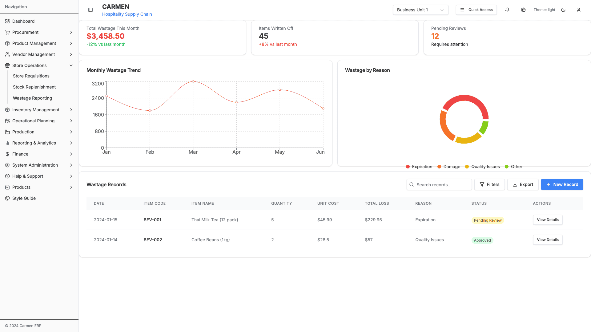

---

## Pages

### Wastage Reporting Dashboard

**Path**: `/store-operations/wastage-reporting`
**Component**: `WastageReportingDashboard`

#### Page Structure

```
┌─────────────────────────────────────────────────────────────┐
│ ┌─── Dashboard Stats ───────────────────────────────────┐  │
│ │ Total Wastage    Items Written Off   Pending Reviews  │  │
│ │  $3,458.50             45                  12         │  │
│ │  -12% vs last        +8% vs last      Requires        │  │
│ └───────────────────────────────────────────────────────┘  │
├─────────────────────────────────────────────────────────────┤
│ ┌─ Monthly Wastage Trend ─┐ ┌─ Wastage by Reason ──────┐  │
│ │ Line chart (6 months)   │ │ Pie chart                 │  │
│ │                          │ │ - Expiration: 45%        │  │
│ │                          │ │ - Damage: 25%            │  │
│ │                          │ │ - Quality Issues: 20%    │  │
│ │                          │ │ - Other: 10%             │  │
│ └──────────────────────────┘ └───────────────────────────┘  │
├─────────────────────────────────────────────────────────────┤
│ Wastage Records                         [+ Report Wastage]  │
│ [Search...] [Date Range] [Reason Filter] [Status Filter]    │
├─────────────────────────────────────────────────────────────┤
│  Date  Item   Qty  Unit Cost  Loss  Reason  Reporter  Status│
│  ─────────────────────────────────────────────────────────...│
│  Data rows with wastage details...                          │
│                                                              │
└─────────────────────────────────────────────────────────────┘
```

#### Dashboard Statistics

**Total Wastage This Month Card**:
- Shows monetary value of wasted inventory
- Current Value: $3,458.50
- Comparison: -12% vs last month (improvement)
- Color: Red (loss indicator)

**Items Written Off Card**:
- Shows count of items marked as wastage
- Current Value: 45 items
- Comparison: +8% vs last month (increase)
- Neutral indicator

**Pending Reviews Card**:
- Shows wastage entries awaiting approval
- Current Value: 12
- Status: Requires attention
- Color: Orange (action needed)

#### Monthly Wastage Trend Chart

**Type**: Line Chart
**Period**: 6 months (January-June)
**Features**:
- Time series visualization
- Interactive tooltips
- Trend identification
- Responsive design

**Monthly Data**:
- January: $2,500
- February: $1,800
- March: $3,200
- April: $2,200
- May: $2,800
- June: $1,900

**Insights**:
- Highest wastage: March ($3,200)
- Lowest wastage: February ($1,800)
- Average: $2,400/month
- Current trend: Decreasing

#### Wastage by Reason Chart

**Type**: Donut/Pie Chart
**Categories**: 4 wastage reasons

**Breakdown**:
- **Expiration**: 45% (Red)
  - Expired products past shelf life
  - Primary wastage cause
- **Damage**: 25% (Orange)
  - Physical damage during handling/storage
  - Secondary cause
- **Quality Issues**: 20% (Yellow)
  - Failed quality inspections
  - Contamination concerns
- **Other**: 10% (Green)
  - Miscellaneous reasons
  - Includes spillage, customer returns, etc.

#### Wastage Records Table

**Features**:
- Chronological wastage log
- Searchable records
- Multi-filter support
- Status tracking
- Export capability

**Table Columns**:
1. **Date** - When wastage occurred
2. **Item Code** - Product SKU
3. **Item Name** - Product description
4. **Quantity** - Amount wasted
5. **Unit Cost** - Cost per unit
6. **Total Loss** - Calculated financial impact
7. **Reason** - Wastage category
8. **Reported By** - Staff member who logged
9. **Status** - Approval status
10. **Actions** - View/Edit/Approve/Delete

**Sample Records**:

**Record 1**:
- Date: 2024-01-15
- Item Code: BEV-001
- Item Name: Thai Milk Tea (12 pack)
- Quantity: 5
- Unit Cost: $45.99
- Total Loss: $229.95
- Reason: Expiration
- Reported By: John Smith
- Status: Pending Review

**Record 2**:
- Date: 2024-01-14
- Item Code: BEV-002
- Item Name: Coffee Beans (1kg)
- Quantity: 2
- Unit Cost: $28.50
- Total Loss: $57.00
- Reason: Quality Issues
- Reported By: Jane Doe
- Status: Approved

---

## Components

### Dashboard Stat Card

**Component**: `Card` with wastage statistics
**Features**:
- Primary value display
- Trend comparison
- Color-coded indicators
- Percentage change

**Variants**:
- **Total Wastage**: Red theme, currency format
- **Items Written Off**: Neutral theme, count
- **Pending Reviews**: Orange theme, action indicator

### Monthly Wastage Chart

**Component**: ResponsiveContainer with LineChart
**Library**: Recharts
**Configuration**:
- Line color: Red (#ef4444)
- Smooth curve
- Grid lines
- Month labels on X-axis
- Dollar values on Y-axis

### Wastage by Reason Chart

**Component**: ResponsiveContainer with PieChart
**Library**: Recharts
**Configuration**:
- Donut style (inner radius: 60, outer radius: 80)
- 4 color segments
- Padding between segments
- Percentage labels
- Interactive tooltips

**Colors**:
- Expiration: #ef4444 (Red)
- Damage: #f97316 (Orange)
- Quality Issues: #eab308 (Yellow)
- Other: #84cc16 (Green)

### Wastage Records Table

**Component**: Custom data table
**Features**:
- Sortable columns
- Row hover effects
- Status badges
- Action menus
- Pagination support

### Status Badge

**Component**: Badge with color coding
**Variants**:
- **Pending Review**: Orange
- **Approved**: Green
- **Rejected**: Red
- **Void**: Gray

---

## Action Flows

### View Dashboard

**Trigger**: Navigate to `/store-operations/wastage-reporting`

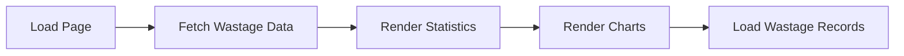

### Report New Wastage

**Trigger**: Click "+ Report Wastage" button

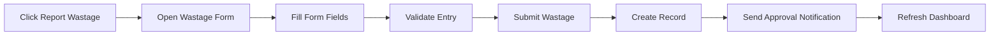

### Search Wastage Records

**Trigger**: Type in search box

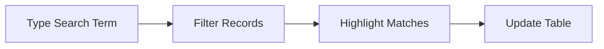

### Filter by Date Range

**Trigger**: Select date range

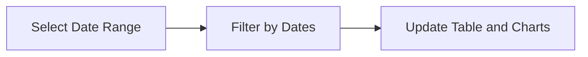

### Filter by Reason

**Trigger**: Select wastage reason

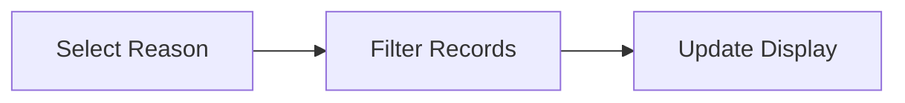

### Filter by Status

**Trigger**: Select approval status

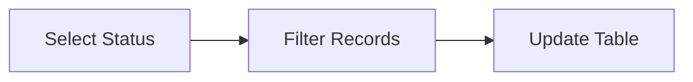

### Approve Wastage Entry

**Trigger**: Click "Approve" in actions menu

```mermaid
flowchart LR
    Click["Click Approve"] --> Validate["Validate Permissions"]
    Validate --> Comment["Add Approval Comment"]
    Comment --> Update["Update Status to Approved"]
    Update --> Journal["Generate Journal Entry"]
    Journal --> Stock["Update Inventory"]
    Stock --> Notify["Notify Requester"]
    Notify --> Refresh["Refresh Display"]
```

### Reject Wastage Entry

**Trigger**: Click "Reject" in actions menu

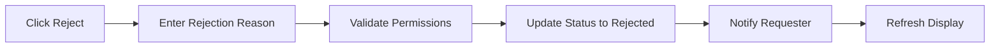

### Edit Wastage Entry

**Trigger**: Click "Edit" in actions menu (if pending)

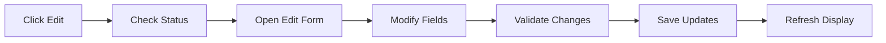

### Delete Wastage Entry

**Trigger**: Click "Delete" in actions menu

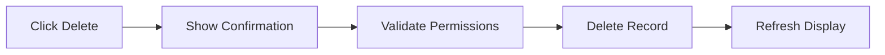

### Export Wastage Report

**Trigger**: Click "Export" button

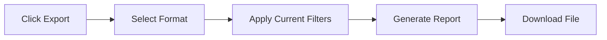

### View Wastage Trends

**Trigger**: Hover on chart elements

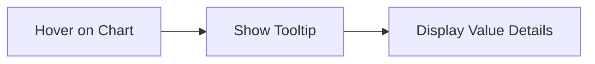

---

## Future Features

### Planned Enhancements

**Advanced Analytics**:
- Wastage by department/location
- Wastage by product category
- Wastage by vendor (product source)
- Cost impact by time period
- Predictive wastage alerts

**Root Cause Analysis**:
- Pattern recognition for recurring wastage
- Correlation with purchase dates
- Quality issue trending
- Storage condition tracking
- Supplier quality correlation

**Workflow Automation**:
- Auto-approval for small amounts
- Escalation for high-value wastage
- Recurring wastage alerts
- Preventive action tracking
- Corrective action workflows

**Integration Features**:
- Photo attachment for evidence
- Barcode scanning for item entry
- Inventory auto-adjustment
- Finance system integration
- Quality management linkage

**Reporting Enhancements**:
- Custom report builder
- Scheduled reports
- Wastage variance analysis
- Benchmark comparisons
- Sustainability metrics (waste reduction)

**Mobile Capabilities**:
- Mobile wastage reporting
- Quick capture with camera
- Offline data entry
- Push notifications
- Location-based logging

---

## Data Models

### Wastage Record

```typescript
interface WastageRecord {
  id: number
  date: string
  itemCode: string
  itemName: string
  quantity: number
  unit: string
  unitCost: number
  totalLoss: number
  reason: 'Expiration' | 'Damage' | 'Quality Issues' | 'Other'
  reasonDetails?: string
  reportedBy: string
  reportedById: string
  location: string
  locationCode: string
  status: 'Pending Review' | 'Approved' | 'Rejected' | 'Void'
  approver?: string
  approvedAt?: string
  approvalComments?: string
  photoEvidence?: string[]
  createdAt: string
  updatedAt: string
}
```

### Wastage Statistics

```typescript
interface WastageStats {
  totalWastageThisMonth: number
  wastageChange: number // percentage vs last month
  itemsWrittenOff: number
  itemsChange: number // percentage vs last month
  pendingReviews: number
}
```

### Wastage Trend Data

```typescript
interface WastageTrendData {
  month: string
  value: number
}
```

### Wastage by Reason

```typescript
interface WastageByReason {
  name: string
  value: number // percentage
}
```

---

## Validation Rules

### Wastage Entry Form

**Required Fields**:
- Date (cannot be future date)
- Item selection
- Quantity (must be > 0)
- Unit cost (must be >= 0)
- Reason
- Location

**Business Rules**:
- Quantity cannot exceed current stock
- Date cannot be more than 30 days in past (configurable)
- High-value wastage (> $1000) requires manager approval
- Photo evidence required for Quality Issues
- Detailed reason required for "Other" category

**Permissions**:
- All staff can report wastage
- Department managers can approve up to $1000
- Store managers can approve up to $5000
- Financial managers can approve any amount
- Only original reporter or manager can edit pending entries

---

## Technical Notes

**Mock Data**: This module uses mock data for demonstration. Real implementation requires:
- API integration for wastage data
- Database for wastage records
- Inventory system integration for stock adjustments
- Finance system integration for journal entries
- User permission validation
- File upload for evidence photos

**Performance Considerations**:
- Paginated table for large datasets
- Chart data aggregation for performance
- Cached statistics calculations
- Lazy loading of historical data

**Accessibility**:
- ARIA labels on all interactive elements
- Keyboard navigation support
- Screen reader compatible charts
- High contrast color scheme
- Focus indicators

**Security**:
- Role-based access control
- Audit trail for all changes
- Approval workflow enforcement
- Data validation
- SQL injection prevention

---

**Last Updated**: 2025-10-02
**Module**: Store Operations > Wastage Reporting
**Status**: 🚧 Prototype/Demo Only
