# Manage Vendors Submodule

## Table of Contents

1. [Overview](#overview)
2. [Vendor List Page](#vendor-list-page)
3. [Vendor Detail Page](#vendor-detail-page)
4. [New Vendor Form](#new-vendor-form)
5. [Edit Vendor Form](#edit-vendor-form)
6. [Pricelist Settings](#pricelist-settings)

---

## Overview

**Submodule Name**: Manage Vendors
**Route**: `/vendor-management/manage-vendors`
**Status**: ✅ Production
**Purpose**: Vendor profile management, contacts, addresses, certifications, and pricelist associations

**Key Features**:
- Vendor CRUD operations
- Contact management
- Address management
- Certification tracking
- Pricelist association
- Advanced filtering and search
- Bulk operations

---

## Vendor List Page

**Path**: `/vendor-management/manage-vendors`
**File**: `app/(main)/vendor-management/manage-vendors/page.tsx`

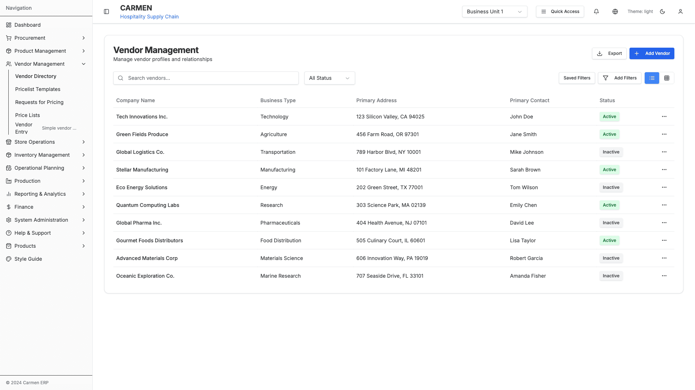
*Vendor List Page - Table view with filtering and search*

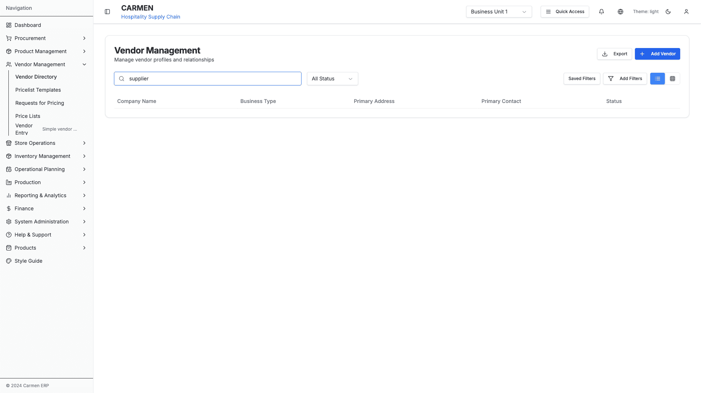
*Vendor List with Active Search - Real-time filtering*

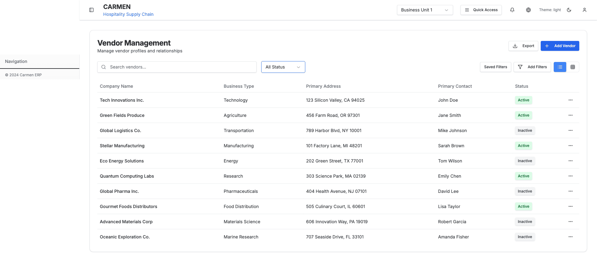
*Status Filter Dropdown - Active/Inactive selection*

### Components Used
- `VendorSearchBar` - Global search functionality
- `VendorFilters` - Status and advanced filtering
- `modern-vendor-list` - Table/card view component
- `VendorCard` - Card view display
- `advanced-filter` - Advanced filter dialog

### Table Columns
- Company Name
- Business Type
- Primary Contact
- Email
- Phone
- Status (Active/Inactive)
- Actions (View, Edit, Duplicate, Delete)

### Dropdown Fields

**1. Status Filter**
- Options: All, Active, Inactive
- Location: Top toolbar
- Component: `VendorFilters`

**2. View Toggle**
- Options: Table View, Card View
- Location: Top toolbar
- Default: Table View

**3. Items Per Page**
- Options: 10, 25, 50, 100
- Location: Bottom pagination
- Default: 25

**4. Sort By**
- Options: Name (A-Z), Name (Z-A), Date Added (Newest), Date Added (Oldest)
- Location: Top toolbar

### Actions
- **Add Vendor** - Opens new vendor form
- **Search** - Real-time search across vendor fields
- **Filter** - Open advanced filter dialog
- **Export** - Export filtered results to Excel
- **View Details** - Navigate to vendor detail page
- **Edit** - Open edit mode for vendor
- **Duplicate** - Duplicate vendor record
- **Delete** - Delete vendor (with dependency check)

### Modals
- Advanced Filter Dialog
- Delete Confirmation Dialog
- Duplicate Vendor Dialog

### Action Flows

**Add Vendor**:
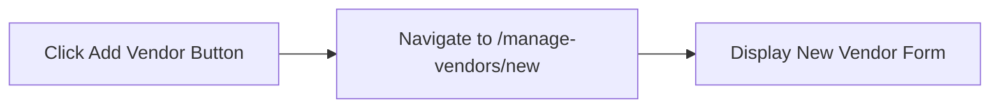

**Search Vendors**:
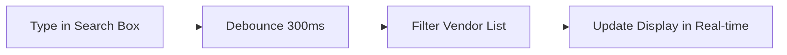

**Filter by Status**:
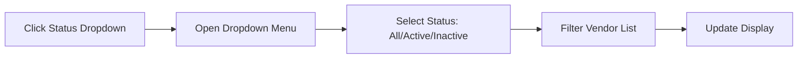

**Open Advanced Filter**:
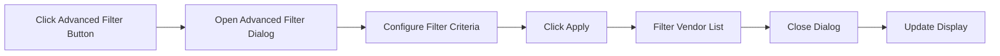

**Export Vendors**:
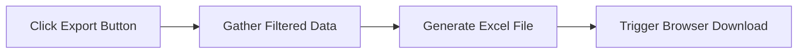

**View Vendor Details**:
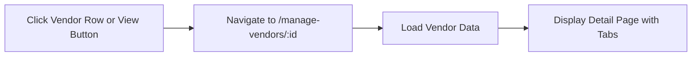

**Edit Vendor**:
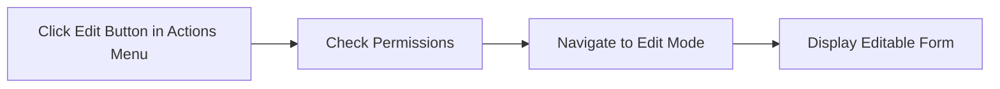

**Duplicate Vendor**:
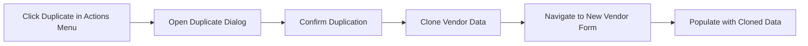

**Delete Vendor**:
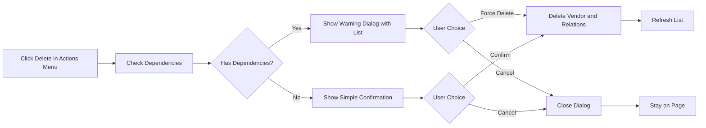

**Toggle View Mode**:
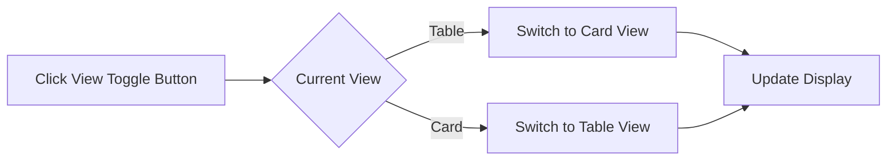

---

## Vendor Detail Page

**Path**: `/vendor-management/manage-vendors/:id`
**File**: `app/(main)/vendor-management/manage-vendors/[id]/page.tsx`

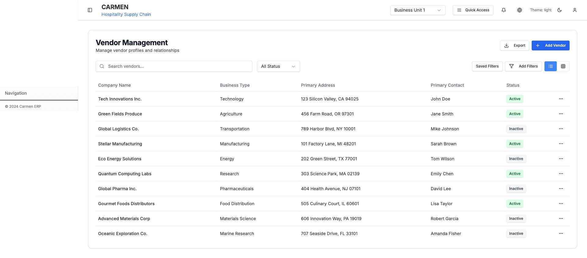
*Vendor Detail Page - Overview Tab with all vendor information*

### Tab Navigation
1. **Overview Tab** (default)
2. **Pricelists Tab**
3. **Contacts Tab**
4. **Certifications Tab**

### Components by Tab

#### Overview Tab Components
- `basic-info-section` - Company information display
- `addresses-section` - Primary address card
- `contacts-section` - Primary contact card
- `certifications-section` - Certifications summary
- `environmental-section` - Environmental profile

**Fields Displayed** (Overview):
- Company Name
- Business Type
- Registration Number
- Tax ID
- Primary Address
- Primary Contact
- Payment Terms
- Credit Limit
- Status (Active/Inactive toggle)

#### Pricelists Tab Components
- `vendor-pricelists-section` - Pricelist management
- Pricelist table with columns:
  - Pricelist Number
  - Effective Date
  - Expiry Date
  - Status
  - Item Count
  - Actions

**Pricelists Tab Actions**:
- View Pricelist Details
- Add New Pricelist
- Edit Pricelist
- Delete Pricelist
- Download Pricelist

#### Contacts Tab Components
- `contacts-tab` - Multi-contact management
- `addresses-tab` - Multi-address management

**Contact Fields**:
- Contact Name
- Role/Title
- Email
- Phone
- Mobile
- Is Primary (toggle)

**Address Fields**:
- Address Type (dropdown: Billing, Shipping, Office)
- Street Address
- City
- State/Province
- Postal Code
- Country
- Is Primary (toggle)

**Contacts Tab Actions**:
- Add Contact
- Edit Contact
- Delete Contact
- Set as Primary Contact
- Add Address
- Edit Address
- Delete Address
- Set as Primary Address

#### Certifications Tab

**Fields**:
- Certification Name
- Certification Number
- Issuing Authority
- Issue Date
- Expiry Date
- Status (Valid/Expired/Expiring Soon)
- Document Upload

**Actions**:
- Add Certification
- Edit Certification
- Delete Certification
- View Document
- Upload Document
- Download Document

### Page-Level Actions (all tabs)
- Back to List
- Edit Vendor
- Delete Vendor
- Print
- Export to PDF

### Modals
- Add Contact Dialog
- Edit Contact Dialog
- Add Address Dialog
- Edit Address Dialog
- Add Certification Dialog
- Edit Certification Dialog
- Delete Confirmation Dialog

### Action Flows

**Switch Tab**:
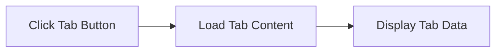

**Back to List**:
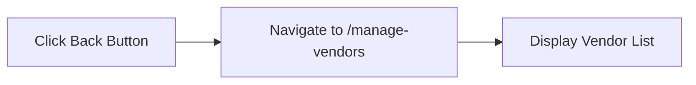

**Edit Vendor**:
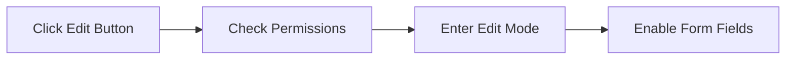

**Delete Vendor**:
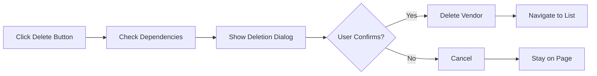

**Print Page**:
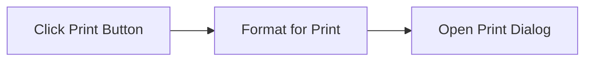

**Export to PDF**:
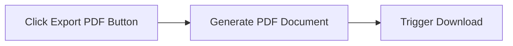

**Add Contact (Contacts Tab)**:
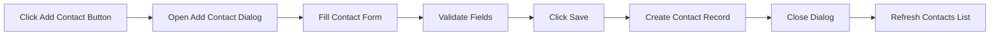

**Edit Contact (Contacts Tab)**:
```mermaid
flowchart LR
    Click["Click Edit on Contact"] --> Open["Open Edit Contact Dialog"]
    Open --> Populate["Populate with Existing Data"]
    Populate --> Modify["Modify Fields"]
    Modify --> Validate["Validate Changes"]
    Validate --> Save["Click Save"]
    Save --> Update["Update Contact Record"]
    Update --> Close["Close Dialog"]
    Close --> Refresh["Refresh Contacts List"]
```

**Delete Contact (Contacts Tab)**:
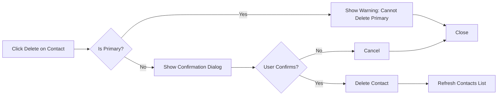

**Set as Primary Contact**:
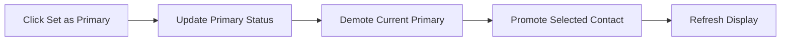

**Add Address (Contacts Tab)**:
```mermaid
flowchart LR
    Click["Click Add Address Button"] --> Open["Open Add Address Dialog"]
    Open --> Fill["Fill Address Form"]
    Fill --> Select["Select Address Type"]
    Select --> Validate["Validate Fields"]
    Validate --> Save["Click Save"]
    Save --> Create["Create Address Record"]
    Create --> Close["Close Dialog"]
    Close --> Refresh["Refresh Addresses List"]
```

**Add New Pricelist (Pricelists Tab)**:
```mermaid
flowchart LR
    Click["Click Add Pricelist Button"] --> Navigate["Navigate to Pricelist Creation"]
    Navigate --> Preselect["Pre-select Current Vendor"]
    Preselect --> Display["Display Pricelist Form"]
```

**View Pricelist Details (Pricelists Tab)**:
```mermaid
flowchart LR
    Click["Click View on Pricelist Row"] --> Navigate["Navigate to Pricelist Detail"]
    Navigate --> Load["Load Pricelist Data"]
    Load --> Display["Display Pricelist Items"]
```

**Download Pricelist (Pricelists Tab)**:
```mermaid
flowchart LR
    Click["Click Download on Pricelist"] --> Gather["Gather Pricelist Data"]
    Gather --> Generate["Generate Excel File"]
    Generate --> Download["Trigger Browser Download"]
```

**Add Certification (Certifications Tab)**:
```mermaid
flowchart LR
    Click["Click Add Certification"] --> Open["Open Certification Dialog"]
    Open --> Fill["Fill Certification Form"]
    Fill --> Upload["Upload Document (Optional)"]
    Upload --> Validate["Validate Fields and Dates"]
    Validate --> Save["Click Save"]
    Save --> Create["Create Certification Record"]
    Create --> Close["Close Dialog"]
    Close --> Refresh["Refresh Certifications List"]
```

**View Document (Certifications Tab)**:
```mermaid
flowchart LR
    Click["Click View Document"] --> Fetch["Fetch Document URL"]
    Fetch --> Open["Open in New Tab or Modal"]
```

**Upload Document (Certifications Tab)**:
```mermaid
flowchart LR
    Click["Click Upload Button"] --> Browse["Open File Browser"]
    Browse --> Select["Select File"]
    Select --> Validate["Validate File Type and Size"]
    Validate --> Upload["Upload to Server"]
    Upload --> Link["Link to Certification"]
    Link --> Refresh["Refresh Display"]
```

---

## New Vendor Form

**Path**: `/vendor-management/manage-vendors/new`
**File**: `app/(main)/vendor-management/manage-vendors/new/page.tsx`

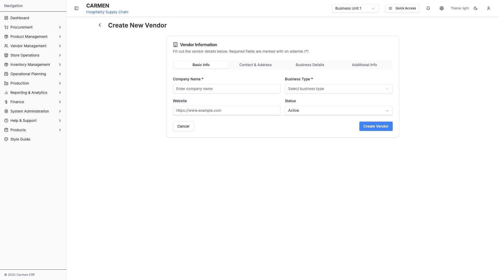
*New Vendor Creation Form - Multi-section form with validation*

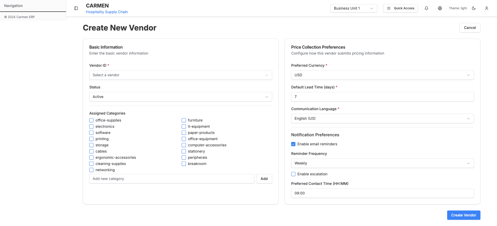
*New Vendor Form (Alternative Path) - Alternative routing interface*

**Component**: `VendorForm`

### Form Sections

**1. Basic Information**
- Company Name (required)
- Business Type (dropdown)
- Registration Number
- Tax ID
- Website URL
- Description (textarea)

**2. Primary Contact**
- Contact Name (required)
- Email (required, validated)
- Phone (required, validated)
- Mobile
- Role/Title

**3. Primary Address**
- Address Type (dropdown: Billing, Shipping, Office)
- Street Address (required)
- City (required)
- State/Province
- Postal Code (required)
- Country (dropdown, required)

**4. Payment Terms**
- Payment Terms (dropdown: Net 30, Net 60, Net 90, Custom)
- Credit Limit (currency input)
- Currency (dropdown)

**5. Tax Configuration**
- Tax ID
- Tax Registration Number
- Tax Rate (percentage)
- Tax Exempt (checkbox)

### Dropdown Options

**Business Type**:
- Manufacturer
- Distributor
- Wholesaler
- Retailer
- Service Provider
- Contractor
- Supplier

**Address Type**:
- Billing Address
- Shipping Address
- Office Address
- Warehouse Address

**Payment Terms**:
- Net 30 Days
- Net 60 Days
- Net 90 Days
- Due on Receipt
- Custom Terms

**Country**: (Standard country list)

**Currency**:
- USD - US Dollar
- EUR - Euro
- GBP - British Pound
- JPY - Japanese Yen
- (etc.)

### Validation Rules
- Company Name: Required, min 2 characters
- Email: Valid email format
- Phone: Valid phone format
- Postal Code: Required
- Tax ID: Optional but validated format if provided
- Credit Limit: Positive number

### Actions
- Save Vendor
- Save and Add Another
- Cancel
- Reset Form

### Modal Dialogs
- Unsaved Changes Warning (on cancel)
- Validation Error Summary

### Action Flows

**Save Vendor**:
```mermaid
flowchart LR
    Click["Click Save Vendor"] --> Validate["Validate Form"]
    Validate --> Create["Create Vendor Record"]
    Create --> Navigate["Navigate to Vendor Detail Page"]
```

**Save and Add Another**:
```mermaid
flowchart LR
    Click["Click Save and Add Another"] --> Validate["Validate Form"]
    Validate --> Create["Create Vendor Record"]
    Create --> Clear["Clear Form Fields"]
```

**Cancel**:
```mermaid
flowchart LR
    Click["Click Cancel"] --> Check["Check for Unsaved Changes"]
    Check --> Modal["Show Unsaved Changes Warning"]
    Modal --> Navigate["Navigate Back to Vendor List"]
```

**Reset Form**:
```mermaid
flowchart LR
    Click["Click Reset Form"] --> Clear["Clear All Form Fields"]
    Clear --> Reset["Reset to Default Values"]
```

**Field Validation**:
```mermaid
flowchart LR
    Blur["Field Blur Event"] --> Validate["Validate Field Value"]
    Validate --> Show["Show Validation Error/Success"]
```

**Business Type Selection**:
```mermaid
flowchart LR
    Click["Click Business Type Dropdown"] --> Open["Open Dropdown Options"]
    Open --> Select["Select Business Type"]
```

**Address Type Selection**:
```mermaid
flowchart LR
    Click["Click Address Type Dropdown"] --> Open["Open Dropdown Options"]
    Open --> Select["Select Address Type"]
```

**Payment Terms Selection**:
```mermaid
flowchart LR
    Click["Click Payment Terms Dropdown"] --> Open["Open Dropdown Options"]
    Open --> Select["Select Payment Terms"]
```

**Country Selection**:
```mermaid
flowchart LR
    Click["Click Country Dropdown"] --> Open["Open Searchable Country List"]
    Open --> Select["Select Country"]
```

**Currency Selection**:
```mermaid
flowchart LR
    Click["Click Currency Dropdown"] --> Open["Open Currency Options"]
    Open --> Select["Select Currency"]
```

---

## Edit Vendor Form

**Path**: `/vendor-management/vendors/:id/edit`
**File**: `app/(main)/vendor-management/vendors/[id]/edit/page.tsx`

Same form structure as New Vendor but pre-populated with existing data.

### Additional Actions
- Save Changes
- Cancel (revert to detail view)
- Delete Vendor

### Action Flows

**Save Changes**:
```mermaid
flowchart LR
    Click["Click Save Changes"] --> Validate["Validate Form"]
    Validate --> Update["Update Vendor Record"]
    Update --> Navigate["Navigate to Vendor Detail Page"]
```

**Cancel Edit**:
```mermaid
flowchart LR
    Click["Click Cancel"] --> Check["Check for Unsaved Changes"]
    Check --> Navigate["Navigate to Vendor Detail Page"]
```

**Delete Vendor**:
```mermaid
flowchart LR
    Click["Click Delete Vendor"] --> Modal["Show Delete Confirmation Modal"]
    Modal --> Delete["Delete Vendor Record"]
    Delete --> Navigate["Navigate to Vendor List"]
```

---

## Pricelist Settings

**Path**: `/vendor-management/vendors/:id/pricelist-settings`
**File**: `app/(main)/vendor-management/vendors/[id]/pricelist-settings/page.tsx`

**Purpose**: Configure pricelist-specific settings for a vendor

### Settings Available
- Default Currency
- Default Payment Terms
- Auto-approve Pricelists (toggle)
- Price Update Notifications (toggle)
- Minimum Order Quantity Settings
- Volume Discount Configuration

### Action Flows

**Update Default Currency**:
```mermaid
flowchart LR
    Select["Select Default Currency"] --> Update["Update Vendor Pricelist Settings"]
    Update --> Save["Save Settings"]
```

**Update Payment Terms**:
```mermaid
flowchart LR
    Select["Select Payment Terms"] --> Update["Update Vendor Pricelist Settings"]
    Update --> Save["Save Settings"]
```

**Toggle Auto-approve Pricelists**:
```mermaid
flowchart LR
    Toggle["Toggle Auto-approve Switch"] --> Update["Update Setting Value"]
    Update --> Save["Save Settings"]
```

**Configure MOQ Settings**:
```mermaid
flowchart LR
    Click["Click Configure MOQ"] --> Open["Open MOQ Settings Modal"]
    Open --> Save["Save MOQ Configuration"]
```

**Configure Volume Discounts**:
```mermaid
flowchart LR
    Click["Click Configure Discounts"] --> Open["Open Volume Discount Modal"]
    Open --> Save["Save Discount Configuration"]
```

---

**Last Updated**: 2025-10-02
**Status**: Complete
**Module**: Vendor Management
**Submodule**: Manage Vendors
