# Pricelists Submodule

## Table of Contents

1. [Overview](#overview)
2. [Pricelists List Page](#pricelists-list-page)
3. [Edit Pricelist Pages](#edit-pricelist-pages)

---

## Overview

**Submodule Name**: Pricelists
**Route**: `/vendor-management/pricelists`
**Status**: 🚧 Prototype
**Purpose**: Vendor pricelist management, approval workflows, and price comparison

**Key Features**:
- Pricelist creation and editing
- Approval workflow (Draft → Pending Review → Active)
- Bulk price updates
- Excel import/export
- Price comparison across vendors
- Tier pricing and MOQ management

---

## Pricelists List Page

**Path**: `/vendor-management/pricelists`
**File**: `app/(main)/vendor-management/pricelists/page.tsx`

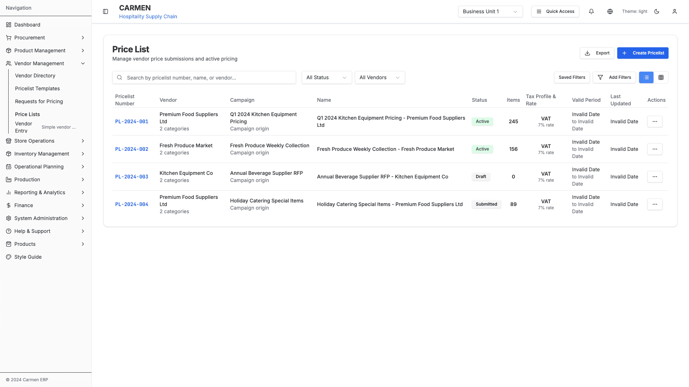
*Pricelists Management - Price list viewing and editing*

**Status**: 🚧 Prototype

### Table Columns
- Pricelist Number
- Vendor Name
- Effective Date
- Expiry Date
- Currency
- Item Count
- Status
- Actions

### Status Options
- Draft
- Pending Review
- Active
- Expired
- Rejected

### Filters
- Status dropdown
- Vendor filter
- Date range picker
- Currency filter

### Actions
- Create Pricelist
- Edit Pricelist
- Review Pricelist
- Approve/Reject
- Download
- Delete

### Action Flows

**Create Pricelist**:
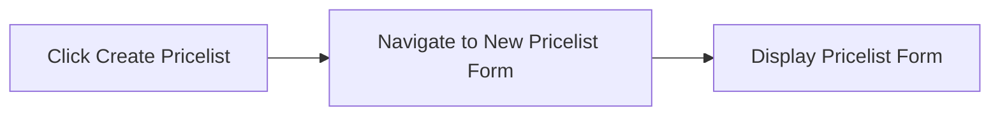

**Edit Pricelist**:
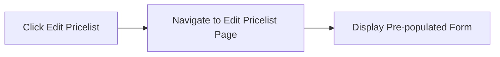

**Review Pricelist**:
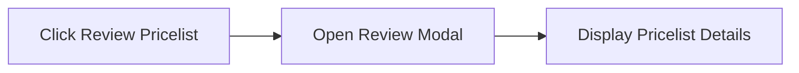

**Approve Pricelist**:
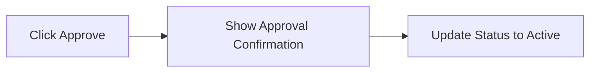

**Reject Pricelist**:
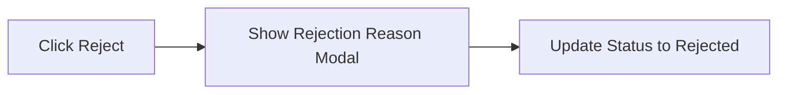

**Download Pricelist**:
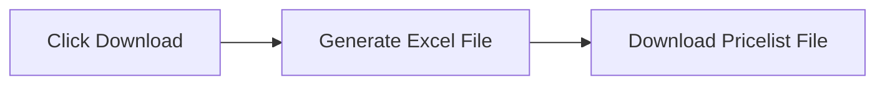

**Delete Pricelist**:
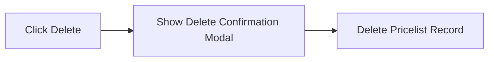

**Filter by Status**:
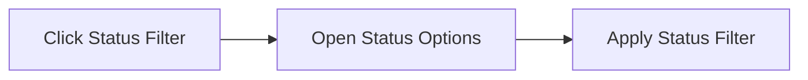

**Filter by Vendor**:
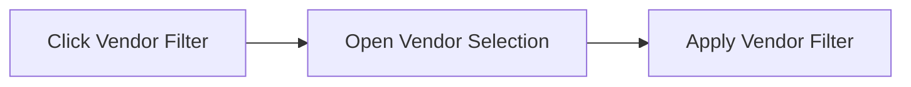

---

## Edit Pricelist Pages

**Path**: `/vendor-management/pricelists/:id/edit` or `/vendor-management/pricelists/:id/edit-new`
**Files**:
- `app/(main)/vendor-management/pricelists/[id]/edit/page.tsx`
- `app/(main)/vendor-management/pricelists/[id]/edit-new/page.tsx`

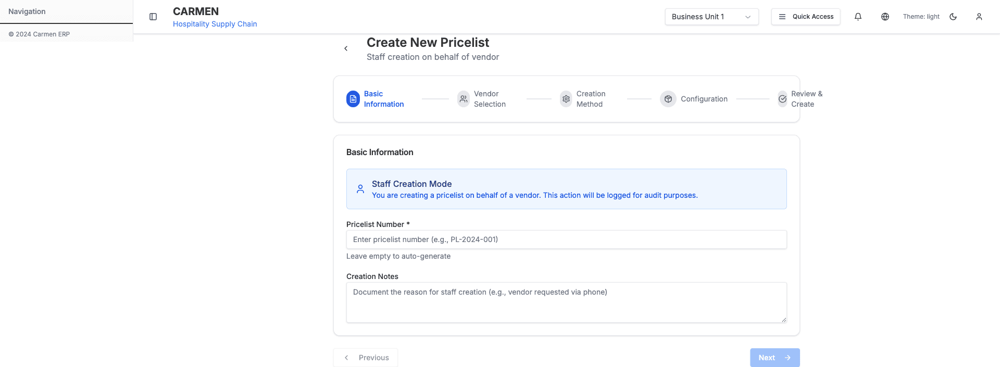
*New Pricelist Creation - Product pricing configuration*

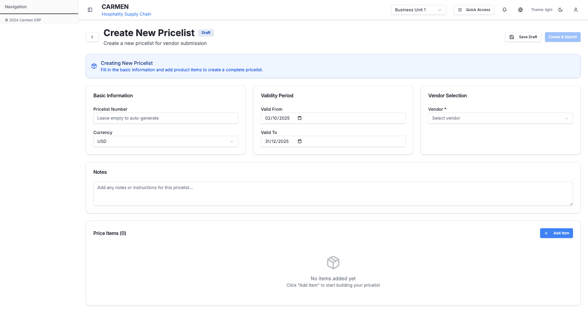
*Add Pricelist Form - Alternative creation interface*

### Components
- `StaffPricelistForm` - Staff editing interface
- `PricelistProductEditingComponent` - Product-level editing

### Pricelist Header
- Vendor (readonly)
- Effective Date
- Expiry Date
- Currency
- Payment Terms
- Notes

### Product Line Items

Each item has:
- Product Name/Code
- Description
- Unit of Measure
- MOQ (Minimum Order Quantity)
- Base Price
- Tier Pricing (multiple tiers)
- Discount Percentage
- Final Price (calculated)
- Status (Active/Inactive)

### Bulk Actions
- Apply percentage increase/decrease
- Copy pricing from another pricelist
- Delete selected items
- Set MOQ for selected

### Validation
- Price > 0
- Effective date < Expiry date
- All required fields filled
- No duplicate products

### Actions
- Save Draft
- Submit for Review
- Save and Publish
- Cancel
- Export to Excel
- Import from Excel

### Action Flows

**Save Draft**:
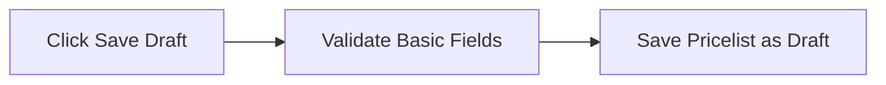

**Submit for Review**:

**Save and Publish**:
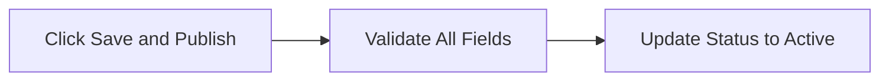

**Add Product Line**:

**Delete Product Line**:
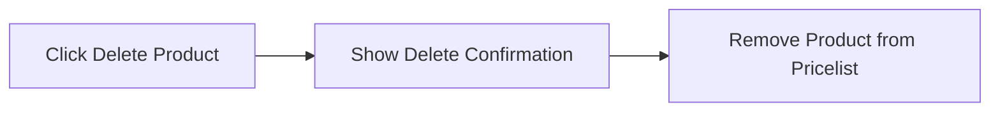

**Apply Percentage Change**:
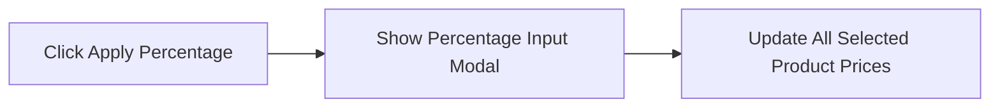

**Copy Pricing**:
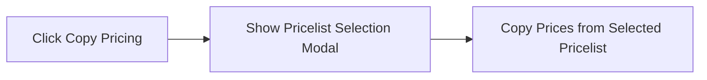

**Export to Excel**:

**Import from Excel**:
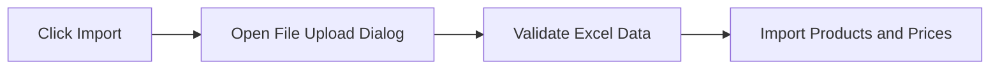

---

**Last Updated**: 2025-10-02
**Status**: Complete
**Module**: Vendor Management
**Submodule**: Pricelists
