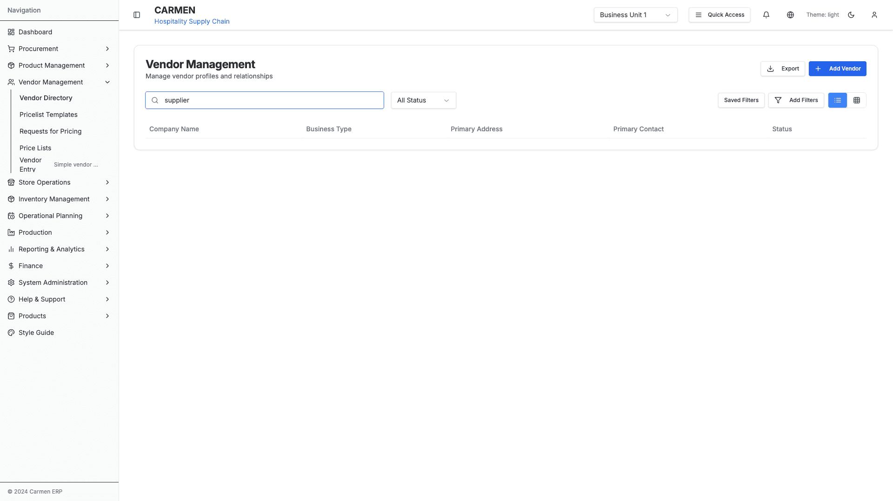
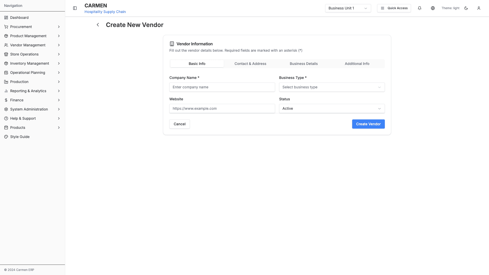
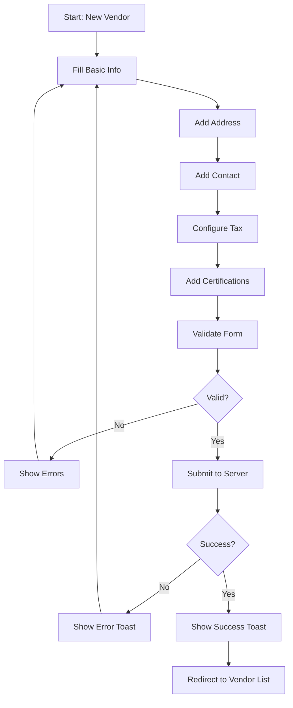
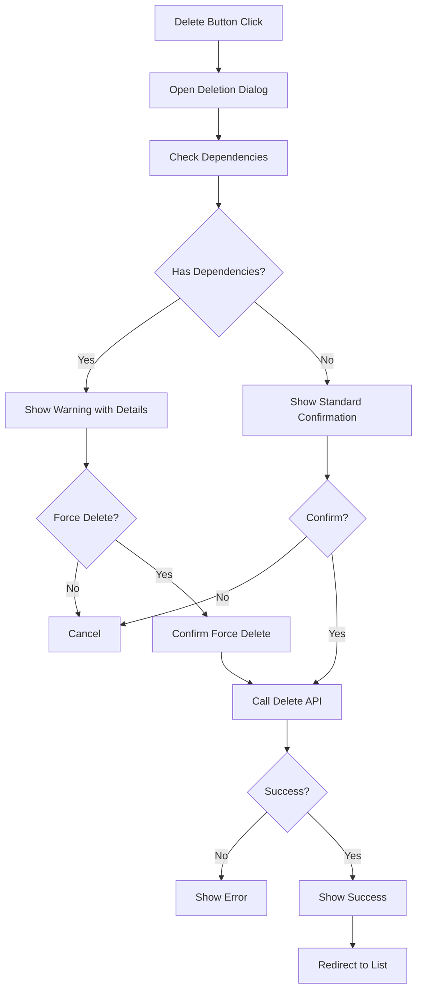
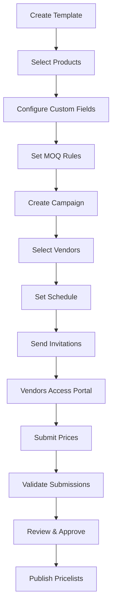

# Vendor Management Module Documentation

## Overview

The Vendor Management module is a comprehensive system for managing vendor relationships, profiles, certifications, price lists, and procurement workflows within the Carmen ERP system. It serves as the central hub for all vendor-related operations, from onboarding to ongoing relationship management.

### Module Screenshots


*Vendor Management Landing Page - Main dashboard with navigation to all submodules*

## Module Information

- **Main Path**: `/vendor-management`
- **Icon**: Users
- **Primary Purpose**: Manage vendor profiles, relationships, pricing, and procurement workflows
- **Status**: Production-ready core features, with price management prototypes in development

## Quick Navigation

- [Submodules](#submodules)
- [Key Features](#key-features)
- [Page Structure](#page-structure)
- [Data Models](#data-models)
- [Workflows](#workflows)
- [Components](#components)
- [API & Server Actions](#api--server-actions)
- [Business Rules](#business-rules)

## Submodules

The Vendor Management module consists of 6 main submodules:

### 1. Vendor Directory (Manage Vendors)
**Path**: `/vendor-management/manage-vendors`

**Purpose**: Core vendor profile management


*Vendor List Page - Table view with filtering and search capabilities*


*Vendor List with Active Search - Real-time filtering results*

**Features**:
- List view with table/card toggle
- Advanced filtering and search
- Vendor CRUD operations
- Vendor detail pages with tabs
- Vendor deletion with dependency checking


*New Vendor Creation Form - Multi-section form with validation*

### 2. Vendors (Alternative Path)
**Path**: `/vendor-management/vendors`

**Purpose**: Alternative vendor management interface

**Features**:
- Create new vendors
- Edit existing vendors
- Vendor pricelist settings
- Alternative routing for vendor operations

### 3. Pricelist Templates
**Path**: `/vendor-management/templates`

**Status**: 🚧 Prototype/Demo Only

## Document History

| Version | Date | Author | Changes |
|---------|------|--------|---------|
| 1.0.0 | 2025-11-19 | Documentation Team | Initial version |
**Purpose**: Pricelist template management and configuration


*Pricelist Templates Management - Template configuration interface*

**Features**:
- Template creation and customization
- Product selection component
- Custom fields configuration
- MOQ pricing setup
- Excel template generation

### 4. Requests for Pricing (Campaigns)
**Path**: `/vendor-management/campaigns`

**Status**: 🚧 Prototype/Demo Only

**Purpose**: Manage pricing campaign workflows


*RFP Campaigns Management - Campaign tracking and vendor invitations*

**Features**:
- Campaign creation and management
- Vendor invitation management
- Campaign analytics
- Response tracking

### 5. Price Lists
**Path**: `/vendor-management/pricelists`

**Status**: 🚧 Prototype/Demo Only

**Purpose**: Vendor price list management


*Pricelists Management - Price list viewing and editing interface*

**Features**:
- Price list viewing and editing
- Multi-MOQ pricing support
- Price validation
- Staff pricelist forms

### 6. Vendor Entry Portal
**Path**: `/vendor-management/vendor-portal/sample`

**Status**: 🚧 Prototype/Demo Only


*Vendor Self-Service Portal - External vendor price entry interface*

**Purpose**: Vendor self-service price entry

**Features**:
- Token-based vendor access
- Self-service price submission
- Real-time validation
- Auto-save functionality

## Key Features

### Vendor Profile Management
- **Complete Vendor Profiles**: Company info, addresses, contacts, certifications
- **Multi-Address Support**: Headquarters, warehouse, billing addresses
- **Contact Management**: Multiple contacts with role specifications
- **Certification Tracking**: Expiry monitoring and renewal alerts
- **Tax Configuration**: Tax ID, profiles, and rates
- **Performance Metrics**: Quality ratings, on-time delivery tracking

### Search and Filtering
- **Global Search**: Search across vendor names, types, addresses, contacts
- **Advanced Filters**: Multi-criteria filtering with saved filter support
- **Filter Storage**: Save and reuse complex filter configurations
- **Status Filtering**: Quick filter by active/inactive status

### View Options
- **Table View**: Comprehensive data display with sortable columns
- **Card View**: Visual grid layout for easier browsing
- **Detail View**: Tabbed interface for comprehensive vendor information

### Data Management
- **CRUD Operations**: Full create, read, update, delete capabilities
- **Bulk Operations**: Export, duplicate, batch actions
- **Dependency Checking**: Validation before deletion
- **Audit Trail**: Track all changes with timestamps and user info

### Price Management (Prototype)
- **Template System**: Reusable pricelist templates
- **Campaign Management**: Request for pricing workflows
- **Vendor Portal**: Self-service price entry
- **Excel Integration**: Import/export capabilities

## Page Structure

### Main Landing Page
**File**: `app/(main)/vendor-management/page.tsx`

**Components**:
- Quick statistics dashboard
- Module navigation cards
- Development status indicators
- Direct links to submodules

**Key Metrics Displayed**:
- Total Vendors
- Active Contracts
- Price Updates This Month
- Pending Approvals

### Manage Vendors List Page
**File**: `app/(main)/vendor-management/manage-vendors/page.tsx`

**Layout**:
```
┌─────────────────────────────────────────────────────┐
│ Header: Vendor Management                          │
│ - Title and description                             │
│ - Export and Add Vendor buttons                     │
├─────────────────────────────────────────────────────┤
│ Search and Filters Bar                              │
│ - Search input (global search)                      │
│ - Status dropdown filter                            │
│ - Saved Filters button                              │
│ - Add Filters button                                │
│ - View toggle (Table/Card)                          │
├─────────────────────────────────────────────────────┤
│ Data Display Area                                   │
│ - Table view OR Card view                           │
│ - Action menu per vendor                            │
└─────────────────────────────────────────────────────┘
```

**Features**:
- Dual view modes (table/card)
- In-line actions menu
- Real-time filtering
- Advanced filter dialog

### Vendor Detail Page
**File**: `app/(main)/vendor-management/manage-vendors/[id]/page.tsx`

**Tabs**:
1. **Overview Tab**
   - Basic Information card
   - Tax Configuration card
   - Primary Address card
   - Primary Contact card

2. **Price Lists Tab**
   - Vendor pricelists section
   - Price history
   - Active campaigns

3. **Contacts & Addresses Tab**
   - All addresses with management
   - All contacts with roles
   - Add/edit functionality

4. **Certifications Tab**
   - Certification list
   - Expiry status
   - Document management

**Action Buttons**:
- Edit Vendor (toggles edit mode)
- Print (print-friendly view)
- Delete Vendor (with dependency check)
- Save Changes (in edit mode)
- Cancel (in edit mode)

### Vendor Form Pages

#### New Vendor
**File**: `app/(main)/vendor-management/manage-vendors/new/page.tsx`

**Form Sections**:
- Basic Information
- Address Details
- Contact Information
- Tax Configuration
- Certifications

#### Edit Vendor
**File**: `app/(main)/vendor-management/vendors/[id]/edit/page.tsx`

**Features**:
- Pre-populated form fields
- Validation on submit
- Change tracking
- Cancel confirmation

## Data Models

### Core Vendor Types

#### Vendor (Main Profile)
```typescript
interface Vendor {
  id: string
  name: string
  contactEmail: string
  contactPhone?: string
  address: Address
  status: 'active' | 'inactive'
  preferredCurrency: string
  paymentTerms?: string
  performanceMetrics: VendorMetrics
  createdAt: Date
  updatedAt: Date
  createdBy: string
  companyRegistration?: string
  taxId?: string
  taxProfile?: string
  taxRate?: number
  website?: string
  businessType?: string
  certifications?: string[]
  languages?: string[]
  notes?: string
}
```

#### Vendor Metrics
```typescript
interface VendorMetrics {
  responseRate: number
  averageResponseTime: number
  qualityScore: number
  onTimeDeliveryRate: number
  totalCampaigns: number
  completedSubmissions: number
  averageCompletionTime: number
  lastSubmissionDate?: Date
}
```

#### Address
```typescript
interface Address {
  street: string
  city: string
  state: string
  postalCode: string
  country: string
}
```

### Price Management Types

#### Pricelist Template
```typescript
interface PricelistTemplate {
  id: string
  name: string
  description?: string
  productSelection: ProductSelection
  customFields: CustomField[]
  instructions: string
  validityPeriod: number // days
  status: 'draft' | 'active' | 'inactive'
  createdAt: Date
  updatedAt: Date
  createdBy: string
  allowMultiMOQ: boolean
  requireLeadTime: boolean
  defaultCurrency: string
  supportedCurrencies: string[]
  maxItemsPerSubmission?: number
  notificationSettings: {
    sendReminders: boolean
    reminderDays: number[]
    escalationDays: number
  }
}
```

#### Request for Pricing (Campaign)
```typescript
interface RequestForPricing {
  id: string
  name: string
  description?: string
  templateId: string
  vendorIds: string[]
  schedule: RequestForPricingSchedule
  status: 'draft' | 'active' | 'paused' | 'completed' | 'cancelled'
  invitations: VendorInvitation[]
  analytics: RequestForPricingAnalytics
  createdAt: Date
  updatedAt: Date
  createdBy: string
  deadlineBuffer: number
  maxSubmissionAttempts: number
  requireManagerApproval: boolean
  priority: 'low' | 'medium' | 'high' | 'urgent'
  tags: string[]
}
```

#### Vendor Pricelist
```typescript
interface VendorPricelist {
  id: string
  pricelistNumber: string
  vendorId: string
  campaignId: string
  templateId: string
  invitationId: string
  currency: string
  status: 'draft' | 'submitted' | 'approved' | 'rejected' | 'expired'
  items: PricelistItem[]
  validFrom: Date
  validTo: Date
  submittedAt?: Date
  approvedAt?: Date
  rejectedAt?: Date
  rejectionReason?: string
  approvedBy?: string
  createdAt: Date
  updatedAt: Date
  completionPercentage: number
  qualityScore: number
  totalItems: number
  completedItems: number
  lastAutoSave: Date
  submissionNotes?: string
  internalNotes?: string
  version: number
  parentPricelistId?: string
}
```

See [Data Models Documentation](./data-models.md) for complete type definitions.

## Workflows

### 1. Vendor Creation Workflow


### 2. Vendor Deletion Workflow


### 3. Price List Campaign Workflow (Prototype)


See [Workflows Documentation](./workflows.md) for detailed workflow diagrams.

## Components

### Core Components

#### VendorCard
**File**: `components/VendorCard.tsx`
- Card view display for vendors
- Quick actions menu
- Status indicators

#### VendorForm
**File**: `components/VendorForm.tsx`
- Comprehensive vendor form
- Multi-section layout
- Validation handling

#### VendorSearchBar
**File**: `components/VendorSearchBar.tsx`
- Global search functionality
- Real-time filtering
- Search suggestions

#### VendorFilters
**File**: `components/VendorFilters.tsx`
- Filter panel
- Multi-criteria selection
- Save/load filters

#### VendorDeletionDialog
**File**: `components/VendorDeletionDialog.tsx`
- Deletion confirmation
- Dependency checking
- Force delete option

### Detail Page Components

#### BasicInfoTab
**File**: `manage-vendors/[id]/components/basic-info-tab.tsx`
- Display/edit basic vendor info
- Tax configuration
- Business details

#### AddressesTab
**File**: `manage-vendors/[id]/components/addresses-tab.tsx`
- List all addresses
- Add/edit/delete addresses
- Primary address designation

#### ContactsTab
**File**: `manage-vendors/[id]/components/contacts-tab.tsx`
- Contact list management
- Role assignment
- Primary contact designation

#### VendorPricelistsSection
**File**: `manage-vendors/[id]/sections/vendor-pricelists-section.tsx`
- Display vendor pricelists
- Filter and search
- Price history

### Advanced Filter Component

#### AdvancedFilter
**File**: `manage-vendors/components/advanced-filter.tsx`

**Features**:
- Multi-field filtering
- Operator selection (equals, contains, starts with, etc.)
- Filter combination logic
- Save filter configurations
- Load saved filters

**Filter Fields**:
- Company Name
- Business Type
- Status
- Address
- Contact Name
- Contact Email
- Contact Phone

See [Components Documentation](./components/) for detailed component specifications.

## API & Server Actions

### Server Actions
**File**: `app/(main)/vendor-management/manage-vendors/actions.ts`

#### createVendor
```typescript
async function createVendor(
  vendorData: Omit<Vendor, 'id' | 'createdAt' | 'updatedAt' | 'performanceMetrics'>
): Promise<{ success: boolean; data?: Vendor; error?: string }>
```

#### updateVendor
```typescript
async function updateVendor(
  vendor: Vendor
): Promise<{ success: boolean; data?: Vendor; error?: string }>
```

#### deleteVendor
```typescript
async function deleteVendor(
  vendorId: string
): Promise<{ success: boolean; data?: any; error?: string }>
```

#### getVendor
```typescript
async function getVendor(
  vendorId: string
): Promise<{ success: boolean; data?: Vendor; error?: string }>
```

#### getVendors
```typescript
async function getVendors(
  filters?: any
): Promise<{ success: boolean; data?: Vendor[]; error?: string }>
```

### API Routes

#### /api/vendors
- GET: List all vendors with optional filters
- POST: Create new vendor

#### /api/vendors/[id]
- GET: Get specific vendor
- PUT: Update vendor
- DELETE: Delete vendor

#### /api/vendors/[id]/metrics
- GET: Get vendor performance metrics

#### /api/vendors/stats
- GET: Get vendor statistics

### Vendor Service
**File**: `lib/services/vendor-service.ts`

**Methods**:
- `createVendor()`: Create new vendor with validation
- `updateVendor()`: Update vendor with dependency checks
- `deleteVendor()`: Delete vendor with dependency validation
- `getVendor()`: Retrieve single vendor
- `searchVendors()`: Search with filters

### Vendor Validation Service
**File**: `lib/services/vendor-validation.ts`

**Validation Rules**:
- Required fields validation
- Email format validation
- Phone format validation
- Tax ID format validation
- Business registration validation
- Duplicate vendor check

See [API Documentation](./api/) for complete API specifications.

## Business Rules

### Vendor Status Rules
1. **Active Status**
   - Can create purchase orders
   - Can receive invitations
   - Appears in vendor selection

2. **Inactive Status**
   - Cannot create new POs
   - Historical data preserved
   - Can be reactivated

### Tax Configuration Rules
1. **Tax Profiles**
   - None VAT: 0% tax rate
   - VAT (Thailand): 7% tax rate
   - GST (Singapore/Australia): 10% tax rate
   - Sales Tax (USA): 8.5% tax rate
   - Custom: User-defined rate

2. **Tax Rate Validation**
   - Must be between 0-100%
   - Can have decimal places (e.g., 8.25%)
   - Auto-populated based on tax profile

### Deletion Rules
1. **Dependency Checking**
   - Check for active purchase orders
   - Check for pending purchase requests
   - Check for active contracts
   - Check for price lists

2. **Soft Delete**
   - Mark as deleted, preserve data
   - Prevent new transactions
   - Maintain audit trail

### Performance Metrics Rules
1. **Quality Score Calculation**
   - Based on delivery performance
   - Product quality ratings
   - Invoice accuracy
   - Communication responsiveness

2. **Rating System**
   - 0-5 star rating
   - Calculated from metrics
   - Updated periodically

See [Business Rules Documentation](./business-logic/) for complete rule specifications.

## Integration Points

### Procurement Module
- Vendor selection in Purchase Requests
- Vendor selection in Purchase Orders
- Price validation against vendor pricelists
- Delivery terms from vendor profile

### Finance Module
- Tax calculation using vendor tax profile
- Payment terms from vendor settings
- Currency preferences
- Invoice validation

### Inventory Module
- GRN vendor association
- Stock-in vendor tracking
- Quality inspection by vendor

### Reporting Module
- Vendor performance reports
- Spend analysis by vendor
- Delivery performance tracking
- Price trend analysis

## Security & Permissions

### Role-Based Access

#### View Permissions
- All users: View vendor list
- Purchasing Staff: View detailed vendor info
- Finance: View financial details

#### Edit Permissions
- Purchasing Staff: Create/edit vendors
- Department Manager: Approve vendors
- Financial Manager: Edit financial terms

#### Delete Permissions
- Department Manager: Delete vendors (with checks)
- Admin: Force delete vendors

### Data Privacy
- Sensitive fields masked for unauthorized users
- Audit trail for all changes
- Encryption for sensitive data

## Testing

### Unit Tests
- Component rendering tests
- Form validation tests
- Service layer tests
- API endpoint tests

### Integration Tests
- End-to-end vendor creation flow
- Vendor deletion with dependencies
- Filter and search functionality
- Pricelist management workflow

### Test Data
**File**: `lib/mock-data/vendors.ts`
- Sample vendor profiles
- Test certifications
- Mock pricelists
- Test campaigns

## Development Roadmap

### ✅ Completed (Production Ready)
- Vendor profile management
- CRUD operations
- Advanced filtering
- Dependency checking
- Tax configuration
- Certification tracking

### 🚧 In Progress (Prototype/Demo)
- Pricelist templates
- Request for pricing campaigns
- Vendor portal
- Price validation
- Excel integration

### 📅 Planned (Future Features)
- Advanced analytics dashboard
- AI-powered vendor recommendations
- Automated price comparison
- Contract management automation
- Vendor performance prediction
- Blockchain-based verification

## Troubleshooting

### Common Issues

#### Vendor Not Appearing in List
**Cause**: Status filter or search query
**Solution**: Clear all filters and check status

#### Cannot Delete Vendor
**Cause**: Active dependencies
**Solution**: Review dependency list, consider archiving instead

#### Tax Rate Not Updating
**Cause**: Tax profile mismatch
**Solution**: Select correct tax profile or use custom rate

#### Price List Not Loading
**Cause**: Prototype feature using mock data
**Solution**: Check if using production or demo mode

## Documentation Structure

This module documentation follows a modular structure for easy navigation and maintenance.

### Main Documentation
- **[VENDOR-MANAGEMENT-MODULE.md](VENDOR-MANAGEMENT-MODULE.md)** - Module overview and entry point

### Submodule Documentation
1. **[MANAGE-VENDORS.md](MANAGE-VENDORS.md)** - Vendor CRUD operations, detail pages, and forms
2. **[TEMPLATES.md](TEMPLATES.md)** - Pricelist template management
3. **[CAMPAIGNS.md](CAMPAIGNS.md)** - RFP/RFQ campaign workflows
4. **[PRICELISTS.md](PRICELISTS.md)** - Pricelist viewing and editing
5. **[VENDOR-PORTAL.md](VENDOR-PORTAL.md)** - External vendor self-service portal

### Supporting Documentation
- **[SHARED-COMPONENTS.md](SHARED-COMPONENTS.md)** - Reusable UI components, modals, dropdowns, and actions
- **[PAGES-AND-COMPONENTS-SPEC.md](PAGES-AND-COMPONENTS-SPEC.md)** - Legacy comprehensive specification (reference)

### Templates & Tools
- **[module-spec-template.md](../module-spec-template.md)** - Reusable template for documenting other modules

## Related Documentation

- [Module Analysis Template](../module-analysis-template.md)
- [Sitemap & Navigation](./sitemap.md)
- [Page Documentation](./pages/)
- [Component Documentation](./components/)
- [Business Logic](./business-logic/)
- [API Documentation](./api/)

## Support & Contact

For questions or issues with the Vendor Management module:
- Technical Lead: [Contact Info]
- Product Owner: [Contact Info]
- Documentation: This file and linked resources

---

**Last Updated**: 2025-10-02
**Module Version**: 1.0.0 (Core), 0.5.0 (Price Management Prototype)
**Documentation Status**: Complete
