# Shared Components and UI Elements

## Table of Contents

1. [Overview](#overview)
2. [Modals and Dialogs](#modals-and-dialogs)
3. [Dropdown Fields Reference](#dropdown-fields-reference)
4. [Actions and Buttons Reference](#actions-and-buttons-reference)
5. [Form Components](#form-components)
6. [Data Display Components](#data-display-components)

---

## Overview

This document describes all shared UI components, modals, dropdowns, actions, and display elements used across the Vendor Management module. These components are reusable across all submodules.

---

## Modals and Dialogs

### 1. Advanced Filter Dialog

**Trigger**: Click "Advanced Filter" button
**Component**: `advanced-filter.tsx`

**Filter Fields**:
- Company Name (text contains)
- Business Type (multi-select)
- Status (dropdown)
- Registration Date (date range)
- Credit Limit (range)
- Has Active Pricelists (yes/no)
- Payment Terms (multi-select)

**Actions**:
- Apply Filters
- Clear All
- Save Filter Preset
- Cancel

#### Action Flows

**Apply Filters**:
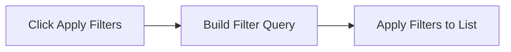

**Clear All Filters**:
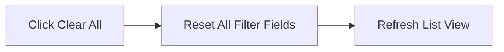

**Save Filter Preset**:
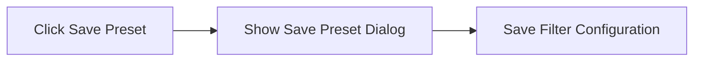

---

### 2. Vendor Deletion Dialog

**Trigger**: Click delete on vendor
**Component**: `VendorDeletionDialog.tsx`

**Displays**:
- Warning message
- Dependency check results
- Impact summary (POs, PRs affected)
- Force delete option (if has dependencies)

**Actions**:
- Confirm Delete
- Cancel
- View Dependencies

#### Action Flows

**Confirm Delete**:
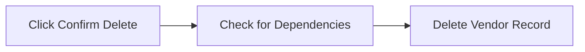

**View Dependencies**:
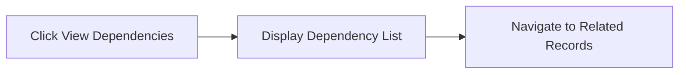

---

### 3. Add/Edit Contact Dialog

**Trigger**: Add/Edit contact buttons

**Fields**:
- Contact Name
- Role/Title
- Email
- Phone
- Mobile
- Is Primary Contact (toggle)

**Actions**:
- Save
- Cancel

#### Action Flows

**Save Contact**:
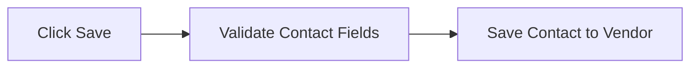

**Set Primary Contact**:
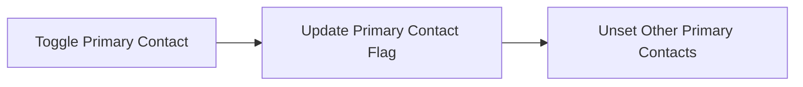

---

### 4. Add/Edit Address Dialog

**Trigger**: Add/Edit address buttons

**Fields**:
- Address Type
- Street Address
- City
- State/Province
- Postal Code
- Country
- Is Primary Address (toggle)

**Actions**:
- Save
- Cancel

#### Action Flows

**Save Address**:
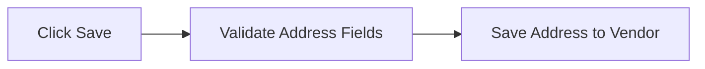

**Set Primary Address**:
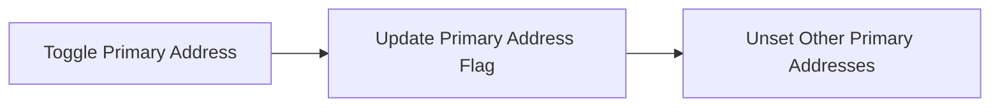

---

### 5. Add/Edit Certification Dialog

**Trigger**: Add/Edit certification buttons

**Fields**:
- Certification Name
- Certification Number
- Issuing Authority
- Issue Date
- Expiry Date
- Document Upload
- Notes

**Actions**:
- Save
- Upload Document
- Cancel

#### Action Flows

**Save Certification**:
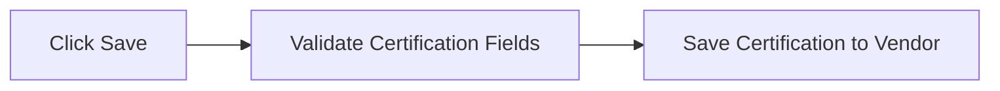

**Upload Document**:
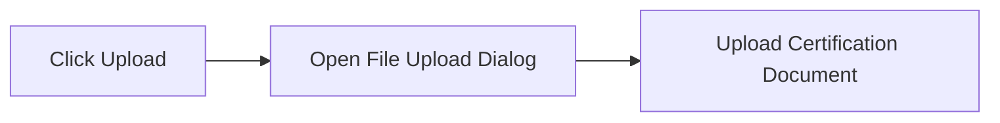

---

### 6. Product Selection Dialog

**Trigger**: Add products in templates

**Features**:
- Search bar
- Category tree navigation
- Product list with checkboxes
- Selected products preview
- Bulk select/deselect

**Actions**:
- Add Selected
- Clear Selection
- Cancel

#### Action Flows

**Search Products**:
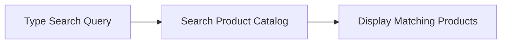

**Select Products**:
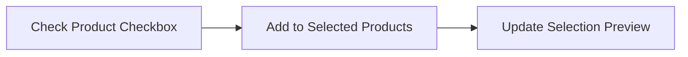

**Add Selected Products**:
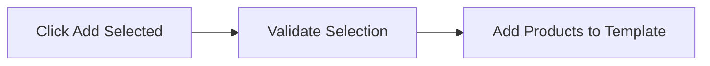

**Browse Categories**:
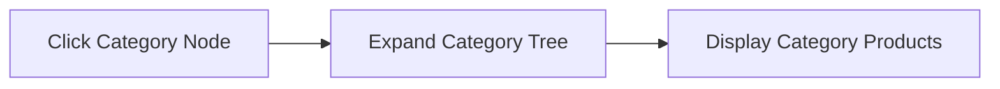

---

### 7. Email Preview Dialog

**Trigger**: Preview campaign invitation

**Displays**:
- Email subject
- Email body
- Vendor portal link
- Campaign details

**Actions**:
- Send Now
- Edit Template
- Cancel

#### Action Flows

**Send Now**:
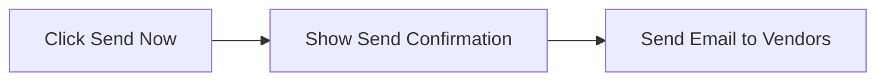

**Edit Template**:
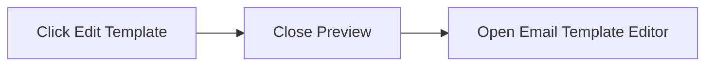

---

## Dropdown Fields Reference

### Status Dropdown
**Values**: Active, Inactive
**Used in**: Vendor filters, vendor form

### Business Type Dropdown
**Values**:
- Manufacturer
- Distributor
- Wholesaler
- Retailer
- Service Provider
- Contractor
- Supplier

**Used in**: Vendor form, advanced filters

### Payment Terms Dropdown
**Values**:
- Net 30 Days
- Net 60 Days
- Net 90 Days
- Due on Receipt
- Custom Terms

**Used in**: Vendor form, pricelist settings

### Address Type Dropdown
**Values**:
- Billing Address
- Shipping Address
- Office Address
- Warehouse Address

**Used in**: Address forms

### Currency Dropdown
**Values**: USD, EUR, GBP, JPY, CAD, AUD, etc.
**Used in**: Vendor form, pricelist forms

### Template Type Dropdown
**Values**:
- Standard Pricelist
- RFQ Template
- Contract Template
- Catalog Template

**Used in**: Template forms

### Campaign Status Dropdown
**Values**: Draft, Active, Completed, Cancelled
**Used in**: Campaign filters

### Pricelist Status Dropdown
**Values**: Draft, Pending Review, Active, Expired, Rejected
**Used in**: Pricelist filters

---

## Actions and Buttons Reference

### Global Actions (appearing across multiple pages)
- **Search** - Real-time search
- **Filter** - Open filter dialog
- **Export** - Export to Excel
- **Add New** - Create new record
- **Refresh** - Reload data
- **Settings** - Module settings

### List View Actions
- **View Details** - Navigate to detail page
- **Edit** - Edit mode or edit page
- **Duplicate** - Clone record
- **Delete** - Delete with confirmation
- **Export Single** - Export single record

### Detail View Actions
- **Back** - Return to list
- **Edit** - Enter edit mode
- **Save** - Save changes
- **Cancel** - Discard changes
- **Delete** - Delete record
- **Print** - Print view
- **Download PDF** - Export to PDF

### Form Actions
- **Save** - Save record
- **Save and Add Another** - Save and reset form
- **Save Draft** - Save as draft
- **Submit** - Submit for review/approval
- **Cancel** - Discard and return
- **Reset** - Clear form

### Bulk Actions (multi-select)
- **Delete Selected** - Bulk delete
- **Export Selected** - Bulk export
- **Update Status** - Bulk status change
- **Apply Action** - Custom bulk operations

---

## Form Components

### Text Input Fields
- Standard text input
- Email input (validated)
- Phone input (formatted)
- URL input (validated)
- Number input (numeric keyboard)
- Currency input (formatted with symbol)

### Select/Dropdown Fields
- Single select dropdown
- Multi-select dropdown
- Searchable dropdown
- Country selector
- Currency selector

### Date/Time Fields
- Date picker
- Date range picker
- Time picker
- DateTime picker

### Rich Input Fields
- Textarea (multiline)
- Rich text editor
- File upload (with preview)
- Image upload (with cropping)
- Document upload (with validation)

### Toggle/Checkbox Fields
- Checkbox
- Toggle switch
- Radio button group
- Checkbox group

### Specialized Components
- Product selector
- Vendor selector
- Category tree selector
- MOQ tier builder
- Custom field builder

---

## Data Display Components

### Tables
- Sortable columns
- Pagination
- Row selection
- Inline actions
- Expandable rows
- Column visibility toggle

### Cards
- Vendor card
- Template card
- Campaign card
- Pricelist card

### Lists
- Contact list
- Address list
- Certification list
- Product list

### Statistics/Metrics
- KPI cards
- Summary widgets
- Progress indicators
- Status badges

### Timeline/History
- Activity feed
- Audit trail
- Change log

---

**Last Updated**: 2025-10-02
**Status**: Complete
## Document History

| Version | Date | Author | Changes |
|---------|------|--------|---------|
| 1.0.0 | 2025-11-19 | Documentation Team | Initial version |
**Module**: Vendor Management
