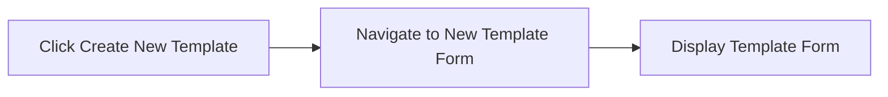
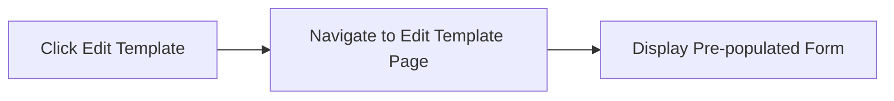
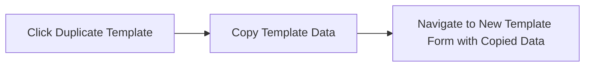
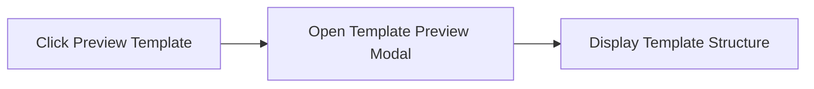
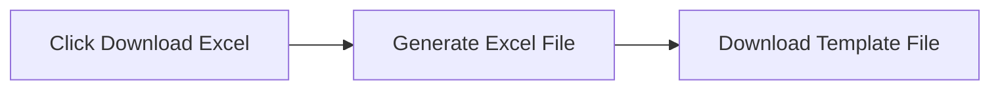
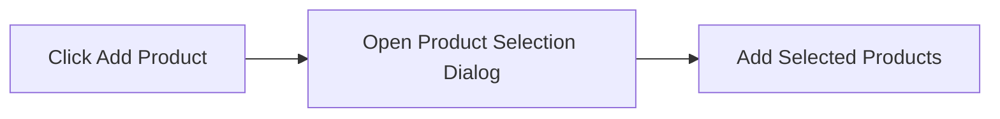
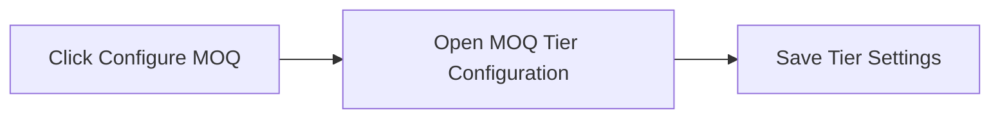
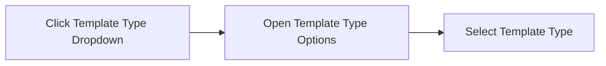

# Templates Submodule

## Table of Contents

1. [Overview](#overview)
2. [Templates List Page](#templates-list-page)
3. [New/Edit Template Pages](#newedit-template-pages)

---

## Overview

**Submodule Name**: Templates
**Route**: `/vendor-management/templates`
**Status**: 🚧 Prototype
## Document History

| Version | Date | Author | Changes |
|---------|------|--------|---------|
| 1.0.0 | 2025-11-19 | Documentation Team | Initial version |
**Purpose**: Pricelist template creation and management for standardized vendor pricing requests

**Key Features**:
- Template creation and editing
- Product selection with categories
- Custom field configuration
- MOQ pricing structure definition
- Excel template generation
- Template duplication

---

## Templates List Page

**Path**: `/vendor-management/templates`
**File**: `app/(main)/vendor-management/templates/page.tsx`

*Pricelist Templates List - Template management interface*

**Status**: 🚧 Prototype

### Components
- Template list table
- Template cards
- Search and filter functionality

### Table Columns
- Template Name
- Created Date
- Last Modified
- Product Count
- Status (Active/Draft)
- Actions

### Actions
- Create New Template
- Edit Template
- Duplicate Template
- Preview Template
- Delete Template
- Download Excel Template

### Action Flows

**Create New Template**:

**Edit Template**:

**Duplicate Template**:

**Preview Template**:

**Delete Template**:

**Download Excel Template**:

---

## New/Edit Template Pages

**Path**: `/vendor-management/templates/new` or `/vendor-management/templates/:id/edit`
**Files**:
- `app/(main)/vendor-management/templates/new/page.tsx`
- `app/(main)/vendor-management/templates/[id]/edit/page.tsx`

*New Template Creation - Product selection and custom fields configuration*

### Components Used
- `ProductSelectionComponent` - Product picker with search
- `CustomFieldsComponent` - Custom field configuration
- `MOQPricingComponent` - MOQ pricing structure
- `ExcelTemplateCustomizer` - Excel template layout
- `TemplatePreview` - Preview before saving

### Form Sections

**1. Template Information**
- Template Name (required)
- Description
- Template Type (dropdown)

**2. Product Selection**
- Search and select products
- Multi-select with categories
- Product tree view
- Selected products list

**3. Custom Fields Configuration**
- Add custom column
- Field name
- Field type (dropdown: Text, Number, Date, Dropdown)
- Required toggle
- Default value

**4. MOQ Pricing Structure**
- Define quantity tiers
- Pricing per tier
- Unit selection
- Volume discounts

**5. Excel Template Layout**
- Column order
- Header customization
- Branding options

### Dropdowns

**Template Type**:
- Standard Pricelist
- RFQ Template
- Contract Template
- Catalog Template

**Field Type**:
- Text
- Number
- Currency
- Date
- Dropdown
- Yes/No

### Actions
- Save Template
- Save as Draft
- Preview
- Generate Excel
- Cancel

### Modals
- Product Selection Dialog
- Custom Field Editor
- MOQ Tier Configuration
- Preview Dialog

### Action Flows

**Save Template**:

**Save as Draft**:

**Preview Template**:

**Generate Excel**:

**Add Product**:

**Add Custom Field**:

**Configure MOQ Tier**:

**Template Type Selection**:

---

**Last Updated**: 2025-10-02
**Status**: Complete
**Module**: Vendor Management
**Submodule**: Templates
