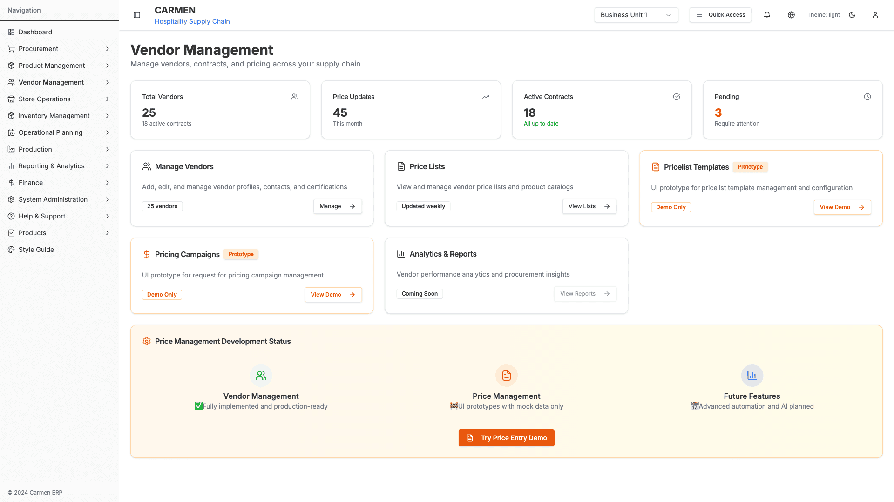
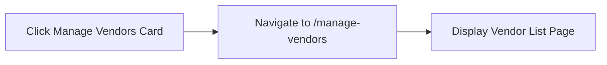
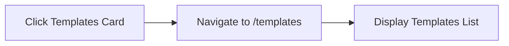
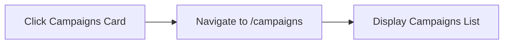
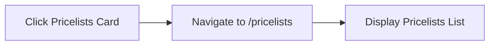
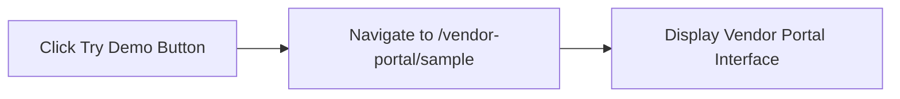

# Vendor Management Module - Overview

## Table of Contents

1. [Module Overview](#module-overview)
2. [Submodules](#submodules)
3. [Module-Level Components](#module-level-components)
4. [Navigation](#navigation)
5. [Related Documentation](#related-documentation)

---

## Module Overview

**Module Name**: Vendor Management
**Route**: `/vendor-management`
**Purpose**: Comprehensive vendor relationship management, pricing, and procurement workflows

### Landing Page
**Path**: `/vendor-management`
**File**: `app/(main)/vendor-management/page.tsx`


*Vendor Management Landing Page - Main dashboard with module navigation*

**Purpose**: Main entry point for vendor management module

**Components**:
- Module dashboard cards
- Quick navigation tiles
- Statistics overview
- Recent activity feed

**Quick Access Cards**:
- Manage Vendors
- Templates
- Campaigns
- Pricelists
- Vendor Portal Demo

### Action Flows

**Navigate to Manage Vendors**:


**Navigate to Templates**:


**Navigate to Campaigns**:


**Navigate to Pricelists**:


**Try Vendor Portal Demo**:


---

## Submodules

### 1. Manage Vendors
**Route**: `/vendor-management/manage-vendors`
**Status**: ✅ Production
## Document History

| Version | Date | Author | Changes |
|---------|------|--------|---------|
| 1.0.0 | 2025-11-19 | Documentation Team | Initial version |
**Purpose**: Vendor profile management, contacts, addresses, certifications

**Key Features**:
- Vendor CRUD operations
- Contact management
- Address management
- Certification tracking
- Pricelist association

**Documentation**: [MANAGE-VENDORS.md](MANAGE-VENDORS.md)

---

### 2. Templates
**Route**: `/vendor-management/templates`
**Status**: 🚧 Prototype
**Purpose**: Pricelist template creation and management

**Key Features**:
- Template creation and editing
- Product selection
- Custom field configuration
- MOQ pricing structure
- Excel template generation

**Documentation**: [TEMPLATES.md](TEMPLATES.md)

---

### 3. Campaigns
**Route**: `/vendor-management/campaigns`
**Status**: 🚧 Prototype
**Purpose**: RFP/RFQ campaign management

**Key Features**:
- Campaign creation
- Vendor invitation
- Response tracking
- Email management
- Result export

**Documentation**: [CAMPAIGNS.md](CAMPAIGNS.md)

---

### 4. Pricelists
**Route**: `/vendor-management/pricelists`
**Status**: 🚧 Prototype
**Purpose**: Vendor pricelist management and approval

**Key Features**:
- Pricelist creation and editing
- Approval workflow
- Bulk price updates
- Excel import/export
- Price comparison

**Documentation**: [PRICELISTS.md](PRICELISTS.md)

---

### 5. Vendor Portal
**Route**: `/vendor-management/vendor-portal`
**Status**: 🚧 Prototype/Demo
**Purpose**: External vendor self-service portal

**Key Features**:
- Token-based access
- Price submission
- Auto-save functionality
- Template download
- Submission tracking

**Documentation**: [VENDOR-PORTAL.md](VENDOR-PORTAL.md)

---

## Module-Level Components

### Shared Components
All shared UI components, modals, and utilities are documented in:
**Documentation**: [SHARED-COMPONENTS.md](SHARED-COMPONENTS.md)

### Glossary
Complete terminology and definitions for the module:
**Documentation**: [GLOSSARY.md](GLOSSARY.md)

---

## Navigation

### Module Structure
```
vendor-management/
├── (landing page)
├── manage-vendors/
│   ├── (list page)
│   ├── new/
│   ├── [id]/
│   │   ├── (detail page)
│   │   └── edit/
│   └── vendors/[id]/edit (alt path)
├── templates/
│   ├── (list page)
│   ├── new/
│   └── [id]/edit/
├── campaigns/
│   ├── (list page)
│   ├── new/
│   └── [id]/ (detail)
├── pricelists/
│   ├── (list page)
│   └── [id]/
│       ├── edit/
│       └── edit-new/
└── vendor-portal/
    └── sample/
```

### Breadcrumb Pattern
```
Vendor Management > [Submodule] > [Page] > [Detail]
```

**Examples**:
- `Vendor Management > Manage Vendors`
- `Vendor Management > Manage Vendors > Vendor Detail`
- `Vendor Management > Templates > New Template`
- `Vendor Management > Campaigns > Campaign Detail`

---

## Related Documentation

### Module Documentation
- [README.md](README.md) - Module overview and features
- [sitemap.md](sitemap.md) - Complete navigation structure with Mermaid diagrams
- [ANALYSIS-COMPLETE.md](ANALYSIS-COMPLETE.md) - Analysis summary
- [COMPLETION_SUMMARY.md](COMPLETION_SUMMARY.md) - Executive summary

### Submodule Documentation
- [MANAGE-VENDORS.md](MANAGE-VENDORS.md) - Vendor management submodule
- [TEMPLATES.md](TEMPLATES.md) - Templates submodule
- [CAMPAIGNS.md](CAMPAIGNS.md) - Campaigns submodule
- [PRICELISTS.md](PRICELISTS.md) - Pricelists submodule
- [VENDOR-PORTAL.md](VENDOR-PORTAL.md) - Vendor portal submodule

### Shared Documentation
- [SHARED-COMPONENTS.md](SHARED-COMPONENTS.md) - Shared components, modals, dropdowns
- [GLOSSARY.md](GLOSSARY.md) - Complete terminology reference

### Technical Documentation
- Architecture patterns
- Data models
- API endpoints
- State management
- Form validation

---

## Module Statistics

**Total Pages**: 23+
**Total Screenshots**: 15
**Total Action Flows**: 84+
**Components**: 70+
**Modals/Dialogs**: 7

**File Structure**:
- Source files analyzed: 70+
- Pages documented: 23
- Modals documented: 7
- Dropdown fields: 10+
- Validation rules: 20+

---

**Last Updated**: 2025-10-02
**Status**: Complete - Refactored into modular structure
**Version**: 2.0
