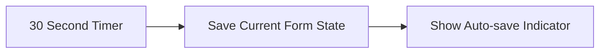
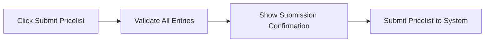
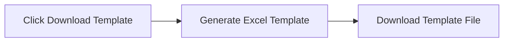
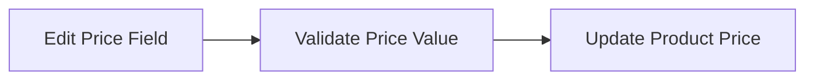
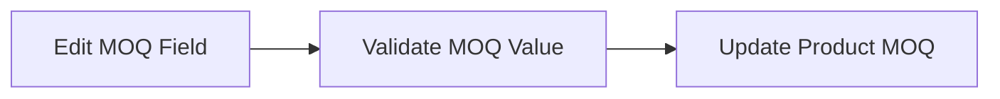

# Vendor Portal Submodule

## Table of Contents

1. [Overview](#overview)
2. [Vendor Portal Demo Page](#vendor-portal-demo-page)

---

## Overview

**Submodule Name**: Vendor Portal
**Route**: `/vendor-management/vendor-portal`
**Status**: 🚧 Prototype/Demo
## Document History

| Version | Date | Author | Changes |
|---------|------|--------|---------|
| 1.0.0 | 2025-11-19 | Documentation Team | Initial version |
**Purpose**: External vendor self-service portal for price submission and campaign response

**Key Features**:
- Token-based authentication (simulated)
- Campaign/template viewing
- Price entry forms
- Auto-save functionality every 30 seconds
- Real-time validation feedback
- Submit confirmation
- Excel template download

---

## Vendor Portal Demo Page

**Path**: `/vendor-management/vendor-portal/sample`
**File**: `app/(main)/vendor-management/vendor-portal/sample/page.tsx`

*Vendor Self-Service Portal - External vendor price entry interface*

**Status**: 🚧 Prototype/Demo

**Purpose**: External vendor self-service portal for price entry

### Features
- Token-based authentication (simulated)
- Campaign/template view
- Price entry form
- Auto-save functionality
- Validation feedback
- Submit confirmation

### Form Fields (per product)
- Product Name (readonly)
- Product Code (readonly)
- Description (readonly)
- Your Price (editable)
- MOQ (editable)
- Lead Time Days (editable)
- Notes (textarea)

### Actions
- Save Draft (auto-save every 30s)
- Submit Pricelist
- Download Template
- Cancel

### Validation
- All prices must be positive
- MOQ must be positive integer
- Lead time reasonable (1-365 days)

### Action Flows

**Auto-Save Draft**:

**Submit Pricelist**:

**Download Template**:

**Edit Product Price**:

**Edit MOQ**:

---

## Technical Implementation Notes

### Authentication
- Token-based access (simulated in demo)
- Session timeout after 30 minutes of inactivity
- Secure vendor identification

### Auto-Save Mechanism
- Saves form state every 30 seconds
- Visual indicator shows save status
- Prevents data loss from browser closure
- Stores in browser local storage (demo) or backend (production)

### Validation Rules
- **Price Validation**:
  - Must be positive number
  - Up to 2 decimal places
  - Cannot be zero

- **MOQ Validation**:
  - Must be positive integer
  - Minimum value of 1
  - Maximum value of 999,999

- **Lead Time Validation**:
  - Must be between 1-365 days
  - Integer values only
  - Reasonable business timeframe

### Data Flow
1. Vendor receives email invitation with portal link
2. Token authentication grants access to campaign
3. Vendor views products and template requirements
4. Vendor enters pricing data with auto-save
5. Validation occurs on field blur and submit
6. Final submission locks pricing data
7. Confirmation email sent to vendor
8. Staff receives notification of submission

---

**Last Updated**: 2025-10-02
**Status**: Complete
**Module**: Vendor Management
**Submodule**: Vendor Portal
