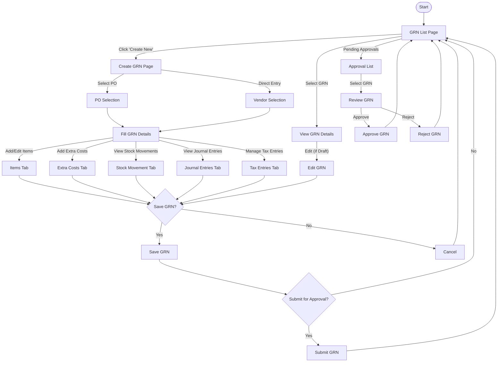
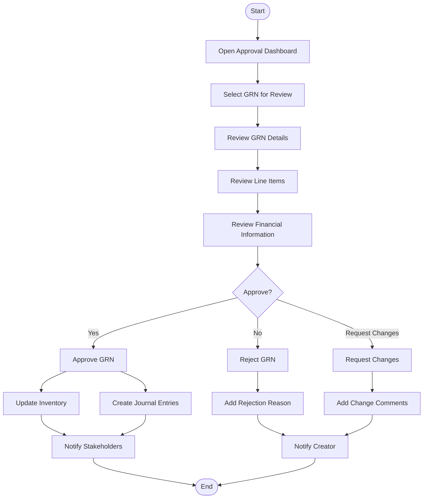

# Goods Received Note Module - User Experience

## Document History

| Version | Date | Author | Changes |
|---------|------|--------|---------|
| 1.0.0 | 2025-11-19 | Documentation Team | Initial version |
> **Document Status**: Content Migration Complete (Phase 2)  
> **Last Updated**: March 14, 2024  
> **Next Update**: Phase 3 - Content Review and Refinement

> **Note**: This is a consolidated document that combines content from:
> - grn-page-flow.md (User Flows)
> - grn-module-prd.md (User Interface Requirements)
> - grn-ba.md (UI Rules)

## Table of Contents
1. [Introduction](#introduction)
2. [User Personas](#user-personas)
3. [User Flows](#user-flows)
4. [User Interface Guidelines](#user-interface-guidelines)
5. [UI Rules](#ui-rules)
6. [Screen Designs](#screen-designs)
7. [Accessibility Considerations](#accessibility-considerations)

## Introduction

This document outlines the user experience design for the Goods Received Note (GRN) module within the Carmen F&B Management System. It provides comprehensive information about user flows, interface guidelines, and screen designs to ensure a consistent and intuitive user experience.

## User Personas

The GRN module is designed to serve the following primary user personas:

### Receiving Clerk
**Profile**: Warehouse staff responsible for receiving goods from vendors and creating GRNs.
**Goals**:
- Efficiently record received goods
- Verify items against purchase orders
- Document any discrepancies
- Process receipts quickly to avoid vendor wait times

**Pain Points**:
- Handling large deliveries with many line items
- Managing partial deliveries
- Dealing with unexpected or unordered items
- Limited time to enter detailed information

### Inventory Manager
**Profile**: Responsible for overseeing inventory levels and ensuring accurate stock records.
**Goals**:
- Ensure accurate inventory updates
- Monitor stock levels and movements
- Verify proper lot/batch tracking
- Analyze receipt patterns and issues

**Pain Points**:
- Reconciling inventory discrepancies
- Managing multiple storage locations
- Ensuring proper quality control
- Tracking expiry dates for perishable items

### Finance Officer
**Profile**: Responsible for financial aspects of goods receipt and vendor payments.
**Goals**:
- Ensure accurate financial records
- Verify costs and tax calculations
- Reconcile GRNs with vendor invoices
- Process payments efficiently

**Pain Points**:
- Managing exchange rates for international purchases
- Allocating additional costs (freight, duties, etc.)
- Handling tax complexities
- Reconciling price discrepancies

### Procurement Manager
**Profile**: Oversees the procurement process and vendor relationships.
**Goals**:
- Monitor vendor performance
- Analyze procurement metrics
- Ensure compliance with procurement policies
- Optimize the procurement process

**Pain Points**:
- Tracking order fulfillment
- Managing vendor performance issues
- Coordinating between departments
- Ensuring policy compliance

## User Flows

### Main GRN User Flow



### GRN Creation from Purchase Order Flow

```mermaid
flowchart TD
    Start([Start]) --> ClickCreate[Click "Create New GRN"]
    ClickCreate --> SelectPO[Select "From Purchase Order"]
    SelectPO --> POSearch[Search for Purchase Order]
    POSearch --> SelectPOFromList[Select PO from List]
    SelectPOFromList --> POItemsLoaded[PO Items Loaded]
    POItemsLoaded --> AdjustQuantities[Adjust Received Quantities]
    AdjustQuantities --> AddLotInfo[Add Lot/Batch Information]
    AddLotInfo --> AddExtraCosts[Add Extra Costs]
    AddExtraCosts --> ReviewTotals[Review Financial Totals]
    ReviewTotals --> SaveDraft{Save as Draft?}
    
    SaveDraft -->|"Yes"| SaveDraftAction[Save as Draft]
    SaveDraft -->|"No"| SubmitApproval[Submit for Approval]
    
    SaveDraftAction --> End([End])
    SubmitApproval --> End
```

### GRN Approval Flow



## User Interface Guidelines

### General Principles

1. **Consistency**: Maintain consistent layout, terminology, and interaction patterns across all GRN screens.

2. **Efficiency**: Design for efficiency, minimizing the number of clicks and data entry steps required to complete common tasks.

3. **Clarity**: Provide clear visual hierarchy and feedback to help users understand the current state and available actions.

4. **Guidance**: Offer contextual help and guidance, especially for complex operations like cost allocation or tax calculations.

5. **Responsiveness**: Ensure the interface is responsive and works well on different screen sizes, from desktop to tablet.

### Layout Structure

The GRN module follows a consistent layout structure:

1. **Header Section**:
   - Page title and breadcrumb navigation
   - Primary action buttons (Save, Submit, Approve, etc.)
   - Document status indicator
   - Key document information (GRN number, date, vendor)

2. **Main Content Area**:
   - Tabbed interface for different sections of the GRN
   - Form fields and data tables
   - Inline editing capabilities where appropriate

3. **Right Sidebar** (when applicable):
   - Summary information
   - Financial totals
   - Quick actions
   - Contextual help

4. **Footer Section**:
   - Secondary action buttons
   - Pagination controls (for list views)
   - Last updated information

### Color Scheme

The GRN module uses the following color scheme:

- **Primary Color**: #0F766E (Teal 700) - Used for primary buttons and key UI elements
- **Secondary Color**: #334155 (Slate 700) - Used for secondary buttons and accents
- **Success Color**: #16A34A (Green 600) - Used for approval and success states
- **Warning Color**: #F59E0B (Amber 500) - Used for warnings and pending states
- **Error Color**: #DC2626 (Red 600) - Used for errors and rejection states
- **Neutral Colors**: Various shades of gray for backgrounds, text, and borders

### Typography

- **Primary Font**: Inter, a clean sans-serif font optimized for screen readability
- **Heading Sizes**:
  - H1: 24px/1.5 (page titles)
  - H2: 20px/1.5 (section titles)
  - H3: 16px/1.5 (subsection titles)
  - H4: 14px/1.5 (group titles)
- **Body Text**: 14px/1.5 for general content
- **Small Text**: 12px/1.5 for secondary information
- **Font Weights**:
  - Regular (400) for body text
  - Medium (500) for emphasis
  - Semibold (600) for headings and important elements

## UI Rules

The following UI rules must be applied consistently across the GRN module:

- **GRN_021**: GRN list must display key information (GRN number, vendor, date, status, total)
- **GRN_022**: Item grid must support inline editing for received quantities and actual costs
- **GRN_023**: Financial summary must update in real-time as items are modified
- **GRN_024**: Status changes must be reflected immediately in the UI
- **GRN_025**: Validation errors must be displayed clearly next to relevant fields
- **GRN_026**: Required fields must be visually marked with asterisk (*)
- **GRN_027**: Currency fields must display appropriate currency symbols
- **GRN_028**: All dates must be displayed using system's regional format with UTC offset (e.g., "2024-03-20 +07:00")
- **GRN_029**: Action buttons must be disabled based on user permissions
- **GRN_030**: Print preview must match final GRN document format
- **GRN_031**: All monetary amounts must be displayed with 2 decimal places
- **GRN_032**: All quantities must be displayed with 3 decimal places
- **GRN_033**: Exchange rates must be displayed with 5 decimal places
- **GRN_034**: All numeric values must be right-aligned
- **GRN_035**: All numeric values must use system's regional numeric format
- **GRN_036**: Date inputs must enforce regional format validation
- **GRN_037**: Date/time values must be stored as timestamptz in UTC
- **GRN_038**: Time zone conversions must respect daylight saving rules
- **GRN_039**: Calendar controls must indicate working days and holidays
- **GRN_040**: Date range validations must consider time zone differences

## Screen Designs

### GRN List Screen

The GRN List screen provides an overview of all GRNs in the system, with filtering and sorting capabilities.

**Key Components**:
1. **Filter Panel**:
   - Quick filters for common statuses (Draft, Pending Approval, Approved, Rejected)
   - Date range selector
   - Vendor search
   - Advanced filter builder for complex queries

2. **Action Bar**:
   - Create New GRN button
   - Bulk action dropdown (for selected items)
   - Export options (Excel, PDF, CSV)
   - View options (compact, detailed)

3. **GRN Table**:
   - Selectable rows with checkboxes
   - Sortable columns
   - Key information columns:
     - GRN Number
     - Reference Number
     - Vendor
     - Receipt Date
     - Status
     - Total Amount
     - Created By
     - Last Updated
   - Action column with context menu

4. **Pagination Controls**:
   - Page size selector
   - Page navigation
   - Total items counter

### GRN Detail Screen

The GRN Detail screen provides a comprehensive view of a single GRN, with tabbed sections for different aspects.

**Key Components**:
1. **Header Section**:
   - GRN number and status badge
   - Vendor information
   - Dates (receipt, document)
   - Reference numbers
   - Action buttons based on status

2. **Tab Navigation**:
   - General Info tab
   - Items tab
   - Extra Costs tab
   - Stock Movement tab
   - Journal Entries tab
   - Tax Entries tab
   - Comments & Attachments tab
   - Activity Log tab

3. **Items Tab**:
   - Item table with the following columns:
     - Product Code
     - Description
     - UOM
     - Ordered Qty (if from PO)
     - Received Qty
     - Unit Price
     - Discount
     - Tax
     - Subtotal
     - Total
   - Add Item button
   - Remove Item button
   - Inline editing capabilities

4. **Right Sidebar**:
   - Financial summary
   - Document totals
   - Quick actions
   - Status timeline

### GRN Creation Screen

The GRN Creation screen allows users to create a new GRN, either from a purchase order or as a direct entry.

**Key Components**:
1. **Creation Method Selection**:
   - From Purchase Order
   - Direct Entry

2. **Header Information**:
   - Vendor selection
   - Department selection
   - Location selection
   - Receipt date
   - Document date
   - Reference number
   - Currency and exchange rate

3. **Items Section**:
   - Add from PO button (if applicable)
   - Add new item button
   - Item table with editable fields
   - Lot/batch information entry

4. **Extra Costs Section**:
   - Add extra cost button
   - Cost type selection
   - Amount entry
   - Allocation method selection
   - Tax handling

5. **Summary Section**:
   - Subtotal
   - Discount total
   - Tax total
   - Extra costs total
   - Grand total

## Accessibility Considerations

The GRN module is designed to be accessible to all users, including those with disabilities. The following accessibility considerations have been implemented:

1. **Keyboard Navigation**:
   - All interactive elements are keyboard accessible
   - Logical tab order follows visual layout
   - Keyboard shortcuts for common actions

2. **Screen Reader Support**:
   - Proper ARIA labels and roles
   - Meaningful alt text for images
   - Descriptive form labels
   - Announcements for dynamic content changes

3. **Visual Accessibility**:
   - High contrast mode support
   - Text resizing without layout breaking
   - Color is not the only means of conveying information
   - Sufficient color contrast ratios (WCAG AA compliance)

4. **Cognitive Accessibility**:
   - Clear and consistent navigation
   - Simple and concise language
   - Error messages that explain how to fix issues
   - Progressive disclosure for complex features 