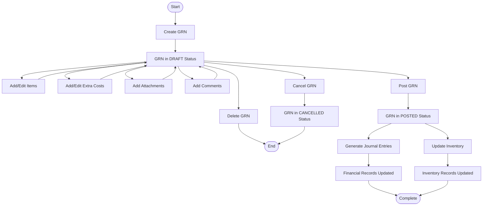
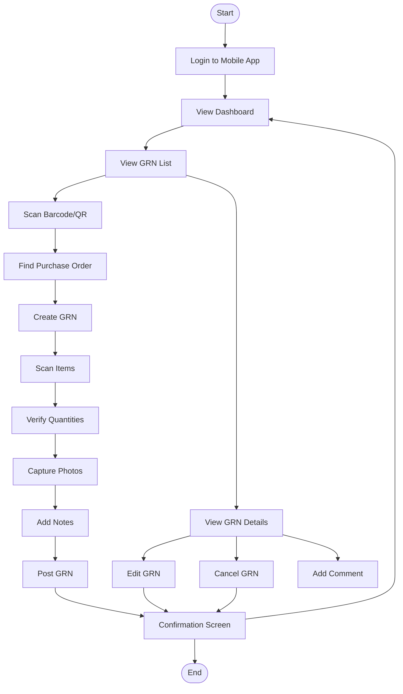

# Goods Received Note Module - User Flow Diagram

## Document History

| Version | Date | Author | Changes |
|---------|------|--------|---------|
| 1.0.0 | 2025-11-19 | Documentation Team | Initial version |
> **Document Status**: Content Migration Complete (Phase 2)  
> **Last Updated**: March 14, 2024  
> **Next Update**: Phase 3 - Content Review and Refinement

## Table of Contents
1. [Introduction](#introduction)
2. [GRN Lifecycle Flow](#grn-lifecycle-flow)
3. [Integration Points](#integration-points)
4. [Mobile User Flow](#mobile-user-flow)
5. [Related Documentation](#related-documentation)

## Introduction

This document provides visual representations of the user flows and process workflows for the Goods Received Note (GRN) module. These diagrams illustrate how users interact with the system when creating, processing, and managing GRNs, as well as how GRNs integrate with other modules in the Carmen F&B Management System.

## GRN Lifecycle Flow

The following diagram illustrates the complete lifecycle of a Goods Received Note, from creation to completion:



## Integration Points

The following diagram illustrates how the GRN module integrates with other modules in the system:

```mermaid
flowchart LR
    GRN[GRN Module] <--> PO[Purchase Order Module]
    GRN <--> INV[Inventory Management]
    GRN <--> FIN[Finance Module]
    GRN <--> UM[User Management]
    
    subgraph PO Integration
        PO1[Create GRN from PO]
        PO2[Link GRN to PO]
        PO3[Update PO status]
    end
    
    subgraph INV Integration
        INV1[Update stock levels]
        INV2[Create stock movements]
        INV3[Update item costs]
    end
    
    subgraph FIN Integration
        FIN1[Generate journal entries]
        FIN2[Update accounts payable]
        FIN3[Tax calculations]
    end
    
    subgraph UM Integration
        UM1[User permissions]
        UM2[Role-based access]
        UM3[User activity tracking]
    end
    
    GRN --- PO Integration
    GRN --- INV Integration
    GRN --- FIN Integration
    GRN --- UM Integration
```

## Mobile User Flow

The following diagram illustrates the user flow for mobile users of the GRN module:



## Related Documentation

For more information about the GRN module, please refer to the following documentation:

1. **API Documentation**:
   - [GRN API Endpoints Overview](./GRN-API-Endpoints-Overview.md)
   - [GRN API Core Endpoints](./GRN-API-Endpoints-Core.md)

2. **Technical Documentation**:
   - [GRN Technical Specification](./GRN-Technical-Specification.md)

3. **User Experience Documentation**:
   - [GRN User Experience](./GRN-User-Experience.md)

4. **Component Documentation**:
   - [GRN Component Specifications](./GRN-Component-Specifications.md) 