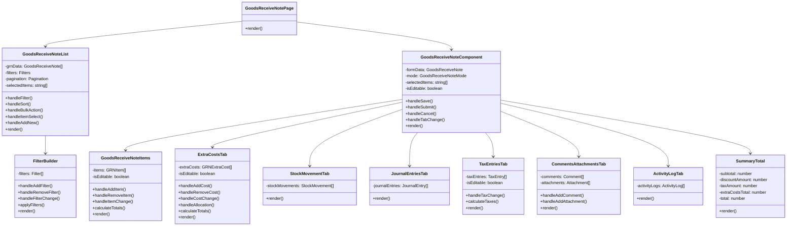

# Goods Received Note Module - Component Specifications

> **Document Status**: Content Migration Complete (Phase 2)  
> **Last Updated**: March 14, 2024  
> **Next Update**: Phase 3 - Content Review and Refinement

> **Note**: This is a consolidated document that combines content from:
> - grn-component-structure.md (Component Details)
> - grn-module-prd.md (Component Requirements)

## Table of Contents
1. [Introduction](#introduction)
2. [Component Overview](#component-overview)
3. [Component Hierarchy](#component-hierarchy)
4. [Core Components](#core-components)
5. [Supporting Components](#supporting-components)
6. [Component Interactions](#component-interactions)
7. [State Management](#state-management)
8. [Component Specifications](#component-specifications)

## Introduction

This document provides detailed specifications for the components that make up the Goods Received Note (GRN) module within the Carmen F&B Management System. It outlines the component hierarchy, interactions, and individual component specifications to guide development and maintenance.

## Component Overview

The GRN module is built using a component-based architecture, with a focus on reusability, maintainability, and performance. The components are organized in a hierarchical structure, with parent components managing state and child components handling specific functionality.

The module follows these component design principles:
- Single Responsibility: Each component has a clear, focused purpose
- Composability: Components can be combined to create complex interfaces
- Reusability: Common patterns are extracted into reusable components
- Testability: Components are designed to be easily testable
- Accessibility: Components adhere to WCAG accessibility guidelines

## Component Hierarchy

The GRN module is composed of the following component hierarchy:



## Core Components

### GoodsReceiveNotePage

**Purpose**: Serves as the main container for the GRN module, handling routing and overall state management.

**Props**:
- `params`: Object containing route parameters
- `searchParams`: Object containing query parameters

**State**:
- `activeView`: String indicating the current view ('list', 'detail', 'create', 'edit')
- `selectedGRN`: Object containing the currently selected GRN data

**Key Functions**:
- `handleViewChange(view, grnId)`: Changes the active view and loads GRN data if needed
- `handleGRNCreated(grnData)`: Handles the creation of a new GRN
- `handleGRNUpdated(grnData)`: Handles updates to an existing GRN

**Rendering Logic**:
- Renders the appropriate component based on the active view
- Provides context for child components

### GoodsReceiveNoteList

**Purpose**: Displays a list of GRNs with filtering, sorting, and pagination capabilities.

**Props**:
- `onViewGRN`: Function to handle viewing a GRN
- `onCreateGRN`: Function to handle creating a new GRN
- `onBulkAction`: Function to handle bulk actions

**State**:
- `grnData`: Array of GRN objects
- `filters`: Object containing active filters
- `pagination`: Object containing pagination state
- `selectedItems`: Array of selected GRN IDs
- `sortBy`: String indicating the sort field
- `sortOrder`: String indicating the sort order ('asc', 'desc')

**Key Functions**:
- `handleFilter(filters)`: Applies filters to the GRN list
- `handleSort(field, order)`: Sorts the GRN list
- `handleBulkAction(action)`: Performs a bulk action on selected GRNs
- `handleItemSelect(id, selected)`: Selects or deselects a GRN
- `handleAddNew()`: Initiates the creation of a new GRN

**Rendering Logic**:
- Renders a filter panel
- Renders an action bar with bulk actions
- Renders a table of GRNs with selectable rows
- Renders pagination controls

### GoodsReceiveNoteComponent

**Purpose**: Provides the main form for creating, viewing, and editing GRNs.

**Props**:
- `grnId`: String ID of the GRN to display (optional)
- `mode`: String indicating the mode ('view', 'create', 'edit')
- `onSave`: Function to handle saving the GRN
- `onSubmit`: Function to handle submitting the GRN for approval
- `onCancel`: Function to handle canceling the operation

**State**:
- `formData`: Object containing the GRN form data
- `activeTab`: String indicating the active tab
- `isLoading`: Boolean indicating if data is being loaded
- `errors`: Object containing validation errors
- `isDirty`: Boolean indicating if the form has unsaved changes

**Key Functions**:
- `handleSave()`: Validates and saves the GRN
- `handleSubmit()`: Validates and submits the GRN for approval
- `handleCancel()`: Cancels the current operation
- `handleTabChange(tab)`: Changes the active tab
- `validateForm()`: Validates the form data

**Rendering Logic**:
- Renders a header with GRN information and action buttons
- Renders a tabbed interface for different sections of the GRN
- Renders a right sidebar with summary information

## Supporting Components

### GoodsReceiveNoteItems

**Purpose**: Manages the line items of a GRN.

**Props**:
- `items`: Array of GRN item objects
- `isEditable`: Boolean indicating if items can be edited
- `onItemsChange`: Function to handle changes to items
- `poItems`: Array of PO item objects (optional)

**State**:
- `localItems`: Array of GRN item objects for local state
- `selectedItems`: Array of selected item IDs
- `isAddingItem`: Boolean indicating if an item is being added

**Key Functions**:
- `handleAddItem()`: Adds a new item to the GRN
- `handleRemoveItem(id)`: Removes an item from the GRN
- `handleItemChange(id, field, value)`: Updates a field in an item
- `calculateTotals()`: Calculates subtotals and totals for items

**Rendering Logic**:
- Renders a table of GRN items with editable fields
- Renders add and remove buttons
- Renders a product selector for adding items

### ExtraCostsTab

**Purpose**: Manages additional costs associated with the GRN.

**Props**:
- `extraCosts`: Array of extra cost objects
- `isEditable`: Boolean indicating if costs can be edited
- `onExtraCostsChange`: Function to handle changes to extra costs
- `items`: Array of GRN item objects for allocation

**State**:
- `localExtraCosts`: Array of extra cost objects for local state
- `selectedCosts`: Array of selected cost IDs
- `isAddingCost`: Boolean indicating if a cost is being added
- `allocationMethod`: String indicating the current allocation method

**Key Functions**:
- `handleAddCost()`: Adds a new extra cost
- `handleRemoveCost(id)`: Removes an extra cost
- `handleCostChange(id, field, value)`: Updates a field in an extra cost
- `handleAllocation(id, method)`: Allocates a cost to items
- `calculateTotals()`: Calculates totals for extra costs

**Rendering Logic**:
- Renders a table of extra costs with editable fields
- Renders add and remove buttons
- Renders allocation controls for distributing costs to items

### StockMovementTab

**Purpose**: Displays the inventory movements that will be generated when the GRN is approved.

**Props**:
- `grnId`: String ID of the GRN
- `items`: Array of GRN item objects

**State**:
- `stockMovements`: Array of stock movement objects
- `isLoading`: Boolean indicating if data is being loaded

**Key Functions**:
- `loadStockMovements()`: Loads stock movement data for the GRN

**Rendering Logic**:
- Renders a table of stock movements
- Displays product, location, quantity, and movement type information

### JournalEntriesTab

**Purpose**: Shows the financial journal entries that will be created when the GRN is approved.

**Props**:
- `grnId`: String ID of the GRN
- `items`: Array of GRN item objects
- `extraCosts`: Array of extra cost objects

**State**:
- `journalEntries`: Array of journal entry objects
- `isLoading`: Boolean indicating if data is being loaded

**Key Functions**:
- `loadJournalEntries()`: Loads journal entry data for the GRN

**Rendering Logic**:
- Renders a table of journal entries
- Displays account, department, description, debit, and credit information

### TaxEntriesTab

**Purpose**: Manages tax calculations and displays tax breakdown by tax type.

**Props**:
- `taxEntries`: Array of tax entry objects
- `isEditable`: Boolean indicating if tax entries can be edited
- `onTaxEntriesChange`: Function to handle changes to tax entries
- `items`: Array of GRN item objects
- `extraCosts`: Array of extra cost objects

**State**:
- `localTaxEntries`: Array of tax entry objects for local state
- `isCalculating`: Boolean indicating if taxes are being calculated

**Key Functions**:
- `handleTaxChange(id, field, value)`: Updates a field in a tax entry
- `calculateTaxes()`: Calculates taxes based on items and extra costs

**Rendering Logic**:
- Renders a table of tax entries
- Displays tax type, rate, taxable amount, and tax amount information

### CommentsAttachmentsTab

**Purpose**: Provides functionality for adding comments and attachments to the GRN.

**Props**:
- `grnId`: String ID of the GRN
- `comments`: Array of comment objects
- `attachments`: Array of attachment objects
- `onAddComment`: Function to handle adding a comment
- `onAddAttachment`: Function to handle adding an attachment

**State**:
- `newComment`: String containing the new comment text
- `isUploading`: Boolean indicating if an attachment is being uploaded

**Key Functions**:
- `handleAddComment()`: Adds a new comment to the GRN
- `handleAddAttachment(file)`: Uploads and adds a new attachment to the GRN

**Rendering Logic**:
- Renders a list of comments with user and timestamp information
- Renders a list of attachments with download links
- Renders a comment input field and attachment upload control

### ActivityLogTab

**Purpose**: Displays the audit trail of actions performed on the GRN.

**Props**:
- `grnId`: String ID of the GRN

**State**:
- `activityLogs`: Array of activity log objects
- `isLoading`: Boolean indicating if data is being loaded

**Key Functions**:
- `loadActivityLogs()`: Loads activity log data for the GRN

**Rendering Logic**:
- Renders a timeline of activities
- Displays user, action, details, and timestamp information

### FilterBuilder

**Purpose**: Allows users to create complex filter conditions for the GRN list view.

**Props**:
- `onApplyFilters`: Function to handle applying filters
- `initialFilters`: Object containing initial filter values

**State**:
- `filters`: Array of filter objects
- `conjunctionType`: String indicating the conjunction type ('AND', 'OR')

**Key Functions**:
- `handleAddFilter()`: Adds a new filter condition
- `handleRemoveFilter(index)`: Removes a filter condition
- `handleFilterChange(index, field, value)`: Updates a field in a filter condition
- `applyFilters()`: Applies the current filters

**Rendering Logic**:
- Renders a list of filter conditions with field, operator, and value inputs
- Renders add and remove buttons for filter conditions
- Renders conjunction type selector
- Renders apply and reset buttons

### SummaryTotal

**Purpose**: Displays the financial summary of the GRN.

**Props**:
- `subtotal`: Number representing the subtotal
- `discountAmount`: Number representing the discount amount
- `taxAmount`: Number representing the tax amount
- `extraCostsTotal`: Number representing the extra costs total
- `total`: Number representing the final total
- `currency`: String representing the currency code

**Rendering Logic**:
- Renders a summary card with financial totals
- Displays subtotal, discount, tax, extra costs, and final total
- Formats amounts according to currency and locale

## Component Interactions

The components in the GRN module interact through the following patterns:

1. **Parent-Child Communication**:
   - Parent components pass data and callbacks to child components via props
   - Child components notify parents of changes via callback functions

2. **Context-Based Communication**:
   - Shared state is managed through React Context
   - Components can access and update context values as needed

3. **Event-Based Communication**:
   - Components can subscribe to and publish events
   - Used for cross-component communication without direct relationships

4. **Server Communication**:
   - Components interact with the server through API calls
   - Server actions are used for data mutations
   - React Query is used for data fetching and caching

## State Management

The GRN module uses a combination of state management approaches:

1. **Local Component State**:
   - Used for UI state that doesn't need to be shared
   - Managed with React's useState and useReducer hooks

2. **Context API**:
   - Used for shared state across components
   - Provides access to global state without prop drilling

3. **React Query**:
   - Used for server state management
   - Handles caching, background updates, and optimistic updates

4. **Form State**:
   - Managed with React Hook Form
   - Handles form validation, error messages, and submission

## Component Specifications

### GoodsReceiveNotePage Component

```typescript
// GoodsReceiveNotePage.tsx
import { useRouter, useSearchParams } from 'next/navigation'
import { useState, useEffect } from 'react'
import { GoodsReceiveNoteList } from './GoodsReceiveNoteList'
import { GoodsReceiveNoteComponent } from './GoodsReceiveNoteComponent'

export function GoodsReceiveNotePage({ params }) {
  const router = useRouter()
  const searchParams = useSearchParams()
  const [activeView, setActiveView] = useState('list')
  const [selectedGRN, setSelectedGRN] = useState(null)
  
  useEffect(() => {
    // Initialize view based on route parameters
    const view = searchParams.get('view') || 'list'
    const grnId = searchParams.get('id')
    
    setActiveView(view)
    
    if (grnId && (view === 'detail' || view === 'edit')) {
      // Load GRN data
      loadGRNData(grnId)
    }
  }, [searchParams])
  
  const loadGRNData = async (grnId) => {
    try {
      // Fetch GRN data from API
      const response = await fetch(`/api/grns/${grnId}`)
      const data = await response.json()
      setSelectedGRN(data)
    } catch (error) {
      console.error('Error loading GRN data:', error)
      // Handle error state
    }
  }
  
  const handleViewChange = (view, grnId = null) => {
    const params = new URLSearchParams(searchParams)
    params.set('view', view)
    
    if (grnId) {
      params.set('id', grnId)
    } else {
      params.delete('id')
    }
    
    router.push(`/procurement/goods-received-note?${params.toString()}`)
  }
  
  const handleGRNCreated = (grnData) => {
    // Navigate to the detail view of the newly created GRN
    handleViewChange('detail', grnData.id)
  }
  
  const handleGRNUpdated = (grnData) => {
    // Update the selected GRN data
    setSelectedGRN(grnData)
    // Navigate to the detail view
    handleViewChange('detail', grnData.id)
  }
  
  return (
    <div className="container mx-auto px-4 py-8">
      {activeView === 'list' && (
        <GoodsReceiveNoteList
          onViewGRN={(grnId) => handleViewChange('detail', grnId)}
          onCreateGRN={() => handleViewChange('create')}
          onBulkAction={(action, ids) => {
            // Handle bulk actions
            console.log('Bulk action:', action, ids)
          }}
        />
      )}
      
      {activeView === 'detail' && selectedGRN && (
        <GoodsReceiveNoteComponent
          grnId={selectedGRN.id}
          mode="view"
          onEdit={() => handleViewChange('edit', selectedGRN.id)}
          onBack={() => handleViewChange('list')}
        />
      )}
      
      {activeView === 'create' && (
        <GoodsReceiveNoteComponent
          mode="create"
          onSave={handleGRNCreated}
          onCancel={() => handleViewChange('list')}
        />
      )}
      
      {activeView === 'edit' && selectedGRN && (
        <GoodsReceiveNoteComponent
          grnId={selectedGRN.id}
          mode="edit"
          onSave={handleGRNUpdated}
          onCancel={() => handleViewChange('detail', selectedGRN.id)}
        />
      )}
    </div>
  )
}
```

### GoodsReceiveNoteList Component

```typescript
// GoodsReceiveNoteList.tsx
import { useState, useEffect } from 'react'
import { useQuery } from '@tanstack/react-query'
import { FilterBuilder } from './FilterBuilder'
import { DataTable } from '@/components/ui/data-table'
import { Button } from '@/components/ui/button'
import { Badge } from '@/components/ui/badge'
import { formatCurrency, formatDate } from '@/lib/utils'

export function GoodsReceiveNoteList({ onViewGRN, onCreateGRN, onBulkAction }) {
  const [filters, setFilters] = useState({})
  const [pagination, setPagination] = useState({
    page: 1,
    limit: 10
  })
  const [selectedItems, setSelectedItems] = useState([])
  const [sortBy, setSortBy] = useState('createdAt')
  const [sortOrder, setSortOrder] = useState('desc')
  
  // Fetch GRN data
  const { data, isLoading, error } = useQuery({
    queryKey: ['grns', filters, pagination, sortBy, sortOrder],
    queryFn: async () => {
      const queryParams = new URLSearchParams({
        page: pagination.page.toString(),
        limit: pagination.limit.toString(),
        sortBy,
        order: sortOrder,
        ...filters
      })
      
      const response = await fetch(`/api/grns?${queryParams.toString()}`)
      return response.json()
    }
  })
  
  const handleFilter = (newFilters) => {
    setFilters(newFilters)
    // Reset pagination when filters change
    setPagination({ ...pagination, page: 1 })
  }
  
  const handleSort = (field, order) => {
    setSortBy(field)
    setSortOrder(order)
  }
  
  const handleBulkAction = (action) => {
    if (selectedItems.length === 0) return
    onBulkAction(action, selectedItems)
  }
  
  const handleItemSelect = (id, selected) => {
    if (selected) {
      setSelectedItems([...selectedItems, id])
    } else {
      setSelectedItems(selectedItems.filter(item => item !== id))
    }
  }
  
  const handleSelectAll = (selected) => {
    if (selected) {
      setSelectedItems(data?.data.map(item => item.id) || [])
    } else {
      setSelectedItems([])
    }
  }
  
  const columns = [
    {
      id: 'select',
      header: ({ table }) => (
        <input
          type="checkbox"
          checked={table.getIsAllRowsSelected()}
          onChange={(e) => handleSelectAll(e.target.checked)}
          className="h-4 w-4 rounded border-gray-300"
        />
      ),
      cell: ({ row }) => (
        <input
          type="checkbox"
          checked={selectedItems.includes(row.original.id)}
          onChange={(e) => handleItemSelect(row.original.id, e.target.checked)}
          className="h-4 w-4 rounded border-gray-300"
        />
      ),
      enableSorting: false,
      enableHiding: false
    },
    {
      accessorKey: 'grnNumber',
      header: 'GRN Number',
      cell: ({ row }) => (
        <button
          onClick={() => onViewGRN(row.original.id)}
          className="text-blue-600 hover:underline"
        >
          {row.original.grnNumber}
        </button>
      )
    },
    {
      accessorKey: 'vendor.name',
      header: 'Vendor'
    },
    {
      accessorKey: 'receiptDate',
      header: 'Receipt Date',
      cell: ({ row }) => formatDate(row.original.receiptDate)
    },
    {
      accessorKey: 'status',
      header: 'Status',
      cell: ({ row }) => {
        const status = row.original.status
        let color = 'gray'
        
        switch (status) {
          case 'DRAFT':
            color = 'gray'
            break
          case 'PENDING_APPROVAL':
            color = 'yellow'
            break
          case 'APPROVED':
            color = 'green'
            break
          case 'REJECTED':
            color = 'red'
            break
          case 'CANCELLED':
            color = 'slate'
            break
        }
        
        return <Badge variant={color}>{status}</Badge>
      }
    },
    {
      accessorKey: 'total',
      header: 'Total',
      cell: ({ row }) => formatCurrency(row.original.total, row.original.currencyCode)
    },
    {
      accessorKey: 'createdBy',
      header: 'Created By'
    },
    {
      accessorKey: 'createdAt',
      header: 'Created At',
      cell: ({ row }) => formatDate(row.original.createdAt)
    },
    {
      id: 'actions',
      header: 'Actions',
      cell: ({ row }) => (
        <div className="flex space-x-2">
          <Button
            variant="ghost"
            size="sm"
            onClick={() => onViewGRN(row.original.id)}
          >
            View
          </Button>
          {row.original.status === 'DRAFT' && (
            <Button
              variant="outline"
              size="sm"
              onClick={() => {
                // Handle edit action
              }}
            >
              Edit
            </Button>
          )}
        </div>
      )
    }
  ]
  
  return (
    <div className="space-y-6">
      <div className="flex justify-between items-center">
        <h1 className="text-2xl font-semibold">Goods Received Notes</h1>
        <Button onClick={onCreateGRN}>Create New GRN</Button>
      </div>
      
      <FilterBuilder
        onApplyFilters={handleFilter}
        initialFilters={filters}
      />
      
      <div className="bg-white rounded-md shadow">
        {selectedItems.length > 0 && (
          <div className="p-4 border-b">
            <div className="flex items-center space-x-4">
              <span>{selectedItems.length} items selected</span>
              <Button
                variant="outline"
                size="sm"
                onClick={() => handleBulkAction('export')}
              >
                Export
              </Button>
              <Button
                variant="outline"
                size="sm"
                onClick={() => handleBulkAction('print')}
              >
                Print
              </Button>
              {/* Add more bulk actions as needed */}
            </div>
          </div>
        )}
        
        <DataTable
          columns={columns}
          data={data?.data || []}
          isLoading={isLoading}
          error={error}
          pagination={{
            pageCount: Math.ceil((data?.total || 0) / pagination.limit),
            page: pagination.page,
            pageSize: pagination.limit,
            onPageChange: (page) => setPagination({ ...pagination, page }),
            onPageSizeChange: (limit) => setPagination({ page: 1, limit })
          }}
          sorting={{
            sortBy,
            sortOrder,
            onSort: handleSort
          }}
        />
      </div>
    </div>
  )
}
```

These component specifications provide a detailed blueprint for implementing the GRN module components, including their structure, props, state, and key functions. 