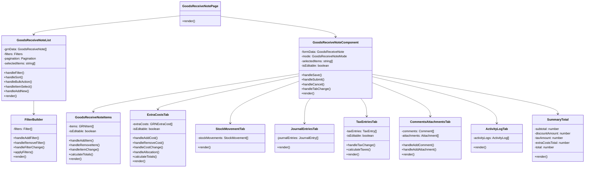

# Goods Received Note Module - Technical Specification

> **Document Status**: Content Migration Complete (Phase 2)  
> **Last Updated**: March 14, 2024  
> **Next Update**: Phase 3 - Content Review and Refinement

> **Note**: This is a consolidated document that combines content from:
> - grn-module-prd.md (Technical Requirements, Data Models)
> - grn-component-structure.md (Component Hierarchy)
> - grn-ba.md (System Calculation Rules)

## Table of Contents
1. [Introduction](#introduction)
2. [Technical Architecture](#technical-architecture)
3. [Data Models](#data-models)
4. [Component Hierarchy](#component-hierarchy)
5. [System Calculation Rules](#system-calculation-rules)
6. [Technical Requirements](#technical-requirements)
7. [Security Considerations](#security-considerations)
8. [Performance Considerations](#performance-considerations)

## Introduction

This document provides the technical specifications for the Goods Received Note (GRN) module within the Carmen F&B Management System. It outlines the technical architecture, data models, component hierarchy, and system calculation rules that govern the module's functionality.

## Technical Architecture

The GRN module follows a layered architecture pattern:

### Presentation Layer
- React components for user interface
- Next.js for server-side rendering and routing
- Tailwind CSS for styling
- Shadcn UI for component library

### Business Logic Layer
- Server components for data processing
- Client components for interactive elements
- Form validation using Zod
- State management using React Context and hooks

### Data Access Layer
- Prisma ORM for database operations
- PostgreSQL database for data storage
- RESTful API endpoints for data access
- Server actions for data mutations

### Integration Layer
- Event-driven architecture for module integration
- Webhook support for external system integration
- Message queue for asynchronous processing

## Data Models

### Core Data Models

#### GoodsReceivedNote
```typescript
interface GoodsReceivedNote {
  id: string                    // UUID primary key
  grnNumber: string             // System-generated GRN number
  poId?: string                 // Reference to Purchase Order (optional)
  vendorId: string              // Reference to Vendor
  departmentId: string          // Reference to Department
  locationId: string            // Reference to Location
  status: GRNStatus             // Enum: DRAFT, PENDING_APPROVAL, APPROVED, REJECTED, CANCELLED
  receiptDate: Date             // Date when goods were received
  documentDate: Date            // Date of GRN document creation
  referenceNumber?: string      // External reference number (e.g., delivery note)
  currencyCode: string          // 3-letter ISO currency code
  exchangeRate: number          // Exchange rate to base currency
  subtotal: number              // Sum of all item subtotals
  discountAmount: number        // Total discount amount
  taxAmount: number             // Total tax amount
  extraCostsTotal: number       // Sum of all extra costs
  total: number                 // Final total amount
  notes?: string                // General notes
  createdBy: string             // User who created the GRN
  createdAt: Date               // Creation timestamp
  updatedBy?: string            // User who last updated the GRN
  updatedAt?: Date              // Last update timestamp
  approvedBy?: string           // User who approved the GRN
  approvedAt?: Date             // Approval timestamp
  items: GRNItem[]              // Line items
  extraCosts: GRNExtraCost[]    // Additional costs
  journalEntries: JournalEntry[] // Financial journal entries
  taxEntries: TaxEntry[]        // Tax breakdown entries
  attachments: Attachment[]     // Document attachments
  comments: Comment[]           // User comments
  activityLogs: ActivityLog[]   // Audit trail
}
```

#### GRNItem
```typescript
interface GRNItem {
  id: string                    // UUID primary key
  grnId: string                 // Reference to parent GRN
  poItemId?: string             // Reference to PO Item (optional)
  productId: string             // Reference to Product
  description: string           // Product description
  uomId: string                 // Unit of Measure
  orderedQuantity?: number      // Quantity ordered (from PO)
  receivedQuantity: number      // Quantity received
  unitPrice: number             // Unit price
  discountRate?: number         // Discount percentage
  discountAmount: number        // Calculated discount amount
  taxRate?: number              // Tax percentage
  taxAmount: number             // Calculated tax amount
  subtotal: number              // Quantity × Unit Price
  total: number                 // Final line total
  notes?: string                // Item-specific notes
  lotNumber?: string            // Lot/batch number
  expiryDate?: Date             // Expiry date for perishable items
  manufacturingDate?: Date      // Manufacturing date
  locationId: string            // Storage location
  status: GRNItemStatus         // Enum: RECEIVED, REJECTED, PARTIALLY_REJECTED
  rejectedQuantity?: number     // Quantity rejected
  rejectionReason?: string      // Reason for rejection
  createdAt: Date               // Creation timestamp
  updatedAt?: Date              // Last update timestamp
}
```

#### GRNExtraCost
```typescript
interface GRNExtraCost {
  id: string                    // UUID primary key
  grnId: string                 // Reference to parent GRN
  costTypeId: string            // Reference to Cost Type
  description: string           // Cost description
  amount: number                // Cost amount
  taxRate?: number              // Tax percentage
  taxAmount: number             // Calculated tax amount
  total: number                 // Amount + Tax Amount
  allocationMethod: AllocationMethod // Enum: MANUAL, BY_VALUE, BY_QUANTITY, BY_WEIGHT, BY_VOLUME
  allocations: GRNExtraCostAllocation[] // Item allocations
  notes?: string                // Cost-specific notes
  createdAt: Date               // Creation timestamp
  updatedAt?: Date              // Last update timestamp
}
```

#### GRNExtraCostAllocation
```typescript
interface GRNExtraCostAllocation {
  id: string                    // UUID primary key
  extraCostId: string           // Reference to Extra Cost
  grnItemId: string             // Reference to GRN Item
  amount: number                // Allocated amount
  createdAt: Date               // Creation timestamp
  updatedAt?: Date              // Last update timestamp
}
```

### Supporting Data Models

#### JournalEntry
```typescript
interface JournalEntry {
  id: string                    // UUID primary key
  grnId: string                 // Reference to parent GRN
  journalNumber: string         // System-generated journal number
  postingDate: Date             // Date of posting
  accountId: string             // Reference to GL Account
  departmentId?: string         // Reference to Department
  description: string           // Transaction description
  debitAmount: number           // Debit amount
  creditAmount: number          // Credit amount
  currencyCode: string          // 3-letter ISO currency code
  exchangeRate: number          // Exchange rate to base currency
  baseDebitAmount: number       // Debit amount in base currency
  baseCreditAmount: number      // Credit amount in base currency
  createdAt: Date               // Creation timestamp
  updatedAt?: Date              // Last update timestamp
}
```

#### TaxEntry
```typescript
interface TaxEntry {
  id: string                    // UUID primary key
  grnId: string                 // Reference to parent GRN
  taxTypeId: string             // Reference to Tax Type
  taxRate: number               // Tax percentage
  taxableAmount: number         // Amount subject to tax
  taxAmount: number             // Calculated tax amount
  createdAt: Date               // Creation timestamp
  updatedAt?: Date              // Last update timestamp
}
```

#### Attachment
```typescript
interface Attachment {
  id: string                    // UUID primary key
  grnId: string                 // Reference to parent GRN
  fileName: string              // Original file name
  fileSize: number              // File size in bytes
  fileType: string              // MIME type
  storageUrl: string            // Storage location URL
  uploadedBy: string            // User who uploaded the file
  uploadedAt: Date              // Upload timestamp
  description?: string          // File description
}
```

#### Comment
```typescript
interface Comment {
  id: string                    // UUID primary key
  grnId: string                 // Reference to parent GRN
  userId: string                // User who created the comment
  text: string                  // Comment text
  createdAt: Date               // Creation timestamp
  updatedAt?: Date              // Last update timestamp
}
```

#### ActivityLog
```typescript
interface ActivityLog {
  id: string                    // UUID primary key
  grnId: string                 // Reference to parent GRN
  userId: string                // User who performed the action
  action: string                // Action performed
  details?: string              // Additional details
  timestamp: Date               // Action timestamp
}
```

### Enumerations

```typescript
enum GRNStatus {
  DRAFT = 'DRAFT',
  PENDING_APPROVAL = 'PENDING_APPROVAL',
  APPROVED = 'APPROVED',
  REJECTED = 'REJECTED',
  CANCELLED = 'CANCELLED'
}

enum GRNItemStatus {
  RECEIVED = 'RECEIVED',
  REJECTED = 'REJECTED',
  PARTIALLY_REJECTED = 'PARTIALLY_REJECTED'
}

enum AllocationMethod {
  MANUAL = 'MANUAL',
  BY_VALUE = 'BY_VALUE',
  BY_QUANTITY = 'BY_QUANTITY',
  BY_WEIGHT = 'BY_WEIGHT',
  BY_VOLUME = 'BY_VOLUME'
}
```

## Component Hierarchy

The GRN module is composed of a hierarchy of components that work together to provide the complete functionality:



### Component Descriptions

#### GoodsReceiveNotePage
The main container component that manages the overall GRN page, including routing and state management.

#### GoodsReceiveNoteList
Displays a list of GRNs with filtering, sorting, and pagination capabilities. Allows users to select GRNs for bulk actions.

#### GoodsReceiveNoteComponent
The main form component for creating, viewing, and editing GRNs. Manages the tabbed interface and overall form state.

#### GoodsReceiveNoteItems
Manages the line items of a GRN, including adding, removing, and editing items. Calculates item totals and validates item data.

#### ExtraCostsTab
Handles additional costs associated with the GRN, such as freight, handling, and customs charges. Supports cost allocation to items.

#### StockMovementTab
Displays the inventory movements that will be generated when the GRN is approved. Read-only view.

#### JournalEntriesTab
Shows the financial journal entries that will be created when the GRN is approved. Read-only view.

#### TaxEntriesTab
Manages tax calculations and displays tax breakdown by tax type. Allows editing of tax rates and amounts.

#### CommentsAttachmentsTab
Provides functionality for adding comments and attachments to the GRN. Displays existing comments and attachments.

#### ActivityLogTab
Displays the audit trail of actions performed on the GRN. Read-only view.

#### FilterBuilder
Allows users to create complex filter conditions for the GRN list view. Supports multiple filter types and operators.

#### SummaryTotal
Displays the financial summary of the GRN, including subtotal, discounts, taxes, extra costs, and final total.

## System Calculation Rules

The GRN module implements the following calculation rules to ensure consistent and accurate financial calculations:

### Item Level Calculations
- **GRN_041**: Item subtotal = Round(Received Quantity (3 decimals) × Unit Price (2 decimals), 2)
- **GRN_042**: Item discount amount = Round(Round(Subtotal, 2) × Discount Rate, 2)
- **GRN_043**: Item net amount = Round(Round(Subtotal, 2) - Round(Discount Amount, 2), 2)
- **GRN_044**: Item tax amount = Round(Round(Net Amount, 2) × Tax Rate, 2)
- **GRN_045**: Item total = Round(Round(Net Amount, 2) + Round(Tax Amount, 2), 2)

### Extra Cost Calculations
- **GRN_046**: Extra cost tax amount = Round(Round(Extra Cost Amount, 2) × Tax Rate, 2)
- **GRN_047**: Extra cost total = Round(Round(Extra Cost Amount, 2) + Round(Tax Amount, 2), 2)

### Extra Cost Allocation Methods
- **GRN_048**: Manual allocation: User specifies allocation amounts (sum must equal total extra cost)
- **GRN_049**: By value allocation: Item allocation = Round(Round(Extra Cost Total, 2) × (Item Total / GRN Items Total), 2)
- **GRN_050**: By quantity allocation: Item allocation = Round(Round(Extra Cost Total, 2) × (Item Quantity / Total Quantity), 2)
- **GRN_051**: By weight allocation: Item allocation = Round(Round(Extra Cost Total, 2) × (Item Weight / Total Weight), 2)
- **GRN_052**: By volume allocation: Item allocation = Round(Round(Extra Cost Total, 2) × (Item Volume / Total Volume), 2)

### Document Level Calculations
- **GRN_053**: GRN subtotal = Sum of all item subtotals
- **GRN_054**: GRN discount amount = Sum of all item discount amounts
- **GRN_055**: GRN net amount = Round(Round(GRN Subtotal, 2) - Round(GRN Discount Amount, 2), 2)
- **GRN_056**: GRN tax amount = Sum of all item tax amounts + Sum of all extra cost tax amounts
- **GRN_057**: GRN extra costs total = Sum of all extra cost amounts (excluding tax)
- **GRN_058**: GRN total = Round(Round(GRN Net Amount, 2) + Round(GRN Tax Amount, 2) + Round(GRN Extra Costs Total, 2), 2)

### Currency Conversion Rules
- **GRN_059**: Base currency amount = Round(Document currency amount × Exchange rate, 2)
- **GRN_060**: Exchange rate must have 5 decimal places
- **GRN_061**: Exchange rate must be greater than zero

### Rounding Rules
- **GRN_062**: All monetary amounts must be rounded to 2 decimal places
- **GRN_063**: All quantities must be rounded to 3 decimal places
- **GRN_064**: All percentages must be rounded to 2 decimal places
- **GRN_065**: Rounding method is "half up" (≥ 0.5 rounds up, < 0.5 rounds down)

## Technical Requirements

### Performance Requirements
- **GRN_066**: GRN list page must load within 2 seconds for up to 1,000 records
- **GRN_067**: GRN detail page must load within 1.5 seconds
- **GRN_068**: Save operations must complete within 3 seconds
- **GRN_069**: Calculations must update within 500ms of user input
- **GRN_070**: System must support concurrent editing by multiple users with conflict resolution

### Scalability Requirements
- **GRN_071**: System must support up to 10,000 GRNs per month
- **GRN_072**: System must support up to 1,000 line items per GRN
- **GRN_073**: Database must be optimized for efficient querying of large datasets
- **GRN_074**: Archiving strategy must be implemented for historical data

### Reliability Requirements
- **GRN_075**: System must maintain 99.9% uptime during business hours
- **GRN_076**: Data loss prevention mechanisms must be implemented
- **GRN_077**: Automatic recovery from transaction failures must be supported
- **GRN_078**: Regular database backups must be configured

## Security Considerations

### Authentication and Authorization
- **GRN_079**: Access to GRN functionality must be role-based
- **GRN_080**: Sensitive operations (approval, deletion) must require appropriate permissions
- **GRN_081**: API endpoints must be secured with JWT authentication
- **GRN_082**: Session timeout must be implemented for inactive users

### Data Security
- **GRN_083**: All sensitive data must be encrypted at rest
- **GRN_084**: All data transmissions must use HTTPS
- **GRN_085**: Database access must be restricted to application service accounts
- **GRN_086**: Audit logging must be implemented for all data modifications

### Input Validation
- **GRN_087**: All user inputs must be validated on both client and server
- **GRN_088**: Protection against SQL injection must be implemented
- **GRN_089**: Protection against XSS attacks must be implemented
- **GRN_090**: File uploads must be validated for type, size, and content

## Performance Considerations

### Database Optimization
- **GRN_091**: Appropriate indexes must be created for frequently queried fields
- **GRN_092**: Query optimization must be performed for complex operations
- **GRN_093**: Database connection pooling must be implemented
- **GRN_094**: Lazy loading must be used for large datasets

### Frontend Optimization
- **GRN_095**: Code splitting must be implemented for improved load times
- **GRN_096**: Asset optimization (minification, compression) must be applied
- **GRN_097**: Caching strategies must be implemented for static content
- **GRN_098**: Virtual scrolling must be used for large data tables

### API Optimization
- **GRN_099**: API responses must be paginated for large datasets
- **GRN_100**: API responses must be compressed
- **GRN_101**: API rate limiting must be implemented
- **GRN_102**: API caching must be implemented where appropriate 