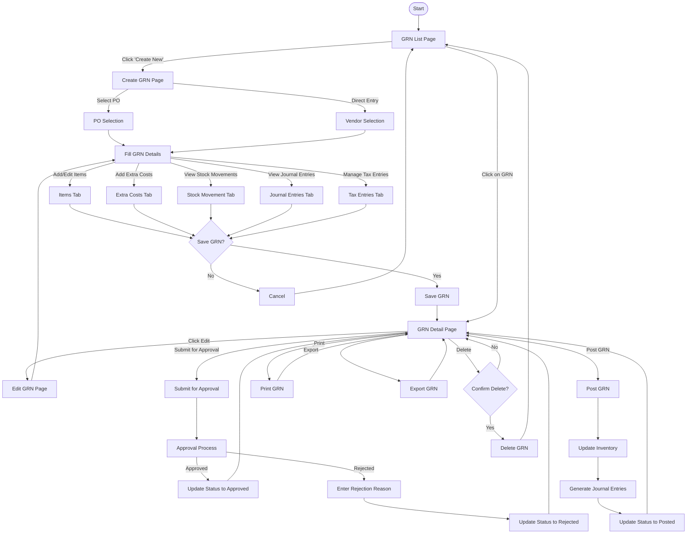
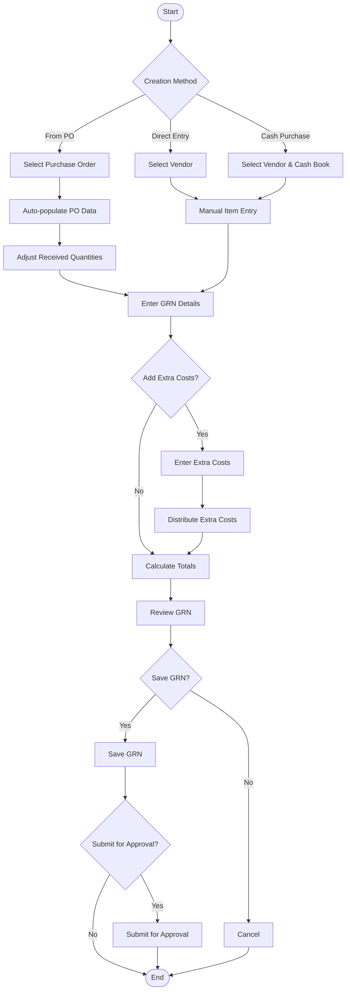
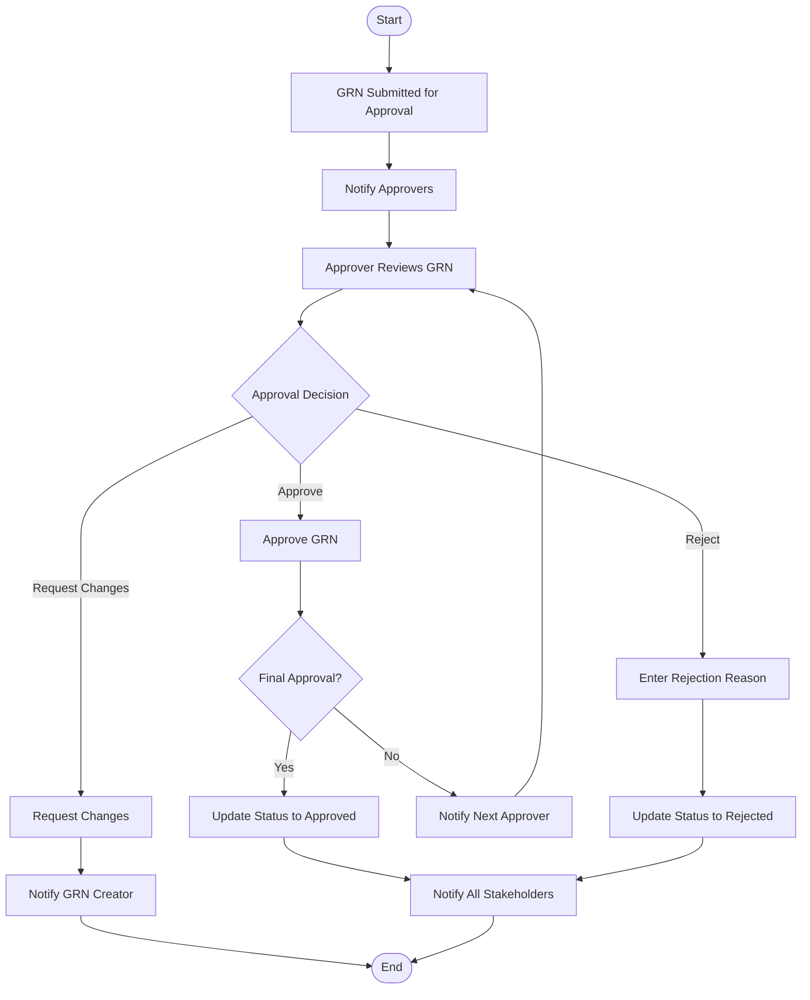
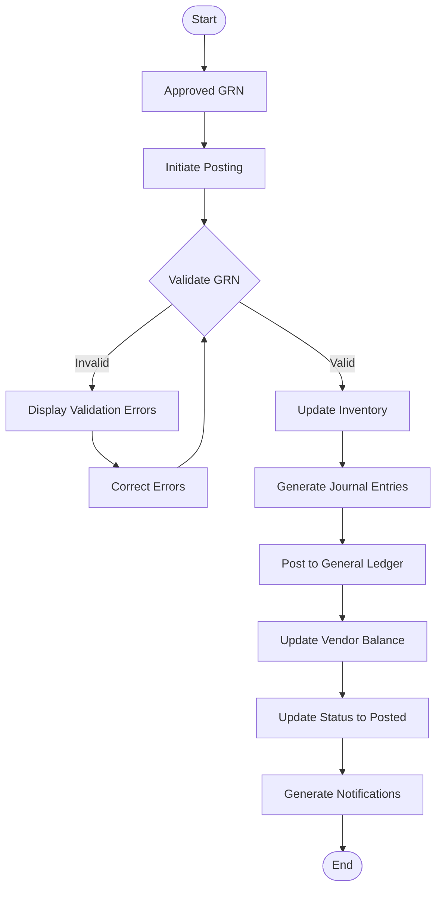
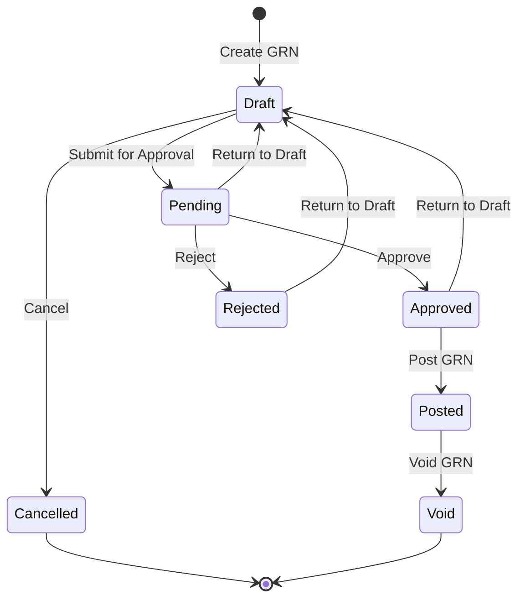

# Goods Received Note (GRN) Module - Page Flow Diagrams

This document provides visual representations of the user flows and page navigation within the Goods Received Note module.

## 1. Main GRN User Flow

## 2. GRN Creation Flow

## 3. GRN Approval Flow

## 4. GRN Posting Flow

## 5. GRN Component Interaction

```mermaid
flowchart TD
    GRNPage[GRN Page] --> GRNHeader[GRN Header Component]
    GRNPage --> TabsContainer[Tabs Container]
    
    GRNHeader --> BasicInfoSection[Basic Info Section]
    GRNHeader --> ActionButtons[Action Buttons]
    GRNHeader --> StatusDisplay[Status Display]
    
    TabsContainer --> ItemsTab[Items Tab]
    TabsContainer --> ExtraCostsTab[Extra Costs Tab]
    TabsContainer --> StockMovementTab[Stock Movement Tab]
    TabsContainer --> JournalEntriesTab[Journal Entries Tab]
    TabsContainer --> TaxEntriesTab[Tax Entries Tab]
    TabsContainer --> CommentsTab[Comments Tab]
    TabsContainer --> AttachmentsTab[Attachments Tab]
    TabsContainer --> ActivityLogTab[Activity Log Tab]
    
    ItemsTab --> ItemsGrid[Items Grid]
    ItemsTab --> BulkActions[Bulk Actions]
    ItemsTab --> ItemDetailForm[Item Detail Form]
    
    ExtraCostsTab --> CostsGrid[Costs Grid]
    ExtraCostsTab --> DistributionSettings[Distribution Settings]
    
    StockMovementTab --> MovementsGrid[Movements Grid]
    StockMovementTab --> MovementDetails[Movement Details]
    
    JournalEntriesTab --> JournalGrid[Journal Grid]
    JournalEntriesTab --> AccountingDetails[Accounting Details]
    
    TaxEntriesTab --> TaxInvoiceDetails[Tax Invoice Details]
    TaxEntriesTab --> TaxCalculations[Tax Calculations]
    
    GRNPage --> SummarySection[Summary Section]
    SummarySection --> TotalsDisplay[Totals Display]
    SummarySection --> CurrencyDisplay[Currency Display]
```

## 6. GRN Status Transitions

