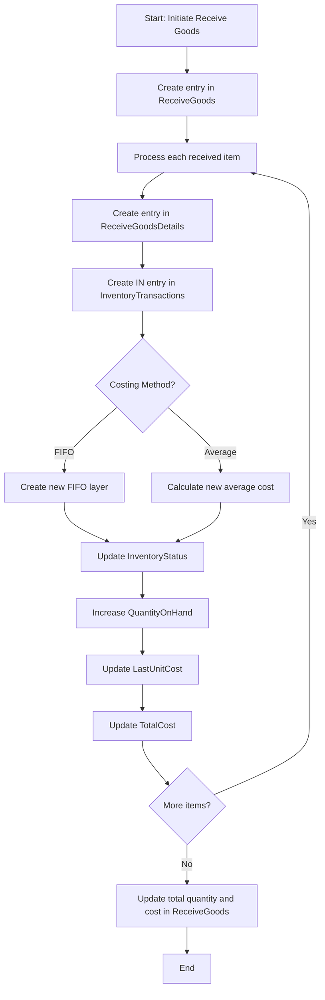
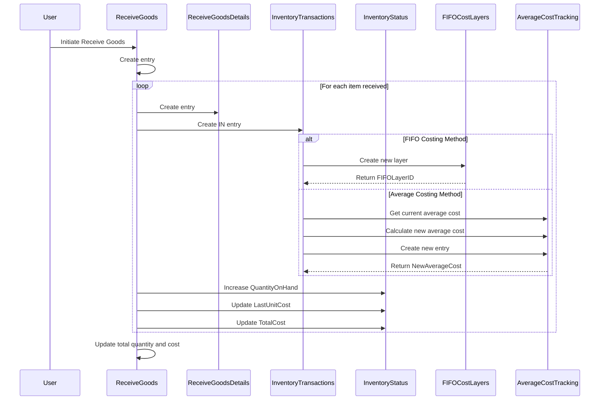
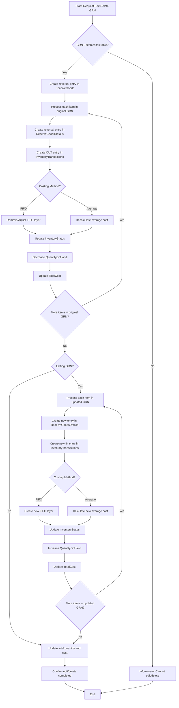
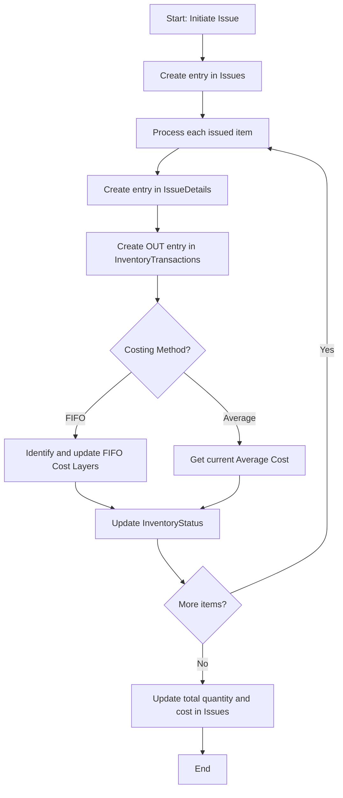
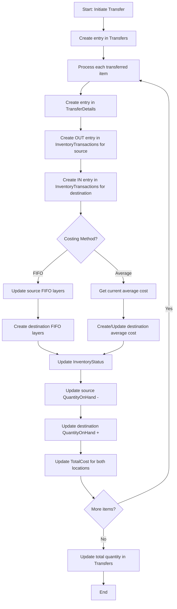
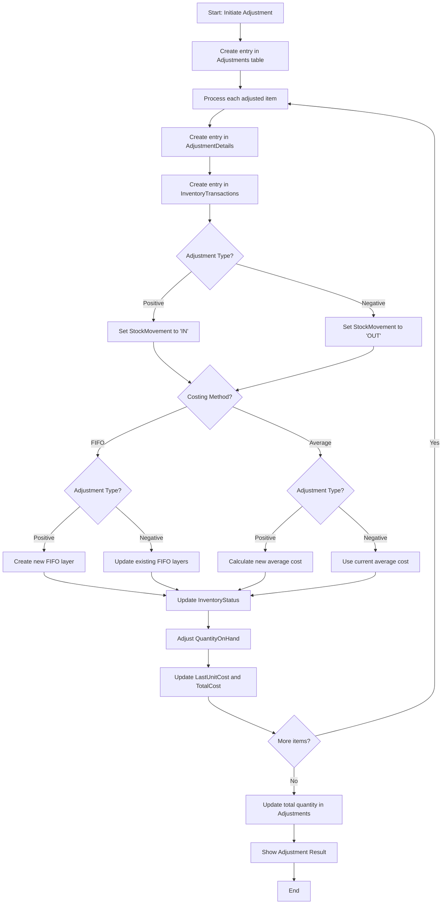
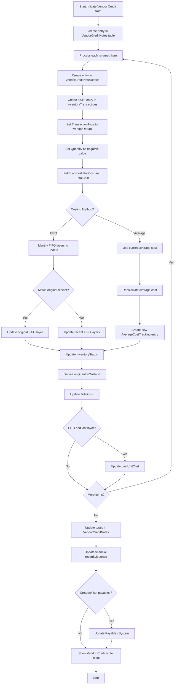

# Comprehensive Inventory Management System Documentation

**Document Status:** Draft  
**Last Updated:** March 27, 2024

## Table of Contents

1. [Introduction](#1-introduction)
2. [Data Schema](#2-data-schema)
3. [Transaction Types](#3-transaction-types)
4. [Process Flows](#4-process-flows)
   - [4.1 Receive Goods (IN)](#41-receive-goods-in)
   - [4.2 Issue Goods (OUT)](#42-issue-goods-out)
   - [4.3 Transfer Goods (TRANSFER)](#43-transfer-goods-transfer)
   - [4.4 Adjust Inventory](#44-adjust-inventory)
   - [4.5 Vendor Credit Notes (Returns to Vendor)](#45-vendor-credit-notes-returns-to-vendor)
5. [Costing Methods](#5-costing-methods)
6. [Reporting and Analysis](#6-reporting-and-analysis)
7. [Implementation Considerations](#7-implementation-considerations)

## 1. Introduction

This document outlines a comprehensive inventory management system that supports both FIFO (First-In-First-Out) and Average costing methods. The system is designed to handle various transaction types including receipts, issues, transfers, adjustments, and vendor returns, while maintaining accurate cost tracking and inventory valuation.

## 2. Data Schema

### Items Table

| Field Name | Data Type | Constraints | Description |
| --- | --- | --- | --- |
| ItemID | INT | PK, AUTO_INCREMENT | Unique identifier for each item |
| ItemCode | VARCHAR(50) | UNIQUE | Unique code assigned to the item |
| Description | VARCHAR(255) |  | Detailed description of the item |
| UnitOfMeasure | VARCHAR(20) |  | Unit of measurement (e.g., Each, Kg, Liter) |
| CostingMethod | VARCHAR(10) |  | Costing method used (FIFO or AVERAGE) |

### Locations Table

| Field Name | Data Type | Constraints | Description |
| --- | --- | --- | --- |
| LocationID | INT | PK, AUTO_INCREMENT | Unique identifier for each location |
| LocationCode | VARCHAR(50) | UNIQUE | Unique code assigned to the location |
| Description | VARCHAR(255) |  | Detailed description of the location |

### InventoryTransactions Table

| Field Name | Data Type | Constraints | Description |
| --- | --- | --- | --- |
| TransactionID | INT | PK, AUTO_INCREMENT | Unique identifier for each inventory transaction |
| TransactionDate | DATE |  | Date of the transaction |
| TransactionType | VARCHAR(50) |  | Type of transaction (Receive, Issue, Transfer, etc.) |
| StockMovement | VARCHAR(10) |  | Direction of stock movement (IN, OUT, TRANSFER) |
| ItemID | INT | FK (Items) | Reference to the item involved in the transaction |
| FromLocationID | INT | FK (Locations) | Source location of the transaction |
| ToLocationID | INT | FK (Locations) | Destination location of the transaction |
| Quantity | DECIMAL(18,2) |  | Quantity involved in the transaction |
| UnitCost | DECIMAL(18,2) |  | Unit cost of the item in this transaction |
| TotalCost | DECIMAL(18,2) |  | Total cost (Quantity * UnitCost) |
| FIFOLayerID | INT | FK (FIFOCostLayers) | Reference to FIFO layer (for FIFO items) |
| NewAverageCost | DECIMAL(18,2) |  | New average cost after transaction (for Average items) |
| ReferenceID | INT |  | Reference to the source transaction ID |
| ReferenceType | VARCHAR(50) |  | Type of reference (e.g., ReceiveID, IssueID, TransferID) |

### FIFOCostLayers Table

| Field Name | Data Type | Constraints | Description |
| --- | --- | --- | --- |
| LayerID | INT | PK, AUTO_INCREMENT | Unique identifier for each FIFO cost layer |
| ItemID | INT | FK (Items) | Reference to the item |
| LocationID | INT | FK (Locations) | Location of the cost layer |
| ReceiveDate | DATE |  | Date when this layer was received |
| Quantity | DECIMAL(18,2) |  | Original quantity in this layer |
| RemainingQuantity | DECIMAL(18,2) |  | Remaining quantity in this layer |
| UnitCost | DECIMAL(18,2) |  | Unit cost of this layer |
| TotalCost | DECIMAL(18,2) |  | Total cost of this layer |
| TransactionID | INT | FK (InventoryTransactions) | Reference to the creating transaction |

### AverageCostTracking Table

| Field Name | Data Type | Constraints | Description |
| --- | --- | --- | --- |
| TrackingID | INT | PK, AUTO_INCREMENT | Unique identifier for each average cost record |
| ItemID | INT | FK (Items) | Reference to the item |
| LocationID | INT | FK (Locations) | Location for this average cost |
| Date | DATE |  | Date of the average cost calculation |
| Quantity | DECIMAL(18,2) |  | Total quantity on hand |
| TotalCost | DECIMAL(18,2) |  | Total cost of inventory on hand |
| AverageCost | DECIMAL(18,2) |  | Calculated average cost (TotalCost / Quantity) |

### InventoryStatus Table

| Field Name | Data Type | Constraints | Description |
| --- | --- | --- | --- |
| StatusID | INT | PK, AUTO_INCREMENT | Unique identifier for each inventory status record |
| ItemID | INT | FK (Items) | Reference to the item |
| LocationID | INT | FK (Locations) | Location of the inventory |
| QuantityOnHand | DECIMAL(18,2) |  | Current quantity on hand |
| LastUnitCost | DECIMAL(18,2) |  | Last unit cost (for FIFO) or current average cost |
| TotalCost | DECIMAL(18,2) |  | Total cost of inventory on hand |
| LastUpdateDate | DATE |  | Date of the last update to this status |

## 3. Transaction Types

1. **Receive Goods (IN)** - Adding inventory to the system through purchases or returns
2. **Issue Goods (OUT)** - Removing inventory for sales, consumption, or other uses
3. **Transfer Goods (TRANSFER)** - Moving inventory between locations
4. **Adjust Inventory** - Correcting inventory quantities and costs
5. **Vendor Credit Notes (Returns to Vendor)** - Returning goods to vendors

## 4. Process Flows

### 4.1 Receive Goods (IN)

**Process Flow:**
1. Create entry in ReceiveGoods table
2. For each item received:
   a. Create entry in ReceiveGoodsDetails table
   b. Create entry in InventoryTransactions table:
      - Set StockMovement to 'IN'
      - Set FromLocationID to NULL
      - Set ToLocationID to receiving location
   c. Check CostingMethod for the item:
      - If FIFO:
        i. Create new entry in FIFOCostLayers table
        ii. Set FIFOLayerID in InventoryTransactions
      - If Average:
        i. Calculate new average cost:
           (Current Total Cost + Received Total Cost) / (Current Quantity + Received Quantity)
        ii. Create entry in AverageCostTracking table
        iii. Set NewAverageCost in InventoryTransactions
   d. Update InventoryStatus table:
      - Increase QuantityOnHand
      - Update LastUnitCost and TotalCost
3. Update total quantity and cost in ReceiveGoods table

#### 4.1.5 Edit and Delete

**Process for Editing or Deleting a Goods Received Note:**

1. Check if the GRN can be edited/deleted:
   - Verify if any items from this receipt have been issued or transferred.
   - If yes, prevent editing/deletion and inform the user.
2. If editable/deletable:
   a. For deletion: Reverse all effects of the original GRN.
   b. For editing: Reverse original entries and create new ones with updated information.
3. Reversal process:
   - Create a reversal entry in ReceiveGoods table (negative quantities).
   - For each item in the original receipt:
     a. Create a reversal entry in ReceiveGoodsDetails.
     b. Create a reversal entry in InventoryTransactions (OUT transaction).
     c. Update costing:
        - If FIFO: Remove or adjust the corresponding FIFOCostLayer.
        - If Average: Recalculate average cost and create a new AverageCostTracking entry.
     d. Update InventoryStatus:
        - Decrease QuantityOnHand.
        - Update TotalCost.
4. For editing, after reversal:
   - Create new entries as per the regular Receive Goods process with updated information.
5. Update total quantity and cost in ReceiveGoods table.

### 4.2 Issue Goods (OUT)

**Process Flow:**
1. Create entry in Issues table
2. For each item issued:
   a. Create entry in IssueDetails table
   b. Create entry in InventoryTransactions table:
      - Set StockMovement to 'OUT'
      - Set FromLocationID to issuing location
      - Set ToLocationID to NULL or To Cost Location if Zero. 
   c. Check CostingMethod for the item:
      - If FIFO:
        i. Identify and update FIFOCostLayers:
           - Start with oldest layer, move to newer layers as needed
           - Update RemainingQuantity in each affected layer
        ii. Set FIFOLayerID(s) in InventoryTransactions (may need multiple entries if spanning layers)
      - If Average:
        i. Use current average cost from latest AverageCostTracking entry
        ii. Set NewAverageCost in InventoryTransactions (same as current in this case)
   d. Update InventoryStatus table:
      - Decrease QuantityOnHand
      - Update TotalCost
3. Update total quantity and cost in Issues table

### 4.3 Transfer Goods (TRANSFER)

**Process Flow:**
1. Create entry in Transfers table
2. For each item transferred:
   a. Create entry in TransferDetails table
   b. Create two entries in InventoryTransactions table:
      - First entry (OUT from source):
        - Set StockMovement to 'TRANSFER'
        - Set FromLocationID to source location
        - Set ToLocationID to destination location
      - Second entry (IN to destination):
        - Set StockMovement to 'TRANSFER'
        - Set FromLocationID to source location
        - Set ToLocationID to destination location
   c. Check CostingMethod for the item:
      - If FIFO:
        i. Identify and update FIFOCostLayers for source location:
           - Start with oldest layer, move to newer layers as needed
           - Update RemainingQuantity in each affected layer
        ii. Create new FIFOCostLayers for destination location
        iii. Set FIFOLayerID(s) in both InventoryTransactions entries
      - If Average:
        i. Use current average cost from latest AverageCostTracking entry for source location
        ii. Create new AverageCostTracking entry for destination location if it's the first time this item is stocked there
        iii. Set NewAverageCost in both InventoryTransactions entries
   d. Update InventoryStatus table for both locations:
      - Decrease QuantityOnHand for source location
      - Increase QuantityOnHand for destination location
      - Update TotalCost for both locations
3. Update total quantity in Transfers table

### 4.4 Adjust Inventory

**Process Flow:**
1. Create entry in Adjustments table
2. For each item adjusted:
   a. Create entry in AdjustmentDetails table
   b. Create entry in InventoryTransactions table:
      - Set StockMovement to 'IN' for positive adjustments, 'OUT' for negative
      - Set FromLocationID and ToLocationID based on adjustment type
   c. Check CostingMethod for the item:
      - If FIFO:
        i. For positive adjustments:
           - Create new entry in FIFOCostLayers table
        ii. For negative adjustments:
           - Update RemainingQuantity in FIFOCostLayers, starting with oldest
        iii. Set FIFOLayerID in InventoryTransactions
      - If Average:
        i. For positive adjustments:
           - Calculate new average cost
           - Create new entry in AverageCostTracking table
        ii. For negative adjustments:
           - Use current average cost
        iii. Set NewAverageCost in InventoryTransactions
   d. Update InventoryStatus table:
      - Adjust QuantityOnHand
      - Update LastUnitCost and TotalCost
3. Update total quantity in Adjustments table

### 4.5 Vendor Credit Notes (Returns to Vendor)

**Process Flow:**
1. Create entry in VendorCreditNotes table
2. For each item being returned to the vendor:
   a. Create entry in VendorCreditNoteDetails table
   b. Create entry in InventoryTransactions table:
      - Set TransactionType to 'VendorReturn'
      - Set StockMovement to 'OUT'
      - Set FromLocationID to the location of the inventory
      - Set ToLocationID to NULL
      - Set Quantity (as negative value)
      - Set UnitCost and TotalCost
   c. Check CostingMethod for the item:
      - If FIFO:
        i. Identify the appropriate FIFOCostLayers to update:
           - Ideally, match to the original receipt layer if possible
           - If not possible, use the most recent layers
        ii. Update RemainingQuantity in affected FIFOCostLayers
        iii. Set FIFOLayerID in InventoryTransactions
      - If Average:
        i. Use current average cost for the transaction
        ii. Recalculate average cost after removal:
           New Avg Cost = (Total Cost - Returned Cost) / (Total Quantity - Returned Quantity)
        iii. Create new entry in AverageCostTracking table
        iv. Set NewAverageCost in InventoryTransactions
   d. Update InventoryStatus table:
      - Decrease QuantityOnHand
      - Update LastUnitCost (if FIFO and it was the last layer)
      - Update TotalCost
3. Update total quantity and amount in VendorCreditNotes table
4. (Optional) Create a payable or offset against existing payables to the vendor
5. Update any relevant financial records or journals to reflect the return and credit

## 5. Costing Methods

### FIFO (First-In-First-Out)

- Each receipt creates a new cost layer
- Issues deplete layers in the order they were created
- Supports detailed cost tracking and valuation
- Provides more accurate inventory valuation in inflationary environments
- Requires more detailed record-keeping and processing

### Average Cost

- Calculates a new average cost with each receipt
- All issues use the current average cost
- Simplifies cost tracking but may be less precise for individual transactions
- Reduces the complexity of inventory valuation
- Requires less detailed record-keeping than FIFO
- May be more appropriate for commodities or items with minimal cost variations

## 6. Reporting and Analysis

1. **Inventory Valuation Report**
   - Current value of inventory by item, location, and category
   - Historical valuation trends
   - Comparison of valuation methods (FIFO vs. Average)

2. **Stock Movement Report**
   - Detailed transaction history by item and location
   - Movement analysis by transaction type
   - Trend analysis of stock movements

3. **FIFO Layer Analysis** (for FIFO items)
   - Current FIFO layers by item and location
   - Age analysis of inventory layers
   - Cost variance analysis across layers

4. **Average Cost Trend Analysis** (for Average Cost items)
   - Historical average cost changes
   - Cost trend visualization
   - Impact analysis of new receipts on average cost

5. **Inventory Turnover Report**
   - Turnover ratio by item, category, and location
   - Slow-moving and fast-moving item identification
   - Seasonal turnover patterns

6. **Stock-out Frequency Report**
   - Items with frequent stock-outs
   - Duration of stock-out periods
   - Impact analysis of stock-outs

7. **Vendor Return Analysis**
   - Return frequency by vendor and item
   - Return reason analysis
   - Cost impact of returns

## 7. Implementation Considerations

1. **Data Integrity**
   - Ensure robust error handling and transaction management
   - Implement database constraints and validation rules
   - Develop comprehensive audit trails for all inventory transactions

2. **Performance Optimization**
   - Implement proper indexing on frequently queried fields
   - Consider partitioning for large transaction tables
   - Optimize queries for high-volume operations

3. **Transaction Volume Management**
   - Design for scalability to handle high transaction volumes
   - Consider the impact on FIFO layer updates
   - Implement batch processing for bulk operations

4. **Cost Variance Handling**
   - Develop clear policies for handling cost variances
   - Implement variance accounts for financial reconciliation
   - Define approval workflows for significant variances

5. **Security and Access Control**
   - Implement role-based access controls
   - Define approval hierarchies for critical transactions
   - Ensure proper segregation of duties

6. **System Integration**
   - Define integration points with purchasing, sales, and finance systems
   - Implement robust API interfaces for external systems
   - Ensure real-time or near-real-time data synchronization

7. **Data Management**
   - Develop archiving strategies for historical transaction data
   - Implement data purging policies for obsolete records
   - Ensure data backup and recovery procedures

8. **Testing Strategy**
   - Develop comprehensive test cases including edge scenarios
   - Test performance under high-volume conditions
   - Implement automated regression testing

9. **User Training and Documentation**
   - Create detailed user manuals and training materials
   - Develop process flow documentation for end-users
   - Provide ongoing training for system updates

10. **Maintenance and Updates**
    - Plan for regular system maintenance
    - Develop a roadmap for feature enhancements
    - Implement a change management process for system updates 