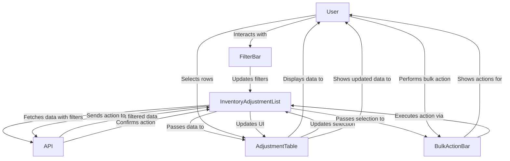
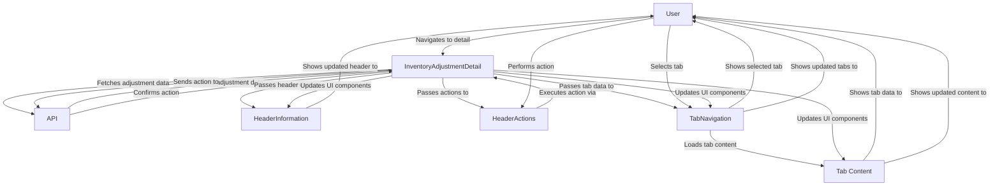
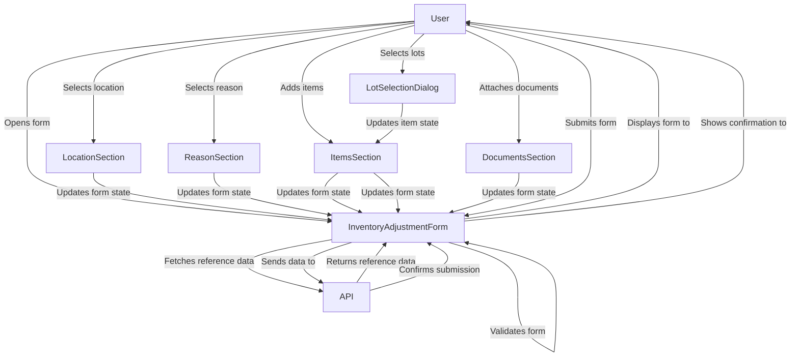

# Inventory Adjustment Module - Component Structure

**Document Status:** Draft  
**Last Updated:** March 27, 2024

## Table of Contents

1. [Introduction](#1-introduction)
2. [Component Hierarchy](#2-component-hierarchy)
3. [Component Responsibilities](#3-component-responsibilities)
4. [Data Flow](#4-data-flow)
5. [Component Interactions](#5-component-interactions)
6. [State Management](#6-state-management)
7. [Technical Considerations](#7-technical-considerations)

## 1. Introduction

This document outlines the component structure for the Inventory Adjustment module within the Carmen F&B Management System. It details the hierarchy, responsibilities, and interactions between components, providing a blueprint for development and maintenance.

The component architecture follows modern React patterns with a focus on reusability, maintainability, and performance. Components are organized in a logical hierarchy that reflects the business domain and user workflows.

## 2. Component Hierarchy

```
InventoryAdjustmentModule
├── InventoryAdjustmentList
│   ├── FilterBar
│   │   ├── QuickFilters
│   │   ├── SearchInput
│   │   └── AdvancedFilterDialog
│   ├── AdjustmentTable
│   │   ├── TableHeader
│   │   ├── TableRow
│   │   │   └── StatusBadge
│   │   └── TablePagination
│   ├── BulkActionBar
│   └── ExportOptions
├── InventoryAdjustmentDetail
│   ├── HeaderActions
│   ├── HeaderInformation
│   │   └── StatusBadge
│   ├── TabNavigation
│   │   ├── ItemsTab
│   │   │   ├── ItemsTable
│   │   │   │   └── ItemRow
│   │   │   └── AddItemDialog
│   │   │       └── LotSelectionDialog
│   │   ├── StockMovementTab
│   │   │   └── StockMovementTable
│   │   ├── JournalEntriesTab
│   │   │   ├── JournalHeader
│   │   │   └── JournalTable
│   │   ├── CommentsTab
│   │   │   ├── CommentList
│   │   │   └── CommentForm
│   │   └── ActivityLogTab
│   │       └── ActivityLogList
│   └── RightPanel
│       ├── DocumentsSection
│       └── SummarySection
├── InventoryAdjustmentForm
│   ├── FormHeader
│   ├── LocationSection
│   ├── ReasonSection
│   ├── ItemsSection
│   │   ├── ItemSearchInput
│   │   ├── ItemsGrid
│   │   │   └── ItemRow
│   │   └── LotSelectionDialog
│   ├── DocumentsSection
│   │   └── FileUploader
│   └── SummarySection
└── SharedComponents
    ├── StatusBadge
    ├── DatePicker
    ├── Dropdown
    ├── SearchInput
    ├── FileUploader
    ├── ConfirmDialog
    ├── NotificationToast
    └── LoadingSpinner
```

## 3. Component Responsibilities

### 3.1 List View Components

#### InventoryAdjustmentList

- Main container for the adjustment list view
- Manages data fetching and pagination
- Handles filtering and sorting state
- Coordinates child components

#### FilterBar

- Contains filtering and search controls
- Manages filter state and applies filters
- Provides quick filters for common scenarios
- Opens advanced filter dialog

#### AdjustmentTable

- Displays adjustment data in tabular format
- Handles row selection
- Manages column sorting
- Renders status indicators

#### BulkActionBar

- Provides actions for selected adjustments
- Handles batch operations
- Shows count of selected items
- Confirms destructive actions

### 3.2 Detail View Components

#### InventoryAdjustmentDetail

- Main container for the adjustment detail view
- Fetches and manages adjustment data
- Coordinates child components
- Handles state transitions

#### HeaderActions

- Provides action buttons based on adjustment status
- Handles edit, post, void, and other operations
- Confirms destructive actions
- Shows appropriate actions based on user permissions

#### HeaderInformation

- Displays key adjustment information
- Shows status with appropriate visual indicators
- Provides context for the current adjustment
- Displays reference numbers and dates

#### TabNavigation

- Manages tab selection and content display
- Provides consistent navigation between sections
- Preserves tab state during navigation
- Handles lazy loading of tab content

#### ItemsTab

- Displays and manages adjustment items
- Handles adding, editing, and removing items
- Calculates totals and validates entries
- Manages lot selection for lot-tracked items

#### StockMovementTab

- Displays stock movement records
- Shows impact on inventory quantities
- Provides filtering and sorting of movements
- Links to related inventory transactions

#### JournalEntriesTab

- Displays financial entries generated by the adjustment
- Shows debit and credit entries
- Provides account details and totals
- Links to financial module for further details

#### RightPanel

- Displays contextual information and actions
- Displays attached documents
- Provides summary information

### 3.3 Form Components

#### InventoryAdjustmentForm

- Main container for creating/editing adjustments
- Manages form state and validation
- Coordinates child components
- Handles form submission and saving

#### LocationSection

- Provides location selection
- Validates location availability
- Shows location details
- Filters available items based on location

#### ReasonSection

- Provides reason code selection
- Filters reasons based on adjustment type
- Shows reason details
- Validates reason selection

#### ItemsSection

- Manages the list of items in the adjustment
- Provides item search and selection
- Calculates item and total costs
- Validates item entries

#### LotSelectionDialog

- Provides lot selection for lot-tracked items
- Shows available lots with quantities
- Validates lot selection
- Calculates lot costs

#### DocumentsSection

- Manages document attachments
- Provides file upload functionality
- Shows preview of attached documents
- Validates document requirements

### 3.4 Shared Components

#### StatusBadge

- Displays status with appropriate color and icon
- Provides consistent status visualization
- Supports different status types
- Includes tooltips for status description

#### DatePicker

- Provides date selection functionality
- Validates date ranges
- Supports different date formats
- Includes calendar visualization

#### Dropdown

- Provides dropdown selection
- Supports search in dropdown
- Handles large option lists
- Supports custom rendering of options

#### SearchInput

- Provides search functionality
- Supports autocomplete
- Handles debounced search
- Shows search results

#### FileUploader

- Handles file uploads
- Validates file types and sizes
- Shows upload progress
- Provides preview functionality

## 4. Data Flow

### 4.1 List View Data Flow



### 4.2 Detail View Data Flow



### 4.3 Form Data Flow



## 5. Component Interactions

### 5.1 List-Detail Navigation

- User clicks on a row in AdjustmentTable
- InventoryAdjustmentList captures the click event
- InventoryAdjustmentList triggers navigation to detail view
- InventoryAdjustmentDetail loads with the selected adjustment ID
- InventoryAdjustmentDetail fetches and displays the adjustment data

### 5.2 Tab Navigation

- User clicks on a tab in TabNavigation
- TabNavigation updates the active tab state
- TabNavigation renders the corresponding tab content
- Tab content components fetch their specific data if needed
- Tab content components render their specific UI

### 5.3 Form Submission

- User fills out the InventoryAdjustmentForm
- Each section updates the form state as the user interacts
- User clicks the submit button
- InventoryAdjustmentForm validates all sections
- If validation passes, InventoryAdjustmentForm submits the data
- On successful submission, user is navigated to the detail view
- On error, validation messages are displayed in the appropriate sections

## 6. State Management

### 6.1 List View State

```typescript
interface AdjustmentListState {
  adjustments: AdjustmentListItem[]
  loading: boolean
  error: Error | null
  pagination: {
    page: number
    pageSize: number
    totalItems: number
    totalPages: number
  }
  filters: {
    status: string[]
    type: string[]
    dateRange: [Date | null, Date | null]
    location: string[]
    reason: string[]
    searchTerm: string
    advancedFilters: Record<string, any>
  }
  sorting: {
    field: string
    direction: 'asc' | 'desc'
  }
  selectedRows: string[]
  bulkActionInProgress: boolean
}
```

### 6.2 Detail View State

```typescript
interface AdjustmentDetailState {
  adjustment: InventoryAdjustment | null
  loading: boolean
  error: Error | null
  activeTab: 'items' | 'stock' | 'journal' | 'comments' | 'activity'
  isEditing: boolean
  actionInProgress: boolean
  rightPanelOpen: boolean
  tabData: {
    items: {
      loading: boolean
      error: Error | null
      data: AdjustmentItem[]
    }
    stock: {
      loading: boolean
      error: Error | null
      data: StockMovement[]
    }
    journal: {
      loading: boolean
      error: Error | null
      data: JournalEntry[]
    }
    comments: {
      loading: boolean
      error: Error | null
      data: Comment[]
    }
    activity: {
      loading: boolean
      error: Error | null
      data: ActivityLog[]
    }
  }
}
```

### 6.3 Form State

```typescript
interface AdjustmentFormState {
  formData: {
    id?: string
    date: Date
    type: 'IN' | 'OUT'
    location: string
    locationCode: string
    reason: string
    description: string
    department: string
    items: AdjustmentFormItem[]
    documents: File[]
  }
  validation: {
    date: string | null
    type: string | null
    location: string | null
    reason: string | null
    description: string | null
    department: string | null
    items: string | null
    documents: string | null
  }
  referenceData: {
    locations: Location[]
    reasons: ReasonCode[]
    departments: Department[]
    loadingLocations: boolean
    loadingReasons: boolean
    loadingDepartments: boolean
  }
  ui: {
    isSubmitting: boolean
    submitError: Error | null
    isDirty: boolean
    activeSection: string
    showLotDialog: boolean
    currentItemIndex: number | null
  }
}
```

## 7. Technical Considerations

### 7.1 Component Implementation

- Use functional components with React hooks
- Implement proper TypeScript interfaces for props and state
- Use React Context for shared state where appropriate
- Implement error boundaries for robust error handling
- Use React.memo for performance optimization where beneficial
- Implement proper loading states and error handling
- Use consistent naming conventions

### 7.2 Data Fetching

- Use React Query for data fetching and caching
- Implement optimistic updates for better user experience
- Handle loading and error states consistently
- Use proper pagination and infinite scrolling where appropriate
- Implement debouncing for search inputs
- Use proper error handling and retry mechanisms

### 7.3 Form Handling

- Use React Hook Form for form state management
- Implement Zod for schema validation
- Use controlled components for form inputs
- Implement proper field-level validation
- Use form context for complex forms
- Implement proper dirty state tracking
- Use consistent validation error display

### 7.4 Styling

- Use Tailwind CSS for styling
- Implement responsive design for all components
- Use Shadcn UI components for consistent UI
- Implement proper accessibility attributes
- Use CSS variables for theming
- Implement proper focus and hover states
- Use consistent spacing and sizing

### 7.5 Performance Considerations

- Implement virtualization for large lists
- Use proper memoization for expensive calculations
- Implement lazy loading for tabs and dialogs
- Optimize re-renders with proper dependency arrays
- Use code splitting for large components
- Implement proper loading indicators
- Optimize API calls with proper caching 