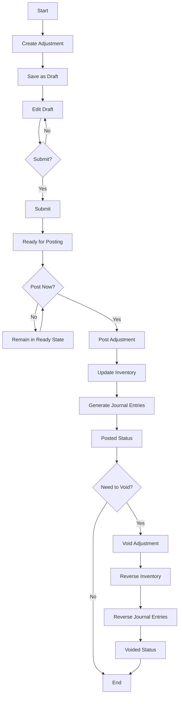
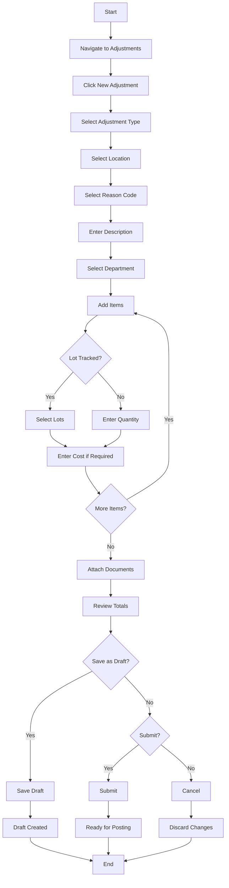
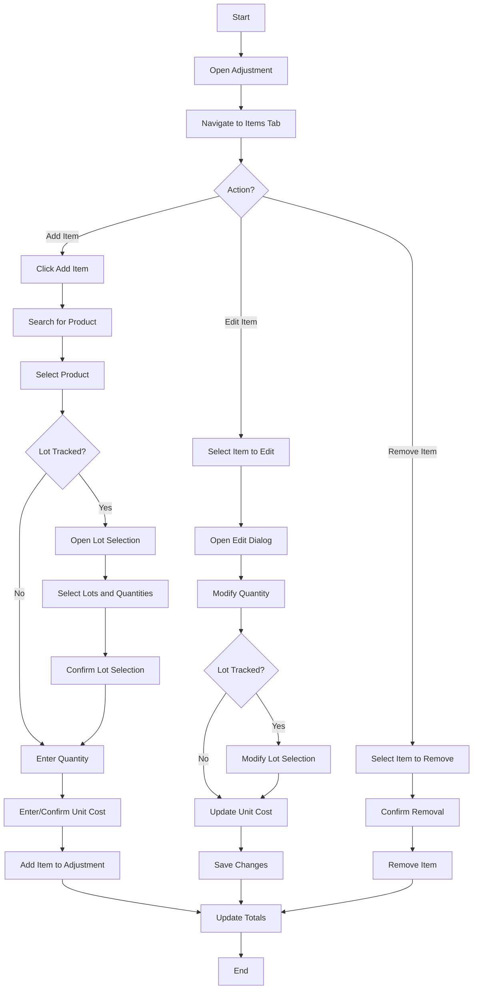
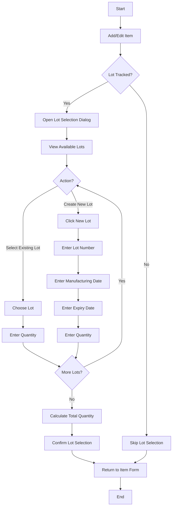
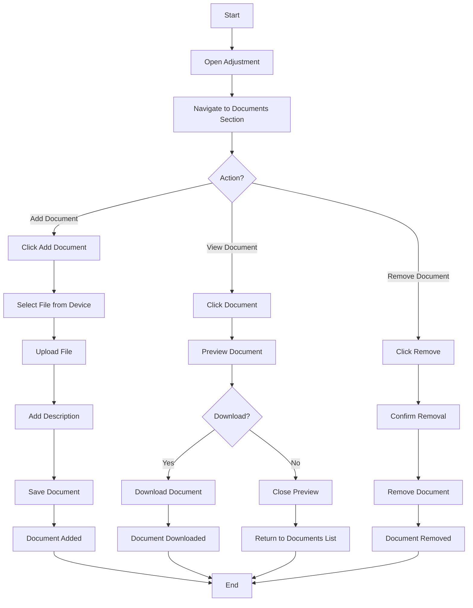
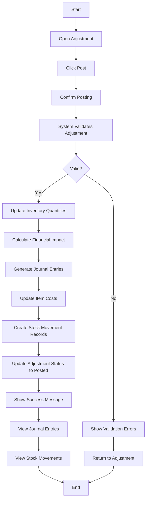
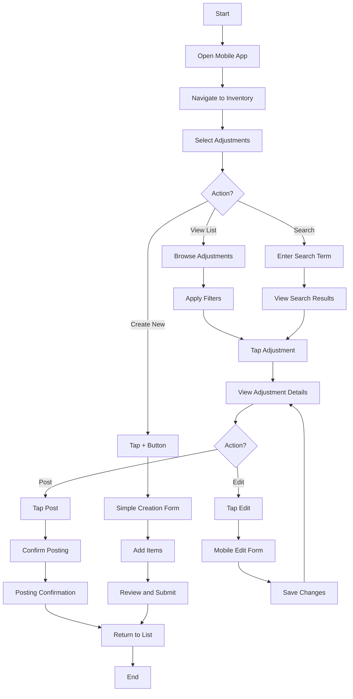
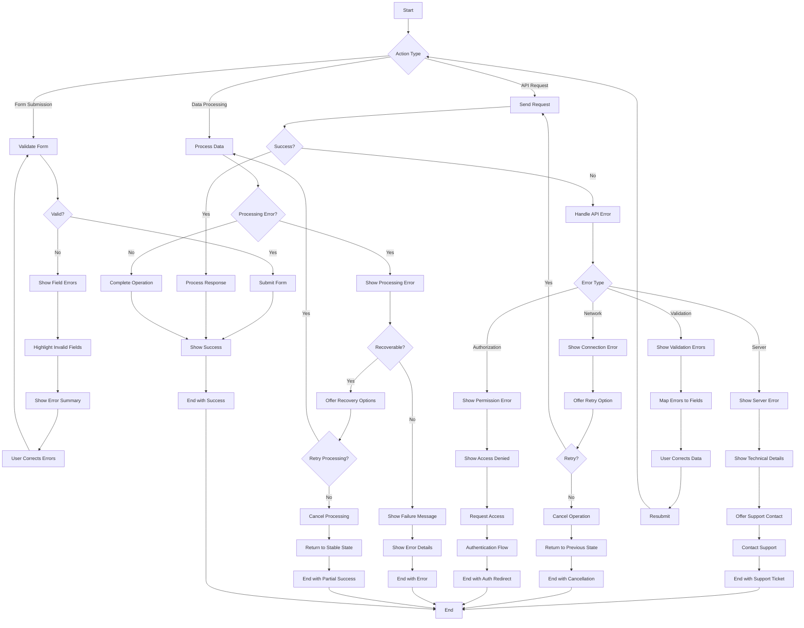

# Inventory Adjustment Module - User Flow Diagrams

**Document Status:** Draft  
**Last Updated:** March 27, 2024

## Document History

| Version | Date | Author | Changes |
|---------|------|--------|---------|
| 1.0.0 | 2025-11-19 | Documentation Team | Initial version |
## Table of Contents

1. [Introduction](#1-introduction)
2. [Adjustment Lifecycle Flow](#2-adjustment-lifecycle-flow)
3. [Adjustment Creation Flow](#3-adjustment-creation-flow)
4. [Item Management Flow](#4-item-management-flow)
5. [Lot Selection Flow](#5-lot-selection-flow)
6. [Document Management Flow](#6-document-management-flow)
7. [Posting and Financial Flow](#7-posting-and-financial-flow)
8. [Mobile User Flow](#8-mobile-user-flow)
9. [Error Handling Flow](#9-error-handling-flow)

## 1. Introduction

This document provides visual representations of user flows within the Inventory Adjustment module of the Carmen F&B Management System. These diagrams illustrate typical user journeys and interactions with the system, helping to understand the workflow and user experience.

## 2. Adjustment Lifecycle Flow

The following diagram illustrates the complete lifecycle of an inventory adjustment from creation to completion.

## 3. Adjustment Creation Flow

This diagram shows the step-by-step process for creating a new inventory adjustment.

## 4. Item Management Flow

This diagram shows the process for managing items within an adjustment.

## 5. Lot Selection Flow

This diagram illustrates the process for selecting lots for lot-tracked items.

## 6. Document Management Flow

This diagram shows the process for managing documents attached to an adjustment.

## 7. Posting and Financial Flow

This diagram illustrates the process for posting an adjustment and its financial impact.

## 8. Mobile User Flow

This diagram shows the user flow for mobile devices.

## 9. Error Handling Flow

This diagram illustrates how errors are handled during the adjustment process.

