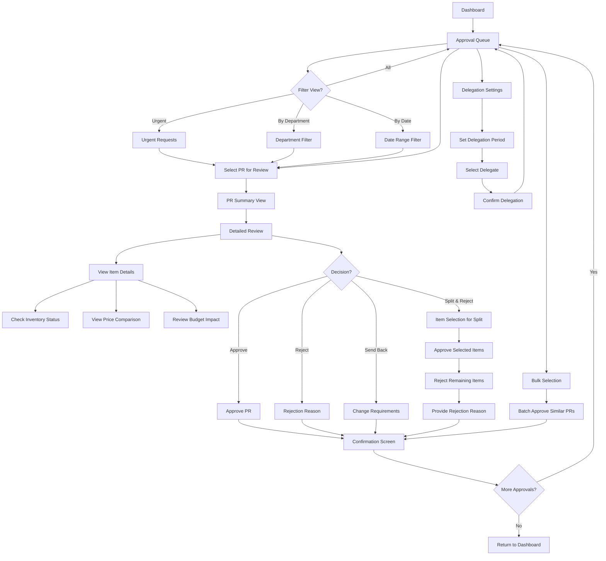

# Purchase Request Approval Module Page Flow

This diagram illustrates the user flow through the purchase request approval module of the Hotel Supply Chain Mobile Application.

## Purchase Request Approval Process Details

1. **Approval Queue**: List of pending requests requiring approval
2. **Filtering Options**: Sort and filter by priority, department, date, etc.
3. **PR Review**: Comprehensive examination of request details
4. **Decision Options**:
   - Approve: Full approval of request
   - Reject: Complete rejection with justification
   - Send Back: Return to requester for changes
   - Split & Reject: Partial approval of selected items
5. **Delegation**: Temporary transfer of approval authority
6. **Bulk Actions**: Process multiple similar requests simultaneously

## Key Features

- Real-time notifications for pending approvals
- Budget impact visualization
- Offline approval capability
- Priority indicators for urgent requests
- Complete audit trail of decisions
- Quantity adjustment during approval
- Approval history view
- Mobile-optimized review interface
