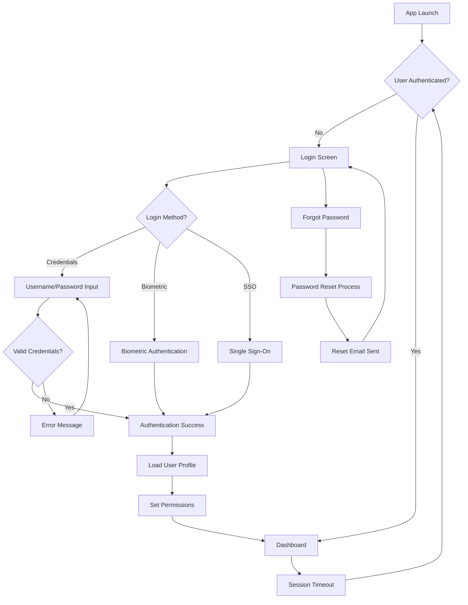

# Authentication Module Page Flow

This diagram illustrates the user flow through the authentication module of the Hotel Supply Chain Mobile Application.

## Authentication Process Details

1. **App Launch**: Initial app startup
2. **Authentication Check**: Verify if user is already authenticated
3. **Login Options**:
   - Username/Password: Traditional credential-based login
   - Biometric: Fingerprint or Face recognition
   - SSO: Enterprise Single Sign-On
4. **Credential Validation**: Server-side verification of credentials
5. **User Profile Loading**: Retrieve user information and settings
6. **Permission Setting**: Apply role-based access controls
7. **Password Recovery**: Self-service password reset flow
8. **Session Management**: Handle session timeouts and re-authentication

## Security Considerations

- All authentication attempts are logged for security auditing
- Biometric data never leaves the device
- Passwords are never stored in plain text
- Session tokens are encrypted and have configurable expiration
- Multiple failed attempts trigger temporary account lockout
