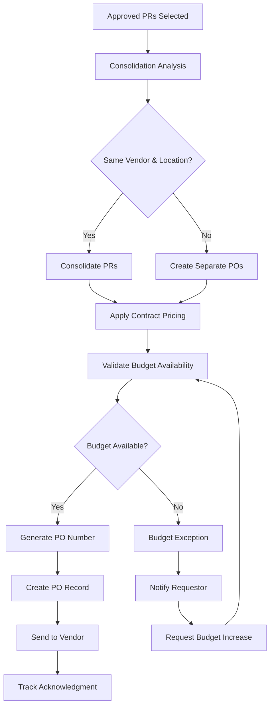
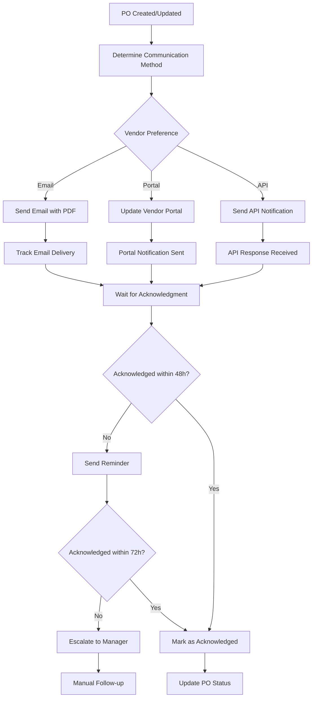
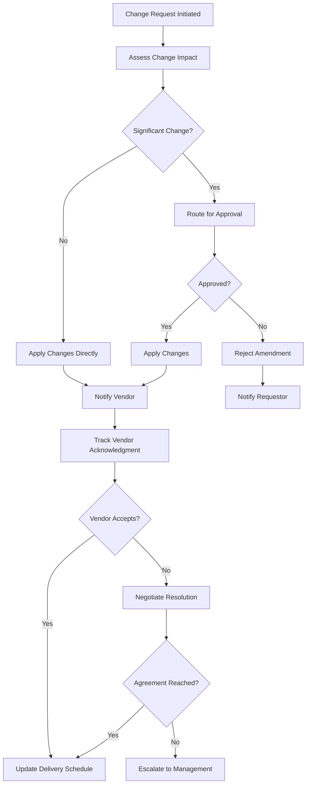
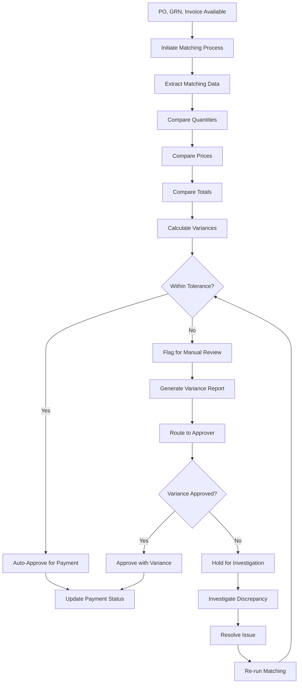

# Purchase Order Module - Technical Architecture & Workflows

**Document Version**: 1.0
**Last Updated**: January 23, 2025
**Document Type**: Technical Architecture Documentation
**Module**: Purchase Order Management

---

## 🏗️ Technical Architecture Overview

### System Architecture
```
┌─────────────────────────────────────────────────────────────────────────────┐
│                              Purchase Order Module                           │
├─────────────────────────────────────────────────────────────────────────────┤
│                                                                             │
│  ┌─────────────────┐  ┌─────────────────┐  ┌─────────────────┐            │
│  │   Presentation  │  │   Business      │  │   Data Access   │            │
│  │     Layer       │  │    Logic        │  │     Layer       │            │
│  │                 │  │                 │  │                 │            │
│  │ • PO Dashboard  │  │ • PO Service    │  │ • PO Repository │            │
│  │ • PO Detail     │  │ • Vendor Comm   │  │ • Item Repo     │            │
│  │ • Item Forms    │  │ • Matching Eng  │  │ • Audit Repo    │            │
│  │ • Reports       │  │ • Amendment Svc │  │ • Config Repo   │            │
│  └─────────────────┘  └─────────────────┘  └─────────────────┘            │
│           │                       │                       │                │
│           │                       │                       │                │
│  ┌─────────────────────────────────────────────────────────────────────┐   │
│  │                        Integration Layer                             │   │
│  │                                                                     │   │
│  │ ┌─────────────┐ ┌─────────────┐ ┌─────────────┐ ┌─────────────┐    │   │
│  │ │ PR Module   │ │ Vendor Mgmt │ │ Inventory   │ │ Finance     │    │   │
│  │ │ Connector   │ │ Connector   │ │ Connector   │ │ Connector   │    │   │
│  │ └─────────────┘ └─────────────┘ └─────────────┘ └─────────────┘    │   │
│  └─────────────────────────────────────────────────────────────────────┘   │
│                                                                             │
└─────────────────────────────────────────────────────────────────────────────┘
                                      │
                                      ▼
┌─────────────────────────────────────────────────────────────────────────────┐
│                              External Systems                               │
├─────────────────────────────────────────────────────────────────────────────┤
│                                                                             │
│ ┌─────────────┐ ┌─────────────┐ ┌─────────────┐ ┌─────────────┐            │
│ │ Email       │ │ Vendor      │ │ ERP         │ │ Audit       │            │
│ │ Service     │ │ Portals     │ │ System      │ │ System      │            │
│ └─────────────┘ └─────────────┘ └─────────────┘ └─────────────┘            │
│                                                                             │
└─────────────────────────────────────────────────────────────────────────────┘
```

### Component Architecture

#### Frontend Components (React/Next.js)
```typescript
// Component Hierarchy
PurchaseOrderModule/
├── pages/
│   ├── PurchaseOrdersPage.tsx          // Main listing page
│   ├── PODetailPage.tsx                // Detail view with tabs
│   ├── CreatePOPage.tsx                // Creation wizard
│   └── EditPOPage.tsx                  // Edit interface
├── components/
│   ├── tables/
│   │   ├── PurchaseOrdersDataTable.tsx
│   │   ├── POItemsTable.tsx
│   │   └── VendorCommunicationTable.tsx
│   ├── forms/
│   │   ├── POHeaderForm.tsx
│   │   ├── POItemForm.tsx
│   │   └── VendorSelectionForm.tsx
│   ├── tabs/
│   │   ├── EnhancedItemsTab.tsx
│   │   ├── FinancialDetailsTab.tsx
│   │   ├── RelatedDocumentsTab.tsx
│   │   └── ActivityLogTab.tsx
│   └── dialogs/
│       ├── CreateFromPRDialog.tsx
│       ├── AmendmentDialog.tsx
│       └── StatusChangeDialog.tsx
└── services/
    ├── POService.ts                    // API communication
    ├── VendorCommunicationService.ts
    └── ThreeWayMatchingService.ts
```

#### Backend Services (Node.js/TypeScript)
```typescript
// Service Layer Architecture
services/
├── PurchaseOrderService.ts
│   ├── generateFromPRs()
│   ├── createPurchaseOrder()
│   ├── updatePurchaseOrder()
│   ├── deletePurchaseOrder()
│   └── getPurchaseOrderById()
├── VendorCommunicationService.ts
│   ├── sendPOToVendor()
│   ├── trackAcknowledgment()
│   ├── sendReminders()
│   └── processVendorResponses()
├── AmendmentService.ts
│   ├── requestAmendment()
│   ├── approveAmendment()
│   ├── notifyVendorOfChanges()
│   └── trackAmendmentHistory()
├── ThreeWayMatchingService.ts
│   ├── performMatching()
│   ├── validateVariances()
│   ├── flagExceptions()
│   └── generateMatchingReports()
└── BudgetValidationService.ts
    ├── validateBudgetAvailability()
    ├── reserveBudgetFunds()
    └── releaseBudgetReservation()
```

---

## 🔄 Core Business Workflows

### 1. Purchase Order Generation Workflow



#### Implementation Details
```typescript
class POGenerationService {
  async generateFromPRs(prIds: string[]): Promise<PurchaseOrder[]> {
    // 1. Retrieve and validate PRs
    const approvedPRs = await this.validatePRsForConversion(prIds);

    // 2. Group by vendor and location for consolidation
    const consolidatedGroups = this.consolidatePRsByVendor(approvedPRs);

    // 3. Process each group
    const generatedPOs: PurchaseOrder[] = [];

    for (const group of consolidatedGroups) {
      // 4. Apply contract pricing
      const pricedItems = await this.applyContractPricing(group.items);

      // 5. Validate budget availability
      const budgetValidation = await this.validateBudget(pricedItems);
      if (!budgetValidation.isValid) {
        throw new BudgetInsufficientError(budgetValidation.details);
      }

      // 6. Generate PO
      const po = await this.createPurchaseOrder({
        vendor: group.vendor,
        items: pricedItems,
        sourcePRs: group.prIds,
        budgetReservation: budgetValidation.reservationId
      });

      generatedPOs.push(po);
    }

    return generatedPOs;
  }
}
```

### 2. Vendor Communication Workflow



#### Implementation Details
```typescript
class VendorCommunicationService {
  async sendPurchaseOrder(po: PurchaseOrder): Promise<CommunicationResult> {
    const vendor = await this.vendorService.getVendorById(po.vendorId);
    const preferences = vendor.communicationPreferences;

    const results: CommunicationResult[] = [];

    // Multi-channel communication
    if (preferences.email.enabled) {
      const emailResult = await this.sendEmailNotification(po, preferences.email);
      results.push(emailResult);
    }

    if (preferences.portal.enabled) {
      const portalResult = await this.updateVendorPortal(po);
      results.push(portalResult);
    }

    if (preferences.api.enabled) {
      const apiResult = await this.sendAPINotification(po, preferences.api);
      results.push(apiResult);
    }

    // Schedule follow-up reminders
    await this.scheduleAcknowledgmentReminders(po.id, preferences.reminderSchedule);

    return this.consolidateResults(results);
  }

  async processAcknowledgment(poId: string, acknowledgment: VendorAcknowledgment): Promise<void> {
    await this.updatePOStatus(poId, 'ACKNOWLEDGED');
    await this.cancelPendingReminders(poId);

    if (acknowledgment.proposedChanges) {
      await this.initiateChangeRequest(poId, acknowledgment.proposedChanges);
    }
  }
}
```

### 3. Amendment Management Workflow



#### Implementation Details
```typescript
class AmendmentService {
  async requestAmendment(
    poId: string,
    changes: ChangeRequest[],
    requestedBy: string
  ): Promise<Amendment> {
    // 1. Assess change impact
    const impact = await this.assessChangeImpact(poId, changes);

    // 2. Determine if approval is required
    const requiresApproval = this.requiresApproval(impact);

    // 3. Create amendment record
    const amendment = await this.createAmendment({
      poId,
      changes,
      requestedBy,
      impact,
      requiresApproval,
      status: requiresApproval ? 'PENDING_APPROVAL' : 'APPROVED'
    });

    // 4. Route for approval if required
    if (requiresApproval) {
      await this.routeForApproval(amendment);
    } else {
      await this.applyChanges(amendment);
    }

    return amendment;
  }

  private requiresApproval(impact: ChangeImpact): boolean {
    return (
      impact.totalAmountChange > 1000 ||
      impact.percentageChange > 10 ||
      impact.deliversDateChange > 7 // days
    );
  }
}
```

### 4. Three-Way Matching Workflow



#### Implementation Details
```typescript
class ThreeWayMatchingService {
  async performMatching(
    poId: string,
    grnId: string,
    invoiceId: string
  ): Promise<MatchingResult> {
    // 1. Retrieve matching documents
    const po = await this.poService.getPOById(poId);
    const grn = await this.grnService.getGRNById(grnId);
    const invoice = await this.invoiceService.getInvoiceById(invoiceId);

    // 2. Extract line items for matching
    const matchingLines = this.correlateLineItems(po.items, grn.items, invoice.items);

    // 3. Calculate variances
    const variances: MatchingVariance[] = [];

    for (const line of matchingLines) {
      const quantityVariance = this.calculateQuantityVariance(line);
      const priceVariance = this.calculatePriceVariance(line);
      const totalVariance = this.calculateTotalVariance(line);

      variances.push(...[quantityVariance, priceVariance, totalVariance]
        .filter(v => v.variance !== 0));
    }

    // 4. Determine if within tolerance
    const toleranceSettings = await this.getToleranceSettings();
    const withinTolerance = this.isWithinTolerance(variances, toleranceSettings);

    // 5. Generate result
    const result: MatchingResult = {
      poId,
      grnId,
      invoiceId,
      matchStatus: withinTolerance ? 'MATCHED' : 'VARIANCE_DETECTED',
      variances,
      withinTolerance,
      requiresApproval: !withinTolerance,
      totalVarianceAmount: this.calculateTotalVariance(variances)
    };

    // 6. Auto-process or route for approval
    if (withinTolerance) {
      await this.approveForPayment(result);
    } else {
      await this.routeForVarianceApproval(result);
    }

    return result;
  }
}
```

---

## 💾 Data Architecture

### Database Schema Design

#### Core Tables
```sql
-- Purchase Orders
CREATE TABLE purchase_orders (
    id UUID PRIMARY KEY DEFAULT gen_random_uuid(),
    po_number VARCHAR(20) UNIQUE NOT NULL,
    vendor_id UUID REFERENCES vendors(id) NOT NULL,
    location_id UUID REFERENCES locations(id) NOT NULL,
    buyer_id UUID REFERENCES users(id) NOT NULL,
    order_date TIMESTAMP WITH TIME ZONE DEFAULT NOW(),
    expected_delivery_date DATE,
    status purchase_order_status DEFAULT 'DRAFT',
    priority item_priority DEFAULT 'MEDIUM',

    -- Financial Fields
    currency_code VARCHAR(3) DEFAULT 'USD',
    exchange_rate DECIMAL(10,6) DEFAULT 1.000000,
    subtotal DECIMAL(15,4) DEFAULT 0,
    tax_amount DECIMAL(15,4) DEFAULT 0,
    shipping_amount DECIMAL(15,4) DEFAULT 0,
    total_amount DECIMAL(15,4) DEFAULT 0,

    -- Terms and Conditions
    payment_terms_id UUID REFERENCES payment_terms(id),
    delivery_terms TEXT,
    special_instructions TEXT,
    terms_and_conditions TEXT,

    -- Audit Fields
    version INTEGER DEFAULT 1,
    created_at TIMESTAMP WITH TIME ZONE DEFAULT NOW(),
    updated_at TIMESTAMP WITH TIME ZONE DEFAULT NOW(),
    created_by UUID REFERENCES users(id),
    updated_by UUID REFERENCES users(id),

    -- Constraints
    CONSTRAINT valid_amounts CHECK (
        subtotal >= 0 AND
        tax_amount >= 0 AND
        shipping_amount >= 0 AND
        total_amount = subtotal + tax_amount + shipping_amount
    )
);

-- Purchase Order Items
CREATE TABLE po_items (
    id UUID PRIMARY KEY DEFAULT gen_random_uuid(),
    po_id UUID REFERENCES purchase_orders(id) ON DELETE CASCADE,
    line_number INTEGER NOT NULL,

    -- Product Information
    product_id UUID REFERENCES products(id),
    product_name VARCHAR(255) NOT NULL,
    product_description TEXT,
    product_code VARCHAR(50),

    -- Quantity and Units
    quantity DECIMAL(12,4) NOT NULL CHECK (quantity > 0),
    unit_of_measure_id UUID REFERENCES units_of_measure(id),

    -- Pricing
    unit_price DECIMAL(15,4) NOT NULL CHECK (unit_price >= 0),
    extended_price DECIMAL(15,4) GENERATED ALWAYS AS (quantity * unit_price) STORED,
    currency_code VARCHAR(3) DEFAULT 'USD',

    -- Contract and Tax Information
    contract_id UUID REFERENCES contracts(id),
    tax_rate DECIMAL(5,4) DEFAULT 0,
    discount_rate DECIMAL(5,4) DEFAULT 0,

    -- Delivery Information
    requested_delivery_date DATE,
    delivery_location_id UUID REFERENCES locations(id),

    -- Status Tracking
    received_quantity DECIMAL(12,4) DEFAULT 0,
    invoiced_quantity DECIMAL(12,4) DEFAULT 0,
    status po_item_status DEFAULT 'OPEN',

    -- Source Traceability
    pr_item_id UUID REFERENCES pr_items(id),

    -- Specifications and Notes
    specifications TEXT,
    notes TEXT,

    created_at TIMESTAMP WITH TIME ZONE DEFAULT NOW(),

    UNIQUE(po_id, line_number),
    CHECK (received_quantity <= quantity),
    CHECK (invoiced_quantity <= received_quantity)
);

-- Purchase Order Amendments
CREATE TABLE po_amendments (
    id UUID PRIMARY KEY DEFAULT gen_random_uuid(),
    po_id UUID REFERENCES purchase_orders(id) ON DELETE CASCADE,
    amendment_number VARCHAR(10) NOT NULL,

    -- Change Information
    change_type change_type NOT NULL,
    requested_by UUID REFERENCES users(id),
    requested_date TIMESTAMP WITH TIME ZONE DEFAULT NOW(),
    reason TEXT NOT NULL,
    change_summary TEXT,

    -- Approval Workflow
    approval_required BOOLEAN DEFAULT FALSE,
    approved_by UUID REFERENCES users(id),
    approved_date TIMESTAMP WITH TIME ZONE,
    approval_comments TEXT,

    -- Vendor Communication
    vendor_notified_date TIMESTAMP WITH TIME ZONE,
    vendor_acknowledged_date TIMESTAMP WITH TIME ZONE,
    vendor_response TEXT,

    -- Status
    status amendment_status DEFAULT 'PENDING',

    created_at TIMESTAMP WITH TIME ZONE DEFAULT NOW(),

    UNIQUE(po_id, amendment_number)
);

-- Vendor Communications
CREATE TABLE vendor_communications (
    id UUID PRIMARY KEY DEFAULT gen_random_uuid(),
    po_id UUID REFERENCES purchase_orders(id) ON DELETE CASCADE,

    -- Communication Details
    communication_type communication_type NOT NULL,
    method communication_method NOT NULL,

    -- Timing
    sent_date TIMESTAMP WITH TIME ZONE DEFAULT NOW(),
    acknowledged_date TIMESTAMP WITH TIME ZONE,
    reminder_sent_date TIMESTAMP WITH TIME ZONE,

    -- Content
    subject VARCHAR(255),
    message_body TEXT,
    attachment_urls TEXT[],

    -- Status
    delivery_status delivery_status DEFAULT 'PENDING',
    acknowledgment_status acknowledgment_status DEFAULT 'PENDING',

    -- Response Tracking
    vendor_response TEXT,
    response_date TIMESTAMP WITH TIME ZONE,

    created_at TIMESTAMP WITH TIME ZONE DEFAULT NOW()
);

-- Three-Way Matching
CREATE TABLE three_way_matches (
    id UUID PRIMARY KEY DEFAULT gen_random_uuid(),
    po_id UUID REFERENCES purchase_orders(id) NOT NULL,
    grn_id UUID REFERENCES goods_receipt_notes(id) NOT NULL,
    invoice_id UUID REFERENCES vendor_invoices(id) NOT NULL,

    -- Matching Results
    match_status match_status NOT NULL,
    match_date TIMESTAMP WITH TIME ZONE DEFAULT NOW(),
    matched_by UUID REFERENCES users(id),

    -- Variance Information
    total_variance_amount DECIMAL(15,4) DEFAULT 0,
    within_tolerance BOOLEAN DEFAULT TRUE,

    -- Approval
    requires_approval BOOLEAN DEFAULT FALSE,
    approved_by UUID REFERENCES users(id),
    approved_date TIMESTAMP WITH TIME ZONE,
    approval_comments TEXT,

    -- Payment
    payment_authorized BOOLEAN DEFAULT FALSE,
    payment_authorized_by UUID REFERENCES users(id),
    payment_authorized_date TIMESTAMP WITH TIME ZONE,

    created_at TIMESTAMP WITH TIME ZONE DEFAULT NOW()
);

-- Matching Variances
CREATE TABLE matching_variances (
    id UUID PRIMARY KEY DEFAULT gen_random_uuid(),
    match_id UUID REFERENCES three_way_matches(id) ON DELETE CASCADE,
    po_item_id UUID REFERENCES po_items(id),

    -- Variance Details
    variance_type variance_type NOT NULL,
    description TEXT NOT NULL,

    -- Values
    po_value DECIMAL(15,4),
    grn_value DECIMAL(15,4),
    invoice_value DECIMAL(15,4),

    -- Variance Calculation
    variance_amount DECIMAL(15,4) NOT NULL,
    variance_percentage DECIMAL(5,4),
    tolerance_limit DECIMAL(5,4),
    within_tolerance BOOLEAN NOT NULL,

    created_at TIMESTAMP WITH TIME ZONE DEFAULT NOW()
);
```

#### Custom Types
```sql
-- Enums for Purchase Orders
CREATE TYPE purchase_order_status AS ENUM (
    'DRAFT', 'SENT', 'ACKNOWLEDGED', 'IN_PROGRESS',
    'PARTIALLY_RECEIVED', 'RECEIVED', 'INVOICED',
    'PARTIALLY_INVOICED', 'CLOSED', 'CANCELLED', 'VOIDED'
);

CREATE TYPE po_item_status AS ENUM (
    'OPEN', 'PARTIALLY_RECEIVED', 'RECEIVED',
    'INVOICED', 'CANCELLED', 'CLOSED'
);

CREATE TYPE change_type AS ENUM (
    'QUANTITY_CHANGE', 'PRICE_CHANGE', 'DATE_CHANGE',
    'VENDOR_CHANGE', 'ITEM_ADDITION', 'ITEM_DELETION',
    'TERMS_CHANGE', 'CANCELLATION'
);

CREATE TYPE amendment_status AS ENUM (
    'PENDING', 'APPROVED', 'REJECTED', 'IMPLEMENTED', 'CANCELLED'
);

CREATE TYPE communication_type AS ENUM (
    'PO_TRANSMISSION', 'AMENDMENT_NOTICE', 'REMINDER',
    'CANCELLATION', 'DELIVERY_INQUIRY', 'GENERAL'
);

CREATE TYPE communication_method AS ENUM (
    'EMAIL', 'VENDOR_PORTAL', 'API', 'PHONE', 'FAX'
);

CREATE TYPE delivery_status AS ENUM (
    'PENDING', 'SENT', 'DELIVERED', 'FAILED', 'BOUNCED'
);

CREATE TYPE acknowledgment_status AS ENUM (
    'PENDING', 'ACKNOWLEDGED', 'OVERDUE', 'ESCALATED'
);

CREATE TYPE match_status AS ENUM (
    'PERFECT_MATCH', 'MATCHED_WITH_VARIANCES',
    'VARIANCE_EXCEEDS_TOLERANCE', 'MANUAL_REVIEW_REQUIRED'
);

CREATE TYPE variance_type AS ENUM (
    'QUANTITY_VARIANCE', 'PRICE_VARIANCE', 'TOTAL_VARIANCE',
    'DATE_VARIANCE', 'SPECIFICATION_VARIANCE'
);
```

#### Indexes and Performance Optimization
```sql
-- Performance Indexes
CREATE INDEX idx_po_vendor_date ON purchase_orders(vendor_id, order_date);
CREATE INDEX idx_po_status ON purchase_orders(status);
CREATE INDEX idx_po_number ON purchase_orders(po_number);
CREATE INDEX idx_po_expected_delivery ON purchase_orders(expected_delivery_date);

CREATE INDEX idx_po_items_po_id ON po_items(po_id);
CREATE INDEX idx_po_items_product ON po_items(product_id);
CREATE INDEX idx_po_items_status ON po_items(status);

CREATE INDEX idx_amendments_po_status ON po_amendments(po_id, status);
CREATE INDEX idx_amendments_requested_date ON po_amendments(requested_date);

CREATE INDEX idx_communications_po_type ON vendor_communications(po_id, communication_type);
CREATE INDEX idx_communications_status ON vendor_communications(delivery_status);

CREATE INDEX idx_matches_po_status ON three_way_matches(po_id, match_status);
CREATE INDEX idx_matches_date ON three_way_matches(match_date);

-- Full-text search indexes
CREATE INDEX idx_po_search ON purchase_orders USING gin(
    to_tsvector('english', po_number || ' ' || COALESCE(special_instructions, ''))
);

CREATE INDEX idx_po_items_search ON po_items USING gin(
    to_tsvector('english', product_name || ' ' || COALESCE(product_description, ''))
);
```

---

## 🔌 API Architecture

### REST API Endpoints

#### Purchase Order Management
```typescript
// Purchase Order CRUD Operations
GET    /api/procurement/purchase-orders          // List POs with filtering
POST   /api/procurement/purchase-orders          // Create new PO
GET    /api/procurement/purchase-orders/:id      // Get PO details
PUT    /api/procurement/purchase-orders/:id      // Update PO
DELETE /api/procurement/purchase-orders/:id      // Delete PO

// PO Generation
POST   /api/procurement/purchase-orders/generate // Generate PO from PRs
POST   /api/procurement/purchase-orders/bulk     // Bulk PO operations

// PO Items
GET    /api/procurement/purchase-orders/:id/items
POST   /api/procurement/purchase-orders/:id/items
PUT    /api/procurement/purchase-orders/:id/items/:itemId
DELETE /api/procurement/purchase-orders/:id/items/:itemId

// Vendor Communication
POST   /api/procurement/purchase-orders/:id/send
GET    /api/procurement/purchase-orders/:id/communications
POST   /api/procurement/purchase-orders/:id/communications

// Amendments
GET    /api/procurement/purchase-orders/:id/amendments
POST   /api/procurement/purchase-orders/:id/amendments
PUT    /api/procurement/purchase-orders/:id/amendments/:amendmentId
POST   /api/procurement/purchase-orders/:id/amendments/:amendmentId/approve

// Three-Way Matching
POST   /api/procurement/purchase-orders/:id/match
GET    /api/procurement/purchase-orders/:id/matching-results
POST   /api/procurement/purchase-orders/:id/matching-results/:resultId/approve
```

#### API Request/Response Examples
```typescript
// Generate PO from PRs
POST /api/procurement/purchase-orders/generate
Content-Type: application/json
Authorization: Bearer {jwt_token}

{
  "prIds": ["pr-001", "pr-002", "pr-003"],
  "consolidateByVendor": true,
  "expectedDeliveryDate": "2025-02-15",
  "paymentTermsId": "terms-net-30",
  "specialInstructions": "Delivery to loading dock only",
  "requestorComments": "Urgent order for weekend event"
}

Response: 201 Created
{
  "success": true,
  "data": {
    "purchaseOrders": [
      {
        "id": "po-001",
        "poNumber": "PO-2025-001234",
        "vendor": {
          "id": "vendor-abc",
          "name": "ABC Supply Company",
          "email": "orders@abcsupply.com"
        },
        "totalAmount": 5750.00,
        "currency": "USD",
        "itemCount": 8,
        "status": "DRAFT",
        "expectedDeliveryDate": "2025-02-15",
        "sourcePRs": ["PR-2025-001", "PR-2025-002"]
      }
    ],
    "consolidationSummary": {
      "totalPRsProcessed": 3,
      "totalPOsCreated": 1,
      "consolidationSavings": 125.00
    }
  }
}

// Send PO to Vendor
POST /api/procurement/purchase-orders/po-001/send
Content-Type: application/json
Authorization: Bearer {jwt_token}

{
  "methods": ["EMAIL", "VENDOR_PORTAL"],
  "priority": "NORMAL",
  "requestAcknowledgment": true,
  "acknowledgmentDeadline": "2025-01-25T17:00:00Z",
  "customMessage": "Please confirm receipt and expected delivery date",
  "includeAttachments": ["specifications", "delivery_instructions"]
}

Response: 200 OK
{
  "success": true,
  "data": {
    "communicationId": "comm-001",
    "deliveryResults": {
      "email": {
        "sent": true,
        "timestamp": "2025-01-23T10:30:00Z",
        "recipients": ["orders@abcsupply.com", "purchasing@abcsupply.com"],
        "messageId": "msg-email-001"
      },
      "vendorPortal": {
        "sent": true,
        "timestamp": "2025-01-23T10:30:15Z",
        "portalNotificationId": "portal-notif-001"
      }
    },
    "acknowledgmentTracking": {
      "deadline": "2025-01-25T17:00:00Z",
      "reminderSchedule": [
        "2025-01-24T09:00:00Z",
        "2025-01-25T14:00:00Z"
      ]
    }
  }
}

// Three-Way Matching
POST /api/procurement/purchase-orders/po-001/match
Content-Type: application/json
Authorization: Bearer {jwt_token}

{
  "grnId": "grn-001",
  "invoiceId": "inv-001",
  "toleranceOverrides": {
    "quantityVariance": 2.0,
    "priceVariance": 5.0,
    "totalVariance": 1.0
  },
  "autoApproveIfWithinTolerance": true
}

Response: 200 OK
{
  "success": true,
  "data": {
    "matchingResult": {
      "id": "match-001",
      "status": "MATCHED_WITH_VARIANCES",
      "matchDate": "2025-01-23T15:45:00Z",
      "withinTolerance": false,
      "requiresApproval": true,
      "totalVarianceAmount": 45.50,
      "variances": [
        {
          "type": "QUANTITY_VARIANCE",
          "description": "Received quantity less than ordered",
          "poValue": 100,
          "grnValue": 98,
          "variance": -2.0,
          "variancePercentage": -2.0,
          "toleranceLimit": 2.0,
          "withinTolerance": true
        },
        {
          "type": "PRICE_VARIANCE",
          "description": "Unit price higher than PO",
          "poValue": 12.50,
          "invoiceValue": 13.25,
          "variance": 0.75,
          "variancePercentage": 6.0,
          "toleranceLimit": 5.0,
          "withinTolerance": false
        }
      ],
      "nextAction": "SUBMIT_FOR_APPROVAL",
      "approvalWorkflow": {
        "requiredApprovers": ["finance-manager"],
        "escalationRules": ["24_hour_timeout"]
      }
    }
  }
}
```

---

## 📊 Performance Optimization

### Caching Strategy
```typescript
// Redis Caching Implementation
class POCacheService {
  private redis: Redis;

  async cachePurchaseOrder(po: PurchaseOrder): Promise<void> {
    const key = `po:${po.id}`;
    const ttl = 3600; // 1 hour

    await this.redis.setex(key, ttl, JSON.stringify(po));

    // Cache vendor info separately for quick lookups
    await this.redis.setex(
      `po:vendor:${po.vendorId}:${po.id}`,
      ttl,
      po.id
    );
  }

  async getCachedPO(poId: string): Promise<PurchaseOrder | null> {
    const cached = await this.redis.get(`po:${poId}`);
    return cached ? JSON.parse(cached) : null;
  }

  async invalidatePOCache(poId: string): Promise<void> {
    await this.redis.del(`po:${poId}`);
    // Also invalidate related caches
    await this.redis.del(`po:items:${poId}`);
    await this.redis.del(`po:communications:${poId}`);
  }
}
```

### Database Query Optimization
```typescript
// Optimized PO Query with Eager Loading
class PORepository {
  async getPOWithDetails(poId: string): Promise<PurchaseOrder> {
    const query = `
      SELECT
        po.*,
        v.name as vendor_name,
        v.email as vendor_email,
        json_agg(
          json_build_object(
            'id', poi.id,
            'productName', poi.product_name,
            'quantity', poi.quantity,
            'unitPrice', poi.unit_price,
            'totalAmount', poi.extended_price,
            'receivedQuantity', poi.received_quantity,
            'status', poi.status
          ) ORDER BY poi.line_number
        ) as items
      FROM purchase_orders po
      JOIN vendors v ON po.vendor_id = v.id
      LEFT JOIN po_items poi ON po.id = poi.po_id
      WHERE po.id = $1
      GROUP BY po.id, v.name, v.email
    `;

    const result = await this.db.query(query, [poId]);
    return this.mapToPurchaseOrder(result.rows[0]);
  }

  async searchPOsOptimized(criteria: SearchCriteria): Promise<PurchaseOrder[]> {
    const conditions = [];
    const params = [];
    let paramCount = 0;

    if (criteria.vendorId) {
      conditions.push(`po.vendor_id = $${++paramCount}`);
      params.push(criteria.vendorId);
    }

    if (criteria.status) {
      conditions.push(`po.status = $${++paramCount}`);
      params.push(criteria.status);
    }

    if (criteria.dateFrom) {
      conditions.push(`po.order_date >= $${++paramCount}`);
      params.push(criteria.dateFrom);
    }

    const whereClause = conditions.length > 0
      ? `WHERE ${conditions.join(' AND ')}`
      : '';

    const query = `
      SELECT po.*, v.name as vendor_name
      FROM purchase_orders po
      JOIN vendors v ON po.vendor_id = v.id
      ${whereClause}
      ORDER BY po.order_date DESC
      LIMIT $${++paramCount} OFFSET $${++paramCount}
    `;

    params.push(criteria.limit || 50, criteria.offset || 0);

    const result = await this.db.query(query, params);
    return result.rows.map(this.mapToPurchaseOrder);
  }
}
```

### Background Job Processing
```typescript
// Queue-based Processing for Heavy Operations
class POJobProcessor {
  private queue: Bull.Queue;

  async queuePOGeneration(jobData: POGenerationJob): Promise<string> {
    const job = await this.queue.add('generate-pos', jobData, {
      priority: jobData.priority || 5,
      attempts: 3,
      backoff: {
        type: 'exponential',
        delay: 2000
      }
    });

    return job.id;
  }

  async processPOGeneration(job: Bull.Job<POGenerationJob>): Promise<void> {
    const { prIds, options } = job.data;

    try {
      await job.progress(10);

      // Validate PRs
      const validatedPRs = await this.validatePRs(prIds);
      await job.progress(30);

      // Generate POs
      const generatedPOs = await this.generatePOs(validatedPRs, options);
      await job.progress(70);

      // Send notifications
      await this.sendVendorNotifications(generatedPOs);
      await job.progress(90);

      // Update audit logs
      await this.updateAuditLogs(generatedPOs);
      await job.progress(100);

    } catch (error) {
      await this.handleJobError(job, error);
      throw error;
    }
  }
}
```

---

## 🔒 Security Implementation

### Authentication & Authorization
```typescript
// Role-based Access Control
class POSecurityService {
  async checkPOAccess(
    userId: string,
    poId: string,
    action: POAction
  ): Promise<boolean> {
    const user = await this.userService.getUserWithRoles(userId);
    const po = await this.poService.getPOById(poId);

    // Check basic role permissions
    const hasRolePermission = this.checkRolePermission(user.roles, action);
    if (!hasRolePermission) {
      return false;
    }

    // Check ownership/department access
    const hasOwnershipAccess = this.checkOwnershipAccess(user, po);
    if (!hasOwnershipAccess) {
      return false;
    }

    // Check specific business rules
    return this.checkBusinessRules(user, po, action);
  }

  private checkBusinessRules(
    user: User,
    po: PurchaseOrder,
    action: POAction
  ): boolean {
    switch (action) {
      case 'APPROVE':
        // Only managers can approve POs over certain amounts
        if (po.totalAmount > 10000 && !user.roles.includes('PROCUREMENT_MANAGER')) {
          return false;
        }
        // Cannot approve own POs
        if (po.createdBy === user.id) {
          return false;
        }
        return true;

      case 'AMEND':
        // Cannot amend sent POs without special permission
        if (['SENT', 'ACKNOWLEDGED'].includes(po.status) &&
            !user.permissions.includes('AMEND_SENT_PO')) {
          return false;
        }
        return true;

      case 'CANCEL':
        // Only creators or managers can cancel
        return po.createdBy === user.id ||
               user.roles.includes('PROCUREMENT_MANAGER');

      default:
        return true;
    }
  }
}
```

### Data Encryption
```typescript
// Sensitive Data Encryption
class PODataEncryption {
  private encryptionKey: string;

  async encryptSensitiveFields(po: PurchaseOrder): Promise<PurchaseOrder> {
    return {
      ...po,
      specialInstructions: po.specialInstructions ?
        await this.encrypt(po.specialInstructions) : null,
      termsAndConditions: po.termsAndConditions ?
        await this.encrypt(po.termsAndConditions) : null,
      // Encrypt any vendor-specific pricing information
      items: await Promise.all(
        po.items.map(async item => ({
          ...item,
          unitPrice: await this.encryptDecimal(item.unitPrice),
          specifications: item.specifications ?
            await this.encrypt(item.specifications) : null
        }))
      )
    };
  }

  async decryptSensitiveFields(encryptedPO: PurchaseOrder): Promise<PurchaseOrder> {
    return {
      ...encryptedPO,
      specialInstructions: encryptedPO.specialInstructions ?
        await this.decrypt(encryptedPO.specialInstructions) : null,
      termsAndConditions: encryptedPO.termsAndConditions ?
        await this.decrypt(encryptedPO.termsAndConditions) : null,
      items: await Promise.all(
        encryptedPO.items.map(async item => ({
          ...item,
          unitPrice: await this.decryptDecimal(item.unitPrice),
          specifications: item.specifications ?
            await this.decrypt(item.specifications) : null
        }))
      )
    };
  }
}
```

---

## 🎯 User Experience Patterns

### Progressive Enhancement
```typescript
// Progressive Loading for PO Detail Page
class PODetailPage extends React.Component {
  async componentDidMount() {
    // 1. Load basic PO info first (fast)
    const basicPO = await this.poService.getPOBasicInfo(this.props.poId);
    this.setState({ po: basicPO, loading: false });

    // 2. Load items in background
    const items = await this.poService.getPOItems(this.props.poId);
    this.setState(prev => ({
      po: { ...prev.po, items }
    }));

    // 3. Load activity log asynchronously
    const activityLog = await this.poService.getPOActivityLog(this.props.poId);
    this.setState(prev => ({
      po: { ...prev.po, activityLog }
    }));

    // 4. Load related documents last
    const relatedDocs = await this.poService.getRelatedDocuments(this.props.poId);
    this.setState(prev => ({
      po: { ...prev.po, relatedDocuments: relatedDocs }
    }));
  }
}
```

### Accessibility Implementation
```typescript
// Accessible PO Table Component
const AccessiblePOTable: React.FC<{ pos: PurchaseOrder[] }> = ({ pos }) => {
  return (
    <table
      role="table"
      aria-label="Purchase Orders List"
      className="w-full border-collapse"
    >
      <thead>
        <tr>
          <th scope="col" aria-sort="descending">
            <button
              className="flex items-center gap-2"
              onClick={() => handleSort('poNumber')}
              aria-label="Sort by PO Number, currently descending"
            >
              PO Number
              <ChevronDown className="h-4 w-4" aria-hidden="true" />
            </button>
          </th>
          <th scope="col">Vendor</th>
          <th scope="col">Status</th>
          <th scope="col">Amount</th>
          <th scope="col">Date</th>
          <th scope="col">
            <span className="sr-only">Actions</span>
          </th>
        </tr>
      </thead>
      <tbody>
        {pos.map((po, index) => (
          <tr
            key={po.id}
            className={index % 2 === 0 ? 'bg-gray-50' : 'bg-white'}
            aria-rowindex={index + 2}
          >
            <td>
              <Link
                href={`/procurement/purchase-orders/${po.id}`}
                className="text-blue-600 hover:text-blue-800 focus:outline-none focus:ring-2 focus:ring-blue-500"
                aria-describedby={`po-${po.id}-description`}
              >
                {po.poNumber}
              </Link>
              <div id={`po-${po.id}-description`} className="sr-only">
                Purchase Order {po.poNumber} for {po.vendorName},
                status {po.status}, amount {formatCurrency(po.totalAmount)}
              </div>
            </td>
            <td>{po.vendorName}</td>
            <td>
              <StatusBadge
                status={po.status}
                aria-label={`Status: ${po.status}`}
              />
            </td>
            <td>{formatCurrency(po.totalAmount)}</td>
            <td>{formatDate(po.orderDate)}</td>
            <td>
              <ActionDropdown
                poId={po.id}
                aria-label={`Actions for PO ${po.poNumber}`}
              />
            </td>
          </tr>
        ))}
      </tbody>
    </table>
  );
};
```

### Responsive Design Patterns
```typescript
// Mobile-Optimized PO Card Component
const POCard: React.FC<{ po: PurchaseOrder }> = ({ po }) => {
  return (
    <Card className="mb-4 md:hidden">
      <CardHeader className="pb-2">
        <div className="flex justify-between items-start">
          <div>
            <CardTitle className="text-lg">
              <Link href={`/procurement/purchase-orders/${po.id}`}>
                {po.poNumber}
              </Link>
            </CardTitle>
            <p className="text-sm text-gray-600">{po.vendorName}</p>
          </div>
          <StatusBadge status={po.status} />
        </div>
      </CardHeader>
      <CardContent>
        <div className="grid grid-cols-2 gap-4 text-sm">
          <div>
            <span className="font-medium">Amount:</span>
            <br />
            {formatCurrency(po.totalAmount)}
          </div>
          <div>
            <span className="font-medium">Date:</span>
            <br />
            {formatDate(po.orderDate)}
          </div>
          <div>
            <span className="font-medium">Items:</span>
            <br />
            {po.items.length} items
          </div>
          <div>
            <span className="font-medium">Delivery:</span>
            <br />
            {po.expectedDeliveryDate ?
              formatDate(po.expectedDeliveryDate) :
              'TBD'
            }
          </div>
        </div>
        <div className="mt-4 flex gap-2">
          <Button size="sm" variant="outline" className="flex-1">
            <Edit className="h-4 w-4 mr-2" />
            Edit
          </Button>
          <Button size="sm" variant="outline" className="flex-1">
            <Send className="h-4 w-4 mr-2" />
            Send
          </Button>
        </div>
      </CardContent>
    </Card>
  );
};
```

---

## 📈 Monitoring & Analytics

### Performance Monitoring
```typescript
// Performance Metrics Collection
class POPerformanceMonitor {
  async trackPOGeneration(startTime: number, result: POGenerationResult): Promise<void> {
    const duration = Date.now() - startTime;

    await this.metricsService.recordMetric({
      name: 'po_generation_duration',
      value: duration,
      labels: {
        prCount: result.sourcePRCount,
        poCount: result.generatedPOCount,
        vendor: result.vendorName
      }
    });

    if (duration > 5000) { // Alert if > 5 seconds
      await this.alertService.sendAlert({
        type: 'PERFORMANCE_ALERT',
        message: `PO generation took ${duration}ms for ${result.sourcePRCount} PRs`,
        severity: 'WARNING'
      });
    }
  }

  async trackVendorCommunication(communicationResult: CommunicationResult): Promise<void> {
    await this.metricsService.recordMetric({
      name: 'vendor_communication_success_rate',
      value: communicationResult.successRate,
      labels: {
        method: communicationResult.method,
        vendor: communicationResult.vendorId
      }
    });
  }

  async trackThreeWayMatching(matchingResult: MatchingResult): Promise<void> {
    await this.metricsService.recordMetric({
      name: 'three_way_matching_accuracy',
      value: matchingResult.withinTolerance ? 1 : 0,
      labels: {
        varianceType: matchingResult.primaryVarianceType,
        poAmount: this.categorizeAmount(matchingResult.poAmount)
      }
    });
  }
}
```

### Business Analytics
```typescript
// Business Intelligence Dashboard Data
class POAnalyticsService {
  async getProcurementDashboard(dateRange: DateRange): Promise<DashboardData> {
    const [
      poVolume,
      vendorPerformance,
      budgetUtilization,
      processingMetrics
    ] = await Promise.all([
      this.getPOVolumeMetrics(dateRange),
      this.getVendorPerformanceMetrics(dateRange),
      this.getBudgetUtilizationMetrics(dateRange),
      this.getProcessingMetrics(dateRange)
    ]);

    return {
      summary: {
        totalPOs: poVolume.totalCount,
        totalValue: poVolume.totalValue,
        averageProcessingTime: processingMetrics.averageTime,
        vendorSatisfactionScore: vendorPerformance.averageScore
      },
      trends: {
        poVolumeByMonth: poVolume.monthlyTrends,
        spendByCategory: this.categorizeSpending(poVolume),
        deliveryPerformance: vendorPerformance.deliveryTrends
      },
      alerts: await this.getActiveAlerts(dateRange)
    };
  }

  async generateProcurementReport(
    reportType: ReportType,
    parameters: ReportParameters
  ): Promise<ReportData> {
    switch (reportType) {
      case 'VENDOR_PERFORMANCE':
        return this.generateVendorPerformanceReport(parameters);
      case 'SPEND_ANALYSIS':
        return this.generateSpendAnalysisReport(parameters);
      case 'BUDGET_VARIANCE':
        return this.generateBudgetVarianceReport(parameters);
      case 'PROCESSING_EFFICIENCY':
        return this.generateProcessingEfficiencyReport(parameters);
      default:
        throw new Error(`Unsupported report type: ${reportType}`);
    }
  }
}
```

---

## 🔄 Conclusion

This technical architecture documentation provides a comprehensive blueprint for implementing the Purchase Order module within the Carmen Hospitality ERP system. The architecture emphasizes:

- **Scalability**: Designed to handle high-volume procurement operations
- **Reliability**: Robust error handling and data consistency
- **Security**: Multi-layered security with encryption and audit trails
- **Performance**: Optimized database queries and caching strategies
- **Usability**: Responsive design with accessibility compliance
- **Maintainability**: Modular architecture with clear separation of concerns

The implementation leverages modern technologies and best practices to deliver a production-ready procurement solution that meets the demanding requirements of hospitality businesses while providing room for future enhancements and integrations.

---

*This document serves as the definitive technical guide for Purchase Order module implementation and will be updated to reflect architectural changes and optimizations throughout the development lifecycle.*

**Document Control:**
- **Version**: 1.0.0
- **Classification**: Technical Reference
- **Review Cycle**: Monthly during development, quarterly post-deployment
- **Next Review Date**: February 23, 2025