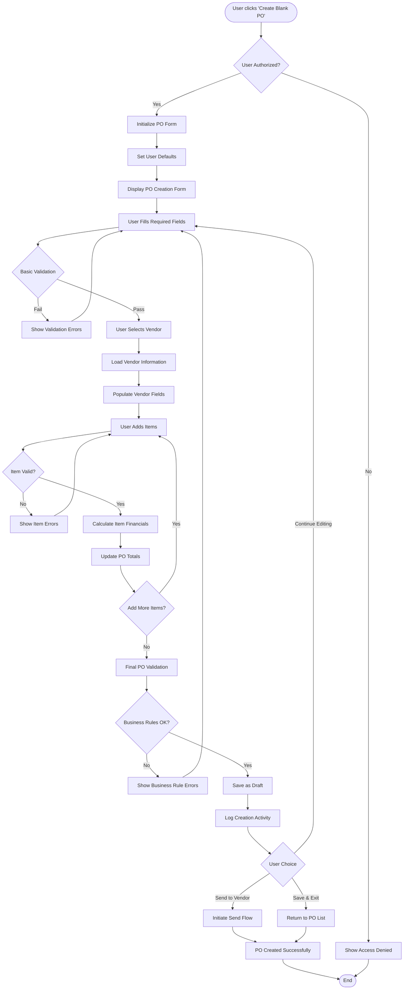
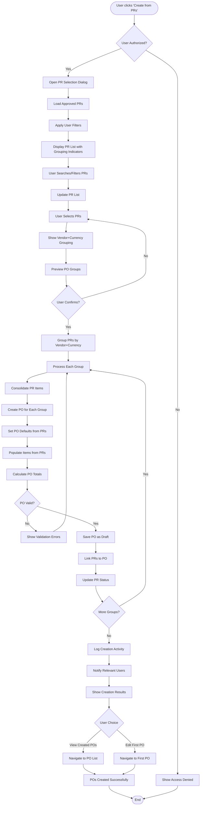
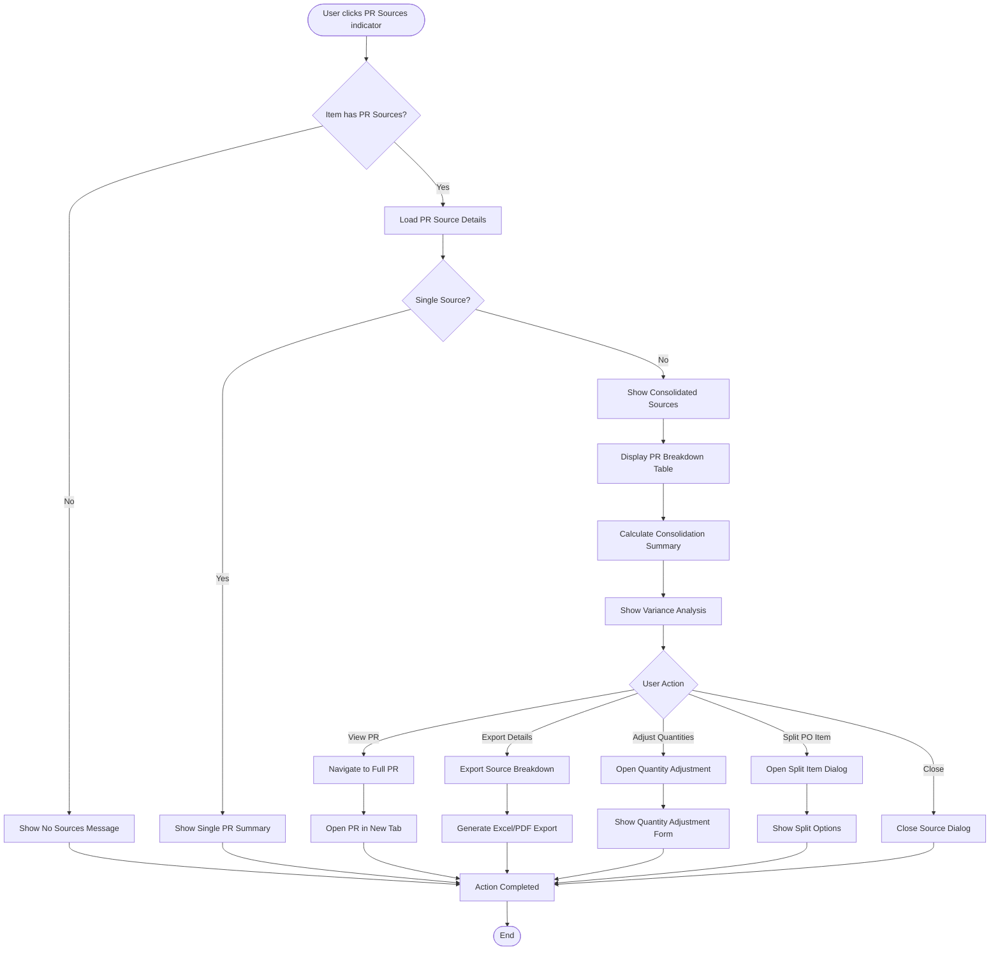
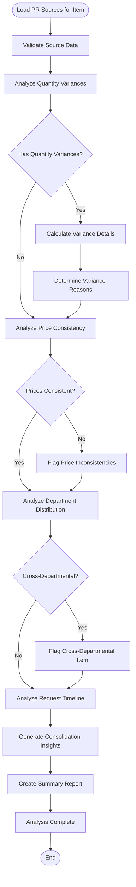
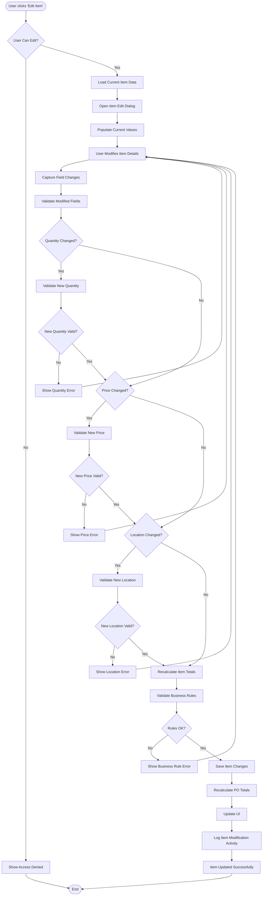
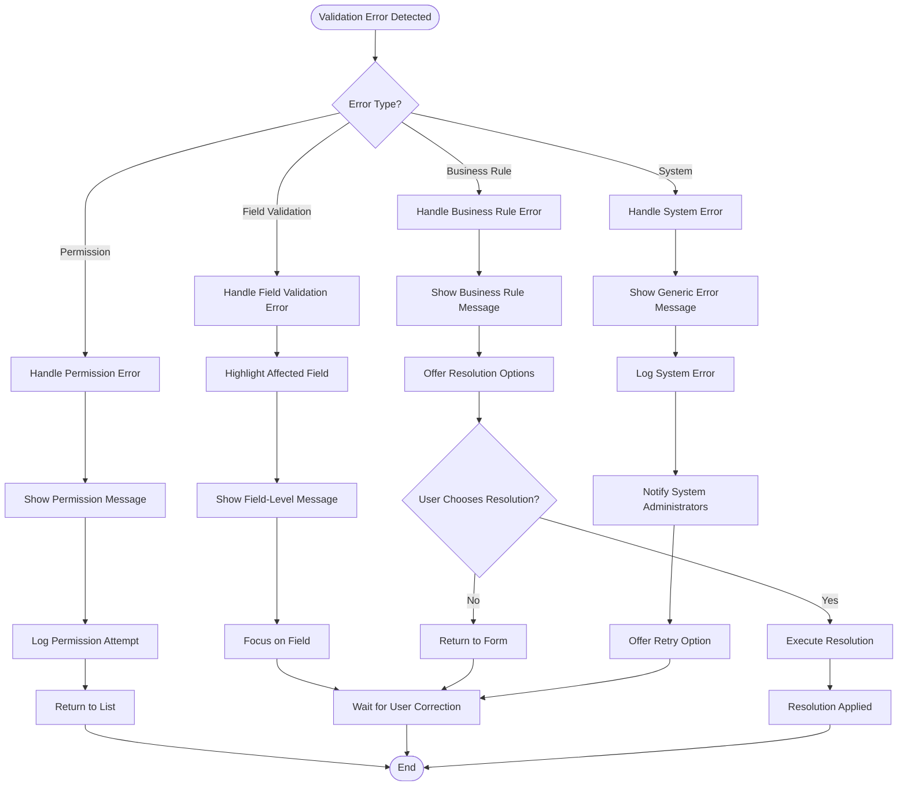
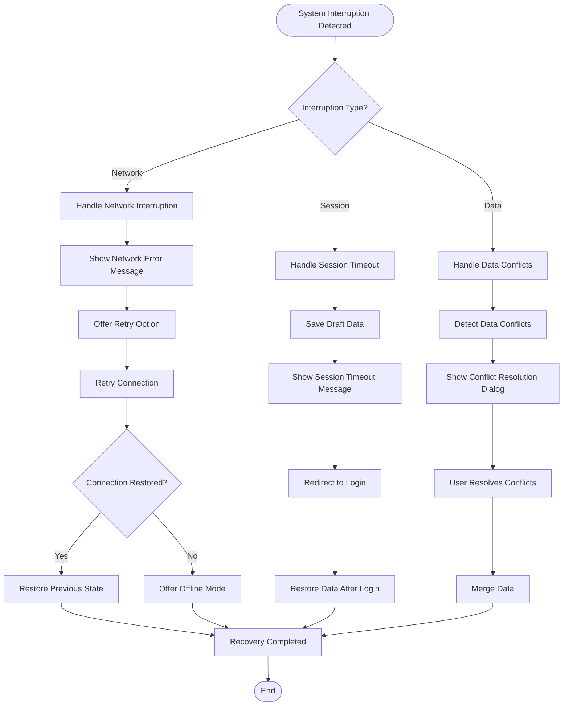
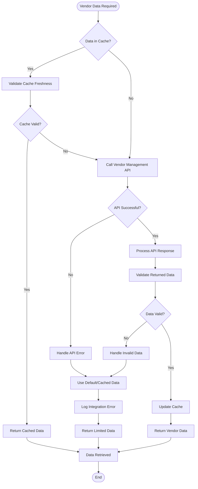

# Purchase Order Action Flows: Comprehensive Documentation

## 1. Overview

This document defines all action flows within the Purchase Order module, including user interactions, system processes, decision points, and integration touchpoints. Each flow includes detailed steps, validation checkpoints, and error handling procedures.

## 2. Primary Action Flows

### 2.1 Create Purchase Order Flow

#### 2.1.1 Manual PO Creation Flow



#### 2.1.2 PR-to-PO Creation Flow



### 2.2 PO Approval Flow

#### 2.2.1 Standard Approval Flow

```mermaid
flowchart TD
    Start([User clicks 'Approve']) --> AuthCheck{User Authorized?}
    AuthCheck -->|No| AccessDenied[Show Access Denied]
    AuthCheck -->|Yes| LoadPO[Load PO Details]
    
    LoadPO --> CheckStatus{PO Status Valid?}
    CheckStatus -->|No| InvalidStatus[Show Invalid Status Error]
    CheckStatus -->|Yes| ValidateApprover[Validate Approver Permissions]
    
    ValidateApprover --> SelfApprovalCheck{Self-Approval?}
    SelfApprovalCheck -->|Yes| SelfApprovalError[Show Self-Approval Error]
    SelfApprovalCheck -->|No| AuthorityCheck{Sufficient Authority?}
    
    AuthorityCheck -->|No| InsufficientAuthority[Show Authority Error]
    AuthorityCheck -->|Yes| DepartmentCheck{Department Match?}
    
    DepartmentCheck -->|No| DepartmentError[Show Department Error]
    DepartmentCheck -->|Yes| BusinessValidation[Run Business Validations]
    
    BusinessValidation --> BudgetCheck{Budget Available?}
    BudgetCheck -->|No| BudgetError[Show Budget Error]
    BudgetCheck -->|Yes| VendorCompliance{Vendor Compliant?}
    
    VendorCompliance -->|No| ComplianceError[Show Compliance Error]
    VendorCompliance -->|Yes| AmountCheck{Within Approval Limit?}
    
    AmountCheck -->|No| EscalateApproval[Escalate to Higher Authority]
    AmountCheck -->|Yes| ShowConfirmation[Show Approval Confirmation]
    
    ShowConfirmation --> UserConfirms{User Confirms?}
    UserConfirms -->|No| CancelApproval[Cancel Approval]
    UserConfirms -->|Yes| ProcessApproval[Process Approval]
    
    ProcessApproval --> UpdateStatus[Update PO Status to Approved]
    UpdateStatus --> RecordApproval[Record Approval in Audit Log]
    RecordApproval --> NotifyStakeholders[Notify Relevant Stakeholders]
    
    NotifyStakeholders --> TriggerWorkflow[Trigger Next Workflow Step]
    TriggerWorkflow --> Success[Approval Completed]
    
    EscalateApproval --> CreateApprovalRequest[Create Higher Level Request]
    CreateApprovalRequest --> NotifyHigherApprover[Notify Higher Level Approver]
    NotifyHigherApprover --> Success
    
    Success --> End([End])
    
    % Error endings
    AccessDenied --> End
    InvalidStatus --> End
    SelfApprovalError --> End
    InsufficientAuthority --> End
    DepartmentError --> End
    BudgetError --> End
    ComplianceError --> End
    CancelApproval --> End
```

### 2.3 Send to Vendor Flow

#### 2.3.1 Email PO to Vendor Flow

```mermaid
flowchart TD
    Start([User clicks 'Send to Vendor']) --> AuthCheck{User Authorized?}
    AuthCheck -->|No| AccessDenied[Show Access Denied]
    AuthCheck -->|Yes| ValidateStatus{Status = Draft?}
    
    ValidateStatus -->|No| InvalidStatus[Show Status Error]
    ValidateStatus -->|Yes| ValidatePO[Validate PO Completeness]
    
    ValidatePO --> HasVendor{Has Vendor?}
    HasVendor -->|No| VendorError[Show Vendor Required Error]
    HasVendor -->|Yes| HasItems{Has Items?}
    
    HasItems -->|No| ItemsError[Show Items Required Error]
    HasItems -->|Yes| HasDeliveryDate{Has Delivery Date?}
    
    HasDeliveryDate -->|No| DeliveryDateError[Show Delivery Date Error]
    HasDeliveryDate -->|Yes| LoadVendorContacts[Load Vendor Contact Information]
    
    LoadVendorContacts --> ShowSendDialog[Show Send Configuration Dialog]
    ShowSendDialog --> UserConfigures[User Configures Send Options]
    
    UserConfigures --> SelectRecipients[Select Email Recipients]
    SelectRecipients --> SelectTemplate[Select Email Template]
    SelectTemplate --> AddCustomMessage[Add Custom Message (Optional)]
    AddCustomMessage --> SelectAttachments[Select Attachments]
    
    SelectAttachments --> PreviewEmail[Preview Email]
    PreviewEmail --> UserConfirms{User Confirms Send?}
    
    UserConfirms -->|No| CancelSend[Cancel Send]
    UserConfirms -->|Yes| GeneratePDF[Generate PO PDF]
    
    GeneratePDF --> PrepareEmail[Prepare Email with Attachments]
    PrepareEmail --> SendEmail[Send Email to Vendor]
    
    SendEmail --> EmailSent{Email Sent Successfully?}
    EmailSent -->|No| EmailError[Show Email Error]
    EmailSent -->|Yes| UpdatePOStatus[Update PO Status to 'Sent']
    
    UpdatePOStatus --> RecordSendActivity[Record Send Activity in Audit Log]
    RecordSendActivity --> SaveEmailRecord[Save Email Record]
    SaveEmailRecord --> NotifyInternal[Notify Internal Stakeholders]
    
    NotifyInternal --> ShowSuccess[Show Success Message]
    ShowSuccess --> Success[PO Sent Successfully]
    
    Success --> End([End])
    
    % Error endings
    AccessDenied --> End
    InvalidStatus --> End
    VendorError --> End
    ItemsError --> End
    DeliveryDateError --> End
    EmailError --> End
    CancelSend --> End
```

### 2.4 Item Management Flows

#### 2.4.1 View PR Sources Flow



#### 2.4.2 PR Source Analysis Flow



#### 2.4.3 Add Item Flow

```mermaid
flowchart TD
    Start([User clicks 'Add Item']) --> AuthCheck{User Can Edit?}
    AuthCheck -->|No| AccessDenied[Show Access Denied]
    AuthCheck -->|Yes| OpenItemDialog[Open Item Selection Dialog]
    
    OpenItemDialog --> LoadItems[Load Available Items]
    LoadItems --> DisplayItemSearch[Display Item Search Interface]
    
    DisplayItemSearch --> UserSearches[User Searches for Item]
    UserSearches --> FilterResults[Filter Search Results]
    FilterResults --> DisplayResults[Display Search Results]
    
    DisplayResults --> UserSelectsItem[User Selects Item]
    UserSelectsItem --> LoadItemDetails[Load Item Details]
    LoadItemDetails --> PopulateForm[Populate Item Form]
    
    PopulateForm --> UserFillsDetails[User Fills Item Details]
    UserFillsDetails --> ValidateQuantity{Quantity Valid?}
    
    ValidateQuantity -->|No| QuantityError[Show Quantity Error]
    QuantityError --> UserFillsDetails
    
    ValidateQuantity -->|Yes| ValidatePrice{Price Valid?}
    ValidatePrice -->|No| PriceError[Show Price Error]
    PriceError --> UserFillsDetails
    
    ValidatePrice -->|Yes| ValidateLocation{Location Valid?}
    ValidateLocation -->|No| LocationError[Show Location Error]
    LocationError --> UserFillsDetails
    
    ValidateLocation -->|Yes| CalculateItemTotals[Calculate Item Totals]
    CalculateItemTotals --> CheckDuplicate{Duplicate Item?}
    
    CheckDuplicate -->|Yes| ShowMergeOption[Show Merge Option Dialog]
    ShowMergeOption --> UserChoosesMerge{User Chooses to Merge?}
    
    UserChoosesMerge -->|No| UserFillsDetails
    UserChoosesMerge -->|Yes| MergeWithExisting[Merge with Existing Item]
    
    CheckDuplicate -->|No| ValidateBusinessRules[Validate Business Rules]
    MergeWithExisting --> ValidateBusinessRules
    
    ValidateBusinessRules --> StockLevelCheck{Check Stock Levels?}
    StockLevelCheck -->|Yes| CheckInventory[Check Current Inventory]
    CheckInventory --> ShowStockInfo[Show Stock Information]
    ShowStockInfo --> ValidateMaxLevel{Within Max Level?}
    
    ValidateMaxLevel -->|No| MaxLevelWarning[Show Max Level Warning]
    MaxLevelWarning --> UserProceedsAnyway{User Proceeds?}
    UserProceedsAnyway -->|No| UserFillsDetails
    UserProceedsAnyway -->|Yes| AddItemToPO[Add Item to PO]
    
    StockLevelCheck -->|No| AddItemToPO
    ValidateMaxLevel -->|Yes| AddItemToPO
    
    AddItemToPO --> RecalculatePOTotals[Recalculate PO Totals]
    RecalculatePOTotals --> UpdateUI[Update UI with New Totals]
    UpdateUI --> LogItemAddition[Log Item Addition Activity]
    
    LogItemAddition --> Success[Item Added Successfully]
    Success --> End([End])
    
    AccessDenied --> End
```



#### 2.4.2 Edit Item Flow



### 2.5 Bulk Operations Flow

#### 2.5.1 Bulk Send Flow

```mermaid
flowchart TD
    Start([User selects 'Send Selected']) --> ValidateSelection{Items Selected?}
    ValidateSelection -->|No| NoSelectionError[Show No Selection Error]
    ValidateSelection -->|Yes| LoadSelectedPOs[Load Selected PO Details]
    
    LoadSelectedPOs --> ValidatePermissions[Validate Send Permissions]
    ValidatePermissions --> CheckPOStatuses[Check All PO Statuses]
    
    CheckPOStatuses --> AllDraft{All POs Draft?}
    AllDraft -->|No| MixedStatusError[Show Mixed Status Error]
    AllDraft -->|Yes| ValidateCompleteness[Validate PO Completeness]
    
    ValidateCompleteness --> AllComplete{All POs Complete?}
    AllComplete -->|No| IncompleteError[Show Incomplete POs Error]
    AllComplete -->|Yes| ShowBulkSendDialog[Show Bulk Send Configuration]
    
    ShowBulkSendDialog --> UserConfigures[User Configures Bulk Send]
    UserConfigures --> SelectTemplate[Select Email Template]
    SelectTemplate --> AddBulkMessage[Add Bulk Message]
    AddBulkMessage --> PreviewBulkSend[Preview Bulk Send]
    
    PreviewBulkSend --> UserConfirms{User Confirms?}
    UserConfirms -->|No| CancelBulkSend[Cancel Bulk Send]
    UserConfirms -->|Yes| ProcessBulkSend[Process Each PO]
    
    ProcessBulkSend --> GeneratePDF[Generate PO PDF]
    GeneratePDF --> SendToVendor[Send to Vendor]
    SendToVendor --> UpdateStatus[Update PO Status]
    UpdateStatus --> LogActivity[Log Send Activity]
    
    LogActivity --> MorePOs{More POs to Process?}
    MorePOs -->|Yes| ProcessBulkSend
    MorePOs -->|No| ShowBulkResults[Show Bulk Send Results]
    
    ShowBulkResults --> Success[Bulk Send Completed]
    Success --> End([End])
    
    % Error endings
    NoSelectionError --> End
    MixedStatusError --> End
    IncompleteError --> End
    CancelBulkSend --> End
```

### 2.6 Status Change Flows

#### 2.6.1 Void PO Flow

```mermaid
flowchart TD
    Start([User clicks 'Void PO']) --> AuthCheck{User Authorized?}
    AuthCheck -->|No| AccessDenied[Show Access Denied]
    AuthCheck -->|Yes| CheckStatus{Status Allows Void?}
    
    CheckStatus -->|No| InvalidStatusError[Show Invalid Status Error]
    CheckStatus -->|Yes| CheckGRNs{Has Linked GRNs?}
    
    CheckGRNs -->|Yes| HasGRNError[Show GRN Exists Error]
    CheckGRNs -->|No| CheckInvoices{Has Linked Invoices?}
    
    CheckInvoices -->|Yes| HasInvoiceError[Show Invoice Exists Error]
    CheckInvoices -->|No| ShowVoidDialog[Show Void Confirmation Dialog]
    
    ShowVoidDialog --> RequireReason[Require Void Reason]
    RequireReason --> UserProvidesReason[User Provides Reason]
    UserProvidesReason --> ValidateReason{Reason Valid?}
    
    ValidateReason -->|No| InvalidReason[Show Invalid Reason Error]
    InvalidReason --> UserProvidesReason
    
    ValidateReason -->|Yes| ShowImpactWarning[Show Impact Warning]
    ShowImpactWarning --> FinalConfirmation{User Confirms?}
    
    FinalConfirmation -->|No| CancelVoid[Cancel Void]
    FinalConfirmation -->|Yes| ProcessVoid[Process Void]
    
    ProcessVoid --> UpdatePOStatus[Update PO Status to Voided]
    UpdatePOStatus --> UpdateLinkedPRs[Update Linked PR Status]
    UpdateLinkedPRs --> CancelPendingApprovals[Cancel Pending Approvals]
    
    CancelPendingApprovals --> NotifyStakeholders[Notify Stakeholders]
    NotifyStakeholders --> LogVoidActivity[Log Void Activity]
    LogVoidActivity --> Success[PO Voided Successfully]
    
    Success --> End([End])
    
    % Error endings
    AccessDenied --> End
    InvalidStatusError --> End
    HasGRNError --> End
    HasInvoiceError --> End
    CancelVoid --> End
```

### 2.7 Financial Calculation Flows

#### 2.7.1 Real-time Calculation Flow

```mermaid
flowchart TD
    Start([Field Value Changed]) --> IdentifyField{Which Field?}
    
    IdentifyField -->|Quantity| ValidateQuantity[Validate Quantity]
    IdentifyField -->|Unit Price| ValidatePrice[Validate Unit Price]
    IdentifyField -->|Discount %| ValidateDiscount[Validate Discount Rate]
    IdentifyField -->|Tax Rate| ValidateTax[Validate Tax Rate]
    
    ValidateQuantity --> QuantityOK{Quantity Valid?}
    ValidatePrice --> PriceOK{Price Valid?}
    ValidateDiscount --> DiscountOK{Discount Valid?}
    ValidateTax --> TaxOK{Tax Valid?}
    
    QuantityOK -->|No| ShowQuantityError[Show Quantity Error]
    PriceOK -->|No| ShowPriceError[Show Price Error]
    DiscountOK -->|No| ShowDiscountError[Show Discount Error]
    TaxOK -->|No| ShowTaxError[Show Tax Error]
    
    QuantityOK -->|Yes| CalculateSubtotal[Calculate Subtotal]
    PriceOK -->|Yes| CalculateSubtotal
    DiscountOK -->|Yes| CalculateSubtotal
    TaxOK -->|Yes| CalculateSubtotal
    
    CalculateSubtotal --> CalculateDiscount[Calculate Discount Amount]
    CalculateDiscount --> CalculateNet[Calculate Net Amount]
    CalculateNet --> CalculateTaxAmount[Calculate Tax Amount]
    CalculateTaxAmount --> CalculateItemTotal[Calculate Item Total]
    
    CalculateItemTotal --> UpdateItemDisplay[Update Item Display]
    UpdateItemDisplay --> RecalculatePOTotals[Recalculate PO Totals]
    
    RecalculatePOTotals --> UpdatePODisplay[Update PO Totals Display]
    UpdatePODisplay --> CheckBusinessRules[Check Business Rules]
    
    CheckBusinessRules --> ShowWarnings[Show Warnings if Any]
    ShowWarnings --> Success[Calculation Completed]
    
    Success --> End([End])
    
    % Error endings
    ShowQuantityError --> End
    ShowPriceError --> End
    ShowDiscountError --> End
    ShowTaxError --> End
```

### 2.8 Export and Print Flows

#### 2.8.1 Export PO Flow

```mermaid
flowchart TD
    Start([User clicks Export]) --> AuthCheck{User Authorized?}
    AuthCheck -->|No| AccessDenied[Show Access Denied]
    AuthCheck -->|Yes| ShowExportOptions[Show Export Options Dialog]
    
    ShowExportOptions --> SelectFormat[Select Export Format]
    SelectFormat --> SelectColumns[Select Columns to Include]
    SelectColumns --> SetDateRange[Set Date Range (if applicable)]
    SetDateRange --> SelectFilters[Apply Additional Filters]
    
    SelectFilters --> PreviewExport[Preview Export]
    PreviewExport --> UserConfirms{User Confirms?}
    
    UserConfirms -->|No| CancelExport[Cancel Export]
    UserConfirms -->|Yes| ValidateSelection[Validate Export Selection]
    
    ValidateSelection --> GenerateExport[Generate Export File]
    GenerateExport --> ApplyFormatting[Apply Formatting]
    ApplyFormatting --> AddHeaders[Add Headers and Metadata]
    
    AddHeaders --> CompressFile[Compress File (if needed)]
    CompressFile --> UploadToStorage[Upload to Temporary Storage]
    UploadToStorage --> GenerateDownloadLink[Generate Download Link]
    
    GenerateDownloadLink --> LogExportActivity[Log Export Activity]
    LogExportActivity --> NotifyUser[Notify User of Completion]
    NotifyUser --> StartDownload[Start Download]
    
    StartDownload --> Success[Export Completed]
    Success --> End([End])
    
    AccessDenied --> End
    CancelExport --> End
```

## 3. Error Handling Flows

### 3.1 Validation Error Flow



### 3.2 Recovery Flow



## 4. Integration Flows

### 4.1 Vendor System Integration Flow



This comprehensive action flow documentation provides detailed guidance for implementing all user interactions and system processes within the Purchase Order module, ensuring consistent behavior and proper error handling across all scenarios.