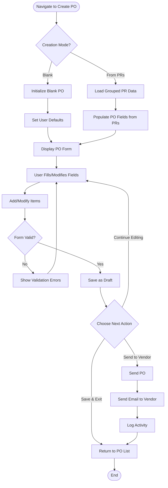
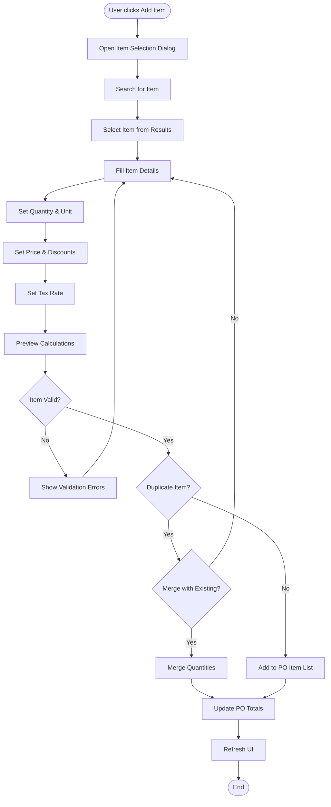
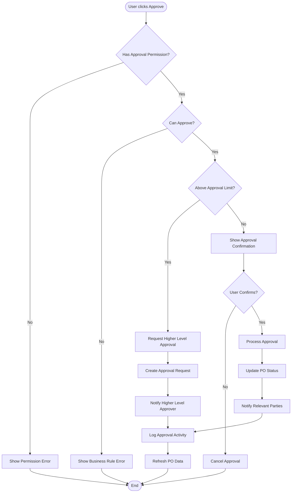

# Purchase Order Details/Create Page: Comprehensive Specification

## 1. Overview

The Purchase Order Details page serves multiple purposes: creating new POs, viewing existing PO details, and editing PO information. It provides a comprehensive interface for managing all aspects of a purchase order including items, financial calculations, vendor information, and workflow management.

## 2. UI/UX Specifications

### 2.1 Page Layout

```
┌─────────────────────────────────────────────────────────────────┐
│ ← Back to List    Purchase Order [PO-2024-001]         [Status]│
│                                                                 │
│ [Edit] [Save] [Cancel] [Send] [Approve] [Print] [Export] [More] │
├─────────────────────────────────────────────────────────────────┤
│ Main Information Panel                                          │
│ ┌─────────────────────────┐ ┌─────────────────────────────────┐ │
│ │ PO Details              │ │ Vendor Information              │ │
│ │ • PO Number             │ │ • Vendor Name                   │ │
│ │ • Date                  │ │ • Contact Person                │ │
│ │ │ Type                  │ │ • Email & Phone                 │ │
│ │ • Currency              │ │ • Payment Terms                 │ │
│ │ • Delivery Date         │ │ • Credit Limit                  │ │
│ └─────────────────────────┘ └─────────────────────────────────┘ │
├─────────────────────────────────────────────────────────────────┤
│ Tab Navigation                                                  │
│ [Items] [Financial] [Documents] [Activity] [Comments] [GRN]     │
├─────────────────────────────────────────────────────────────────┤
│ Tab Content Area                                                │
│ (Dynamic content based on selected tab)                        │
├─────────────────────────────────────────────────────────────────┤
│ Financial Summary Panel (Sticky Bottom)                        │
│ Subtotal: $1,000 | Discount: $50 | Tax: $95 | Total: $1,045   │
└─────────────────────────────────────────────────────────────────┘
```

### 2.2 Component Specifications

#### 2.2.1 Header Section
- **Navigation**: Back button to PO list
- **Title**: Dynamic based on mode (Create/View/Edit)
- **Status Badge**: Color-coded status indicator
- **Action Buttons**: Context-sensitive action toolbar

#### 2.2.2 Main Information Panel

##### PO Details Section
| Field | Type | Required | Validation |
|-------|------|----------|------------|
| PO Number | Text (Auto) | Yes | Auto-generated, read-only |
| Date | Date Picker | Yes | Default to today |
| Type | Dropdown | Yes | Standard/Urgent/Blanket |
| Currency | Dropdown | Yes | From active currencies |
| Delivery Date | Date Picker | Yes | Must be future date |
| Description | Textarea | No | Max 500 characters |
| Department | Dropdown | Yes | From user's departments |
| Location | Dropdown | Yes | From active locations |
| Job Code | Text | No | Optional project reference |

##### Vendor Information Section
| Field | Type | Source | Editable |
|-------|------|--------|----------|
| Vendor | Searchable Dropdown | Vendor Master | Yes |
| Contact Person | Text | Vendor Default | Yes |
| Email | Email | Vendor Default | Yes |
| Phone | Tel | Vendor Default | Yes |
| Payment Terms | Dropdown | Vendor Default | Yes |
| Credit Limit | Currency | Vendor Master | No |
| Address | Textarea | Vendor Master | Yes |

#### 2.2.3 Tab Specifications

##### Items Tab
```
┌─────────────────────────────────────────────────────────────────┐
│ [+ Add Item] [Import from Template] [Bulk Edit]                 │
├─────────────────────────────────────────────────────────────────┤
│ Item Table                                                      │
│ ┌──┬──────────┬─────────┬─────┬──────┬────────┬────────┬───────┬─┐ │
│ │☐ │Item Name │Location │Qty  │Price │Disc.   │Tax     │Total  │📋│ │
│ ├──┼──────────┼─────────┼─────┼──────┼────────┼────────┼───────┼─┤ │
│ │☐ │Coffee    │Kitchen  │25kg │15.50 │0%      │10%     │387.50│⚬│ │
│ │☐ │Flour     │Storage  │100kg│3.00  │5%      │8%      │308.40│⚬│ │
│ └──┴──────────┴─────────┴─────┴──────┴────────┴────────┴───────┴─┘ │
│ Actions: [Edit] [Delete] [Duplicate] [Details] [View PR Sources]│
│                                                                 │
│ PR Source Indicator Legend:                                     │
│ ⚬ = Consolidated from multiple PRs (click to view breakdown)    │
│ • = Single PR source                                            │
└─────────────────────────────────────────────────────────────────┘
```

##### PR Source Breakdown Dialog
```
┌─────────────────────────────────────────────────────────────────┐
│ PR Source Breakdown: Coffee Beans (25kg)                [✕]    │
├─────────────────────────────────────────────────────────────────┤
│ ┌─────────────┬─────────┬─────────┬─────────┬─────────┬────────┐ │
│ │ PR Number   │ Date    │ Req Qty │ App Qty │ Unit    │ Notes  │ │
│ ├─────────────┼─────────┼─────────┼─────────┼─────────┼────────┤ │
│ │ PR-2023-001 │ Jan 15  │ 15kg    │ 15kg    │ kg      │ -      │ │
│ │ PR-2023-005 │ Jan 20  │ 12kg    │ 10kg    │ kg      │ Reduced│ │
│ ├─────────────┼─────────┼─────────┼─────────┼─────────┼────────┤ │
│ │ **Total**   │         │ **27kg**│ **25kg**│         │        │ │
│ └─────────────┴─────────┴─────────┴─────────┴─────────┴────────┘ │
│                                                                 │
│ Consolidation Summary:                                          │
│ • Original Total Requested: 27kg                               │
│ • Total Approved: 25kg                                         │
│ • Variance: -2kg (7.4% reduction)                              │
│ • Reason: Budget constraints (PR-2023-005)                     │
│                                                                 │
│ [View PR-2023-001] [View PR-2023-005] [Export Breakdown]       │
└─────────────────────────────────────────────────────────────────┘
```

##### Financial Tab
```
┌─────────────────────────────────────────────────────────────────┐
│ Financial Breakdown                                             │
│ ┌─────────────────────┐ ┌─────────────────────────────────────┐ │
│ │ Amounts             │ │ Tax Breakdown                       │ │
│ │ Subtotal: $1,000.00 │ │ Tax Rate 8%:  $240.00              │ │
│ │ Discount: $50.00    │ │ Tax Rate 10%: $155.00              │ │
│ │ Net Amount: $950.00 │ │ Total Tax:    $395.00              │ │
│ │ Tax Amount: $95.00  │ │                                     │ │
│ │ Total: $1,045.00    │ │                                     │ │
│ └─────────────────────┘ └─────────────────────────────────────┘ │
│                                                                 │
│ Exchange Rate Information (if multi-currency)                  │
│ Base Currency: USD | PO Currency: EUR | Rate: 1.2500           │
└─────────────────────────────────────────────────────────────────┘
```

##### Documents Tab
```
┌─────────────────────────────────────────────────────────────────┐
│ [+ Upload Document] [Generate PO PDF] [Email to Vendor]        │
├─────────────────────────────────────────────────────────────────┤
│ Document List                                                   │
│ ┌─────────────────┬──────────┬────────────┬──────────┬────────┐ │
│ │ Document Name   │ Type     │ Size       │ Uploaded │ Action │ │
│ ├─────────────────┼──────────┼────────────┼──────────┼────────┤ │
│ │ PO-001.pdf      │ PO Doc   │ 156 KB     │ Today    │ [View] │ │
│ │ vendor-quote.pdf│ Quote    │ 245 KB     │ Yesterday│ [View] │ │
│ │ terms.pdf       │ Terms    │ 89 KB      │ 2d ago   │ [View] │ │
│ └─────────────────┴──────────┴────────────┴──────────┴────────┘ │
└─────────────────────────────────────────────────────────────────┘
```

##### Activity Tab
```
┌─────────────────────────────────────────────────────────────────┐
│ Activity Timeline                                               │
│ ┌─────┬───────────────────────────────────────────────────────┐ │
│ │ 🕐  │ 2024-01-15 10:30 - John Doe                          │ │
│ │     │ PO sent to vendor via email                          │ │
│ ├─────┼───────────────────────────────────────────────────────┤ │
│ │ ✏️   │ 2024-01-15 09:15 - Jane Smith                        │ │
│ │     │ Updated delivery date to 2024-01-25                  │ │
│ ├─────┼───────────────────────────────────────────────────────┤ │
│ │ ✅  │ 2024-01-14 16:45 - Mike Johnson                      │ │
│ │     │ PO approved by finance department                    │ │
│ ├─────┼───────────────────────────────────────────────────────┤ │
│ │ 📝  │ 2024-01-14 14:20 - John Doe                          │ │
│ │     │ PO created from PR-2024-001, PR-2024-002            │ │
│ └─────┴───────────────────────────────────────────────────────┘ │
└─────────────────────────────────────────────────────────────────┘
```

#### 2.2.4 Financial Summary Panel
- **Sticky Positioning**: Always visible at bottom
- **Real-time Updates**: Updates as items are modified
- **Multi-currency Support**: Shows base and PO currency
- **Visual Indicators**: Highlights discrepancies or issues

### 2.3 Responsive Design

#### Desktop (≥1024px)
- Two-column layout for main information
- Full tab interface with all features
- Side-by-side vendor and PO details

#### Tablet (768px - 1023px)
- Single-column stacked layout
- Collapsible sections
- Touch-optimized controls

#### Mobile (≤767px)
- Accordion-style sections
- Bottom sheet for detailed forms
- Simplified action buttons

### 2.4 Modal Dialogs

#### 2.4.1 Add/Edit Item Dialog
```
┌─────────────────────────────────────────────────────────────────┐
│ Add Item to Purchase Order                              [✕]     │
├─────────────────────────────────────────────────────────────────┤
│ Item Information                                                │
│ ┌─────────────────────┐ ┌─────────────────────────────────────┐ │
│ │ Item                │ │ Location                            │ │
│ │ [Search Items...]   │ │ [Select Location ▼]                │ │
│ └─────────────────────┘ └─────────────────────────────────────┘ │
│                                                                 │
│ Quantity & Pricing                                              │
│ ┌─────────┐ ┌─────────┐ ┌─────────┐ ┌─────────┐ ┌─────────────┐ │
│ │ Qty     │ │ Unit    │ │ Price   │ │ Disc %  │ │ Tax Rate    │ │
│ │ [25.00] │ │ [kg ▼]  │ │ [15.50] │ │ [0.00]  │ │ [10% ▼]     │ │
│ └─────────┘ └─────────┘ └─────────┘ └─────────┘ └─────────────┘ │
│                                                                 │
│ Additional Information                                          │
│ ┌─────────────────────────────────────────────────────────────┐ │
│ │ Description                                                 │ │
│ │ [Optional item description...]                              │ │
│ └─────────────────────────────────────────────────────────────┘ │
│                                                                 │
│ [Related PRs] [Inventory Info] [Price History] [Specifications]│
├─────────────────────────────────────────────────────────────────┤
│                                           [Cancel] [Add Item]  │
└─────────────────────────────────────────────────────────────────┘
```

#### 2.4.2 PR Source Breakdown Dialog
```
┌─────────────────────────────────────────────────────────────────┐
│ PR Source Breakdown: Premium Coffee Beans              [✕]     │
├─────────────────────────────────────────────────────────────────┤
│ Item: Premium Coffee Beans (25kg total)                        │
│ Location: Main Kitchen                                          │
├─────────────────────────────────────────────────────────────────┤
│ Source Purchase Requests                                        │
│ ┌─────────────┬─────────┬─────────┬─────────┬─────────┬────────┐ │
│ │ PR Number   │ Date    │ Req Qty │ App Qty │ Price   │ Status │ │
│ ├─────────────┼─────────┼─────────┼─────────┼─────────┼────────┤ │
│ │ PR-2023-001 │ Jan 15  │ 15kg    │ 15kg    │ $15.50  │ ✓ Full │ │
│ │ PR-2023-005 │ Jan 20  │ 12kg    │ 10kg    │ $15.50  │ ⚠ Part │ │
│ └─────────────┴─────────┴─────────┴─────────┴─────────┴────────┘ │
│                                                                 │
│ Consolidation Analysis                                          │
│ ┌─────────────────────────────────────────────────────────────┐ │
│ │ • Total Requested Across PRs: 27kg                         │ │
│ │ • Total Approved for PO: 25kg                              │ │
│ │ • Variance: -2kg (7.4% reduction)                          │ │
│ │ • Average Price: $15.50/kg                                 │ │
│ │ • Original Requestors: John Doe, Jane Smith                │ │
│ │ • Approval Variance Reason: Budget constraints             │ │
│ └─────────────────────────────────────────────────────────────┘ │
│                                                                 │
│ Quick Actions                                                   │
│ [View PR-2023-001] [View PR-2023-005] [Export Details]         │
│ [Adjust Quantities] [Split PO Item] [Add Notes]                │
├─────────────────────────────────────────────────────────────────┤
│                                                 [Close]        │
└─────────────────────────────────────────────────────────────────┘
```

#### 2.4.3 PR Sources Tab (in Item Details)
```
┌─────────────────────────────────────────────────────────────────┐
│ Item Details: Premium Coffee Beans                             │
│ [General] [Pricing] [Inventory] [PR Sources] [History]         │
├─────────────────────────────────────────────────────────────────┤
│ Source Purchase Requests                                        │
│                                                                 │
│ ┌─────────────────────────────────────────────────────────────┐ │
│ │ PR-2023-001 - Office Kitchen Supplies                      │ │
│ │ Date: Jan 15, 2023 | Requestor: John Doe                   │ │
│ │ Requested: 15kg | Approved: 15kg | Unit: kg                │ │
│ │ Notes: Regular monthly coffee supply                       │ │
│ │ [View Full PR] [View Approval History]                     │ │
│ └─────────────────────────────────────────────────────────────┘ │
│                                                                 │
│ ┌─────────────────────────────────────────────────────────────┐ │
│ │ PR-2023-005 - Additional Kitchen Stock                     │ │
│ │ Date: Jan 20, 2023 | Requestor: Jane Smith                 │ │
│ │ Requested: 12kg | Approved: 10kg | Unit: kg                │ │
│ │ Notes: Extra supply for client meetings                    │ │
│ │ Variance: -2kg due to budget constraints                   │ │
│ │ [View Full PR] [View Approval History]                     │ │
│ └─────────────────────────────────────────────────────────────┘ │
│                                                                 │
│ Summary                                                         │
│ Total Sources: 2 PRs | Total Quantity: 25kg | Average: 12.5kg  │
│ Price Consistency: ✓ All sources at $15.50/kg                 │
│ Approval Status: 1 Full, 1 Partial                            │
└─────────────────────────────────────────────────────────────────┘
```

## 3. Business Logic

### 3.1 PO Creation Logic

#### 3.1.1 New PO Initialization
```javascript
function initializeNewPO(userId, mode, sourceData) {
  const po = {
    id: generateUUID(),
    number: generatePONumber(),
    date: new Date(),
    status: 'Draft',
    createdBy: userId,
    createdDate: new Date(),
    currency: getUserDefaultCurrency(userId),
    department: getUserDepartment(userId),
    items: [],
    totalAmount: 0
  };

  if (mode === 'fromPR' && sourceData) {
    return populateFromPRs(po, sourceData);
  }

  return po;
}
```

#### 3.1.2 PR-to-PO Population
```javascript
function populateFromPRs(po, groupedPRs) {
  // Take vendor and currency from the group
  const firstGroup = Object.values(groupedPRs)[0];
  po.vendor = firstGroup.vendor;
  po.vendorId = firstGroup.vendorId;
  po.currency = firstGroup.currency;

  // Consolidate items from all PRs in the group
  po.items = consolidatePRItemsWithSources(firstGroup.prs);
  
  // Calculate totals
  po.totals = calculatePOTotals(po.items);
  
  // Maintain traceability
  po.sourceReferences = firstGroup.prs.map(pr => ({
    type: 'PurchaseRequest',
    id: pr.id,
    number: pr.refNumber
  }));

  return po;
}

function consolidatePRItemsWithSources(prs) {
  const consolidatedItems = {};
  
  prs.forEach(pr => {
    pr.items.forEach(prItem => {
      const itemKey = `${prItem.itemId}-${prItem.location}`;
      
      if (consolidatedItems[itemKey]) {
        // Add to existing consolidated item
        consolidatedItems[itemKey].quantity += prItem.approvedQuantity || prItem.quantity;
        consolidatedItems[itemKey].prSources.push({
          prId: pr.id,
          prNumber: pr.refNumber,
          prDate: pr.date,
          prItemId: prItem.id,
          requestorId: pr.requestorId,
          requestorName: pr.requestor.name,
          requestedQuantity: prItem.quantity,
          approvedQuantity: prItem.approvedQuantity || prItem.quantity,
          unitPrice: prItem.unitPrice,
          notes: prItem.notes,
          status: prItem.approvedQuantity === prItem.quantity ? 'Full' : 'Partial'
        });
      } else {
        // Create new consolidated item
        consolidatedItems[itemKey] = {
          id: generateUUID(),
          itemId: prItem.itemId,
          itemName: prItem.itemName,
          location: prItem.location,
          quantity: prItem.approvedQuantity || prItem.quantity,
          unit: prItem.unit,
          unitPrice: prItem.unitPrice,
          discountRate: prItem.discountRate || 0,
          taxRate: prItem.taxRate || 0,
          description: prItem.description,
          prSources: [{
            prId: pr.id,
            prNumber: pr.refNumber,
            prDate: pr.date,
            prItemId: prItem.id,
            requestorId: pr.requestorId,
            requestorName: pr.requestor.name,
            requestedQuantity: prItem.quantity,
            approvedQuantity: prItem.approvedQuantity || prItem.quantity,
            unitPrice: prItem.unitPrice,
            notes: prItem.notes,
            status: prItem.approvedQuantity === prItem.quantity ? 'Full' : 'Partial'
          }],
          sourceType: 'consolidated', // indicates this item came from PR consolidation
          consolidationSummary: null // will be calculated later
        };
      }
    });
  });
  
  // Calculate consolidation summaries
  Object.values(consolidatedItems).forEach(item => {
    if (item.prSources.length > 1) {
      item.consolidationSummary = calculateConsolidationSummary(item.prSources);
    }
  });
  
  return Object.values(consolidatedItems);
}

function calculateConsolidationSummary(prSources) {
  const totalRequested = prSources.reduce((sum, source) => sum + source.requestedQuantity, 0);
  const totalApproved = prSources.reduce((sum, source) => sum + source.approvedQuantity, 0);
  const variance = totalApproved - totalRequested;
  const variancePercentage = totalRequested > 0 ? (variance / totalRequested) * 100 : 0;
  
  return {
    totalRequested,
    totalApproved,
    variance,
    variancePercentage,
    prCount: prSources.length,
    requestors: [...new Set(prSources.map(s => s.requestorName))],
    hasVariance: variance !== 0,
    varianceReason: variance < 0 ? 'Quantity reduced during approval' : variance > 0 ? 'Quantity increased' : null
  };
}
```

### 3.2 Item Management Logic

#### 3.2.1 Add Item
```javascript
function addItemToPO(po, newItem) {
  // Validate item
  validatePOItem(newItem);
  
  // Check for duplicates
  const existingItem = po.items.find(item => 
    item.itemId === newItem.itemId && 
    item.location === newItem.location
  );
  
  if (existingItem) {
    // Combine quantities
    existingItem.quantity += newItem.quantity;
    existingItem.totalAmount = calculateItemTotal(existingItem);
  } else {
    // Add new item
    newItem.id = generateUUID();
    newItem.totalAmount = calculateItemTotal(newItem);
    po.items.push(newItem);
  }
  
  // Recalculate PO totals
  po.totals = calculatePOTotals(po.items);
  
  return po;
}
```

#### 3.2.2 Item Calculations
```javascript
function calculateItemTotal(item) {
  const subtotal = roundToTwo(item.quantity * item.unitPrice);
  const discountAmount = roundToTwo(subtotal * (item.discountRate / 100));
  const netAmount = roundToTwo(subtotal - discountAmount);
  const taxAmount = roundToTwo(netAmount * (item.taxRate / 100));
  const totalAmount = roundToTwo(netAmount + taxAmount);
  
  return {
    subtotal,
    discountAmount,
    netAmount,
    taxAmount,
    totalAmount
  };
}
```

### 3.3 Status Management

#### 3.3.1 Status Validation
```javascript
function canChangeStatus(po, newStatus, user) {
  const currentStatus = po.status;
  const userRole = user.role;
  
  // Check allowed transitions
  if (!isValidStatusTransition(currentStatus, newStatus)) {
    return { allowed: false, reason: 'Invalid status transition' };
  }
  
  // Check user permissions
  if (!hasStatusChangePermission(userRole, currentStatus, newStatus)) {
    return { allowed: false, reason: 'Insufficient permissions' };
  }
  
  // Business rule checks
  if (newStatus === 'Sent' && po.items.length === 0) {
    return { allowed: false, reason: 'Cannot send PO without items' };
  }
  
  if (newStatus === 'Approved' && po.createdBy === user.id) {
    return { allowed: false, reason: 'Cannot approve own PO' };
  }
  
  return { allowed: true };
}
```

### 3.4 Financial Calculations

#### 3.4.1 Multi-Currency Handling
```javascript
function handleCurrencyChange(po, newCurrency) {
  const exchangeRate = getExchangeRate(po.currency, newCurrency);
  
  // Convert all monetary values
  po.items.forEach(item => {
    item.unitPrice = convertCurrency(item.unitPrice, exchangeRate);
    item.totalAmount = calculateItemTotal(item);
  });
  
  po.currency = newCurrency;
  po.exchangeRate = exchangeRate;
  po.totals = calculatePOTotals(po.items);
  
  return po;
}
```

## 4. Action Flows

### 4.1 PO Creation Flow



### 4.2 Item Management Flow



### 4.3 Approval Flow



## 5. RBAC (Role-Based Access Control)

### 5.1 Page-Level Access Control

#### 5.1.1 Create Mode Access
```javascript
function canAccessCreateMode(user, mode) {
  const permissions = {
    'blank': ['Procurement Officer', 'Procurement Manager', 'Department Head'],
    'fromPR': ['Procurement Officer', 'Procurement Manager', 'Department Head']
  };
  
  return permissions[mode]?.includes(user.role) || false;
}
```

#### 5.1.2 View Mode Access
```javascript
function canViewPO(po, user) {
  // System admins and procurement managers can view all
  if (['System Administrator', 'Procurement Manager'].includes(user.role)) {
    return true;
  }
  
  // Department heads can view their department's POs
  if (user.role === 'Department Head' && po.department === user.department) {
    return true;
  }
  
  // Users can view POs they created or are assigned to
  if (po.createdBy === user.id || po.assignedTo === user.id) {
    return true;
  }
  
  // Finance officers can view for approval/review
  if (user.role === 'Finance Officer' && po.status !== 'Draft') {
    return true;
  }
  
  return false;
}
```

### 5.2 Field-Level Security

#### 5.2.1 Editable Fields by Role
```javascript
const fieldPermissions = {
  'Procurement Officer': {
    editable: ['vendor', 'deliveryDate', 'description', 'items'],
    readonly: ['number', 'createdDate', 'status'],
    hidden: ['internalNotes']
  },
  'Procurement Manager': {
    editable: ['vendor', 'deliveryDate', 'description', 'items', 'paymentTerms'],
    readonly: ['number', 'createdDate'],
    hidden: []
  },
  'Finance Officer': {
    editable: ['paymentTerms', 'creditLimit', 'budgetCode'],
    readonly: ['vendor', 'items', 'deliveryDate'],
    hidden: []
  },
  'Department Head': {
    editable: ['description', 'deliveryDate'],
    readonly: ['vendor', 'items', 'paymentTerms'],
    hidden: ['internalNotes']
  }
};
```

#### 5.2.2 Action Button Visibility
```javascript
function getVisibleActions(po, user) {
  const actions = [];
  
  // Edit action
  if (canEditPO(po, user)) {
    actions.push('edit');
  }
  
  // Send action
  if (po.status === 'Draft' && hasPermission(user, 'send_po')) {
    actions.push('send');
  }
  
  // Approve action
  if (['Sent', 'Pending'].includes(po.status) && 
      hasPermission(user, 'approve_po') && 
      po.createdBy !== user.id) {
    actions.push('approve');
  }
  
  // Void action
  if (['Sent', 'Approved'].includes(po.status) && 
      hasPermission(user, 'void_po')) {
    actions.push('void');
  }
  
  // Delete action
  if (po.status === 'Draft' && 
      (po.createdBy === user.id || hasPermission(user, 'delete_any_po'))) {
    actions.push('delete');
  }
  
  return actions;
}
```

### 5.3 Tab-Level Security

#### 5.3.1 Tab Visibility Matrix
| Tab | Proc Officer | Proc Manager | Finance Officer | Dept Head | Inventory Manager |
|-----|--------------|--------------|-----------------|-----------|-------------------|
| Items | ✓ | ✓ | ✓ (read-only) | ✓ | ✓ (read-only) |
| Financial | ✓ (limited) | ✓ | ✓ | ✗ | ✗ |
| Documents | ✓ | ✓ | ✓ | ✓ | ✓ |
| Activity | ✓ | ✓ | ✓ | ✓ | ✓ |
| Comments | ✓ | ✓ | ✓ | ✓ | ✓ |
| GRN | ✗ | ✓ | ✗ | ✗ | ✓ |

### 5.4 Approval Workflow Security

#### 5.4.1 Approval Hierarchy
```javascript
const approvalWorkflow = {
  'standard': [
    { role: 'Department Head', limit: 5000 },
    { role: 'Finance Officer', limit: 25000 },
    { role: 'Procurement Manager', limit: 100000 },
    { role: 'General Manager', limit: Infinity }
  ],
  'urgent': [
    { role: 'Procurement Manager', limit: 50000 },
    { role: 'General Manager', limit: Infinity }
  ]
};

function getRequiredApprover(po) {
  const workflow = approvalWorkflow[po.type] || approvalWorkflow['standard'];
  return workflow.find(level => po.totalAmount <= level.limit);
}
```

## 6. Validation Rules

### 6.1 Form Validation

#### 6.1.1 Required Field Validation
```javascript
const validationRules = {
  vendor: {
    required: true,
    message: 'Please select a vendor'
  },
  deliveryDate: {
    required: true,
    validate: (date) => date > new Date(),
    message: 'Delivery date must be in the future'
  },
  currency: {
    required: true,
    message: 'Please select a currency'
  },
  items: {
    required: true,
    validate: (items) => items.length > 0,
    message: 'At least one item is required'
  }
};
```

#### 6.1.2 Business Rule Validation
```javascript
function validateBusinessRules(po) {
  const errors = [];
  
  // Check vendor credit limit
  if (po.totalAmount > po.vendor.creditLimit) {
    errors.push('PO amount exceeds vendor credit limit');
  }
  
  // Check budget approval
  if (!isBudgetApproved(po.department, po.totalAmount)) {
    errors.push('Insufficient budget allocation');
  }
  
  // Check delivery date feasibility
  if (isDeliveryDateTooSoon(po.deliveryDate, po.vendor.leadTime)) {
    errors.push('Delivery date may not be feasible with vendor lead time');
  }
  
  return errors;
}
```

### 6.2 Item Validation

#### 6.2.1 Item-Level Validation
```javascript
function validatePOItem(item) {
  const errors = [];
  
  if (!item.itemId) {
    errors.push('Item selection is required');
  }
  
  if (!item.quantity || item.quantity <= 0) {
    errors.push('Quantity must be greater than zero');
  }
  
  if (!item.unitPrice || item.unitPrice <= 0) {
    errors.push('Unit price must be greater than zero');
  }
  
  if (item.discountRate < 0 || item.discountRate > 100) {
    errors.push('Discount rate must be between 0 and 100');
  }
  
  return errors;
}
```

## 7. Integration Points

### 7.1 External System Integration

#### 7.1.1 Vendor Management System
```javascript
async function loadVendorDetails(vendorId) {
  const vendor = await VendorService.getVendor(vendorId);
  return {
    name: vendor.name,
    contactPerson: vendor.primaryContact.name,
    email: vendor.primaryContact.email,
    phone: vendor.primaryContact.phone,
    paymentTerms: vendor.defaultPaymentTerms,
    creditLimit: vendor.creditLimit,
    address: vendor.addresses.find(addr => addr.isPrimary)
  };
}
```

#### 7.1.2 Inventory System
```javascript
async function getItemInventoryInfo(itemId, locationId) {
  const inventory = await InventoryService.getItemStock(itemId, locationId);
  return {
    onHand: inventory.currentStock,
    onOrder: inventory.orderedQuantity,
    reorderLevel: inventory.reorderLevel,
    lastPrice: inventory.lastPurchasePrice,
    averagePrice: inventory.averagePrice
  };
}
```

### 7.2 Workflow Integration

#### 7.2.1 Approval Workflow
```javascript
async function submitForApproval(po) {
  const approver = getRequiredApprover(po);
  const workflowInstance = await WorkflowService.createApprovalRequest({
    documentType: 'PurchaseOrder',
    documentId: po.id,
    requesterId: po.createdBy,
    approverId: approver.userId,
    amount: po.totalAmount,
    priority: po.priority
  });
  
  await NotificationService.sendApprovalRequest(approver.userId, po);
  return workflowInstance;
}
```

## 8. Performance Considerations

### 8.1 Data Loading Optimization
- **Lazy Loading**: Load tab content on demand
- **Caching**: Cache vendor and item data
- **Pagination**: For large item lists
- **Debouncing**: For search inputs

### 8.2 Real-Time Updates
- **WebSocket Integration**: Live status updates
- **Optimistic Updates**: Immediate UI feedback
- **Conflict Resolution**: Handle concurrent edits

### 8.3 Form Performance
- **Form State Management**: Efficient state updates
- **Validation Debouncing**: Prevent excessive validation calls
- **Auto-save**: Periodic draft saving

This comprehensive specification provides the foundation for implementing a robust Purchase Order Details/Create page that handles all business requirements while providing excellent user experience and security.