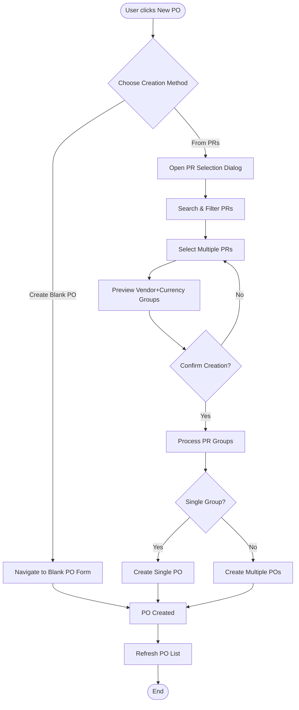
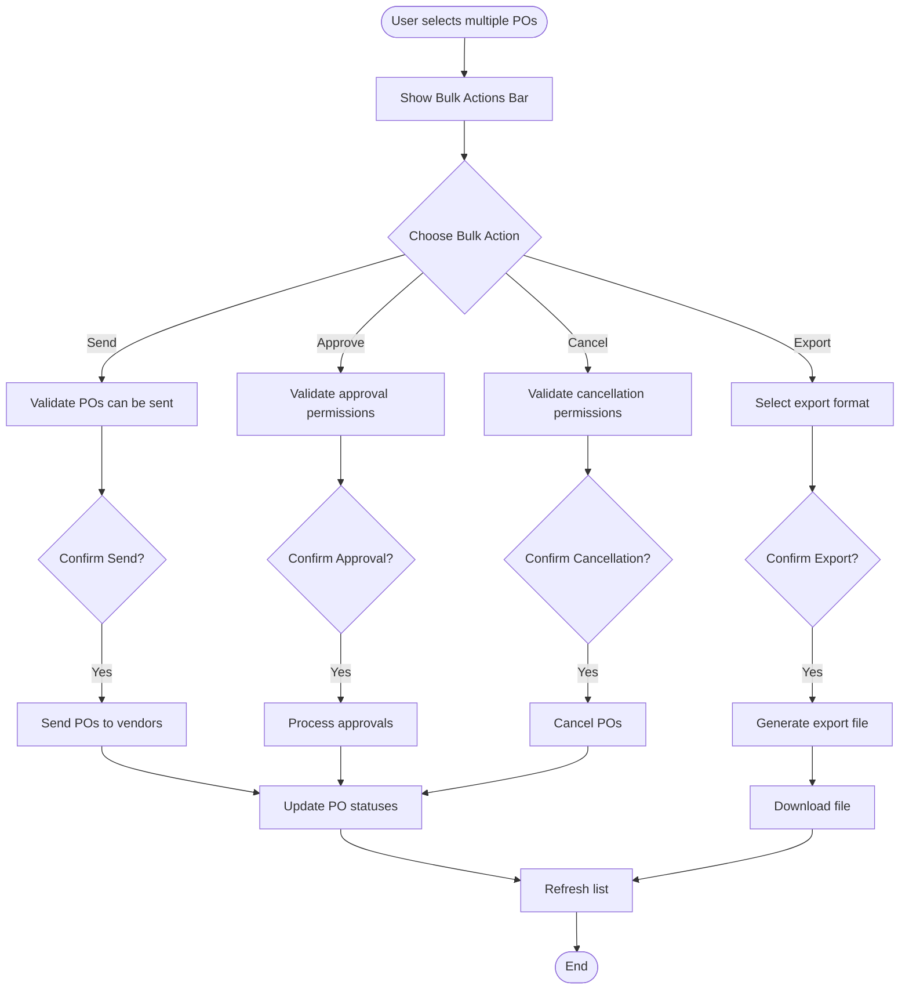
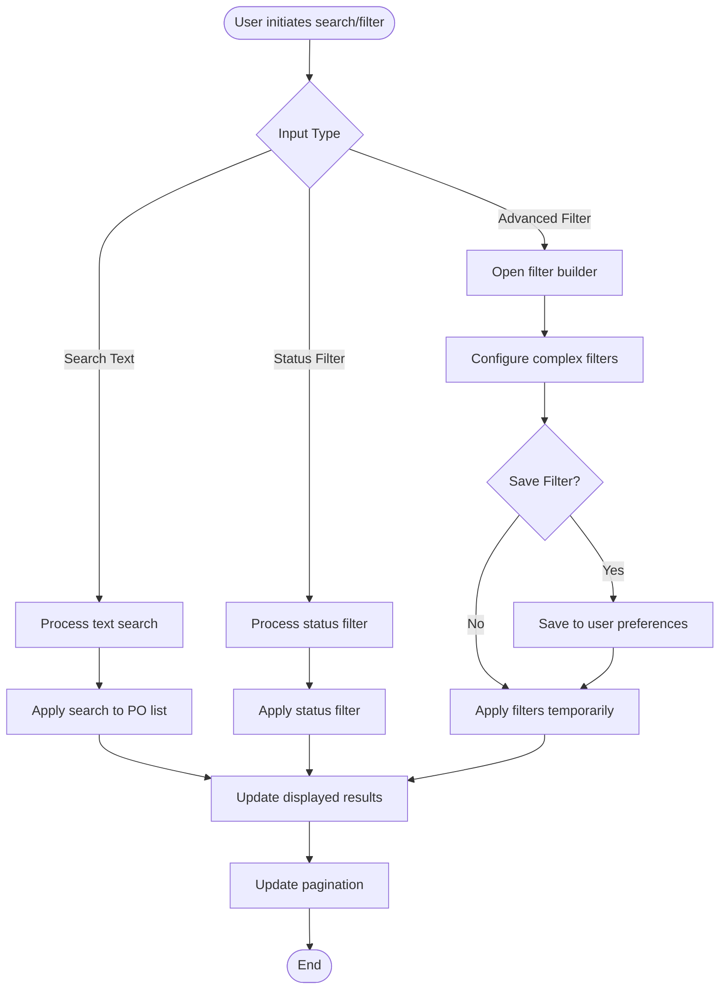

# Purchase Order List Page: Comprehensive Specification

## Document History

| Version | Date | Author | Changes |
|---------|------|--------|---------|
| 1.0.0 | 2025-11-19 | Documentation Team | Initial version |
## 1. Overview

The Purchase Order List page serves as the central hub for managing all purchase orders within the system. It provides comprehensive functionality for viewing, filtering, creating, and managing POs with role-based access control and intelligent grouping capabilities.

## 2. UI/UX Specifications

### 2.1 Page Layout

```
┌─────────────────────────────────────────────────────────────────┐
│ Header: Purchase Orders                                         │
│ ┌─────────────────┐ ┌──────────┐ ┌──────────┐ ┌──────────┐    │
│ │ New PO ▼        │ │ Export   │ │ Print    │ │ Settings │    │
│ └─────────────────┘ └──────────┘ └──────────┘ └──────────┘    │
├─────────────────────────────────────────────────────────────────┤
│ Filters & Search                                                │
│ ┌──────────────────┐ ┌──────────┐ ┌──────────┐ ┌─────────────┐ │
│ │ 🔍 Search POs... │ │ Status ▼ │ │ Filter + │ │ 📄 📋 View │ │
│ └──────────────────┘ └──────────┘ └──────────┘ └─────────────┘ │
├─────────────────────────────────────────────────────────────────┤
│ [Bulk Actions Bar - shown when items selected]                 │
├─────────────────────────────────────────────────────────────────┤
│ Table/Card Content Area                                         │
│ (Adaptive based on view mode selection)                        │
├─────────────────────────────────────────────────────────────────┤
│ Pagination Controls                                             │
│ Showing X to Y of Z results    ⏮ ◀ Page N of M ▶ ⏭           │
└─────────────────────────────────────────────────────────────────┘
```

### 2.2 Component Specifications

#### 2.2.1 Header Section
- **Title**: "Purchase Orders" with document count badge
- **Primary Action**: "New Purchase Order" dropdown button
  - **Create Blank PO**: Direct navigation to blank PO creation
  - **Create from Purchase Requests**: Opens PR selection dialog
- **Secondary Actions**: Export, Print, Settings buttons

#### 2.2.2 Filters & Search Section
- **Search Bar**: Full-text search across PO number, vendor name, description
- **Status Filter**: Dropdown with all PO statuses (Open, Sent, Partial, Closed, etc.)
- **Advanced Filter**: Complex filter builder for custom queries
- **View Toggle**: Switch between table and card views

#### 2.2.3 Table View Specifications

| Column | Type | Sortable | Description |
|--------|------|----------|-------------|
| Select | Checkbox | No | Bulk selection |
| PO Number | Text/Link | Yes | Unique PO reference |
| Vendor | Text | Yes | Vendor name |
| Date | Date | Yes | PO creation date |
| Delivery Date | Date | Yes | Expected delivery |
| Status | Badge | Yes | Current PO status |
| Amount | Currency | Yes | Total PO amount |
| Actions | Menu | No | View/Edit/Delete actions |

#### 2.2.4 Card View Specifications
- **Card Header**: PO number, date, status badge
- **Card Body**: Vendor, delivery date, currency, amount
- **Card Footer**: Action buttons (View, Edit, More)
- **Visual Grouping**: Color-coded borders for vendor relationships

#### 2.2.5 Bulk Actions
- **Send Selected**: Send multiple POs to vendors
- **Approve Selected**: Bulk approval workflow
- **Cancel Selected**: Bulk cancellation with confirmation
- **Export Selected**: Export selected POs to various formats

### 2.3 Responsive Design

#### Desktop (≥1024px)
- Full table with all columns visible
- Sidebar filters available
- Bulk actions in horizontal layout

#### Tablet (768px - 1023px)
- Condensed table with essential columns
- Collapsible filter panel
- Responsive bulk actions

#### Mobile (≤767px)
- Card view by default
- Bottom sheet filters
- Floating action button for new PO

## 3. Business Logic

### 3.1 PO Creation Logic

#### 3.1.1 Manual Creation
```javascript
function createBlankPO() {
  // Navigate to blank PO creation form
  // Pre-populate with current user context
  // Apply default settings based on user role
}
```

#### 3.1.2 PR-Based Creation with Vendor+Currency Grouping
```javascript
function createPOFromPRs(selectedPRs) {
  // Group PRs by vendor and currency
  const groups = groupPRsByVendorCurrency(selectedPRs);
  
  // Create separate PO for each group
  const pos = [];
  for (const group of groups) {
    const po = {
      vendor: group.vendor,
      vendorId: group.vendorId,
      currency: group.currency,
      items: consolidateItems(group.prs),
      totalAmount: calculateGroupTotal(group.prs),
      prReferences: group.prs.map(pr => pr.id)
    };
    pos.push(po);
  }
  
  return pos;
}

function groupPRsByVendorCurrency(prs) {
  return prs.reduce((groups, pr) => {
    const key = `${pr.vendor}-${pr.currency}`;
    if (!groups[key]) {
      groups[key] = {
        vendor: pr.vendor,
        vendorId: pr.vendorId,
        currency: pr.currency,
        prs: []
      };
    }
    groups[key].prs.push(pr);
    return groups;
  }, {});
}
```

### 3.2 Filtering and Search Logic

#### 3.2.1 Search Implementation
```javascript
function searchPOs(searchTerm, pos) {
  const lowercaseSearch = searchTerm.toLowerCase();
  return pos.filter(po => 
    po.number.toLowerCase().includes(lowercaseSearch) ||
    po.vendorName.toLowerCase().includes(lowercaseSearch) ||
    po.description?.toLowerCase().includes(lowercaseSearch)
  );
}
```

#### 3.2.2 Advanced Filtering
```javascript
function applyAdvancedFilters(filters, pos) {
  return pos.filter(po => {
    return filters.every(filter => {
      const fieldValue = getNestedValue(po, filter.field);
      return evaluateFilterCondition(fieldValue, filter.operator, filter.value);
    });
  });
}
```

### 3.3 Status Management

#### 3.3.1 Status Transitions
```javascript
const allowedTransitions = {
  'Draft': ['Sent', 'Deleted'],
  'Sent': ['Partial', 'FullyReceived', 'Voided'],
  'Partial': ['FullyReceived', 'Closed'],
  'FullyReceived': ['Closed'],
  'Voided': [], // Terminal state
  'Closed': [], // Terminal state
  'Deleted': [] // Terminal state
};

function canTransitionTo(currentStatus, newStatus) {
  return allowedTransitions[currentStatus]?.includes(newStatus) || false;
}
```

### 3.4 Financial Calculations

#### 3.4.1 PO Totals Calculation
```javascript
function calculatePOTotals(items) {
  const subtotal = items.reduce((sum, item) => 
    sum + (item.quantity * item.unitPrice), 0);
  
  const discountAmount = items.reduce((sum, item) => 
    sum + item.discountAmount, 0);
  
  const netAmount = subtotal - discountAmount;
  
  const taxAmount = items.reduce((sum, item) => 
    sum + item.taxAmount, 0);
  
  const totalAmount = netAmount + taxAmount;
  
  return {
    subtotal: roundToTwo(subtotal),
    discountAmount: roundToTwo(discountAmount),
    netAmount: roundToTwo(netAmount),
    taxAmount: roundToTwo(taxAmount),
    totalAmount: roundToTwo(totalAmount)
  };
}
```

## 4. Action Flows

### 4.1 PO Creation Flow



### 4.2 Bulk Actions Flow



### 4.3 Filter and Search Flow



## 5. RBAC (Role-Based Access Control)

### 5.1 Role Definitions

#### 5.1.1 Procurement Officer
- **View Permissions**: All POs
- **Create Permissions**: Create POs from PRs and blank POs
- **Edit Permissions**: Edit draft POs, update items
- **Action Permissions**: Send POs, request approvals
- **Restrictions**: Cannot approve own POs

#### 5.1.2 Procurement Manager
- **View Permissions**: All POs across departments
- **Create Permissions**: All creation methods
- **Edit Permissions**: Edit draft and sent POs
- **Action Permissions**: Approve POs, void POs, bulk operations
- **Special Permissions**: Override restrictions, emergency approvals

#### 5.1.3 Finance Officer
- **View Permissions**: All POs for financial review
- **Create Permissions**: None
- **Edit Permissions**: Financial fields only (terms, payment)
- **Action Permissions**: Financial approval, cost center validation
- **Restrictions**: Cannot modify items or quantities

#### 5.1.4 Department Head
- **View Permissions**: Department-specific POs
- **Create Permissions**: POs for their department
- **Edit Permissions**: Department POs in draft status
- **Action Permissions**: Approve department POs
- **Restrictions**: Limited to departmental scope

#### 5.1.5 Inventory Manager
- **View Permissions**: POs affecting inventory
- **Create Permissions**: None
- **Edit Permissions**: Delivery information, receiving status
- **Action Permissions**: Mark as received, create GRNs
- **Special Permissions**: Close POs upon full receipt

### 5.2 Permission Matrix

| Action | Proc Officer | Proc Manager | Finance Officer | Dept Head | Inventory Manager |
|--------|--------------|--------------|-----------------|-----------|-------------------|
| View All POs | ✓ | ✓ | ✓ | ✗ | ✓ |
| View Dept POs | ✓ | ✓ | ✓ | ✓ | ✓ |
| Create Blank PO | ✓ | ✓ | ✗ | ✓ | ✗ |
| Create from PRs | ✓ | ✓ | ✗ | ✓ | ✗ |
| Edit Draft PO | ✓ | ✓ | ✗ | ✓ | ✗ |
| Edit Sent PO | ✗ | ✓ | ✗ | ✗ | ✗ |
| Edit Financial | ✗ | ✓ | ✓ | ✗ | ✗ |
| Send PO | ✓ | ✓ | ✗ | ✓ | ✗ |
| Approve PO | ✗ | ✓ | ✓ | ✓ | ✗ |
| Void PO | ✗ | ✓ | ✗ | ✗ | ✗ |
| Receive Goods | ✗ | ✗ | ✗ | ✗ | ✓ |
| Close PO | ✗ | ✓ | ✗ | ✗ | ✓ |
| Delete Draft | ✗ | ✓ | ✗ | ✓ | ✗ |
| Bulk Actions | ✓ | ✓ | ✗ | ✓ | ✗ |
| Export Data | ✓ | ✓ | ✓ | ✓ | ✓ |

### 5.3 RBAC Implementation

#### 5.3.1 Component-Level Security
```javascript
function PurchaseOrderList({ user }) {
  const permissions = usePOPermissions(user.role);
  
  return (
    <div>
      {permissions.canCreate && (
        <CreatePOButton 
          showFromPRs={permissions.canCreateFromPRs}
          showBlank={permissions.canCreateBlank}
        />
      )}
      
      <POTable 
        data={filteredPOs}
        canEdit={permissions.canEdit}
        canApprove={permissions.canApprove}
        canDelete={permissions.canDelete}
        showFinancialColumns={permissions.canViewFinancials}
      />
      
      {permissions.canBulkActions && (
        <BulkActionsBar selectedItems={selectedPOs} />
      )}
    </div>
  );
}
```

#### 5.3.2 Action-Level Security
```javascript
function handlePOAction(action, po, user) {
  const permissions = getPOActionPermissions(user.role, po.status);
  
  if (!permissions[action]) {
    throw new Error(`Insufficient permissions for action: ${action}`);
  }
  
  // Additional business rule checks
  if (action === 'approve' && po.createdBy === user.id) {
    throw new Error('Cannot approve own purchase order');
  }
  
  if (action === 'edit' && po.status !== 'Draft' && user.role !== 'Procurement Manager') {
    throw new Error('Can only edit draft purchase orders');
  }
  
  // Execute action
  return executeAction(action, po, user);
}
```

#### 5.3.3 Data Filtering
```javascript
function filterPOsByRole(pos, user) {
  switch (user.role) {
    case 'Department Head':
      return pos.filter(po => po.department === user.department);
    
    case 'Procurement Officer':
      return pos.filter(po => 
        po.createdBy === user.id || 
        po.assignedTo === user.id ||
        user.permissions.includes('view_all_pos')
      );
    
    case 'Finance Officer':
    case 'Procurement Manager':
    case 'Inventory Manager':
      return pos; // Full access
    
    default:
      return pos.filter(po => po.createdBy === user.id);
  }
}
```

### 5.4 Security Considerations

#### 5.4.1 Data Protection
- **Field-Level Security**: Hide sensitive financial data based on role
- **Row-Level Security**: Filter POs based on department/ownership
- **Action Auditing**: Log all PO actions with user context
- **Session Validation**: Verify permissions on each action

#### 5.4.2 Business Rules Enforcement
- **Approval Workflows**: Enforce multi-level approval chains
- **Segregation of Duties**: Prevent same user from creating and approving
- **Authorization Limits**: Implement spending limits by role
- **Temporal Controls**: Time-based access restrictions

## 6. Performance Considerations

### 6.1 Data Loading
- **Pagination**: Load 25-50 records per page
- **Virtual Scrolling**: For large datasets
- **Lazy Loading**: Load details on demand
- **Caching**: Cache frequently accessed data

### 6.2 Search Optimization
- **Debounced Search**: Prevent excessive API calls
- **Indexed Fields**: Optimize database queries
- **Result Limiting**: Cap search results
- **Progressive Loading**: Load results as user scrolls

### 6.3 Real-Time Updates
- **WebSocket Integration**: Live status updates
- **Optimistic Updates**: Immediate UI feedback
- **Conflict Resolution**: Handle concurrent edits
- **State Synchronization**: Keep UI in sync with server

## 7. Error Handling

### 7.1 User-Facing Errors
- **Validation Errors**: Clear field-level messages
- **Permission Errors**: Helpful access denied messages
- **Network Errors**: Retry mechanisms and offline support
- **Business Rule Violations**: Contextual error explanations

### 7.2 System Errors
- **Logging**: Comprehensive error logging
- **Monitoring**: Real-time error tracking
- **Fallback UI**: Graceful degradation
- **Recovery**: Automatic retry and recovery mechanisms

This comprehensive specification provides the foundation for implementing a robust, secure, and user-friendly Purchase Order List page that meets all business requirements while providing excellent user experience across different roles and devices.