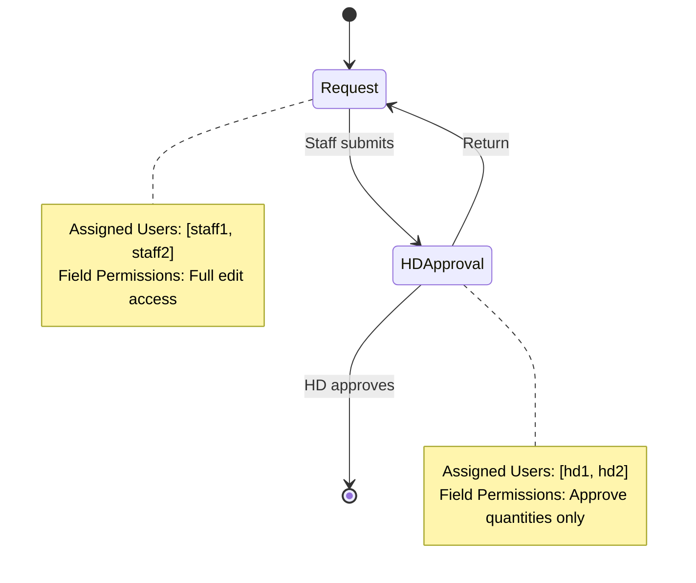

# PR Detail Item CRUD System Architecture

## 1. System Overview

### Purpose
Design a comprehensive CRUD system for Purchase Request (PR) Detail Items that supports complex role-based permissions and workflow-dependent field access controls. The system must handle dynamic form behaviors where different user roles can edit different fields based on the current workflow state.

### Key Requirements
- **PR Type-Specific Workflows**: Different PR types (Market List, General Purchase, Asset Purchase) have different workflow configurations
- **User Assignment per Stage**: Users are assigned to specific workflow stages, not just roles
- **Two-Level Permission System**: 
  - **Workflow Stage Permissions**: Control field visibility/editability per stage
  - **Role Data Scope Permissions**: Control which PRs users can access (own/department/BU)
- **Dynamic Workflow Configuration**: PR type can be changed in draft mode, workflow stages override completely
- **Flexible Return Process**: Users can return items to any previous stage regardless of assignment
- **Multi-Tenant Architecture**: 1000 business units, each with own schema and workflow configurations
- **Estimate-to-Actual Pricing**: Prices remain estimates until purchasing is complete

### Core Entities
- **PR Detail Item**: The primary entity containing product request information
- **Workflow States**: Draft, Pending-HD, HD-Approved, Pending-Manager, Manager-Approved
- **User Roles**: Staff (Requestor), HD (Head of Department), Purchase Staff, Manager(s)
- **Permission Matrix**: Role + State → Field Access Rules

## 2. Complete Workflow Design

### Two-Level Status Structure

#### Document Status (Overall Item Level)
- `draft` - Initial state
- `inprogress` - Being processed through workflow stages
- `approved` - Fully approved through all required stages
- `converted` - Converted to PO or other document
- `rejected` - Rejected at some stage

#### Workflow Stage Status (Per Stage)
Each workflow stage maintains its own status:
- `draft` - Not yet reached this stage
- `pending` - Awaiting action at this stage (first time or reset)
- `approved` - Approved at this stage
- `review` - Sent back for revision to this stage
- `rejected` - Rejected at this stage

### PR Type-Specific Workflow Configurations

Different PR types have completely different workflow stage configurations:

#### **Market List PR Type (Simple Workflow)**


#### **General Purchase PR Type (Full Workflow)**


#### **Asset Purchase PR Type (Specialized Workflow)**


### Stage Status Progression Logic

#### Forward Progress (New Stage)
When an item moves to a **new stage** for the first time:
- New stage status = `pending`
- All previous stages keep their current status
- All future stages remain `draft`
- Document status = `inprogress`

#### Approval at Current Stage
When current stage approver approves:
- Current stage status = `approved`
- Item moves to next stage with status = `pending`
- All other stages unchanged

#### Return/Review Process
When current stage sends item back:
- User selects target stage from **all previous stages**
- Target stage status = `review`
- All intermediate stages reset to `pending`
- Current stage status = `pending`
- Item moves to target stage
- **No restrictions** on how many stages back

#### Example Progression
```
Initial: All stages = draft, currentStage = request

Staff submits:
request: approved → hdApproval: pending

HD approves:
request: approved, hdApproval: approved → purchaseReview: pending

Finance Manager returns to HD:
request: approved, hdApproval: review, purchaseReview: pending, financeManager: pending
currentStage = hdApproval

HD re-approves:
request: approved, hdApproval: approved → purchaseReview: pending
```

### Role-Based Workflow Access

| Role | Draft | Pending-HD | HD-Approved | Pending-Manager | Manager-Approved | Review | Rejected |
|------|-------|------------|-------------|-----------------|------------------|--------|----------|
| **Staff** | ✅ Edit | 👁️ View | 👁️ View | 👁️ View | 👁️ View | ✅ Edit | 👁️ View |
| **HD** | 👁️ View | ✅ Edit | 👁️ View | 👁️ View | 👁️ View | 👁️ View | 👁️ View |
| **Purchase Staff** | 👁️ View | 👁️ View | ✅ Edit | ✅ Edit | ✅ Edit | 👁️ View | 👁️ View |
| **Manager** | 👁️ View | 👁️ View | 👁️ View | ✅ Edit | 👁️ View | 👁️ View | 👁️ View |

## 3. Data Model Design

### Core PR Detail Item Structure

```typescript
interface PRDetailItem {
  id: string;
  prId: string;
  
  // Basic Item Data
  location: string;
  productName: string;
  requestQuantity: number;
  requestUnit: string;
  requiredDate: Date;
  comment: string;
  
  // Document-Level Status
  documentStatus: DocumentStatus;
  
  // Workflow Stages with Individual Statuses
  workflowStages: {
    request: WorkflowStage;
    hdApproval: WorkflowStage;
    purchaseReview: WorkflowStage;
    financeManager: WorkflowStage;
    gmApproval: WorkflowStage;
  };
  
  // Current Active Stage
  currentStage: WorkflowStageType | 'completed';
  
  // ESTIMATE Pricing (Never "actual" until purchased)
  estimatedUnitPrice?: number;        // System-generated estimate
  estimatedTotalPrice?: number;       // Calculated estimate
  priceEstimateSource: EstimateSource;
  priceEstimateAccuracy?: number;     // Confidence level (e.g., 85%)
  
  // Vendor Assignment (for estimation)
  estimatedVendorId?: string;
  estimatedVendorName?: string;
  
  // Purchaser Working Data (still estimates)
  purchaserEstimatedPrice?: number;   // Purchase Staff's refined estimate
  purchaserVendorId?: string;         // Purchase Staff's vendor choice
  purchaserNotes?: string;            // Reasoning for changes
  
  // ACTUAL Data (only populated when purchased)
  actualUnitPrice?: number;           // Real price paid
  actualTotalPrice?: number;          // Real total paid
  actualVendorId?: string;            // Actual vendor used
  purchaseDate?: Date;                // When actually purchased
  
  // Pricing Metadata
  estimateGeneratedAt?: Date;
  estimateValidUntil?: Date;          // Based on price list validity
  priceVarianceRisk: 'low' | 'medium' | 'high';
  
  // Audit Trail (JSON object)
  auditHistory: AuditEntry[];
  
  // System Fields
  createdBy: string;
  createdAt: Date;
  lastModifiedBy: string;
  lastModifiedAt: Date;
  version: number;
}

// Document Status Types
enum DocumentStatus {
  DRAFT = 'draft',
  INPROGRESS = 'inprogress',
  APPROVED = 'approved',
  CONVERTED = 'converted',
  REJECTED = 'rejected'
}

// Workflow Stage Types
enum WorkflowStageType {
  REQUEST = 'request',
  HD_APPROVAL = 'hdApproval',
  PURCHASE_REVIEW = 'purchaseReview',
  FINANCE_MANAGER = 'financeManager',
  GM_APPROVAL = 'gmApproval'
}

// Workflow Stage Status
enum WorkflowStageStatus {
  DRAFT = 'draft',
  PENDING = 'pending',
  APPROVED = 'approved',
  REVIEW = 'review',
  REJECTED = 'rejected'
}

// Individual Workflow Stage
interface WorkflowStage {
  status: WorkflowStageStatus;
  assignedTo?: string;
  completedBy?: string;
  completedAt?: Date;
  comments?: string;
  
  // Stage-specific fields
  approvedQuantity?: number;    // HD/Manager approval quantities
  approvedUnit?: string;        // HD/Manager approval units
  vendorAssigned?: string;      // Purchase staff vendor assignment
  priceVerified?: boolean;      // Purchase staff price verification
  budgetApproved?: boolean;     // Finance manager budget approval
}

// PR Type Workflow Configuration
interface PRTypeWorkflowConfig {
  prType: string;               // 'MarketList', 'GeneralPurchase', 'AssetPurchase'
  businessUnitId: string;       // Multi-tenant support
  stages: WorkflowStageConfig[];
  isActive: boolean;
  createdAt: Date;
  updatedAt: Date;
}

interface WorkflowStageConfig {
  stageId: string;              // 'request', 'hdApproval', 'purchaseReview', etc.
  stageName: string;            // 'Request', 'HD Approval', 'Purchase Review'
  order: number;                // Stage sequence (1, 2, 3, ...)
  isRequired: boolean;          // Can this stage be skipped?
  assignedUsers: string[];      // User IDs assigned to this stage
  
  // Stage-specific field permissions
  fieldPermissions: {
    [fieldName: string]: 'edit' | 'view' | 'hidden';
  };
  
  // Stage configuration
  allowedActions: StageAction[];
  requiresComments: StageAction[]; // Which actions require comments
  autoAdvance?: boolean;        // Auto-advance to next stage on approval
}

enum StageAction {
  APPROVE = 'approve',
  REJECT = 'reject', 
  RETURN = 'return',
  SAVE_DRAFT = 'save_draft',
  SUBMIT = 'submit'
}

// User Role Data Scope Permissions
interface RoleDataScopeConfig {
  role: UserRole;
  dataScope: DataScope;
  businessUnitId: string;
}

enum DataScope {
  OWN_PRS = 'own_prs',           // Can only see PRs they created
  DEPARTMENT_PRS = 'department_prs', // Can see all PRs in their department
  ENTIRE_BU = 'entire_bu'        // Can see all PRs in business unit
}

enum UserRole {
  STAFF = 'staff',
  HD = 'hd', 
  PURCHASE_STAFF = 'purchase_staff',
  FINANCE_MANAGER = 'finance_manager',
  GM = 'gm',
  BOARD_MEMBER = 'board_member'
}

// Return Action for Multi-Stage Returns
interface ReturnAction {
  targetStage: WorkflowStageType;
  returnComments: string;
  affectedStages: WorkflowStageType[];  // All stages that get reset
  returnedBy: string;
  returnedAt: Date;
  returnHistory: ReturnHistoryEntry[];
}

interface ReturnHistoryEntry {
  fromStage: WorkflowStageType;
  toStage: WorkflowStageType;
  returnedBy: string;
  returnedAt: Date;
  comments: string;
  returnCount: number;  // How many times this stage has been returned to
}

enum EstimateSource {
  CATALOG_ESTIMATE = 'catalog_estimate',
  HISTORICAL_AVERAGE = 'historical_average',
  VENDOR_QUOTE = 'vendor_quote',
  STANDARD_PRICE = 'standard_price',
  MANUAL_ESTIMATE = 'manual_estimate'
}

interface AuditEntry {
  timestamp: Date;
  userId: string;
  action: string;
  fieldChanges: FieldChange[];
  oldStatus?: ItemStatus;
  newStatus?: ItemStatus;
  comments?: string;
}
```

## 4. Two-Level Permission System

### Level 1: Role Data Scope Permissions

Controls **which PRs** users can access based on their role:

| Role | Data Scope | Can Access |
|------|------------|------------|
| **Staff** | own_prs | Only PRs they created |
| **HD** | department_prs | All PRs in their department |
| **Purchase Staff** | entire_bu | All PRs in business unit |
| **Finance Manager** | entire_bu | All PRs in business unit |
| **GM** | entire_bu | All PRs in business unit |
| **Board Member** | entire_bu | All PRs in business unit |

### Level 2: Workflow Stage Field Permissions

Controls **which fields** users can see/edit based on workflow stage configuration. These are **configurable per PR type and stage**.

#### Example: General Purchase PR Type Field Permissions

| Stage | Assigned Users | Location | Product | Req Qty | Units | Date | Comment | App Qty | App Unit | Est Price | Purch Price | Vendor | Actual Price |
|-------|----------------|----------|---------|---------|-------|------|---------|---------|----------|-----------|-------------|--------|--------------|
| **request** | [staff1, staff2] | ✅ Edit | ✅ Edit | ✅ Edit | ✅ Edit | ✅ Edit | ✅ Edit | 🚫 Hidden | 🚫 Hidden | 🚫 Hidden | 🚫 Hidden | 🚫 Hidden | 🚫 Hidden |
| **hdApproval** | [hd1, hd2] | 👁️ View | 👁️ View | 👁️ View | 👁️ View | 👁️ View | 👁️ View | ✅ Edit | ✅ Edit | 👁️ View | 🚫 Hidden | 👁️ View | 🚫 Hidden |
| **purchaseReview** | [purchase1, purchase2] | 👁️ View | 👁️ View | 👁️ View | ✅ Edit | ✅ Edit | ✅ Edit | ✅ Edit | ✅ Edit | 👁️ View | ✅ Edit | ✅ Edit | ✅ Edit |
| **financeManager** | [finance1] | 👁️ View | 👁️ View | 👁️ View | 👁️ View | 👁️ View | 👁️ View | 👁️ View | 👁️ View | 👁️ View | 👁️ View | 👁️ View | 👁️ View |
| **gmApproval** | [gm1] | 👁️ View | 👁️ View | 👁️ View | 👁️ View | 👁️ View | 👁️ View | 👁️ View | 👁️ View | 👁️ View | 👁️ View | 👁️ View | 👁️ View |

#### Example: Market List PR Type Field Permissions (Different Configuration)

| Stage | Assigned Users | Location | Product | Req Qty | Units | Date | Comment | App Qty | App Unit | Est Price | Purch Price | Vendor | Actual Price |
|-------|----------------|----------|---------|---------|-------|------|---------|---------|----------|-----------|-------------|--------|--------------|
| **request** | [staff1, staff2] | ✅ Edit | ✅ Edit | ✅ Edit | ✅ Edit | ✅ Edit | ✅ Edit | 🚫 Hidden | 🚫 Hidden | 🚫 Hidden | 🚫 Hidden | 🚫 Hidden | 🚫 Hidden |
| **hdApproval** | [hd1, hd2] | ✅ Edit | ✅ Edit | ✅ Edit | ✅ Edit | ✅ Edit | ✅ Edit | ✅ Edit | ✅ Edit | 🚫 Hidden | 🚫 Hidden | 🚫 Hidden | 🚫 Hidden |

### Combined Permission Logic

```typescript
const canUserAccessField = (user, item, field) => {
  // Step 1: Check data scope access
  const roleConfig = getRoleDataScope(user.role);
  const hasDataAccess = checkDataScope(user, item, roleConfig.dataScope);
  
  if (!hasDataAccess) return { access: false };
  
  // Step 2: Check workflow stage permissions
  const currentStage = item.currentStage;
  const stageConfig = getWorkflowStageConfig(item.prType, currentStage);
  const isAssignedToStage = stageConfig.assignedUsers.includes(user.id);
  const fieldPermission = stageConfig.fieldPermissions[field];
  
  // Step 3: Determine edit capability
  const canEdit = isAssignedToStage && 
                  ['pending', 'review'].includes(item.workflowStages[currentStage].status) &&
                  fieldPermission === 'edit';
  
  return {
    access: true,
    permission: fieldPermission, // 'edit', 'view', 'hidden'
    canEdit: canEdit,
    isAssignedToStage: isAssignedToStage
  };
};
```

### Stage-Specific Actions Available

| Role | Stage | Available Actions | Comments Required |
|------|-------|-------------------|-------------------|
| **Staff** | request (pending/review) | Submit, Save Draft | No |
| **HD** | hdApproval (pending/review) | Approve, Return to Any Previous Stage, Reject | Return/Reject: Yes |
| **Purchase Staff** | purchaseReview (pending/review) | Approve, Return to Any Previous Stage, Reject | Return/Reject: Yes |
| **Finance Manager** | financeManager (pending/review) | Approve, Return to Any Previous Stage, Reject | Return/Reject: Yes |
| **GM** | gmApproval (pending/review) | Approve, Return to Any Previous Stage, Reject | Return/Reject: Yes |

### Return Stage Selection Rules

1. **Available Return Targets**: All previous stages that have been reached
2. **Return Effect**: 
   - Target stage status = `review`
   - Intermediate stages status = `pending` 
   - Current stage status = `pending`
   - Item moves to target stage
3. **Comments**: Return comments are additional to existing item comments
4. **No Restrictions**: Any user can return to any previous stage
5. **Review Status Restriction**: If any item has stage status = `review`, document can only be returned (no forward progress)

**Legend:**
- ✅ Edit: User can modify the field (input controls)
- 👁️ Text: User can view the field (text display, same layout)
- 🚫 Hidden: Field is not visible to the user

## 5. Vendor Allocation Engine

### Allocation Process Flow

```typescript
interface VendorAllocationEngine {
  allocateVendorsForPR(prId: string): Promise<AllocationResult>;
  
  // Fallback strategy for failures
  applyFallbackPricing(item: PRDetailItem): Promise<FallbackResult>;
}

interface AllocationResult {
  success: boolean;
  allocatedItems: ItemAllocation[];
  fallbackItems: FallbackAllocation[];
  totalEstimatedValue: number;
}

interface FallbackAllocation {
  itemId: string;
  standardPrice: number;        // From product master table
  vendorId: null;              // Blank vendor for manual assignment
  fallbackReason: string;      // Why allocation failed
  requiresManualAttention: true;
}
```

### Allocation Business Rules

1. **Primary Allocation**: Use vendor price lists with date range validation
2. **Fallback Strategy**: Use standard price from product master table
3. **Vendor Assignment**: Leave blank if allocation fails
4. **Price Validity**: Must be valid during required/delivery date
5. **Notification**: Alert Staff + HD + Purchase Staff of failures
6. **Workflow Continuation**: Never block PR submission due to allocation failures

## 6. Bulk Operations Design

### Split Bulk Function

```typescript
interface PRSplitOperation {
  originalPrId: string;
  newPrId: string;
  splitBy: string;                    // HD or Purchase Staff
  approvedItemIds: string[];          // Auto-selected approved items
  remainingItemIds: string[];         // Items staying in original PR
  splitReason?: string;
}

interface SplitResult {
  originalPR: {
    id: string;
    status: 'partially_split';
    remainingItems: PRDetailItem[];
    splitReference: string;           // Reference to new PR
  };
  newPR: {
    id: string;
    inheritedItems: PRDetailItem[];   // Items maintain their approved status
    continuesWorkflow: true;          // Goes to next stage
  };
}
```

### Bulk Operation Rules

1. **Who Can Split**: HD and Purchase Staff only
2. **Auto-Selection**: Automatically selects all approved items
3. **Manual Decision**: User decides when to split
4. **Original PR**: Marked as "partially split" with reference
5. **New PR**: Inherits approval status, continues workflow
6. **No Re-splitting**: Cannot split an already-split PR
7. **Bulk Actions**: System asks "Apply to all or just pending items?"

## 7. Database Schema Design

### Core Tables

```sql
-- PR Type Workflow Configuration (per business unit schema)
CREATE TABLE pr_type_workflow_configs (
    id UUID PRIMARY KEY DEFAULT gen_random_uuid(),
    pr_type VARCHAR(100) NOT NULL,
    business_unit_id UUID NOT NULL,
    is_active BOOLEAN NOT NULL DEFAULT true,
    created_at TIMESTAMP NOT NULL DEFAULT NOW(),
    updated_at TIMESTAMP NOT NULL DEFAULT NOW(),
    
    UNIQUE(pr_type, business_unit_id)
);

-- Workflow Stage Configuration (per business unit schema)
CREATE TABLE workflow_stage_configs (
    id UUID PRIMARY KEY DEFAULT gen_random_uuid(),
    pr_type_config_id UUID NOT NULL REFERENCES pr_type_workflow_configs(id),
    stage_id VARCHAR(100) NOT NULL,
    stage_name VARCHAR(255) NOT NULL,
    stage_order INTEGER NOT NULL,
    is_required BOOLEAN NOT NULL DEFAULT true,
    field_permissions JSONB NOT NULL DEFAULT '{}',
    allowed_actions TEXT[] NOT NULL DEFAULT '{}',
    requires_comments TEXT[] NOT NULL DEFAULT '{}',
    auto_advance BOOLEAN NOT NULL DEFAULT false,
    
    UNIQUE(pr_type_config_id, stage_id),
    UNIQUE(pr_type_config_id, stage_order)
);

-- Stage User Assignments (per business unit schema)
CREATE TABLE stage_user_assignments (
    id UUID PRIMARY KEY DEFAULT gen_random_uuid(),
    stage_config_id UUID NOT NULL REFERENCES workflow_stage_configs(id),
    user_id UUID NOT NULL REFERENCES users(id),
    assigned_at TIMESTAMP NOT NULL DEFAULT NOW(),
    assigned_by UUID NOT NULL REFERENCES users(id),
    is_active BOOLEAN NOT NULL DEFAULT true,
    
    UNIQUE(stage_config_id, user_id)
);

-- Role Data Scope Configuration (per business unit schema)
CREATE TABLE role_data_scope_configs (
    id UUID PRIMARY KEY DEFAULT gen_random_uuid(),
    role VARCHAR(50) NOT NULL,
    data_scope VARCHAR(50) NOT NULL CHECK (data_scope IN ('own_prs', 'department_prs', 'entire_bu')),
    business_unit_id UUID NOT NULL,
    is_active BOOLEAN NOT NULL DEFAULT true,
    
    UNIQUE(role, business_unit_id)
);

-- Main PR Detail Items table (per business unit schema)
CREATE TABLE pr_detail_items (
    id UUID PRIMARY KEY DEFAULT gen_random_uuid(),
    pr_id UUID NOT NULL REFERENCES purchase_requests(id),
    
    -- Basic Item Data
    location VARCHAR(255) NOT NULL,
    product_name VARCHAR(500) NOT NULL,
    request_quantity DECIMAL(10,3) NOT NULL,
    request_unit VARCHAR(50) NOT NULL,
    required_date DATE NOT NULL,
    comment TEXT,
    
    -- Document Status
    document_status VARCHAR(20) NOT NULL DEFAULT 'draft' 
        CHECK (document_status IN ('draft', 'inprogress', 'approved', 'converted', 'rejected')),
    
    -- Current Workflow Stage
    current_stage VARCHAR(100) NOT NULL,
    
    -- Workflow Stages (JSON object with stage statuses)
    workflow_stages JSONB NOT NULL DEFAULT '{}',
    
    -- Estimate Pricing
    estimated_unit_price DECIMAL(12,4),
    estimated_total_price DECIMAL(15,4),
    price_estimate_source VARCHAR(50),
    price_estimate_accuracy INTEGER,
    estimate_generated_at TIMESTAMP,
    estimate_valid_until TIMESTAMP,
    price_variance_risk VARCHAR(20) CHECK (price_variance_risk IN ('low', 'medium', 'high')),
    
    -- Vendor Assignment
    estimated_vendor_id UUID REFERENCES vendors(id),
    purchaser_vendor_id UUID REFERENCES vendors(id),
    purchaser_estimated_price DECIMAL(12,4),
    purchaser_notes TEXT,
    
    -- Actual Data
    actual_unit_price DECIMAL(12,4),
    actual_total_price DECIMAL(15,4),
    actual_vendor_id UUID REFERENCES vendors(id),
    purchase_date TIMESTAMP,
    
    -- Status & Workflow
    item_status VARCHAR(20) NOT NULL DEFAULT 'draft',
    review_comments TEXT,
    rejection_reason TEXT,
    
    -- Audit Trail (JSON)
    audit_history JSONB NOT NULL DEFAULT '[]',
    
    -- System Fields
    created_by UUID NOT NULL REFERENCES users(id),
    created_at TIMESTAMP NOT NULL DEFAULT NOW(),
    last_modified_by UUID REFERENCES users(id),
    last_modified_at TIMESTAMP DEFAULT NOW(),
    version INTEGER NOT NULL DEFAULT 1,
    
    -- Constraints
    CONSTRAINT positive_request_quantity CHECK (request_quantity > 0),
    CONSTRAINT valid_item_status CHECK (item_status IN ('draft', 'pending_hd', 'hd_approved', 'pending_manager', 'manager_approved', 'review', 'rejected'))
);

-- Product Master with Standard Prices
CREATE TABLE products (
    id UUID PRIMARY KEY DEFAULT gen_random_uuid(),
    product_name VARCHAR(500) NOT NULL,
    category VARCHAR(255),
    standard_price DECIMAL(12,4) NOT NULL,  -- Fallback price
    allowed_units VARCHAR(255)[],
    is_active BOOLEAN NOT NULL DEFAULT true,
    created_at TIMESTAMP NOT NULL DEFAULT NOW()
);

-- Vendor Price Lists
CREATE TABLE vendor_price_lists (
    id UUID PRIMARY KEY DEFAULT gen_random_uuid(),
    vendor_id UUID NOT NULL REFERENCES vendors(id),
    product_id UUID NOT NULL REFERENCES products(id),
    unit_price DECIMAL(12,4) NOT NULL,
    valid_from_date DATE NOT NULL,
    valid_to_date DATE NOT NULL,
    minimum_order_quantity DECIMAL(10,3),
    lead_time_days INTEGER,
    updated_by_vendor_at TIMESTAMP,
    is_active BOOLEAN NOT NULL DEFAULT true
);

-- PR Split History
CREATE TABLE pr_split_history (
    id UUID PRIMARY KEY DEFAULT gen_random_uuid(),
    original_pr_id UUID NOT NULL,
    new_pr_id UUID NOT NULL,
    split_by UUID NOT NULL REFERENCES users(id),
    split_at TIMESTAMP NOT NULL DEFAULT NOW(),
    approved_item_ids UUID[],
    split_reason TEXT
);
```

### Performance Indexes

```sql
-- Primary lookup indexes
CREATE INDEX idx_pr_items_pr_id ON pr_detail_items(pr_id);
CREATE INDEX idx_pr_items_status ON pr_detail_items(item_status);
CREATE INDEX idx_pr_items_created_by ON pr_detail_items(created_by);

-- Multi-tenant performance
CREATE INDEX idx_pr_items_pr_status ON pr_detail_items(pr_id, item_status);
CREATE INDEX idx_pr_items_status_modified ON pr_detail_items(item_status, last_modified_at);

-- Price list lookups
CREATE INDEX idx_vendor_prices_product_date ON vendor_price_lists(product_id, valid_from_date, valid_to_date);
CREATE INDEX idx_vendor_prices_vendor ON vendor_price_lists(vendor_id, is_active);
```

## 8. API Design

### Core CRUD Operations

```typescript
// Role-based item retrieval
GET /api/pr/{prId}/items
  - Returns items filtered by user role and permissions
  - Includes only fields visible to current user
  - Text format for read-only fields

// Item updates (role and status dependent)
PUT /api/pr/{prId}/items/{itemId}
  - Validates user permissions for current item status
  - Enforces field-level edit permissions
  - Updates audit history JSON

// Bulk operations
POST /api/pr/{prId}/items/bulk-action
  - Supports: approve-all, reject-selected, split-approved
  - Asks user: "Apply to all or just pending items?"
  - Returns partial success results

// Vendor allocation
POST /api/pr/{prId}/allocate-vendors
  - Triggered on staff submission
  - Background processing with fallback strategy
  - Returns allocation results with failures
```

### Status Transition API

```typescript
POST /api/pr/{prId}/items/{itemId}/transition
{
  "toStatus": "hd_approved",
  "comments": "Approved with reduced quantity",
  "fieldUpdates": {
    "approvedQuantity": 50,
    "approvedUnit": "pieces"
  }
}
```

## 9. UI/UX Design Patterns

### Expanded Panel Architecture

```typescript
interface ExpandedPanelProps {
  item: PRDetailItem;
  userRole: UserRole;
  mode: 'edit' | 'view';
}

// Role-based panel components
const RequestorPanel: React.FC<ExpandedPanelProps> = ({ item, mode }) => {
  // Shows: Basic item info, no financial data
  // Edit mode: Input fields when status allows
  // View mode: Text display with same layout
};

const HDPanel: React.FC<ExpandedPanelProps> = ({ item, mode }) => {
  // Shows: All item info + estimates + approval fields
  // Financial data visible as text
};

const PurchaseStaffPanel: React.FC<ExpandedPanelProps> = ({ item, mode }) => {
  // Shows: All fields including vendor management
  // Can edit vendor, prices, purchase details
};
```

### Form Layout Consistency

- **Same Visual Layout**: Edit and view modes use identical layouts
- **Input vs Text**: Replace input fields with text values for read-only
- **No Special Styling**: Plain text display without read-only indicators
- **Financial Format**: Simple value display ("$125.50") without context

## 10. Notification System

### Notification Rules

```typescript
interface NotificationConfig {
  vendorChanges: {
    recipients: ['original_hd', 'final_manager'];
    trigger: 'purchase_staff_vendor_change';
    method: ['email', 'in_app', 'mobile_push'];
  };
  
  priceChanges: {
    recipients: ['original_hd', 'final_manager'];
    trigger: 'any_price_change';  // Always notify
    method: ['email', 'in_app', 'mobile_push'];
  };
  
  statusChanges: {
    recipients: 'role_based';
    trigger: 'status_transition';
    method: ['email', 'in_app'];
  };
}
```

### Integration Points

- **Internal Systems**: Vendor portal for price updates, internal master data
- **External Integration**: Notification service only (email, SMS, push)
- **No ERP Integration**: Manual entry of actual purchase data
- **Price Updates**: Vendors update via portal or Excel upload to price list tables

## 11. Multi-Tenant Architecture

### Schema-Per-Tenant Design

```typescript
interface TenantConfig {
  businessUnits: 1000;
  usersPerUnit: '5-20';
  totalUsers: '5000-20000';
  dataIsolation: 'schema_per_tenant';
  
  processing: {
    staffSubmit: 'background_async';      // Vendor allocation
    purchaseStaff: 'real_time';          // All operations
  };
  
  notifications: {
    inApp: 'real_time';
    email: 'real_time';
    mobilePush: 'real_time';
  };
}
```

### Scalability Considerations

- **Database**: Separate schema per business unit for data isolation
- **Processing**: Background vendor allocation, real-time purchase operations
- **Caching**: Role-based permission caching per tenant
- **Audit Storage**: JSON within documents to avoid separate audit tables
- **History Retention**: Configurable per tenant, stored as JSON arrays

## 12. Error Handling & Validation

### Best Practice Implementation

```typescript
interface ValidationStrategy {
  referentialIntegrity: 'enforce_foreign_keys';
  businessRules: {
    dateRanges: 'reasonable_past_future_limits';
    quantities: 'positive_numbers_only';
    priceValidity: 'check_against_price_list_dates';
  };
  
  errorHandling: {
    strategy: 'fail_fast_with_clear_messages';
    userExperience: 'immediate_validation_feedback';
    systemResilience: 'graceful_degradation';
  };
  
  dataConsistency: {
    masterData: 'soft_delete_with_inactive_flag';
    transactions: 'database_transaction_integrity';
    auditTrail: 'immutable_json_history';
  };
}
```

### Fallback Mechanisms

1. **Vendor Allocation Failure**: Use standard prices, continue workflow
2. **Notification Service Down**: Log for retry, don't block operations
3. **Price List Unavailable**: Fall back to product master standard prices
4. **Validation Errors**: Clear messages with suggested corrections

## 13. Implementation Phases

### Phase 1: Core CRUD & Workflow
- Basic item CRUD operations
- Role-based permissions
- Status transitions
- Audit trail implementation

### Phase 2: Vendor Allocation & Pricing
- Vendor allocation engine
- Price estimation system
- Fallback mechanisms
- Price list integration

### Phase 3: Bulk Operations & Advanced Features
- Split bulk functionality
- Advanced bulk operations
- Notification system
- Performance optimization

### Phase 4: Multi-Tenant & Scale
- Schema-per-tenant implementation
- Background processing
- Monitoring and analytics
- Production deployment

## 14. Testing Strategy

### Unit Testing
- Permission matrix validation
- Status transition logic
- Vendor allocation algorithms
- Price calculation accuracy

### Integration Testing
- Multi-role workflow scenarios
- Bulk operation edge cases
- Notification delivery
- Database transaction integrity

### Performance Testing
- Multi-tenant load testing
- Concurrent user scenarios
- Large PR processing
- Background job performance

### User Acceptance Testing
- Role-based workflow validation
- UI/UX consistency across roles
- Error handling user experience
- Business rule compliance

---

## Conclusion

This architecture provides a robust, scalable solution for PR Detail Item CRUD operations with complex role-based permissions and multi-stage approval workflows. The design emphasizes:

- **Workflow-Driven Permissions**: Clear role-based access control
- **Estimate-to-Actual Pricing**: Transparent pricing lifecycle
- **Resilient Vendor Allocation**: Fallback strategies for system reliability
- **Multi-Tenant Scalability**: Schema-per-tenant for 1000+ business units
- **User Experience**: Consistent layouts with role-appropriate functionality
- **Audit Compliance**: Comprehensive change tracking and notifications

The system is designed to handle the complexity of multi-stage approvals while maintaining data integrity and providing clear user experiences for each role in the procurement workflow.