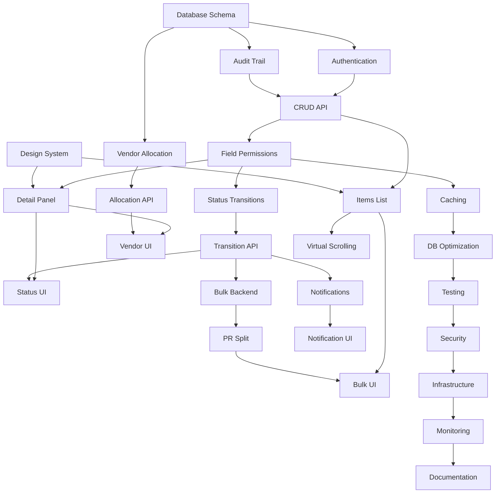

# PR Detail Item CRUD - Implementation Stories

## Overview

This document breaks down the PR Detail Item CRUD system into manageable development stories organized by implementation phases. Each story includes acceptance criteria, technical requirements, and dependencies.

## Story Template

```
Story ID: PRI-XXX
Title: [Story Title]
Epic: [Epic Name]
Priority: High/Medium/Low
Story Points: [1-13]
Dependencies: [Other story IDs]

Description:
As a [role], I want [functionality] so that [business value].

Acceptance Criteria:
- [ ] Criterion 1
- [ ] Criterion 2

Technical Requirements:
- Database changes
- API endpoints
- UI components
- Business logic

Definition of Done:
- [ ] Code implemented and reviewed
- [ ] Unit tests written and passing
- [ ] Integration tests passing
- [ ] Documentation updated
- [ ] Accessibility compliance verified
```

## Phase 1: Foundation & Core CRUD

### Epic 1.1: Database Foundation

#### PRI-001: Create Multi-Tenant Database Schema
**Priority:** High | **Points:** 8 | **Dependencies:** None

**Description:**
As a system administrator, I want a multi-tenant database schema so that each business unit has isolated data.

**Acceptance Criteria:**
- [ ] Schema-per-tenant architecture implemented
- [ ] Core tables created: pr_detail_items, products, vendors, vendor_price_lists
- [ ] Proper indexes for performance
- [ ] Foreign key constraints enforced
- [ ] Audit triggers implemented
- [ ] Database migration scripts created

**Technical Requirements:**
- PostgreSQL schema creation per business unit
- Connection pooling for multi-tenant access
- Database migration framework setup
- Performance indexes on lookup fields

**Definition of Done:**
- [ ] Database schema deployed to dev environment
- [ ] Migration scripts tested
- [ ] Performance benchmarks meet requirements
- [ ] Documentation for schema management

---

#### PRI-002: Implement Audit Trail System
**Priority:** High | **Points:** 5 | **Dependencies:** PRI-001

**Description:**
As a compliance officer, I want comprehensive audit trails so that all changes are tracked for regulatory purposes.

**Acceptance Criteria:**
- [ ] JSON audit history stored within item records
- [ ] Automatic audit entry creation on all changes
- [ ] Status transition tracking
- [ ] User attribution for all changes
- [ ] Immutable audit records

**Technical Requirements:**
- Database triggers for audit trail
- JSON schema for audit entries
- Audit entry validation
- Query optimization for audit data

---

### Epic 1.2: Core API Development

#### PRI-003: Implement Role-Based Authentication
**Priority:** High | **Points:** 8 | **Dependencies:** PRI-001

**Description:**
As a user, I want secure role-based access so that I can only see and edit data appropriate to my role.

**Acceptance Criteria:**
- [ ] JWT token authentication
- [ ] Role-based authorization middleware
- [ ] Business unit isolation
- [ ] Permission matrix enforcement
- [ ] Session management

**Technical Requirements:**
- JWT token generation and validation
- Role-based middleware
- Permission checking utilities
- Security headers implementation

---

#### PRI-004: Create Basic CRUD API Endpoints
**Priority:** High | **Points:** 13 | **Dependencies:** PRI-002, PRI-003

**Description:**
As a developer, I want basic CRUD API endpoints so that the frontend can manage PR items.

**Acceptance Criteria:**
- [ ] GET /api/v1/pr/{prId}/items (role-filtered)
- [ ] GET /api/v1/pr/{prId}/items/{itemId}
- [ ] POST /api/v1/pr/{prId}/items
- [ ] PUT /api/v1/pr/{prId}/items/{itemId}
- [ ] DELETE /api/v1/pr/{prId}/items/{itemId}
- [ ] Role-based field filtering
- [ ] Optimistic locking with version control
- [ ] Comprehensive error handling

**Technical Requirements:**
- RESTful API design
- Input validation
- Role-based response filtering
- Error response standardization
- API documentation (OpenAPI/Swagger)

---

#### PRI-005: Implement Field-Level Permissions
**Priority:** High | **Points:** 8 | **Dependencies:** PRI-004

**Description:**
As a user, I want to see only the fields I'm authorized to view so that sensitive information is protected.

**Acceptance Criteria:**
- [ ] Permission matrix implementation
- [ ] Dynamic field filtering based on role + status
- [ ] Edit permission validation
- [ ] Financial data visibility controls
- [ ] Consistent permission enforcement

**Technical Requirements:**
- Permission matrix configuration
- Field-level filtering utilities
- Permission validation middleware
- Role-based serializers

---

### Epic 1.3: Basic UI Components

#### PRI-006: Create Design System Foundation
**Priority:** High | **Points:** 5 | **Dependencies:** None

**Description:**
As a developer, I want a consistent design system so that the UI is cohesive and maintainable.

**Acceptance Criteria:**
- [ ] Design tokens defined (colors, spacing, typography)
- [ ] Base component library created
- [ ] Status badge component
- [ ] Field display component (edit/view modes)
- [ ] Action button components
- [ ] Responsive grid system

**Technical Requirements:**
- CSS-in-JS or CSS modules setup
- Component library structure
- Storybook for component documentation
- Accessibility compliance (WCAG 2.1 AA)

---

#### PRI-007: Build PR Items List Component
**Priority:** High | **Points:** 8 | **Dependencies:** PRI-004, PRI-006

**Description:**
As a user, I want to see a list of PR items so that I can review and manage them.

**Acceptance Criteria:**
- [ ] Role-based item list display
- [ ] Status filtering
- [ ] Search functionality
- [ ] Pagination
- [ ] Responsive design
- [ ] Loading states

**Technical Requirements:**
- React component with hooks
- API integration
- State management (Redux/Zustand)
- Virtual scrolling for large lists
- Responsive design implementation

---

#### PRI-008: Build Item Detail Panel
**Priority:** High | **Points:** 13 | **Dependencies:** PRI-005, PRI-006

**Description:**
As a user, I want to view and edit item details so that I can manage purchase requests effectively.

**Acceptance Criteria:**
- [ ] Role-based field visibility
- [ ] Edit/view mode switching
- [ ] Form validation
- [ ] Optimistic updates
- [ ] Error handling
- [ ] Responsive layout

**Technical Requirements:**
- Complex form component
- Role-based field rendering
- Form validation library
- State synchronization
- Error boundary implementation

---

## Phase 2: Workflow & Status Management

### Epic 2.1: Status Workflow Engine

#### PRI-009: Implement Status Transition Logic
**Priority:** High | **Points:** 8 | **Dependencies:** PRI-005

**Description:**
As a user, I want items to transition through proper workflow states so that approval processes are enforced.

**Acceptance Criteria:**
- [ ] Status transition validation
- [ ] Role-based transition permissions
- [ ] Business rule enforcement
- [ ] Transition history tracking
- [ ] Invalid transition prevention

**Technical Requirements:**
- State machine implementation
- Transition validation rules
- Business logic layer
- Status history tracking

---

#### PRI-010: Create Status Transition API
**Priority:** High | **Points:** 5 | **Dependencies:** PRI-009

**Description:**
As a frontend developer, I want status transition endpoints so that users can approve, reject, and review items.

**Acceptance Criteria:**
- [ ] POST /api/v1/pr/{prId}/items/{itemId}/transition
- [ ] Validation of transition permissions
- [ ] Required field enforcement (comments for reject/review)
- [ ] Notification triggering
- [ ] Audit trail creation

**Technical Requirements:**
- Transition endpoint implementation
- Validation middleware
- Notification service integration
- Error handling

---

#### PRI-011: Build Status Action Components
**Priority:** Medium | **Points:** 8 | **Dependencies:** PRI-010, PRI-008

**Description:**
As a user, I want to easily approve, reject, or review items so that I can efficiently process my workflow.

**Acceptance Criteria:**
- [ ] Action buttons based on user role and item status
- [ ] Confirmation dialogs for critical actions
- [ ] Comment requirements for reject/review
- [ ] Loading states during transitions
- [ ] Success/error feedback

**Technical Requirements:**
- Action button components
- Modal/dialog components
- Form handling for comments
- State management for transitions

---

### Epic 2.2: Vendor Allocation System

#### PRI-012: Create Vendor Allocation Engine
**Priority:** High | **Points:** 13 | **Dependencies:** PRI-001

**Description:**
As a system, I want to automatically allocate vendors and prices when items are submitted so that estimates are available for approval.

**Acceptance Criteria:**
- [ ] Vendor allocation business rules
- [ ] Price list integration
- [ ] Fallback to standard prices
- [ ] Date range validation for prices
- [ ] Allocation failure handling
- [ ] Background processing capability

**Technical Requirements:**
- Vendor allocation algorithm
- Price list query optimization
- Background job processing
- Fallback mechanism implementation
- Error handling and logging

---

#### PRI-013: Implement Allocation API Endpoints
**Priority:** High | **Points:** 5 | **Dependencies:** PRI-012

**Description:**
As a system, I want allocation endpoints so that vendor assignment can be triggered and monitored.

**Acceptance Criteria:**
- [ ] POST /api/v1/pr/{prId}/allocate-vendors
- [ ] GET /api/v1/pr/{prId}/allocation-status/{jobId}
- [ ] Background job status tracking
- [ ] Allocation results reporting
- [ ] Failure notification

**Technical Requirements:**
- Background job queue (Redis/Bull)
- Job status tracking
- Result storage and retrieval
- Notification integration

---

#### PRI-014: Build Vendor Management UI
**Priority:** Medium | **Points:** 8 | **Dependencies:** PRI-013, PRI-008

**Description:**
As a purchase staff member, I want to view and modify vendor assignments so that I can optimize purchasing decisions.

**Acceptance Criteria:**
- [ ] Vendor selection dropdown
- [ ] Available vendor options display
- [ ] Price comparison interface
- [ ] Vendor assignment history
- [ ] Manual override capability

**Technical Requirements:**
- Vendor selection components
- Price comparison display
- API integration for vendor data
- State management for vendor changes

---

## Phase 3: Advanced Features

### Epic 3.1: Bulk Operations

#### PRI-015: Implement Bulk Action Backend
**Priority:** Medium | **Points:** 8 | **Dependencies:** PRI-010

**Description:**
As a user, I want to perform bulk actions on multiple items so that I can efficiently process large numbers of items.

**Acceptance Criteria:**
- [ ] Bulk status transitions
- [ ] User choice: all items vs. eligible items only
- [ ] Partial success handling
- [ ] All-or-nothing transaction option
- [ ] Bulk operation audit trail

**Technical Requirements:**
- Bulk operation service layer
- Transaction management
- Partial success handling
- Bulk audit trail creation

---

#### PRI-016: Create PR Split Functionality
**Priority:** Medium | **Points:** 13 | **Dependencies:** PRI-015

**Description:**
As an HD or Purchase Staff member, I want to split approved items into a new PR so that approved items can proceed while others are still being processed.

**Acceptance Criteria:**
- [ ] Auto-selection of approved items
- [ ] New PR creation with inherited data
- [ ] Original PR status update
- [ ] Split operation audit trail
- [ ] Reference linking between PRs

**Technical Requirements:**
- PR splitting service
- Data inheritance logic
- Reference management
- Complex transaction handling

---

#### PRI-017: Build Bulk Operations UI
**Priority:** Medium | **Points:** 8 | **Dependencies:** PRI-016, PRI-007

**Description:**
As a user, I want bulk operation controls so that I can efficiently manage multiple items at once.

**Acceptance Criteria:**
- [ ] Multi-select item interface
- [ ] Bulk action toolbar
- [ ] Split PR interface
- [ ] Progress indicators for bulk operations
- [ ] Results summary display

**Technical Requirements:**
- Multi-select component
- Bulk action toolbar
- Progress tracking UI
- Results display components

---

### Epic 3.2: Notification System

#### PRI-018: Implement Notification Service
**Priority:** Medium | **Points:** 8 | **Dependencies:** PRI-010

**Description:**
As a user, I want to receive notifications about relevant changes so that I can stay informed about items requiring my attention.

**Acceptance Criteria:**
- [ ] Email notifications
- [ ] In-app notifications
- [ ] Mobile push notifications (future)
- [ ] Notification preferences
- [ ] Delivery status tracking

**Technical Requirements:**
- Email service integration
- Notification queue system
- Template management
- Delivery tracking
- User preference management

---

#### PRI-019: Create Notification UI Components
**Priority:** Low | **Points:** 5 | **Dependencies:** PRI-018

**Description:**
As a user, I want to see in-app notifications so that I'm aware of important updates without leaving the application.

**Acceptance Criteria:**
- [ ] Notification bell/indicator
- [ ] Notification list display
- [ ] Mark as read functionality
- [ ] Notification filtering
- [ ] Real-time updates

**Technical Requirements:**
- Notification components
- WebSocket integration for real-time
- State management for notifications
- Notification API integration

---

## Phase 4: Performance & Polish

### Epic 4.1: Performance Optimization

#### PRI-020: Implement Caching Strategy
**Priority:** Medium | **Points:** 5 | **Dependencies:** PRI-005

**Description:**
As a system, I want efficient caching so that the application performs well under load.

**Acceptance Criteria:**
- [ ] Permission matrix caching
- [ ] Vendor data caching
- [ ] Price list caching
- [ ] Cache invalidation strategy
- [ ] Performance monitoring

**Technical Requirements:**
- Redis caching implementation
- Cache invalidation logic
- Performance monitoring tools
- Cache hit rate optimization

---

#### PRI-021: Optimize Database Queries
**Priority:** Medium | **Points:** 8 | **Dependencies:** PRI-020

**Description:**
As a system administrator, I want optimized database performance so that the application scales to 1000+ business units.

**Acceptance Criteria:**
- [ ] Query optimization for large datasets
- [ ] Index optimization
- [ ] Connection pooling
- [ ] Query performance monitoring
- [ ] Slow query identification

**Technical Requirements:**
- Database query optimization
- Index analysis and creation
- Connection pool configuration
- Performance monitoring setup

---

#### PRI-022: Implement Virtual Scrolling
**Priority:** Low | **Points:** 5 | **Dependencies:** PRI-007

**Description:**
As a user, I want smooth scrolling through large item lists so that the interface remains responsive.

**Acceptance Criteria:**
- [ ] Virtual scrolling for item lists
- [ ] Smooth scrolling performance
- [ ] Proper item height calculation
- [ ] Search result handling
- [ ] Memory usage optimization

**Technical Requirements:**
- Virtual scrolling library integration
- Performance optimization
- Memory management
- Scroll position management

---

### Epic 4.2: Testing & Quality Assurance

#### PRI-023: Implement Comprehensive Testing
**Priority:** High | **Points:** 13 | **Dependencies:** All previous stories

**Description:**
As a developer, I want comprehensive test coverage so that the system is reliable and maintainable.

**Acceptance Criteria:**
- [ ] Unit tests for all components (>90% coverage)
- [ ] Integration tests for API endpoints
- [ ] End-to-end workflow tests
- [ ] Performance tests
- [ ] Accessibility tests

**Technical Requirements:**
- Jest/React Testing Library setup
- API testing framework
- E2E testing with Playwright/Cypress
- Performance testing tools
- Accessibility testing tools

---

#### PRI-024: Security Audit & Hardening
**Priority:** High | **Points:** 8 | **Dependencies:** PRI-023

**Description:**
As a security officer, I want the system to be secure so that sensitive business data is protected.

**Acceptance Criteria:**
- [ ] Security vulnerability assessment
- [ ] Input validation hardening
- [ ] SQL injection prevention
- [ ] XSS protection
- [ ] CSRF protection
- [ ] Rate limiting implementation

**Technical Requirements:**
- Security scanning tools
- Input sanitization
- Security headers implementation
- Rate limiting middleware
- Security audit documentation

---

## Phase 5: Production Readiness

### Epic 5.1: Deployment & Monitoring

#### PRI-025: Setup Production Infrastructure
**Priority:** High | **Points:** 8 | **Dependencies:** PRI-024

**Description:**
As a DevOps engineer, I want production-ready infrastructure so that the system can be deployed reliably.

**Acceptance Criteria:**
- [ ] Multi-tenant deployment strategy
- [ ] Database scaling configuration
- [ ] Load balancing setup
- [ ] SSL/TLS configuration
- [ ] Backup and recovery procedures

**Technical Requirements:**
- Container orchestration (Docker/Kubernetes)
- Database clustering
- Load balancer configuration
- SSL certificate management
- Backup automation

---

#### PRI-026: Implement Monitoring & Logging
**Priority:** High | **Points:** 5 | **Dependencies:** PRI-025

**Description:**
As a system administrator, I want comprehensive monitoring so that I can ensure system health and performance.

**Acceptance Criteria:**
- [ ] Application performance monitoring
- [ ] Error tracking and alerting
- [ ] Business metrics dashboard
- [ ] Log aggregation and analysis
- [ ] Uptime monitoring

**Technical Requirements:**
- APM tool integration (New Relic/DataDog)
- Error tracking (Sentry)
- Logging framework
- Metrics collection
- Dashboard creation

---

#### PRI-027: Create User Documentation
**Priority:** Medium | **Points:** 5 | **Dependencies:** PRI-026

**Description:**
As a user, I want comprehensive documentation so that I can effectively use the system.

**Acceptance Criteria:**
- [ ] User guide for each role
- [ ] Workflow documentation
- [ ] Troubleshooting guide
- [ ] Video tutorials
- [ ] FAQ section

**Technical Requirements:**
- Documentation platform setup
- Screen recording tools
- User guide creation
- Help system integration

---

## Story Dependencies Visualization



## Sprint Planning Recommendations

### Sprint 1 (2 weeks): Foundation
- PRI-001: Database Schema
- PRI-002: Audit Trail
- PRI-003: Authentication
- PRI-006: Design System

### Sprint 2 (2 weeks): Core CRUD
- PRI-004: CRUD API
- PRI-005: Field Permissions
- PRI-007: Items List

### Sprint 3 (2 weeks): Detail Management
- PRI-008: Detail Panel
- PRI-009: Status Transitions
- PRI-010: Transition API

### Sprint 4 (2 weeks): Workflow UI
- PRI-011: Status UI
- PRI-012: Vendor Allocation
- PRI-013: Allocation API

### Sprint 5 (2 weeks): Vendor Management
- PRI-014: Vendor UI
- PRI-015: Bulk Backend
- PRI-016: PR Split

### Sprint 6 (2 weeks): Advanced Features
- PRI-017: Bulk UI
- PRI-018: Notifications
- PRI-019: Notification UI

### Sprint 7 (2 weeks): Performance
- PRI-020: Caching
- PRI-021: DB Optimization
- PRI-022: Virtual Scrolling

### Sprint 8 (2 weeks): Quality & Testing
- PRI-023: Testing
- PRI-024: Security
- PRI-025: Infrastructure

### Sprint 9 (1 week): Production
- PRI-026: Monitoring
- PRI-027: Documentation

## Estimation Guidelines

**Story Points Reference:**
- 1 point: Simple configuration or minor UI change
- 2 points: Small component or simple API endpoint
- 3 points: Medium component with basic logic
- 5 points: Complex component or API with business logic
- 8 points: Large feature with multiple components
- 13 points: Epic-level feature requiring significant work

**Velocity Planning:**
- Assume 20-25 story points per 2-week sprint for a team of 3-4 developers
- Include buffer time for testing, code review, and bug fixes
- Plan for 20% overhead for meetings, documentation, and unexpected issues

---

This implementation plan provides a structured approach to building the PR Detail Item CRUD system with clear dependencies, acceptance criteria, and realistic timelines.