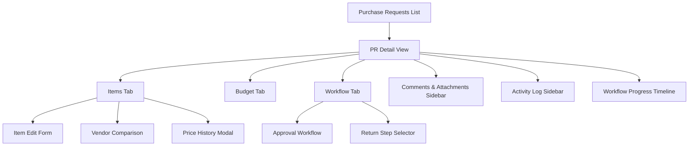
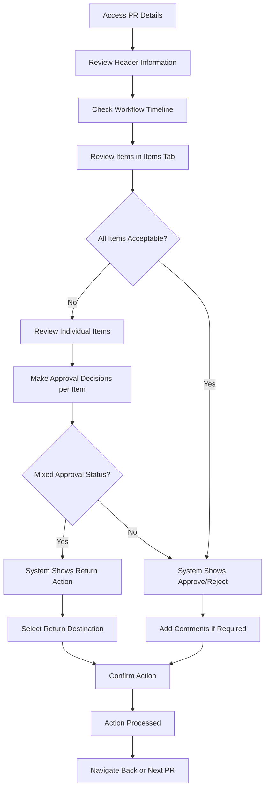
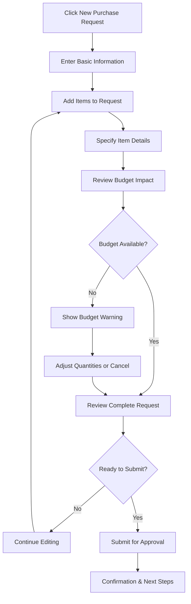

# Purchase Request (PR) Details UI/UX Specification

This document defines the user experience goals, information architecture, user flows, and visual design specifications for the Purchase Request Details interface. It serves as the foundation for visual design and frontend development, ensuring a cohesive and user-centered experience.

## Overall UX Goals & Principles

### Target User Personas

**Requestor/Staff:** Front-line employees who create purchase requests for operational needs. They prioritize ease of use, clear guidance, and quick task completion.

**Department Manager:** Mid-level managers who review and approve departmental purchase requests. They need efficient review capabilities and clear visibility into budget impact.

**Financial Manager:** Senior financial stakeholders who approve high-value purchases and monitor budget compliance. They require comprehensive financial information and audit trail visibility.

**Purchasing Staff:** Procurement specialists who coordinate vendor selection and purchase order creation. They need detailed item information and vendor comparison capabilities.

### Usability Goals

- **Ease of learning:** New users can complete core PR tasks within 10 minutes of training
- **Efficiency of use:** Power users can review and approve PRs with minimal clicks and context switching  
- **Error prevention:** Clear validation, confirmation dialogs, and RBAC controls prevent unauthorized actions
- **Memorability:** Infrequent users can return to the system without relearning core workflows
- **Progressive disclosure:** Complex features are revealed as needed, keeping the interface clean

### Design Principles

1. **Role-based clarity** - Interface adapts to user permissions and responsibilities
2. **Workflow-driven navigation** - User journey follows natural business process flow
3. **Context-aware actions** - Available actions change based on document state and user role
4. **Immediate feedback** - Every action provides clear, immediate visual response
5. **Accessible by default** - WCAG 2.1 AA compliance with semantic markup and keyboard navigation

### Change Log

| Date | Version | Description | Author |
|------|---------|-------------|---------|
| 2025-01-08 | 1.0 | Initial PR Details UI specification | UX Expert |

## Information Architecture (IA)

### Site Map / Screen Inventory

### Navigation Structure

**Primary Navigation:** Tab-based interface (Items, Budget, Workflow) with persistent header controls

**Secondary Navigation:** Contextual actions in floating menu, sidebar toggle, and inline item actions

**Breadcrumb Strategy:** Back button with router navigation, maintaining list context and filters

## User Flows

### Purchase Request Review and Approval Flow

**User Goal:** Department Manager needs to review and approve/reject purchase requests efficiently

**Entry Points:** 
- PR List page (filtered by "Pending My Approval")
- Direct link from email notification
- Dashboard workflow widget

**Success Criteria:** 
- PR is approved/rejected with appropriate comments
- Next workflow stage is triggered automatically  
- Audit trail is preserved

#### Flow Diagram

#### Edge Cases & Error Handling:
- PR modified by another user during review - show conflict resolution dialog
- Network timeout during action submission - retry mechanism with progress indicator
- Insufficient permissions for action - clear error message with contact information
- Budget validation fails during approval - show budget impact and require override
- Required comments missing - highlight comment field with validation message

**Notes:** The workflow decision engine automatically determines available actions based on item approval status, reducing cognitive load on approvers.

### Purchase Request Creation Flow

**User Goal:** Staff member needs to create a new purchase request for operational supplies

**Entry Points:**
- PR List page "New Request" button
- Dashboard quick action
- Direct navigation from menu

**Success Criteria:**
- PR is created with all required information
- Items are properly specified with vendor preferences
- Request is submitted for approval workflow

#### Flow Diagram

#### Edge Cases & Error Handling:
- Item not found in catalog - option to add custom item with approval
- Vendor pricing unavailable - allow manual price entry with flag for review
- Budget exceeded - show alternative options and approval path
- Auto-save failure - local storage backup with recovery option
- Form validation errors - inline highlighting with clear correction guidance

**Notes:** Progressive saving prevents data loss, and smart defaults reduce data entry time.

## Wireframes & Mockups

**Primary Design Files:** Figma workspace - [PR Details Design System](https://figma.com/pr-details-design)

### Key Screen Layouts

#### PR Detail Header Layout

**Purpose:** Provides essential PR information, status, and primary actions in a scannable format

**Key Elements:**
- Back navigation with breadcrumb context
- PR number, title, and status badge
- Quick metadata (date, requestor, department, type)
- Action buttons group (Edit, Print, Export, Share)
- Sidebar toggle control

**Interaction Notes:** Header remains fixed during scroll, with actions adapting based on user role and PR status

**Design File Reference:** [Header Component Frame](https://figma.com/header-component)

#### Workflow Progress Timeline

**Purpose:** Visual representation of approval workflow progress and current stage

**Key Elements:**
- 6-stage workflow visualization with icons
- Color-coded status indicators (completed, current, pending, rejected)
- Current stage highlighting with animated indicator
- Status badge showing overall document state

**Interaction Notes:** Responsive design collapses to compact view on mobile devices

**Design File Reference:** [Timeline Component Frame](https://figma.com/timeline-component)

#### Items Tab Layout

**Purpose:** Detailed item management with inline editing and approval capabilities

**Key Elements:**
- Item list with expandable rows
- Inline editing controls for authorized users
- Bulk selection and actions
- Filtering and sorting controls
- Add item functionality

**Interaction Notes:** Role-based field editing with clear visual indicators for editable vs read-only states

**Design File Reference:** [Items Tab Frame](https://figma.com/items-tab)

#### Floating Action Menu

**Purpose:** Context-aware workflow actions based on user role and item status

**Key Elements:**
- Workflow summary card showing item analysis
- Smart action buttons (Approve, Reject, Return, Submit)
- Action descriptions and requirements
- Fixed positioning for accessibility

**Interaction Notes:** Actions update dynamically based on workflow decision engine analysis

**Design File Reference:** [Floating Actions Frame](https://figma.com/floating-actions)

## Component Library / Design System

**Design System Approach:** Extended Shadcn/ui component library with custom domain-specific components

### Core Components

#### StatusBadge

**Purpose:** Consistent status visualization across all document states

**Variants:** 
- Draft (gray)
- Submitted (blue) 
- InProgress (orange)
- Completed (green)
- Rejected (red)

**States:** Default, hover, focus

**Usage Guidelines:** Use for document status, workflow stages, and item approval states. Maintain color consistency across all status displays.

#### WorkflowProgressTimeline

**Purpose:** Visual workflow stage tracking with status-aware styling

**Variants:**
- Linear (desktop)
- Compact (mobile)
- Embedded (sidebar)

**States:** 
- Step states: completed, current, pending, rejected
- Overall states: normal, error, loading

**Usage Guidelines:** Always include step descriptions for accessibility. Use consistent iconography for workflow stages.

#### EnhancedItemRow

**Purpose:** Rich item display with inline editing and contextual actions

**Variants:**
- View mode (read-only)
- Edit mode (form controls)
- Compact (mobile)

**States:** Default, selected, editing, error, loading

**Usage Guidelines:** Maintain consistent column alignment across all item rows. Use clear visual hierarchy for primary vs secondary information.

#### FloatingActionMenu

**Purpose:** Context-sensitive workflow actions with intelligent state management

**Variants:**
- Requestor actions (Delete, Submit)
- Approver actions (Approve, Reject, Return)
- Administrator actions (full control)

**States:** Default, disabled, loading, success, error

**Usage Guidelines:** Actions must always reflect actual user permissions. Provide clear action descriptions and confirmation dialogs.

## Branding & Style Guide

**Brand Guidelines:** Follows company design system with hospitality industry color psychology

### Color Palette

| Color Type | Hex Code | Usage |
|------------|----------|--------|
| Primary | #2563EB | Primary buttons, links, selected states |
| Secondary | #64748B | Secondary actions, muted text |
| Accent | #059669 | Success states, positive feedback |
| Success | #10B981 | Completed workflows, approved items |
| Warning | #F59E0B | Cautions, pending approvals, budget alerts |
| Error | #EF4444 | Errors, rejections, destructive actions |
| Neutral | #F8FAFC, #E2E8F0, #64748B, #1E293B | Text, borders, backgrounds, surfaces |

### Typography

#### Font Families
- **Primary:** Inter (system font for clarity)
- **Secondary:** ui-sans-serif (fallback)
- **Monospace:** ui-monospace (for codes and numbers)

#### Type Scale

| Element | Size | Weight | Line Height |
|---------|------|--------|-------------|
| H1 | 1.875rem | 700 | 1.25 |
| H2 | 1.5rem | 600 | 1.375 |
| H3 | 1.25rem | 600 | 1.5 |
| Body | 0.875rem | 400 | 1.5 |
| Small | 0.75rem | 400 | 1.25 |

### Iconography

**Icon Library:** Lucide React for consistent style and optimal performance

**Usage Guidelines:** 
- Use 16px icons for inline elements
- Use 20px icons for buttons and headers  
- Use 24px+ icons for major actions
- Maintain 2px stroke width for consistency

### Spacing & Layout

**Grid System:** CSS Grid with responsive breakpoints (mobile: 320px+, tablet: 768px+, desktop: 1024px+)

**Spacing Scale:** Tailwind CSS spacing scale (4px base unit: 0.5, 1, 1.5, 2, 3, 4, 6, 8, 12, 16, 20, 24)

## Accessibility Requirements

### Compliance Target

**Standard:** WCAG 2.1 AA compliance with hospitality industry considerations

### Key Requirements

**Visual:**
- Color contrast ratios: 4.5:1 minimum for normal text, 3:1 for large text
- Focus indicators: 2px solid outline with high contrast colors
- Text sizing: Minimum 14px font size, scalable to 200% without horizontal scrolling

**Interaction:**
- Keyboard navigation: Full functionality accessible via keyboard with logical tab order
- Screen reader support: Semantic HTML, proper ARIA labels, descriptive link text
- Touch targets: Minimum 44px touch target size for mobile interactions

**Content:**
- Alternative text: Descriptive alt text for all informational images and icons
- Heading structure: Logical heading hierarchy (H1 > H2 > H3) without skipping levels
- Form labels: Explicit labels for all form controls with error descriptions

### Testing Strategy

Automated testing with axe-core, manual testing with NVDA/JAWS screen readers, and keyboard-only navigation testing. Regular accessibility audits using browser dev tools and manual color contrast validation.

## Responsiveness Strategy

### Breakpoints

| Breakpoint | Min Width | Max Width | Target Devices |
|------------|-----------|-----------|---------------|
| Mobile | 320px | 767px | Smartphones, small tablets |
| Tablet | 768px | 1023px | iPads, large tablets |
| Desktop | 1024px | 1439px | Laptops, small monitors |
| Wide | 1440px | - | Large monitors, ultrawide displays |

### Adaptation Patterns

**Layout Changes:** 
- Mobile: Single-column layout, collapsible sidebar, stacked form fields
- Tablet: Two-column layout with adaptive sidebar
- Desktop: Full three-column layout with persistent sidebar

**Navigation Changes:**
- Mobile: Hamburger menu, sheet overlay for sidebar
- Tablet: Collapsible sidebar with toggle
- Desktop: Persistent sidebar with show/hide option

**Content Priority:**
- Mobile: Essential information only, progressive disclosure for details
- Tablet: Balanced information density with smart defaults
- Desktop: Full information display with contextual details

**Interaction Changes:**
- Mobile: Touch-friendly controls, swipe gestures, modal overlays
- Tablet: Hybrid touch/mouse support with larger touch targets
- Desktop: Mouse-optimized interactions, hover states, keyboard shortcuts

## Animation & Micro-interactions

### Motion Principles

Motion should be purposeful, performance-conscious, and accessibility-aware. All animations can be disabled via `prefers-reduced-motion` CSS media query. Focus on functional animation that guides user attention and provides feedback.

### Key Animations

- **Workflow Timeline Progress:** Smooth transition between stages with 300ms ease-in-out timing
- **Item Row Expansion:** 200ms height animation with content fade-in for expandable details
- **Floating Action Menu:** Scale and opacity transition (150ms) on state changes
- **Form Validation:** Shake animation (400ms) for error states with color transition
- **Status Badge Updates:** Gentle color transition (250ms) when status changes
- **Sidebar Toggle:** Slide animation (300ms) with opacity fade for content

## Performance Considerations

### Performance Goals

- **Page Load:** Sub-3 seconds on 3G networks
- **Interaction Response:** <100ms for immediate feedback, <200ms for complex operations  
- **Animation FPS:** Consistent 60fps for all motion design

### Design Strategies

Lazy loading for non-critical components, optimistic UI updates for user actions, efficient re-rendering with React.memo, image optimization with Next.js Image component, and progressive enhancement for advanced features.

## Next Steps

### Immediate Actions

1. **Stakeholder Review:** Present specification to product owner and development team for feedback
2. **Design System Update:** Create/update Figma components based on specification requirements
3. **Technical Architecture Planning:** Coordinate with frontend architects for implementation strategy
4. **User Testing Preparation:** Plan usability testing sessions with target personas

### Design Handoff Checklist

- [x] All user flows documented
- [x] Component inventory complete  
- [x] Accessibility requirements defined
- [x] Responsive strategy clear
- [x] Brand guidelines incorporated
- [x] Performance goals established

## Implementation Notes

### Current Architecture Integration

The PR Details component integrates with:

- **RBAC System:** Role-based access control with field-level permissions
- **Workflow Engine:** Intelligent decision-making for available actions
- **Real-time Updates:** WebSocket integration for collaborative editing
- **State Management:** Zustand for UI state, React Query for server state
- **Form Handling:** React Hook Form with Zod validation

### Key Technical Considerations

- **Server Components:** Leverage Next.js 14 App Router for optimal performance
- **Progressive Enhancement:** Ensure functionality without JavaScript
- **Error Boundaries:** Graceful error handling with user-friendly messages
- **Loading States:** Skeleton components and progressive loading patterns
- **Caching Strategy:** Intelligent caching for frequently accessed data

### Quality Assurance

- **Type Safety:** Strict TypeScript configuration with comprehensive interfaces  
- **Testing Coverage:** Unit tests for components, integration tests for workflows
- **Performance Monitoring:** Core Web Vitals tracking and optimization
- **Accessibility Auditing:** Automated and manual accessibility testing
- **Cross-browser Compatibility:** Support for modern browsers with graceful degradation