# Carmen SaaS Platform Notification Service
## Document History

| Version | Date | Author | Changes |
|---------|------|--------|---------|
| 1.0.0 | 2025-11-19 | Documentation Team | Initial version |
## Business Requirements Document (BRD)

### Document Control
- **Version:** 1.0
- **Date:** March 4, 2025
- **Status:** Draft
- **Prepared By:** Business Analysis Team

### Executive Summary

The Carmen SaaS Supply Chain Platform requires a comprehensive, centralized Notification Service to streamline communications across all platform functions and enhance user experience. This service will act as a communication hub for various business processes including customer onboarding, price variance alerts, goods receipt processing, inventory management, supplier performance monitoring, order fulfillment, compliance tracking, and workflow management.

The Notification Service will enable real-time, contextual, and actionable communications through multiple channels while allowing users to personalize their notification preferences. This document outlines the business requirements for designing and implementing this service.

### Business Objectives

1. **Accelerate Business Processes:** Reduce cycle times for key business processes by 30% through timely notifications and automated follow-ups
2. **Improve User Engagement:** Increase platform adoption and utilization by providing clear guidance and actionable information
3. **Enhance Transparency:** Provide real-time visibility into system events and business processes
4. **Reduce Support Costs:** Decrease support inquiries by 25% through proactive communications
5. **Enable Multi-Channel Communication:** Deliver critical information through users' preferred channels
6. **Support Business Growth:** Create a scalable notification infrastructure that supports the platform's expanding customer base
7. **Maintain Security & Compliance:** Ensure notifications respect data privacy and access controls

### Stakeholder Analysis

#### SaaS Provider Stakeholders
- **Support Manager:** Needs visibility into customer onboarding status and implementation issues
- **Support Team:** Requires tools to guide customers through implementation steps
- **Finance Staff:** Needs billing and subscription notifications for customers
- **Platform Manager:** Requires alerts about system performance and security

#### Customer Stakeholders
- **Cluster Admin Manager:** Needs notifications about user management and business unit configurations
- **Business Unit Manager:** Requires operational notifications specific to their business unit
- **Inventory Managers:** Need threshold alerts and price variance notifications
- **Procurement Teams:** Need supplier performance and order status notifications
- **Warehouse Teams:** Need goods receipt and inventory update notifications
- **Finance Teams:** Need billing notifications and price change alerts
- **End Users:** Need role-specific notifications about tasks and approvals

### Business Service Scenarios

#### 1. Account & User Management Notifications
Notifications related to user account management, security, and access controls.

**Key Requirements:**
- Support for email verification during user registration
- Password reset/recovery notifications
- Role and permission change alerts
- Security event notifications (unusual login attempts, etc.)
- Account status change communications

#### 2. Customer Onboarding Notifications
Facilitate the onboarding of new customers with guided implementation steps.

**Key Requirements:**
- Sequential step-by-step notifications through the implementation process
- Milestone completion and verification notifications
- Configuration success/error notifications
- Training and resource availability alerts
- Go-live readiness communications
- Post-implementation feedback requests

#### 3. Price Variance Notifications
Alert stakeholders about significant price changes and manage approval workflows.

**Key Requirements:**
- Configurable threshold-based price change alerts
- Approval request workflows for significant changes
- Context-rich notifications showing price history and impact
- Market trend alert integration
- Customer-facing price update communications

#### 4. Goods Receipt Notifications
Provide visibility into the receiving process and exception handling.

**Key Requirements:**
- Arrival and check-in confirmations
- Quality and quantity inspection notifications
- Variance alerts with resolution options
- Inventory update confirmations
- Invoice matching notifications for accounting

#### 5. Inventory Management Notifications
Proactively notify stakeholders about inventory levels and issues.

**Key Requirements:**
- Low stock and reorder point alerts
- Critical stock warnings with escalation paths
- Overstock notifications with action recommendations
- Expiration and shelf-life warnings
- Inventory reconciliation reminders

#### 6. Supplier Performance Notifications
Monitor and communicate supplier performance metrics.

**Key Requirements:**
- KPI threshold breach notifications
- Regular performance scorecard distributions
- Improvement plan tracking and updates
- Risk assessment alerts
- Contract milestone and renewal reminders

#### 7. Order Fulfillment Notifications
Provide visibility throughout the order lifecycle.

**Key Requirements:**
- Order confirmation and validation notifications
- Stage-by-stage status updates
- Exception handling alerts with resolution options
- Shipping and delivery notifications with tracking
- Post-fulfillment feedback requests

#### 8. Compliance & Regulatory Notifications
Ensure timely communication of compliance requirements and issues.

**Key Requirements:**
- Regulatory update alerts with impact analysis
- Certification expiration reminders with escalation
- Audit scheduling and preparation notifications
- Compliance violation alerts with severity classification
- Remediation tracking and deadline notifications

#### 9. Workflow Notifications
Facilitate structured business processes with task assignments and approvals.

**Key Requirements:**
- Task assignment notifications with clear instructions
- Approval request notifications with contextual information
- Deadline reminder notifications with escalation paths
- Process milestone and completion notifications
- Delegation and reassignment notifications

#### 10. System & Platform Notifications
Communicate system status, maintenance, and changes.

**Key Requirements:**
- Scheduled maintenance notifications
- Service disruption alerts with estimated resolution
- New feature and enhancement announcements
- Performance and SLA violation notifications
- Data backup and integrity confirmations

### Functional Requirements

```mermaid
flowchart TD
    %% Core Services
    EventSource[Event Sources] --> EventHub[Event Hub Service]
    EventHub --> RuleEngine[Notification Rules Engine]
    RuleEngine --> NotificationService[Notification Service]
    
    %% Supporting services connected to Notification Service
    TemplateService[Template Service] --- NotificationService
    PreferenceService[Preference Service] --- NotificationService
    
    %% Notification Generation and Distribution
    NotificationService --> QueueService[Queue & Priority Service]
    QueueService --> ChannelManager[Channel Management Service]
    
    %% Delivery Channels
    ChannelManager --> InApp[In-App Service]
    ChannelManager --> Email[Email Service]
    ChannelManager --> SMS[SMS Service]
    ChannelManager --> Push[Push Notification Service]
    ChannelManager --> Dashboard[Dashboard Service]
    ChannelManager --> Webhook[Webhook Service]
    
    %% Monitoring and Tracking
    InApp & Email & SMS & Push & Dashboard & Webhook --> DeliveryTracker[Delivery Tracking Service]
    DeliveryTracker --> ResponseTracker[Response Tracking Service]
    ResponseTracker --> EscalationService[Escalation Service]
    EscalationService --> QueueService
    
    %% Administration and Analytics
    DeliveryTracker & ResponseTracker --> AnalyticsService[Analytics Service]
    
    %% Databases with direct connections
    NotificationDB[(Notification DB)] --- NotificationService
    TemplateDB[(Template DB)] --- TemplateService
    PreferenceDB[(Preference DB)] --- PreferenceService
    AnalyticsDB[(Analytics DB)] --- AnalyticsService
    
    %% Administrative Interfaces
    AdminAPI[Admin API] --- RuleEngine & TemplateService & AnalyticsService
    UserAPI[User API] --- PreferenceService & InApp
    
    %% Security and Multi-tenancy Layer surrounding all components
    subgraph SecurityLayer[Security & Multi-tenancy Layer]
        Authentication[Authentication Service]
        Authorization[Authorization Service]
        Encryption[Encryption Service]
        AuditLogging[Audit Logging Service]
    end
    
    %% External connections
    BusinessProcesses[Business Process Services] --> EventSource
    SystemEvents[System Event Services] --> EventSource
    IntegrationEvents[Integration Services] --> EventSource
    ScheduledEvents[Scheduler Service] --> EventSource
    
    %% Connection to client applications
    InApp --> WebApplication[Web Application]
    InApp --> MobileApplication[Mobile Application]
    Dashboard --> WebApplication
    Push --> MobileApplication
    Webhook --> ExternalSystems[External Systems]
    
    %% Define styles
    classDef coreService fill:#000,stroke:#fff,stroke-width:2px
    classDef database fill:#000,stroke:#fff,stroke-width:2px
    classDef interface fill:#000,stroke:#fff,stroke-width:2px
    classDef channel fill:#000,stroke:#fff,stroke-width:2px
    %% Apply styles
    class EventHub,RuleEngine,NotificationService,QueueService,ChannelManager coreService
    class NotificationDB,TemplateDB,PreferenceDB,AnalyticsDB database
    class AdminAPI,UserAPI interface
    class InApp,Email,SMS,Push,Dashboard,Webhook channel
```    

#### Core Notification Functions

1. **Event Capture and Processing**
   - Capture events from multiple sources (business processes, system events, integrations)
   - Classify and prioritize events based on business rules
   - Filter redundant events to prevent notification fatigue
   - Support for real-time and batch event processing

2. **Notification Generation**
   - Dynamic content generation based on event context
   - Template-based formatting with variable substitution
   - Multi-language support for global operations
   - Rich media support (images, charts, action buttons)
   - Branding and styling customization by tenant

3. **Distribution and Delivery**
   - Support for multiple delivery channels (in-app, email, SMS, push, dashboard)
   - Channel-specific formatting and content adaptation
   - Delivery scheduling with timezone awareness
   - Smart channel selection based on message priority and user availability
   - Delivery confirmation and failure handling

4. **User Interaction**
   - Mark as read/unread functionality
   - Action buttons for direct response from notifications
   - Snooze and reminder capabilities
   - Notification grouping and threading
   - Search and filter capabilities for notification history

5. **Preference Management**
   - Channel preference settings by notification type
   - Frequency controls (immediate, digest, scheduled)
   - Opt-in/opt-out capabilities for non-critical notifications
   - Temporary suppression (do not disturb) settings
   - Default preference templates by role

6. **Administration and Management**
   - Template management interface
   - Rule configuration for notification triggers
   - Monitoring and analytics dashboard
   - Audit logging of notification activities
   - Bulk operations for notifications management

#### Multi-tenancy Requirements

1. **Tenant Isolation**
   - Complete separation of notification data between tenants
   - Tenant-specific configuration and customization
   - Hierarchical structure supporting clusters and business units
   - Cross-tenant notification capabilities (for SaaS provider)

2. **Customization Framework**
   - Tenant-level notification template customization
   - Business unit template inheritance with override capabilities
   - Custom branding and styling by tenant
   - Tenant-specific business rules and thresholds

### Non-Functional Requirements

#### Performance Requirements
- Near real-time delivery for critical notifications (< 5 seconds)
- Support for high-volume processing (10,000+ notifications per hour)
- Notification history retention and rapid retrieval (last 90 days)
- Low-latency user interface for notification center (< 2 seconds load time)

#### Scalability Requirements
- Horizontal scaling to support growing tenant base
- Support for both shared and dedicated database deployments
- Efficient handling of peak notification periods
- Graceful degradation under extreme load

#### Reliability Requirements
- 99.9% uptime for notification services
- Guaranteed delivery with retry mechanism
- Fault tolerance and redundancy for critical components
- Disaster recovery with minimal data loss

#### Security Requirements
- End-to-end encryption for notification content
- Role-based access controls for notification management
- PII/PHI handling in compliance with regulations
- Secure API access with authentication and authorization
- Audit trails for all notification activities

#### Usability Requirements
- Intuitive notification center interface
- Consistent notification format across channels
- Clear indication of priority and required actions
- Accessibility compliance for all interfaces
- Mobile-responsive design for all interfaces

### Integration Requirements

#### Internal System Integrations
- Carmen SaaS Core Platform
- User Authentication and Authorization System
- Customer Relationship Management
- Enterprise Resource Planning
- Warehouse Management System
- Business Intelligence and Reporting

#### External System Integrations
- Email Service Providers (SMTP/API)
- SMS Gateway Services
- Mobile Push Notification Services
- External API endpoints (webhooks)
- Calendar systems (for appointment notifications)

### Technical Implementation Considerations

#### Recommended Technology Stack
- **Backend Services:** Node.js/TypeScript with Express.js or NestJS
- **Messaging & Event Processing:** Apache Kafka or RabbitMQ
- **Databases:** MongoDB (notifications), PostgreSQL (business data)
- **Caching:** Redis for high-performance data access
- **Frontend Components:** React with Schadcn-UI
- **Real-time Updates:** WebSockets or Server-Sent Events
- **DevOps Infrastructure:** Docker, Kubernetes, ELK Stack

#### Architectural Approach
- Microservice architecture for notification components
- Event-driven design with publish-subscribe model
- API Gateway for external communications
- Service mesh for inter-service communication
- Database-per-service for optimal performance

### Development Roadmap

#### Phase 1: Foundation (Months 1-3)
- Establish core notification infrastructure
- Implement in-app notification center
- Develop email notification capabilities
- Create basic user preference management
- Support for account, system, and onboarding notifications

#### Phase 2: Business Process Notifications (Months 4-6)
- Implement price variance notification workflow
- Develop goods receipt notification flow
- Create inventory threshold notification system
- Build workflow notification engine
- Expand channel options (SMS, push)

#### Phase 3: Advanced Features (Months 7-9)
- Implement supplier performance notifications
- Develop order fulfillment notification flow
- Create compliance and regulatory notification system
- Build advanced analytics dashboard
- Enhance template management system

#### Phase 4: Optimization and Enhancement (Months 10-12)
- Implement AI-based notification prioritization
- Develop predictive notification capabilities
- Create cross-process notification intelligence
- Build notification effectiveness analytics
- Enhance multi-channel coordination

### Success Metrics

1. **Adoption Metrics**
   - Percentage of users configuring notification preferences
   - Notification open and read rates
   - Action completion rates from notifications
   - Channel preference distribution

2. **Operational Metrics**
   - Average time to process and deliver notifications
   - Notification volume by type and channel
   - Escalation frequency and resolution times
   - System resource utilization

3. **Business Impact Metrics**
   - Reduction in process cycle times
   - Decrease in support ticket volume
   - Improvement in user satisfaction scores
   - Reduction in missed deadlines and SLAs

### Conclusion

The Notification Service will serve as the central communication hub for the Carmen SaaS Supply Chain Platform, enhancing user experience, improving operational efficiency, and providing critical business process support. By implementing this service according to the requirements outlined in this document, Carmen will create a significant competitive advantage through superior communication capabilities and process automation.

### Appendices

#### Appendix A: Notification Type Catalog
Detailed list of all notification types by category with priority levels, required content, and default channels.

#### Appendix B: User Persona Notification Journey Maps
Visual representations of how different user personas will experience notifications throughout their interactions with the platform.

#### Appendix C: Notification Template Standards
Guidelines for creating effective notification templates with examples for different channels and use cases.

#### Appendix D: Regulatory Considerations
Summary of relevant regulations affecting notification content, delivery, and storage across different regions.