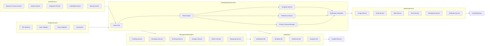

```mermaid
graph LR
    subgraph EventSources
        ES_BusinessEvents[Business Process Events]
        ES_SystemEvents[System Events]
        ES_IntegrationEvents[Integration Events]
        ES_ScheduledEvents[Scheduled Events]
        ES_ManualEvents[Manual Events]
    end

    subgraph CoreNotificationServices
        CNS_EventHub[Event Hub]
        CNS_RulesEngine[Rules Engine]
        CNS_TemplateService[Template Service]
        CNS_PreferenceService[Preference Service]
        CNS_PriorityQueue[Priority & Queue Manager]
        CNS_NotificationGenerator[Notification Generator]
    end

    subgraph DeliveryServices
        DS_InApp[In-App Service]
        DS_Email[Email Service]
        DS_SMS[SMS Service]
        DS_Push[Push Service]
        DS_Dashboard[Dashboard Service]
        DS_Webhook[Webhook Service]
    end

    subgraph Management&Analytics
        MA_Tracking[Tracking Service]
        MA_Escalation[Escalation Service]
        MA_Archiving[Archiving Service]
        MA_Analytics[Analytics Service]
        MA_AdminConsole[Admin Console]
        MA_Reporting[Reporting Service]
    end

    subgraph DataStores
        Store_NotificationDB[Notification DB]
        Store_TemplateDB[Template DB]
        Store_PreferenceDB[Preference DB]
        Store_AnalyticsDB[Analytics DB]
    end

    subgraph IntegrationLayer
        IL_APIGateway[API Gateway]
        IL_SyncAdapters[Sync Adapters]
        IL_AsyncAdapters[Async Adapters]
        IL_Connectors[Connectors]
    end

    EventSources --> CNS_EventHub
    CNS_EventHub --> CNS_RulesEngine
    CNS_RulesEngine --> CNS_TemplateService
    CNS_RulesEngine --> CNS_PreferenceService
    CNS_RulesEngine --> CNS_PriorityQueue
    CNS_TemplateService --> CNS_NotificationGenerator
    CNS_PreferenceService --> CNS_NotificationGenerator
    CNS_PriorityQueue --> CNS_NotificationGenerator
    CNS_NotificationGenerator --> DeliveryServices

    CoreNotificationServices --> Management&Analytics
    CoreNotificationServices --> DataStores
    IntegrationLayer --> CoreNotificationServices
    DeliveryServices --> TrackingService
    Management&Analytics --> DataStores
    DataStores --> AnalyticsService

```