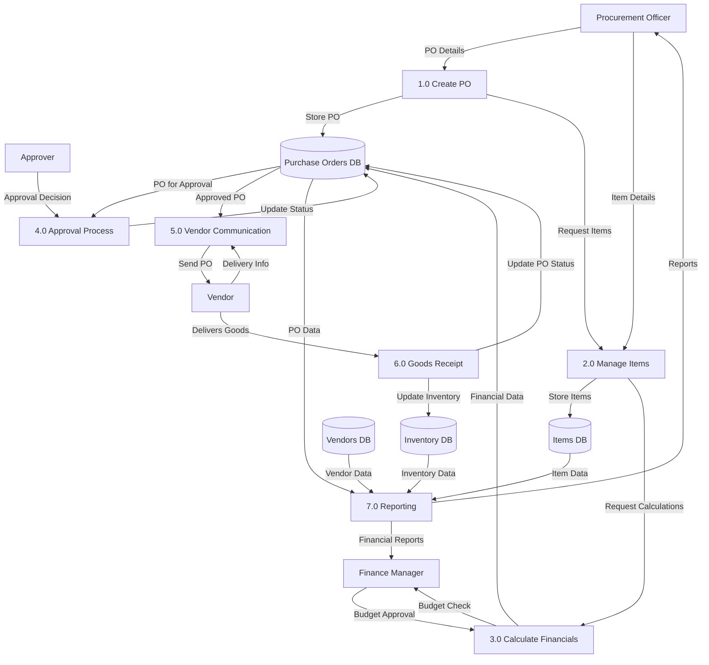
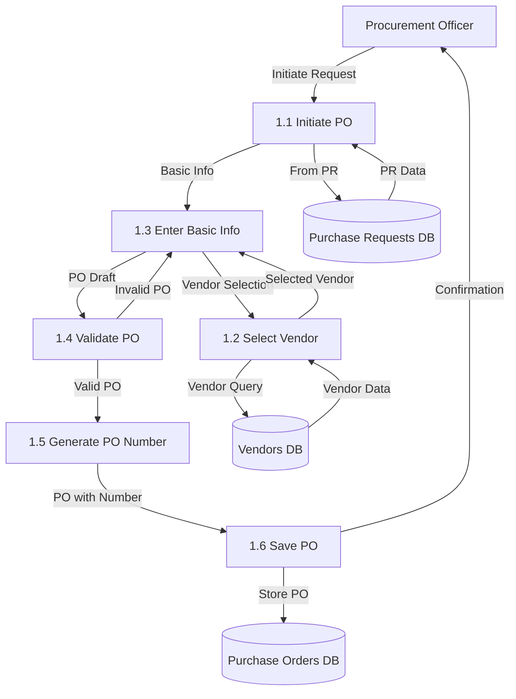
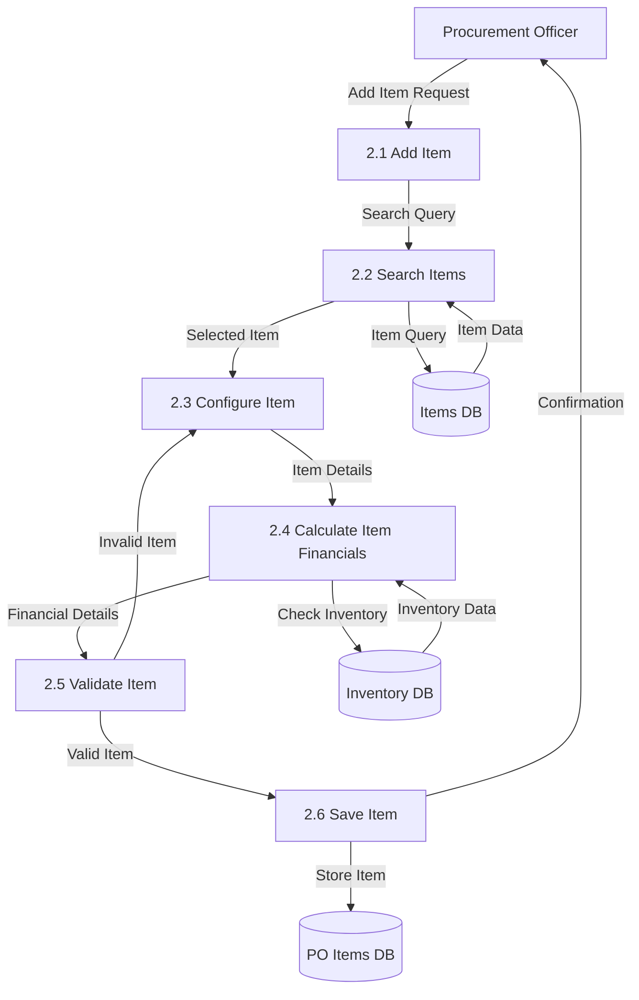
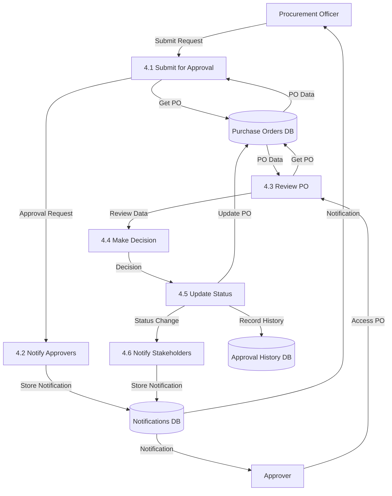
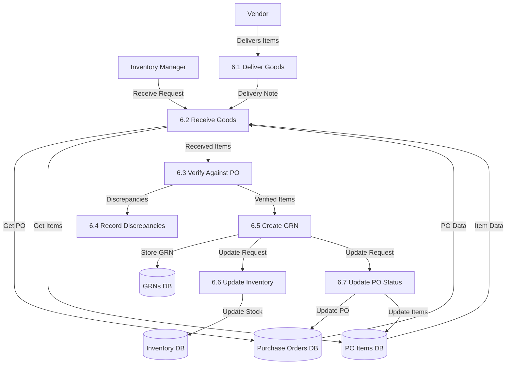

# Purchase Order Module - Data Flow Diagram

This document illustrates the data flows within the Purchase Order module in the Carmen F&B Management System.

## Level 0 Data Flow Diagram

## Level 1 Data Flow Diagram

## Level 2 Data Flow Diagram: PO Creation Process

## Level 2 Data Flow Diagram: Item Management Process

## Level 2 Data Flow Diagram: Approval Process

## Level 2 Data Flow Diagram: Goods Receipt Process

These data flow diagrams illustrate how data moves through the Purchase Order module, from creation to goods receipt, including the approval process and item management. 