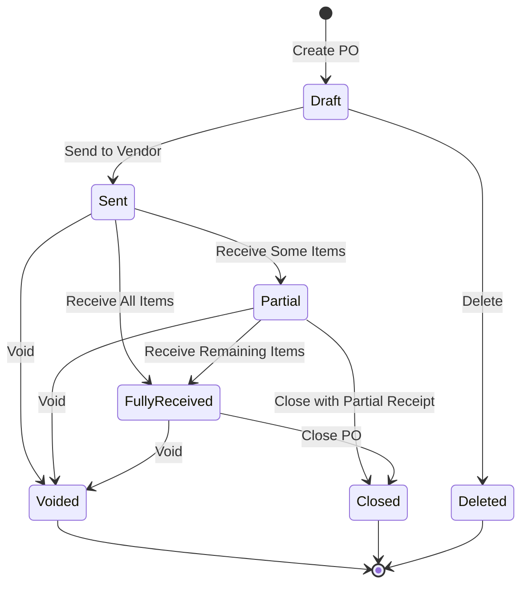
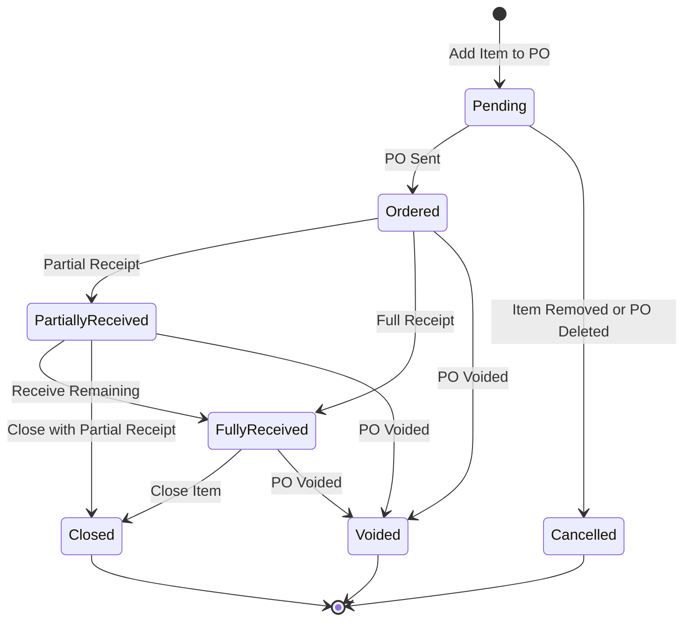
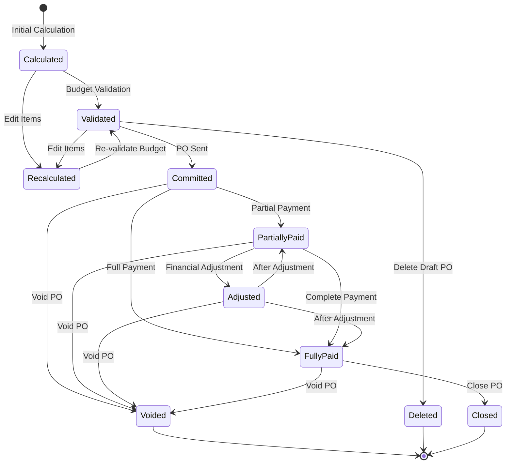
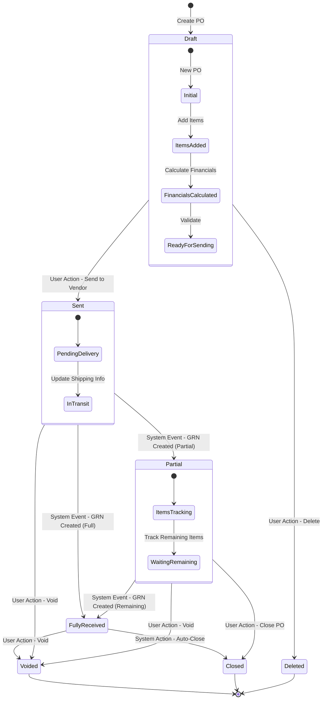

# Purchase Order Module - State Diagram

This document illustrates the state transitions for Purchase Orders in the Carmen F&B Management System.

## Purchase Order State Diagram

> **Important Business Rule**: Purchase Orders in draft mode can be deleted. Once a Purchase Order has been sent to a vendor (active state), it can only be voided or closed, not deleted. This ensures data integrity and maintains a proper audit trail.

## Purchase Order Item State Diagram

## Purchase Order Financial State Diagram

## Integrated State Diagram with Triggers

These state diagrams illustrate the various states a Purchase Order can transition through during its lifecycle, from creation to closure, including goods receipt and financial states. The diagrams highlight the important business rule that draft POs can be deleted, while active POs (Sent, Partially Received, Fully Received) can only be voided or closed. 