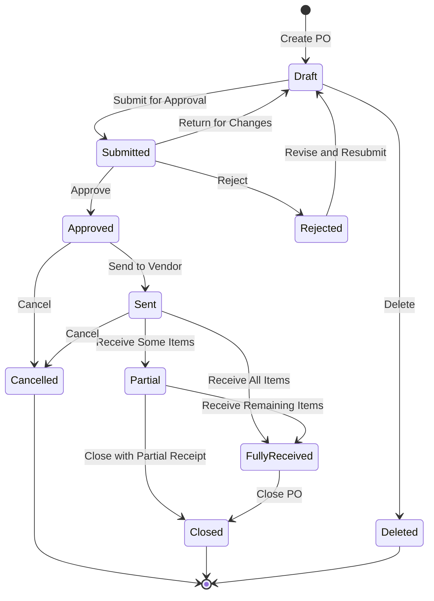
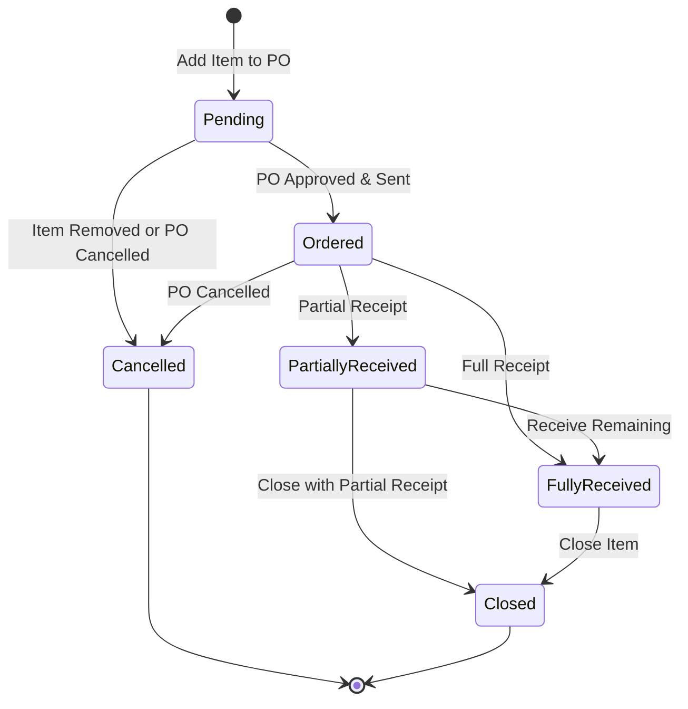
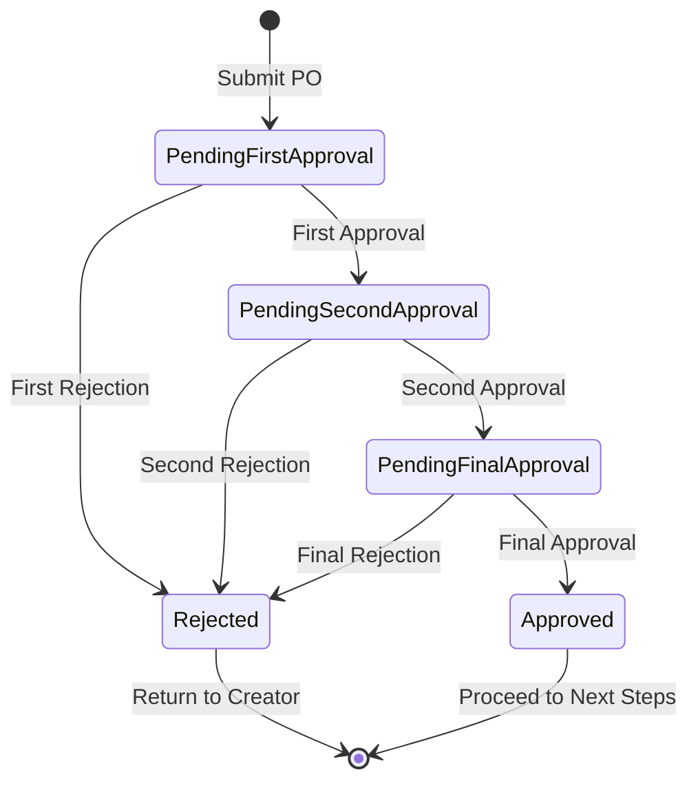
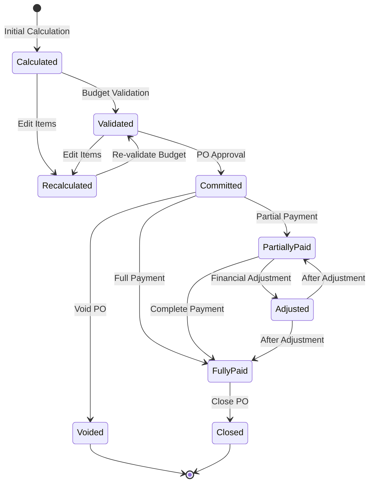
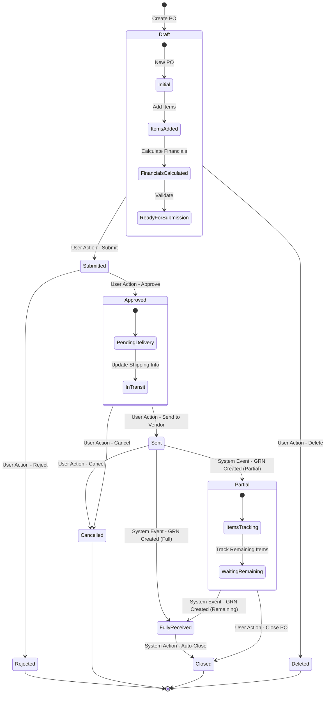

# Purchase Order Module - State Diagram

This document illustrates the state transitions for Purchase Orders in the Carmen F&B Management System.

## Purchase Order State Diagram

## Purchase Order Item State Diagram

## Purchase Order Approval State Diagram

## Purchase Order Financial State Diagram

## Integrated State Diagram with Triggers

These state diagrams illustrate the various states a Purchase Order can transition through during its lifecycle, from creation to closure, including approval processes, goods receipt, and financial states. 