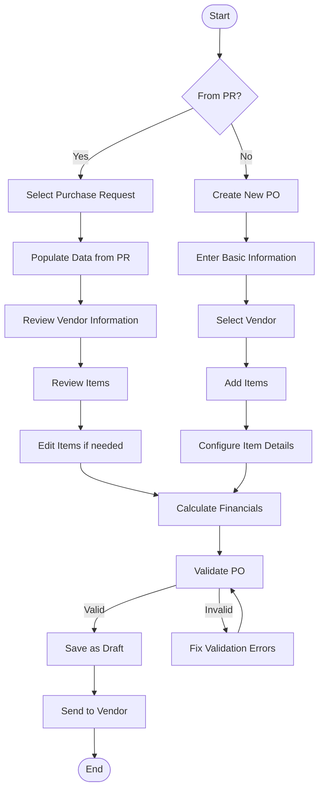
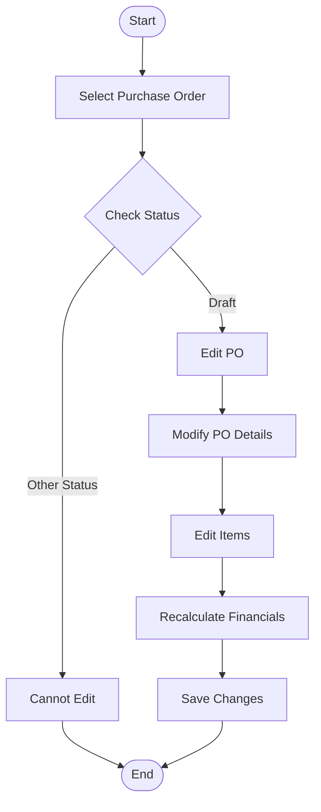
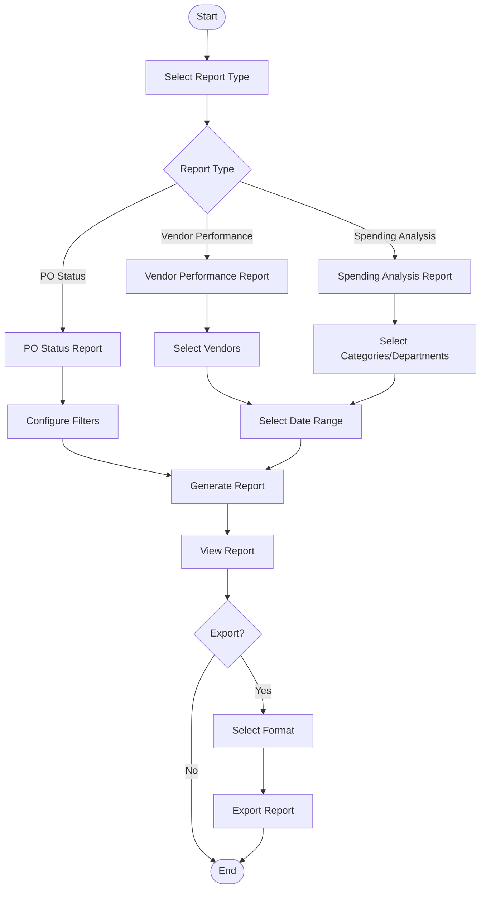
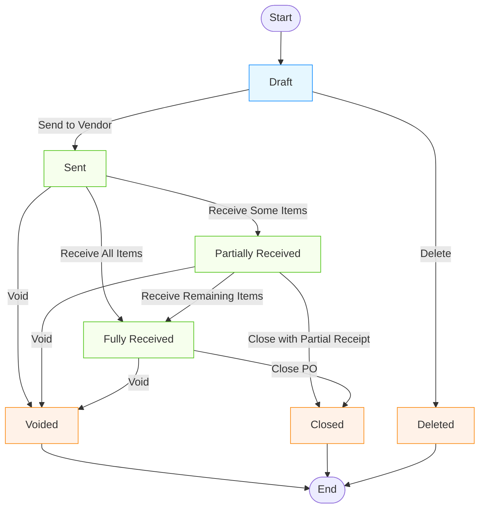
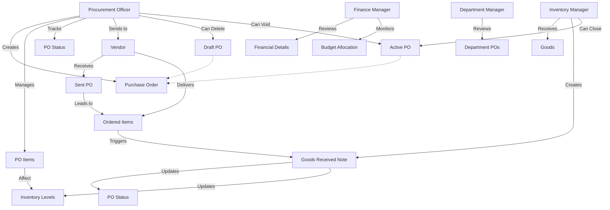
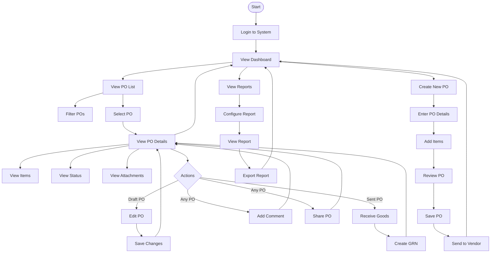

# Purchase Order Module - User Flow Diagram

This document outlines the key user flows for the Purchase Order module in the Carmen F&B Management System.

## 1. Purchase Order Creation and Management Flow

## 2. Goods Receipt Flow

## 3. Purchase Order Modification Flow

## 4. Purchase Order Reporting Flow

## 5. Purchase Order Status Transition Flow

> **Important Business Rule**: Purchase Orders can only be deleted while in draft status. Once a Purchase Order has been sent to a vendor (active state), it can only be voided or closed, not deleted. This ensures data integrity and maintains a proper audit trail.

## 6. User Role Interactions

## 7. Mobile User Flow

These diagrams illustrate the key user flows and interactions within the Purchase Order module, from creation to closure, including goods receipt, reporting, and mobile interactions. 