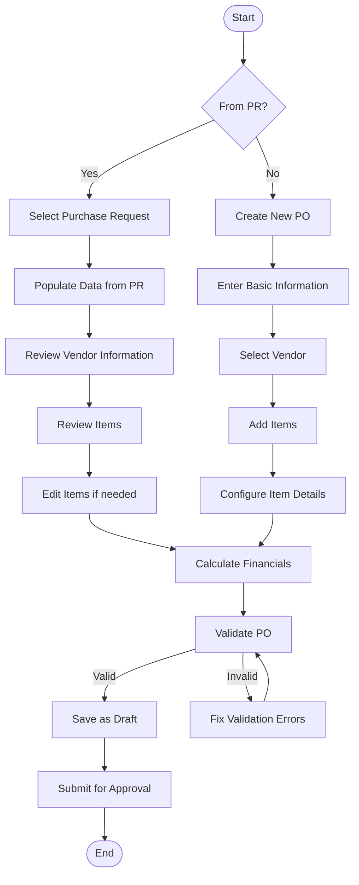
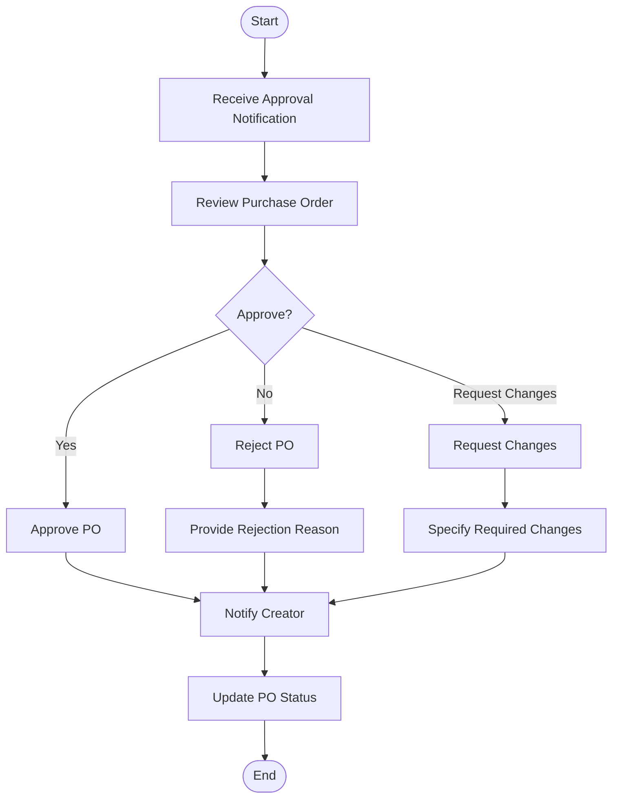
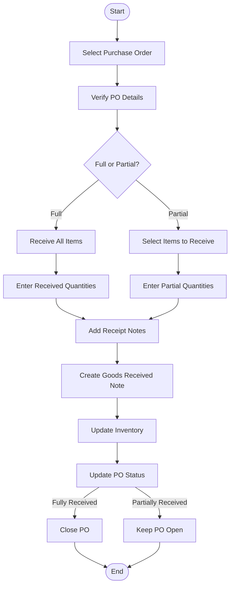
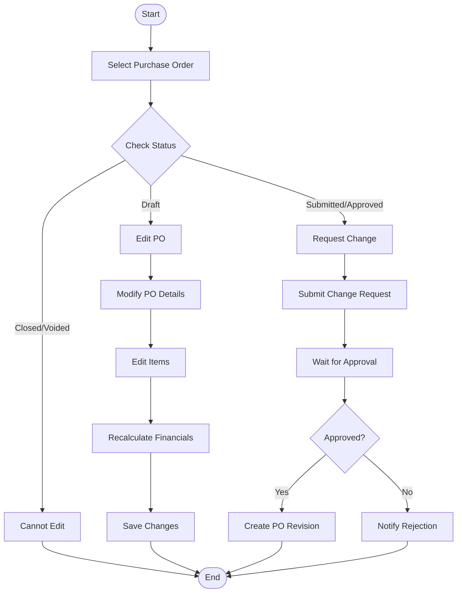
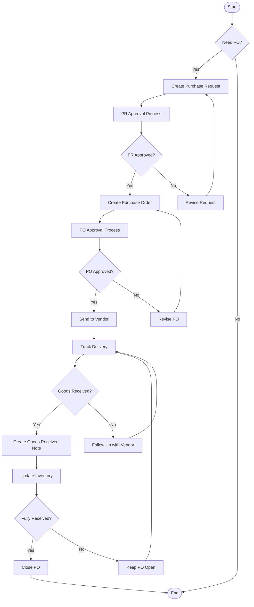
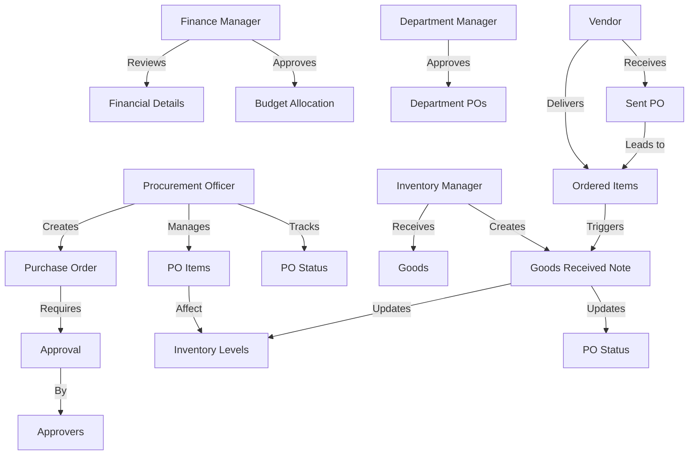

# Purchase Order Module - User Flow Diagram

This document outlines the key user flows for the Purchase Order module in the Carmen F&B Management System.

## 1. Purchase Order Creation and Management Flow

## 2. Purchase Order Approval Flow

## 3. Goods Receipt Flow

## 4. Purchase Order Modification Flow

## 5. Purchase Order Reporting Flow

## 6. Integrated User Flow

## 7. User Role Interactions

These diagrams illustrate the key user flows and interactions within the Purchase Order module, from creation to closure, including approval processes, goods receipt, and reporting. 