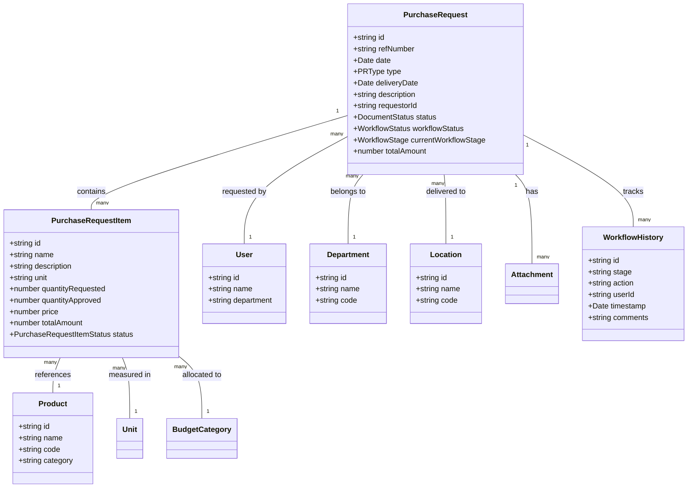
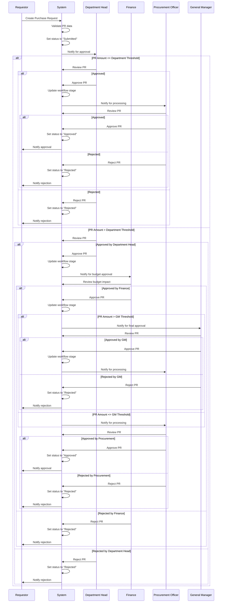
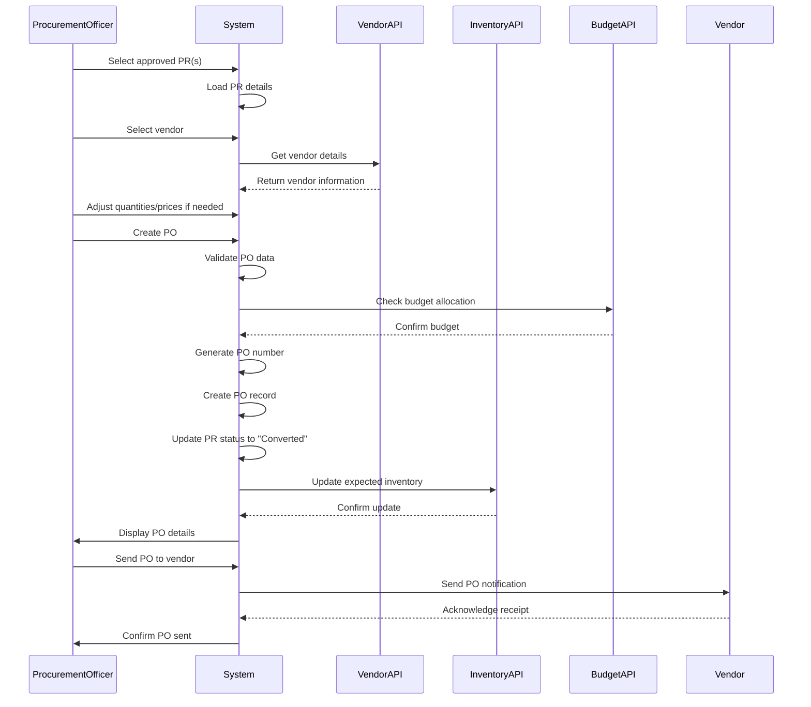

# Purchase Request Module - Technical Specification

> **Note**: This is a consolidated document that combines content from:
> - module-prd.md
> - purchase-request-prd.md
> - module-requirements.md
> - module-implementation.md
> - module-elements.md
> - Schema.md
> - data-models.md

## Table of Contents
1. [Introduction](#introduction)
2. [Module Requirements](#module-requirements)
3. [Data Models](#data-models)
4. [Core Interfaces](#core-interfaces)
5. [Database Schema](#database-schema)
6. [Implementation Details](#implementation-details)
7. [Module Elements](#module-elements)
8. [Validation Rules](#validation-rules)
9. [Technical Dependencies](#technical-dependencies)
10. [Performance Considerations](#performance-considerations)
11. [Security Considerations](#security-considerations)
12. [Related Documentation](#related-documentation)

## Introduction
This document provides comprehensive technical specifications for the Purchase Request (PR) module within the Carmen F&B Management System. It covers data models, interfaces, implementation details, and technical requirements necessary for development and maintenance.

The Purchase Request (PR) Module is a comprehensive system designed to streamline and manage the entire purchase request process, from creation to approval and tracking. It provides a centralized platform for managing procurement requests, budget allocations, and workflow approvals.

### Business Objectives
- Reduce procurement cycle time by 50%
- Improve budget tracking accuracy to 99.9%
- Eliminate paper-based processes
- Enhance compliance with procurement policies
- Reduce procurement errors by 75%

### Success Metrics
- Average processing time per request
- Budget utilization accuracy
- User adoption rate
- Error reduction rate
- Compliance rate

## Module Requirements
### Functional Requirements

#### PR Creation [PR_CRT]
| ID | Requirement | Priority |
|----|-------------|----------|
| PR_CRT_001 | Unique PR reference number generation | High |
| PR_CRT_002 | Multi-step PR creation form | High |
| PR_CRT_003 | Template-based PR creation | Medium |
| PR_CRT_004 | Copy from existing PR | Low |
| PR_CRT_005 | Bulk item upload | Medium |

#### Item Management [PR_ITM]
| ID | Requirement | Priority |
|----|-------------|----------|
| PR_ITM_001 | Add/edit/remove items | High |
| PR_ITM_002 | Item lookup and search | High |
| PR_ITM_003 | Unit conversion support | Medium |
| PR_ITM_004 | Price estimation | Medium |
| PR_ITM_005 | Budget category mapping | High |

#### Workflow Management [PR_WFL]
| ID | Requirement | Priority |
|----|-------------|----------|
| PR_WFL_001 | Multi-level approval workflow | High |
| PR_WFL_002 | Dynamic routing based on thresholds | High |
| PR_WFL_003 | Department-based routing | High |
| PR_WFL_004 | Status change tracking | High |
| PR_WFL_005 | Delegation of authority | Medium |

#### Budget Management [PR_BDG]
| ID | Requirement | Priority |
|----|-------------|----------|
| PR_BDG_001 | Budget availability check | High |
| PR_BDG_002 | Budget allocation tracking | High |
| PR_BDG_003 | Budget override with approval | Medium |
| PR_BDG_004 | Multi-currency support | Medium |
| PR_BDG_005 | Budget history tracking | Medium |

#### Template Management [PR_TPL]
| ID | Requirement | Priority |
|----|-------------|----------|
| PR_TPL_001 | Create/edit/delete templates | Medium |
| PR_TPL_002 | Template sharing | Low |
| PR_TPL_003 | Template versioning | Low |
| PR_TPL_004 | Template categories | Low |
| PR_TPL_005 | Default templates | Medium |

#### Reporting [PR_RPT]
| ID | Requirement | Priority |
|----|-------------|----------|
| PR_RPT_001 | PR status reporting | Medium |
| PR_RPT_002 | Budget utilization reporting | Medium |
| PR_RPT_003 | Approval time reporting | Low |
| PR_RPT_004 | Export to Excel/PDF | Medium |
| PR_RPT_005 | Custom report builder | Low |

### Non-Functional Requirements
#### Performance
- Page load time < 2 seconds
- Form submission < 1 second
- Search results < 500ms
- Support for 1000+ concurrent users
- Handle 10,000+ PRs per month

#### Security
- Role-based access control
- Data encryption for sensitive information
- Audit logging for all changes
- Compliance with data protection regulations
- Secure API endpoints

#### Usability
- Responsive design for all devices
- Accessibility compliance (WCAG 2.1 AA)
- Intuitive navigation
- Consistent UI patterns
- Helpful error messages

#### Reliability
- 99.9% uptime
- Data backup and recovery
- Graceful error handling
- Automatic session recovery
- Offline mode support

#### Scalability
- Horizontal scaling support
- Database partitioning
- Caching strategy
- Asynchronous processing
- Load balancing

## Data Models
### Core Interfaces

#### PurchaseRequest Interface
```typescript
interface PurchaseRequest {
  id: string;
  refNumber: string;
  date: Date;
  type: PRType;
  deliveryDate: Date;
  description: string;
  requestorId: string;
  requestor: {
    name: string;
    id: string;
    department: string;
  };
  status: DocumentStatus;
  workflowStatus: WorkflowStatus;
  currentWorkflowStage: WorkflowStage;
  location: string;
  department: string;
  jobCode: string;
  estimatedTotal: number;
  vendor: string;
  vendorId: number;
  currency: string;
  baseCurrencyCode: string;
  baseSubTotalPrice: number;
  subTotalPrice: number;
  baseNetAmount: number;
  netAmount: number;
  baseDiscAmount: number;
  discountAmount: number;
  baseTaxAmount: number;
  taxAmount: number;
  baseTotalAmount: number;
  totalAmount: number;
  items: PurchaseRequestItem[];
}
```

#### PurchaseRequestItem Interface
```typescript
interface PurchaseRequestItem {
  id?: string;
  location: string;
  name: string;
  description: string;
  unit: string;
  quantityRequested: number;
  quantityApproved: number;
  inventoryInfo: {
    onHand: number;
    onOrdered: number;
    reorderLevel: number;
    restockLevel: number;
    averageMonthlyUsage: number;
    lastPrice: number;
    lastOrderDate: Date;
    lastVendor: string;
    inventoryUnit: string;
  };
  currency: string;
  baseCurrency?: string;
  price: number;
  totalAmount: number;
  status?: PurchaseRequestItemStatus;
  taxRate: number;
  taxAmount: number;
  discountRate: number;
  discountAmount: number;
  netAmount: number;
  deliveryDate: Date;
  deliveryPoint: string;
  jobCode: string;
  createdDate: Date;
  updatedDate: Date;
  createdBy: string;
  updatedBy: string;
  itemCategory: string;
  itemSubcategory: string;
  vendor: string;
  pricelistNumber: string;
  comment: string;
  adjustments: {
    discount: boolean;
    tax: boolean;
  };
  taxIncluded: boolean;
  currencyRate: number;
  foc: number;
  accountCode: string;
  baseSubTotalPrice: number;
  subTotalPrice: number;
  baseNetAmount: number;
  baseDiscAmount: number;
  baseTaxAmount: number;
  baseTotalAmount: number;
}
```

### Data Model Relationships

The following diagram illustrates the relationships between the core data models in the Purchase Request module:



This diagram shows the key entities and their relationships within the PR module. The PurchaseRequest is the central entity, containing multiple PurchaseRequestItem entities. Each PR is associated with a User (requestor), Department, and Location. The workflow history tracks all approval actions on the PR.

### Enums and Types
```typescript
enum PRType {
  GeneralPurchase = "GeneralPurchase",
  MarketList = "MarketList",
  AssetPurchase = "AssetPurchase",
  ServiceRequest = "ServiceRequest"
}

enum DocumentStatus {
  Draft = "Draft",
  Submitted = "Submitted",
  InProgress = "InProgress",
  Completed = "Completed",
  Rejected = "Rejected"
}

enum WorkflowStatus {
  pending = "Pending",
  approved = "Approved",
  rejected = "Rejected"
}

enum WorkflowStage {
  requester = "Requester",
  departmentHeadApproval = "DepartmentHeadApproval",
  purchaseCoordinatorReview = "PurchaseCoordinatorReview",
  financeManagerApproval = "FinanceManagerApproval",
  generalManagerApproval = "GeneralManagerApproval",
  completed = "Completed"
}

type PurchaseRequestItemStatus =
  "Pending" |
  "Accepted" |
  "Rejected" |
  "Review";
```

## Database Schema
### PurchaseRequest Table

| Column Name | Data Type | Constraints | Description |
|-------------|-----------|-------------|-------------|
| id | UUID | PRIMARY KEY | Unique identifier for the PR |
| ref_number | VARCHAR(20) | UNIQUE, NOT NULL | Reference number in format PR-YYYYMM-NNNN |
| date | DATE | NOT NULL | Date the PR was created |
| type | ENUM | NOT NULL | Type of PR (GeneralPurchase, MarketList, AssetPurchase, ServiceRequest) |
| delivery_date | DATE | NOT NULL | Requested delivery date |
| description | TEXT | NOT NULL | Description of the purchase request |
| requestor_id | UUID | FOREIGN KEY, NOT NULL | Reference to the User table |
| status | ENUM | NOT NULL, DEFAULT 'Draft' | Status of the PR (Draft, Submitted, InProgress, Completed, Rejected) |
| workflow_status | ENUM | NOT NULL, DEFAULT 'Pending' | Workflow status (Pending, Approved, Rejected) |
| current_workflow_stage | ENUM | NOT NULL, DEFAULT 'Requester' | Current stage in the workflow |
| location_id | UUID | FOREIGN KEY, NOT NULL | Reference to the Location table |
| department_id | UUID | FOREIGN KEY, NOT NULL | Reference to the Department table |
| job_code | VARCHAR(50) | | Optional job code for cost allocation |
| estimated_total | DECIMAL(15,2) | NOT NULL, DEFAULT 0 | Estimated total amount |
| vendor_id | UUID | FOREIGN KEY | Reference to the Vendor table (if pre-selected) |
| currency | VARCHAR(3) | NOT NULL | Currency code (e.g., THB, USD) |
| base_currency_code | VARCHAR(3) | NOT NULL | Base currency code for the organization |
| exchange_rate | DECIMAL(15,6) | NOT NULL, DEFAULT 1 | Exchange rate between currency and base currency |
| sub_total_price | DECIMAL(15,2) | NOT NULL, DEFAULT 0 | Subtotal price before tax and discounts |
| base_sub_total_price | DECIMAL(15,2) | NOT NULL, DEFAULT 0 | Subtotal price in base currency |
| net_amount | DECIMAL(15,2) | NOT NULL, DEFAULT 0 | Net amount after discounts but before tax |
| base_net_amount | DECIMAL(15,2) | NOT NULL, DEFAULT 0 | Net amount in base currency |
| discount_amount | DECIMAL(15,2) | NOT NULL, DEFAULT 0 | Total discount amount |
| base_disc_amount | DECIMAL(15,2) | NOT NULL, DEFAULT 0 | Discount amount in base currency |
| tax_amount | DECIMAL(15,2) | NOT NULL, DEFAULT 0 | Total tax amount |
| base_tax_amount | DECIMAL(15,2) | NOT NULL, DEFAULT 0 | Tax amount in base currency |
| total_amount | DECIMAL(15,2) | NOT NULL, DEFAULT 0 | Total amount including tax |
| base_total_amount | DECIMAL(15,2) | NOT NULL, DEFAULT 0 | Total amount in base currency |
| created_at | TIMESTAMP | NOT NULL, DEFAULT NOW() | Timestamp of PR creation |
| updated_at | TIMESTAMP | NOT NULL, DEFAULT NOW() | Timestamp of last update |
| created_by | UUID | FOREIGN KEY, NOT NULL | User who created the PR |
| updated_by | UUID | FOREIGN KEY, NOT NULL | User who last updated the PR |

### PRItem Table

| Column Name | Data Type | Constraints | Description |
|-------------|-----------|-------------|-------------|
| id | UUID | PRIMARY KEY | Unique identifier for the PR item |
| pr_id | UUID | FOREIGN KEY, NOT NULL | Reference to the PurchaseRequest table |
| product_id | UUID | FOREIGN KEY, NOT NULL | Reference to the Product table |
| location | VARCHAR(100) | NOT NULL | Location where the item is stored or needed |
| quantity_requested | DECIMAL(10,2) | NOT NULL | Quantity of the item requested |
| quantity_approved | DECIMAL(10,2) | | Quantity of the item approved (if different from requested) |
| unit | VARCHAR(20) | NOT NULL | Unit of measurement (e.g., Kgs, pcs) |
| currency | VARCHAR(3) | NOT NULL | Currency code (e.g., THB, USD) |
| price_current | DECIMAL(10,2) | NOT NULL | Current price per unit |
| price_last | DECIMAL(10,2) | | Last known price per unit |
| total_amount | DECIMAL(10,2) | NOT NULL | Total amount for this item (quantity * price) |
| status | ENUM('Pending', 'Approved', 'Rejected') | NOT NULL | Status of the item within the PR |
| comment | TEXT | | Additional notes or comments for this item |
| created_at | TIMESTAMP | NOT NULL, DEFAULT NOW() | Timestamp of item creation |
| updated_at | TIMESTAMP | NOT NULL, DEFAULT NOW() | Timestamp of last update |

### Indexes
- pr_id
- product_id
- status

### Constraints
- quantity_requested must be greater than 0
- price_current must be greater than or equal to 0
- total_amount must be equal to quantity_requested * price_current

## Implementation Details
### Technology Stack
- Frontend: React, Next.js, TypeScript
- State Management: React Context API, React Query
- UI Components: Shadcn UI, Tailwind CSS
- API: RESTful API with Express.js
- Database: PostgreSQL with Prisma ORM
- Authentication: NextAuth.js

### Directory Structure
```
app/(main)/procurement/purchase-requests/
├── page.tsx                    # Main PR list page
├── [id]/                       # PR detail page directory
│   └── page.tsx                # PR detail page
├── new/                        # New PR page directory
│   └── page.tsx                # New PR creation page
└── components/                 # Shared components
    ├── purchase-request-list.tsx  # List component
    ├── PRDetailPage.tsx        # Detail page component
    ├── PRForm.tsx              # Main PR form
    ├── PRHeader.tsx            # Header component
    ├── item-details-edit-form.tsx # Item editing form
    ├── SummaryTotal.tsx        # Financial summary component
    ├── advanced-filter.tsx     # Advanced filtering component
    ├── tabs/                   # Tab components
    │   ├── ItemsTab.tsx        # Items management tab
    │   ├── WorkflowTab.tsx     # Workflow status tab
    │   ├── BudgetsTab.tsx      # Budget management tab
    │   ├── AttachmentsTab.tsx  # Attachments tab
    │   └── ActivityTab.tsx     # Activity log tab
    └── utils.tsx               # Utility functions
```

### Component Architecture
The PR module follows a component-based architecture with the following key patterns:

1. **Page Components**: Top-level components that handle routing and data fetching
2. **Container Components**: Manage state and business logic
3. **Presentation Components**: Render UI based on props
4. **Utility Components**: Reusable components for common UI patterns

#### Example: Page Component Structure

```tsx
// app/(main)/procurement/purchase-requests/page.tsx
import { Suspense } from "react"
import { PurchaseRequestList } from "./components/purchase-request-list"
import { PurchaseRequestListSkeleton } from "./components/purchase-request-list-skeleton"
import { ListPageHeader } from "./components/list-page-header"

export default function PurchaseRequestsPage() {
  return (
    <div className="container mx-auto py-6 space-y-6">
      <ListPageHeader />
      <Suspense fallback={<PurchaseRequestListSkeleton />}>
        <PurchaseRequestList />
      </Suspense>
    </div>
  )
}
```

#### Example: Container Component

```tsx
// components/purchase-request-list.tsx
"use client"

import { useState } from "react"
import { useQuery } from "@tanstack/react-query"
import { DataTable } from "@/components/ui/data-table"
import { purchaseRequestColumns } from "./columns"
import { fetchPurchaseRequests } from "@/lib/api/purchase-requests"
import { Pagination } from "@/components/ui/pagination"
import { useSearchParams } from "next/navigation"

export function PurchaseRequestList() {
  const searchParams = useSearchParams()
  const page = Number(searchParams.get("page") || "1")
  const pageSize = Number(searchParams.get("pageSize") || "10")
  const status = searchParams.get("status") || undefined
  
  const { data, isLoading, error } = useQuery({
    queryKey: ["purchase-requests", page, pageSize, status],
    queryFn: () => fetchPurchaseRequests({ page, pageSize, status })
  })
  
  if (isLoading) return <PurchaseRequestListSkeleton />
  if (error) return <div>Error loading purchase requests</div>
  
  return (
    <div className="space-y-4">
      <DataTable 
        columns={purchaseRequestColumns} 
        data={data.items} 
      />
      <Pagination 
        totalItems={data.totalItems}
        pageSize={pageSize}
        currentPage={page}
      />
    </div>
  )
}
```

#### Example: Presentation Component

```tsx
// components/status-badge.tsx
import { Badge } from "@/components/ui/badge"
import { cn } from "@/lib/utils"
import { DocumentStatus } from "@/types"

interface StatusBadgeProps {
  status: DocumentStatus
}

export function StatusBadge({ status }: StatusBadgeProps) {
  const getStatusColor = (status: DocumentStatus) => {
    switch (status) {
      case "Draft":
        return "bg-gray-200 text-gray-800"
      case "Submitted":
        return "bg-blue-100 text-blue-800"
      case "InProgress":
        return "bg-amber-100 text-amber-800"
      case "Completed":
        return "bg-green-100 text-green-800"
      case "Rejected":
        return "bg-red-100 text-red-800"
      default:
        return "bg-gray-200 text-gray-800"
    }
  }
  
  return (
    <Badge className={cn(getStatusColor(status))}>
      {status}
    </Badge>
  )
}
```

### State Management
The PR module uses a combination of state management approaches:

1. **React Context**: For global state (user, permissions, settings)
2. **React Query**: For server state (data fetching, caching, synchronization)
3. **React Hook Form**: For form state management
4. **Local Component State**: For UI state (modals, tabs, etc.)

### API Integration
The PR module integrates with the following APIs:

1. **PR API**: Core CRUD operations for purchase requests
2. **Workflow API**: Approval workflow management
3. **Budget API**: Budget validation and allocation
4. **Inventory API**: Inventory status and availability
5. **User API**: User information and permissions
6. **Document API**: Document management and attachments

### Error Handling

The PR module implements a comprehensive error handling strategy to ensure robustness and provide clear feedback to users. The approach includes:

#### Client-Side Error Handling

```tsx
// Example of client-side error handling in a form submission
"use client"

import { useState } from "react"
import { useForm } from "react-hook-form"
import { zodResolver } from "@hookform/resolvers/zod"
import { toast } from "sonner"
import { Button } from "@/components/ui/button"
import { createPurchaseRequest } from "@/lib/api/purchase-requests"
import { CreatePurchaseRequestSchema } from "@/lib/validations/purchase-request"

export function PRForm() {
  const [isSubmitting, setIsSubmitting] = useState(false)
  
  const form = useForm({
    resolver: zodResolver(CreatePurchaseRequestSchema),
    defaultValues: {
      // Default values here
    }
  })
  
  async function onSubmit(data) {
    try {
      setIsSubmitting(true)
      const result = await createPurchaseRequest(data)
      toast.success("Purchase request created successfully")
      // Redirect or update UI
    } catch (error) {
      // Handle different types of errors
      if (error.name === "ValidationError") {
        // Handle validation errors
        for (const field in error.fields) {
          form.setError(field, { 
            type: "server", 
            message: error.fields[field] 
          })
        }
        toast.error("Please fix the validation errors")
      } else if (error.name === "AuthorizationError") {
        // Handle authorization errors
        toast.error("You don't have permission to create purchase requests")
      } else if (error.name === "NetworkError") {
        // Handle network errors
        toast.error("Network error. Please check your connection and try again")
      } else {
        // Handle unexpected errors
        console.error("Unexpected error:", error)
        toast.error("An unexpected error occurred. Please try again later")
      }
    } finally {
      setIsSubmitting(false)
    }
  }
  
  return (
    <form onSubmit={form.handleSubmit(onSubmit)}>
      {/* Form fields here */}
      <Button type="submit" disabled={isSubmitting}>
        {isSubmitting ? "Creating..." : "Create Purchase Request"}
      </Button>
    </form>
  )
}
```

#### Server-Side Error Handling

```typescript
// Example of server-side error handling in an API route
import { NextResponse } from "next/server"
import { createSafeAction } from "@/lib/create-safe-action"
import { db } from "@/lib/db"
import { CreatePurchaseRequestSchema } from "@/lib/validations/purchase-request"
import { getCurrentUser } from "@/lib/session"
import { ApiError } from "@/lib/errors"

// Define input and output types
interface InputType {
  // PR creation input fields
}

interface OutputType {
  success: boolean
  data?: {
    id: string
    refNumber: string
  }
  error?: string
}

// Create the action with validation
const createPurchaseRequestAction = createSafeAction<InputType, OutputType>(
  CreatePurchaseRequestSchema,
  async (data, { revalidatePath }) => {
    try {
      // Get current user
      const user = await getCurrentUser()
      
      if (!user) {
        throw new ApiError({
          name: "AuthorizationError",
          message: "You must be logged in to create a purchase request",
          statusCode: 401
        })
      }
      
      // Check user permissions
      const canCreatePR = await checkUserPermission(user.id, "create:purchase-request")
      
      if (!canCreatePR) {
        throw new ApiError({
          name: "AuthorizationError",
          message: "You don't have permission to create purchase requests",
          statusCode: 403
        })
      }
      
      // Generate PR reference number
      const refNumber = await generatePRNumber()
      
      // Create PR in database
      const purchaseRequest = await db.purchaseRequest.create({
        data: {
          refNumber,
          date: new Date(),
          // Other fields from data
          requestorId: user.id,
          status: "Draft",
          workflowStatus: "Pending",
          currentWorkflowStage: "Requester",
          createdBy: user.id,
          updatedBy: user.id,
          // Create items in a transaction
          items: {
            create: data.items.map(item => ({
              // Item fields
            }))
          }
        }
      })
      
      // Revalidate the PR list page
      revalidatePath("/procurement/purchase-requests")
      
      return {
        success: true,
        data: {
          id: purchaseRequest.id,
          refNumber: purchaseRequest.refNumber
        }
      }
    } catch (error) {
      console.error("Error creating purchase request:", error)
      
      // Handle different types of errors
      if (error instanceof ApiError) {
        return {
          success: false,
          error: error.message
        }
      }
      
      if (error.code === "P2002") {
        return {
          success: false,
          error: "A purchase request with this reference number already exists"
        }
      }
      
      return {
        success: false,
        error: "An unexpected error occurred. Please try again later"
      }
    }
  }
)

export { createPurchaseRequestAction }
```

#### Error Boundaries

The PR module uses React Error Boundaries to catch and handle unexpected errors at the component level:

```tsx
// app/(main)/procurement/purchase-requests/error.tsx
"use client"

import { useEffect } from "react"
import { Button } from "@/components/ui/button"
import { AlertTriangle } from "lucide-react"

export default function PRError({
  error,
  reset,
}: {
  error: Error & { digest?: string }
  reset: () => void
}) {
  useEffect(() => {
    // Log the error to an error reporting service
    console.error("PR module error:", error)
  }, [error])

  return (
    <div className="flex flex-col items-center justify-center min-h-[400px] space-y-4 text-center">
      <AlertTriangle className="h-10 w-10 text-amber-500" />
      <h2 className="text-xl font-semibold">Something went wrong</h2>
      <p className="text-muted-foreground max-w-md">
        An error occurred while loading the purchase requests. Please try again or contact support if the problem persists.
      </p>
      <Button onClick={reset}>Try again</Button>
    </div>
  )
}
```

#### Custom Error Types

The PR module defines custom error types to standardize error handling:

```typescript
// lib/errors.ts
export class ApiError extends Error {
  statusCode: number
  name: string
  
  constructor({ 
    name = "ApiError", 
    message = "An error occurred", 
    statusCode = 500 
  }) {
    super(message)
    this.name = name
    this.statusCode = statusCode
    
    // Maintains proper stack trace
    if (Error.captureStackTrace) {
      Error.captureStackTrace(this, ApiError)
    }
  }
}

export class ValidationError extends ApiError {
  fields: Record<string, string>
  
  constructor(fields: Record<string, string>) {
    super({ 
      name: "ValidationError", 
      message: "Validation failed", 
      statusCode: 400 
    })
    this.fields = fields
  }
}

export class AuthorizationError extends ApiError {
  constructor(message = "Not authorized") {
    super({ 
      name: "AuthorizationError", 
      message, 
      statusCode: 403 
    })
  }
}

export class NotFoundError extends ApiError {
  constructor(resource = "Resource") {
    super({ 
      name: "NotFoundError", 
      message: `${resource} not found`, 
      statusCode: 404 
    })
  }
}
```

### Key Process Flows

#### Purchase Request Approval Process

The following sequence diagram illustrates the approval workflow for a Purchase Request:



This diagram illustrates the complete approval flow for a Purchase Request, including different paths based on PR amount thresholds. The workflow includes validation by Department Heads, Finance team, General Manager (for high-value PRs), and final processing by the Procurement Officer.

#### PR to PO Conversion Process

The following sequence diagram illustrates the process of converting an approved PR to a Purchase Order:



This diagram shows the process of converting approved Purchase Requests into Purchase Orders, including vendor selection, data validation, budget checking, and notification to the vendor.

## Module Elements
### Pages

#### List Page (`page.tsx`)
```typescript
interface ListPageLayout {
  header: {
    title: string
    actions: {
      newRequest: Button
      bulkActions: ButtonGroup
      filters: AdvancedFilter
    }
  }
  content: {
    list: DataTable<PurchaseRequest>
    pagination: Pagination
  }
  sidebar: {
    filters: FilterPanel
    summary: StatsSummary
  }
}
```

#### Detail Page (`[id]/page.tsx`)
```typescript
interface DetailPageLayout {
  header: {
    title: string
    subtitle: string
    status: StatusBadge
    actions: {
      edit: Button
      delete: Button
      approve: Button
      reject: Button
      more: DropdownMenu
    }
  }
  content: {
    tabs: TabGroup
    panels: {
      details: DetailsPanel
      items: ItemsPanel
      workflow: WorkflowPanel
      budget: BudgetPanel
      attachments: AttachmentsPanel
      activity: ActivityPanel
    }
  }
  sidebar: {
    summary: SummaryPanel
    relatedDocs: RelatedDocsPanel
  }
}
```

#### New PR Page (`new/page.tsx`)
```typescript
interface NewPageLayout {
  header: {
    title: string
    actions: {
      save: Button
      saveAsDraft: Button
      cancel: Button
    }
  }
  content: {
    form: {
      header: HeaderForm
      items: ItemsForm
      delivery: DeliveryForm
      budget: BudgetForm
      attachments: AttachmentsForm
    }
  }
  sidebar: {
    templates: TemplatesPanel
    help: HelpPanel
  }
}
```

### Components

#### Core Components
- **PRForm**: Main form component for creating and editing PRs
- **PRItemList**: Component for managing PR items
- **PRWorkflow**: Component for managing PR workflow
- **PRBudget**: Component for managing PR budget
- **PRAttachments**: Component for managing PR attachments
- **PRActivity**: Component for displaying PR activity

#### Utility Components
- **StatusBadge**: Component for displaying PR status
- **UserAvatar**: Component for displaying user information
- **DateDisplay**: Component for displaying formatted dates
- **CurrencyDisplay**: Component for displaying formatted currency values
- **FileUpload**: Component for uploading files
- **CommentBox**: Component for adding and displaying comments

## Validation Rules
### Data Validation
```typescript
interface ValidationRules {
  requestNumber: {
    format: {
      pattern: "PR-YYYYMM-NNNN",
      validation: RegExp,
      errorMessage: string
    },
    unique: {
      scope: "global" | "fiscal-year",
      errorMessage: string
    }
  },
  date: {
    min: "today",
    max: "today + 1 year",
    errorMessage: string
  },
  deliveryDate: {
    min: "today + 1 day",
    max: "today + 1 year",
    errorMessage: string
  },
  items: {
    minItems: 1,
    maxItems: 100,
    errorMessage: string
  },
  quantity: {
    min: 0.001,
    max: 1000000,
    precision: 3,
    errorMessage: string
  },
  price: {
    min: 0,
    max: 1000000000,
    precision: 2,
    errorMessage: string
  },
  description: {
    minLength: 10,
    maxLength: 500,
    errorMessage: string
  }
}
```

#### Zod Validation Schema Example

The PR module uses Zod for schema validation. Below is an example of the Zod schema for validating a Purchase Request:

```typescript
// lib/validations/purchase-request.ts
import { z } from "zod"
import { DocumentStatus, PRType, WorkflowStage, WorkflowStatus } from "@/types"

// Helper schema for nested requestor object
const RequestorSchema = z.object({
  id: z.string().uuid(),
  name: z.string().min(1, "Requestor name is required"),
  department: z.string().min(1, "Department is required")
})

// Schema for purchase request items
export const PurchaseRequestItemSchema = z.object({
  id: z.string().uuid().optional(),
  location: z.string().min(1, "Location is required"),
  name: z.string().min(1, "Item name is required"),
  description: z.string().min(10, "Description must be at least 10 characters").max(500, "Description cannot exceed 500 characters"),
  unit: z.string().min(1, "Unit is required"),
  quantityRequested: z.number().positive("Quantity must be greater than 0").max(1000000, "Quantity cannot exceed 1,000,000"),
  quantityApproved: z.number().optional(),
  price: z.number().min(0, "Price cannot be negative").max(1000000000, "Price cannot exceed 1,000,000,000"),
  totalAmount: z.number(),
  status: z.enum(["Pending", "Accepted", "Rejected", "Review"]).optional(),
  taxRate: z.number().min(0).max(100),
  taxAmount: z.number().min(0),
  discountRate: z.number().min(0).max(100),
  discountAmount: z.number().min(0),
  netAmount: z.number().min(0),
  deliveryDate: z.date().min(new Date(), "Delivery date must be in the future"),
  currency: z.string().length(3, "Currency code must be 3 characters")
})

// Main purchase request schema
export const PurchaseRequestSchema = z.object({
  id: z.string().uuid().optional(),
  refNumber: z.string().regex(/^PR-\d{6}-\d{4}$/, "Reference number must follow format PR-YYYYMM-NNNN"),
  date: z.date(),
  type: z.nativeEnum(PRType),
  deliveryDate: z.date().min(
    new Date(Date.now() + 24 * 60 * 60 * 1000), 
    "Delivery date must be at least 1 day in the future"
  ),
  description: z.string().min(10, "Description must be at least 10 characters").max(500, "Description cannot exceed 500 characters"),
  requestorId: z.string().uuid(),
  requestor: RequestorSchema,
  status: z.nativeEnum(DocumentStatus),
  workflowStatus: z.nativeEnum(WorkflowStatus),
  currentWorkflowStage: z.nativeEnum(WorkflowStage),
  location: z.string().min(1, "Location is required"),
  department: z.string().min(1, "Department is required"),
  jobCode: z.string().optional(),
  estimatedTotal: z.number().min(0),
  currency: z.string().length(3, "Currency code must be 3 characters"),
  totalAmount: z.number().min(0),
  items: z.array(PurchaseRequestItemSchema)
    .min(1, "At least one item is required")
    .max(100, "Cannot exceed 100 items")
})

// Schema for creating a new purchase request
export const CreatePurchaseRequestSchema = PurchaseRequestSchema.omit({ 
  id: true, 
  refNumber: true,
  status: true,
  workflowStatus: true,
  currentWorkflowStage: true
})

// Schema for updating an existing purchase request
export const UpdatePurchaseRequestSchema = PurchaseRequestSchema.partial()
```

This schema is used for both client-side and server-side validation, ensuring data consistency throughout the application.

### Business Validation
1. **Budget Validation**:
   - PR total must not exceed available budget
   - Budget category must match item category
   - Budget period must be valid

2. **Workflow Validation**:
   - Approver must have appropriate permissions
   - Approval levels must match PR amount thresholds
   - Delegation must be properly authorized

3. **Item Validation**:
   - Item must exist in the system
   - Item must be active
   - Item must be available for purchase
   - Item quantity must be reasonable

4. **User Validation**:
   - User must have permission to create PRs
   - User must belong to a valid department
   - User must have a valid cost center

## Technical Dependencies
### External Libraries
- date-fns: Date manipulation
- zod: Schema validation
- react-hook-form: Form handling
- react-query: Data fetching and caching
- next-auth: Authentication
- tailwindcss: Styling
- shadcn/ui: UI components
- prisma: Database ORM
- axios: HTTP client
- uuid: UUID generation

### Internal Dependencies
- Budget Module
- Inventory Module
- User Management Module
- Workflow Engine
- Notification Service
- Document Management Service
- Reporting Service

## Performance Considerations
### Optimization Strategies
- Pagination for large data sets
- Lazy loading of components
- Memoization of expensive calculations
- Efficient state management
- API response caching
- Code splitting
- Image optimization
- Server-side rendering for initial load
- Client-side rendering for interactive elements
- Debouncing for search and filter operations

### Monitoring
- Performance metrics tracking
- Error tracking
- User behavior analytics
- API response time monitoring
- Database query performance monitoring
- Memory usage monitoring
- Network request monitoring

## Security Considerations
### Authentication and Authorization
- Role-based access control
- Permission checks at component level
- API endpoint protection
- JWT token validation
- Session management
- Multi-factor authentication support
- IP-based restrictions

### Data Protection
- Input sanitization
- Output encoding
- SQL injection prevention
- CSRF protection
- XSS prevention
- Sensitive data encryption
- PII handling compliance
- Audit logging
- Rate limiting
- Request validation

## Related Documentation
- [PR Overview](./PR-Overview.md)
- [PR User Experience](./PR-User-Experience.md)
- [PR Component Specifications](./PR-Component-Specifications.md)
- [PR API Specifications](./PR-API-Specifications.md)
- [Procurement Process Flow](../Procurement-Process-Flow.md)

---

**Document Status**: Final - Content Refined (Phase 3 Complete)  
**Last Updated**: March 14, 2024  
**Next Update**: As needed for maintenance or feature additions

### Version History
| Version | Date | Description |
|---------|------|-------------|
| 1.0 | March 14, 2024 | Initial consolidated document (Phase 2) |
| 2.0 | March 14, 2024 | Content refinement with enhanced diagrams, examples, and technical details (Phase 3) 