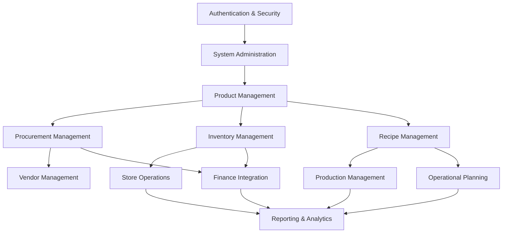

# Carmen Hospitality ERP System - Master Product Requirements Document

**Document Version**: 1.0  
**Last Updated**: January 2025  
**Document Owner**: Product Management Team  
**Status**: Draft

## Document History

| Version | Date | Author | Changes |
|---------|------|--------|---------|
| 1.0.0 | 2025-11-19 | Documentation Team | Initial version |
---

## 📋 Document Information

| Field | Value |
|-------|-------|
| Product Name | Carmen Hospitality ERP System |
| Product Type | Enterprise Resource Planning (ERP) System |
| Target Industry | Food Service & Hospitality |
| Platform | Web Application (Next.js 14) |
| Document Type | Master PRD |
| Classification | Strategic Product Definition |

---

## 🎯 Executive Summary

### Product Vision
Carmen is a comprehensive, cloud-based ERP system designed specifically for food service operations, enabling end-to-end management from procurement to production, inventory control, and financial reporting. The system empowers hospitality businesses to optimize operations, reduce costs, ensure food safety compliance, and make data-driven decisions.

### Key Business Value
- **Operational Efficiency**: Streamline procurement, inventory, and production processes
- **Cost Optimization**: Real-time cost tracking and budget management across all operations  
- **Regulatory Compliance**: Built-in food safety and quality management controls
- **Data-Driven Decisions**: Comprehensive analytics and reporting capabilities
- **Scalability**: Support for single-location to multi-chain operations

### Success Metrics
- **Operational Efficiency**: 25% reduction in procurement cycle time
- **Cost Savings**: 15% reduction in food and beverage costs
- **Inventory Optimization**: 20% reduction in inventory carrying costs
- **User Adoption**: 90% user adoption rate within 6 months
- **System Performance**: <3 second page load times, 99.9% uptime

---

## 🏢 Target Market & Users

### Primary Market
- **Hotels & Resorts**: 100-500+ room properties with multiple F&B outlets
- **Restaurant Chains**: Multi-location operations with centralized procurement
- **Corporate Catering**: Large-scale food service operations
- **Institutional Food Service**: Hospitals, schools, corporate cafeterias

### Target User Personas

#### Executive Level
- **General Managers**: Strategic oversight, performance monitoring, cost control
- **F&B Directors**: Operational excellence, revenue optimization, quality standards

#### Operations Level
- **Procurement Managers**: Vendor relationships, cost optimization, contract management
- **Inventory Controllers**: Stock management, valuation, loss prevention
- **Kitchen Managers**: Recipe management, production planning, food safety

#### Administrative Level
- **Finance Controllers**: Budget management, cost analysis, financial reporting
- **Store Managers**: Daily operations, staff management, local inventory
- **System Administrators**: User management, system configuration, data integrity

---

## 🏗️ System Architecture Overview

### Technical Foundation
- **Framework**: Next.js 14 with App Router architecture
- **Frontend**: React 18, TypeScript, Tailwind CSS, Shadcn/ui components
- **Authentication**: Role-based access control with multi-level permissions
- **Database**: Scalable relational database with audit trails
- **Infrastructure**: Cloud-native, microservices architecture

### Key Architectural Principles
- **Mobile-First Responsive Design**: Optimal experience across all devices
- **Server-Side Rendering**: Enhanced performance and SEO optimization
- **API-First Architecture**: Seamless integration capabilities
- **Real-Time Updates**: Live data synchronization across modules
- **Security by Design**: Data encryption, access controls, audit logging

---

## 🎯 Core Objectives & Goals

### Primary Business Objectives
1. **Operational Excellence**: Digitize and optimize all F&B operations
2. **Cost Management**: Provide real-time visibility into costs and profitability
3. **Quality Assurance**: Ensure food safety and quality compliance
4. **Scalable Growth**: Support business expansion and multi-location operations
5. **Data-Driven Intelligence**: Enable informed decision-making through analytics

### Key Performance Indicators (KPIs)
- **Financial Performance**: Food cost percentage, GP margins, budget variance
- **Operational Efficiency**: Order cycle time, inventory turnover, waste reduction
- **Quality Metrics**: Compliance scores, supplier performance, customer satisfaction
- **System Performance**: User adoption rates, system uptime, response times
- **Business Growth**: Revenue per location, cost per transaction, ROI metrics

---

## 🔧 Core System Modules

### 1. [Procurement Management](./modules/procurement/MODULE-PRD.md)
**Status**: ✅ Implemented  
**Purpose**: End-to-end procurement process from requests to payments
- Purchase Requests with multi-level approvals
- Purchase Orders with vendor management
- Goods Received Notes with quality control
- Credit Notes for returns and adjustments
- Vendor performance tracking and evaluation

### 2. [Inventory Management](./modules/inventory-management/MODULE-PRD.md)
**Status**: ✅ Implemented  
**Purpose**: Real-time inventory control across multiple locations
- Multi-location stock tracking with FIFO/Average costing
- Physical count management and variance analysis
- Stock adjustments with approval workflows
- Expiry date management and waste tracking
- Automated reorder points and safety stock levels

### 3. [Product Management](./modules/product-management/MODULE-PRD.md)
**Status**: ✅ Implemented  
**Purpose**: Centralized product catalog and specification management
- Product master data with categories and attributes
- Unit of measure management with conversions
- Recipe creation and costing calculations
- Nutritional information and allergen tracking
- Product performance analytics

### 4. [Vendor Management](./modules/vendor-management/MODULE-PRD.md)
**Status**: ✅ Implemented  
**Purpose**: Comprehensive vendor lifecycle and performance management
- Vendor profiles with contact and contract management
- Price list management and comparison tools
- Campaign management for pricing requests
- Vendor portal for price submissions
- Performance metrics and evaluation systems

### 5. [Store Operations](./modules/store-operations/MODULE-PRD.md)
**Status**: 🔄 In Development  
**Purpose**: Daily store operations and internal requisitions
- Store requisitions with approval workflows
- Stock replenishment automation
- Wastage tracking and cause analysis
- Inter-location transfers
- Store-level reporting and analytics

### 6. [Recipe Management](./modules/recipe-management/MODULE-PRD.md)
**Status**: 🔄 In Development  
**Purpose**: Recipe creation, costing, and production planning
- Recipe creation with ingredient specifications
- Yield calculations and scaling capabilities
- Cost calculations and profitability analysis
- Production batch management
- Recipe version control and approval

### 7. [Operational Planning](./modules/operational-planning/MODULE-PRD.md)
**Status**: 📋 Planned  
**Purpose**: Forecasting, planning, and resource allocation
- Demand forecasting based on historical data
- Production planning and scheduling
- Budget planning and variance analysis
- Resource allocation optimization
- Seasonal planning and trend analysis

### 8. [Production Management](./modules/production/MODULE-PRD.md)
**Status**: 📋 Planned  
**Purpose**: Manufacturing processes and quality control
- Production order management
- Bill of materials and recipe execution
- Quality control checkpoints
- Batch tracking and traceability
- Production efficiency metrics

### 9. [Finance Integration](./modules/finance/MODULE-PRD.md)
**Status**: 📋 Planned  
**Purpose**: Financial controls and accounting integration
- General ledger integration and cost center tracking
- Budget management and variance analysis
- Accounts payable integration
- Cost allocation and profitability reporting
- Tax management and compliance

### 10. [Reporting & Analytics](./modules/reporting-analytics/MODULE-PRD.md)
**Status**: 📋 Planned  
**Purpose**: Business intelligence and performance monitoring
- Real-time dashboards and KPI tracking
- Standard and custom reporting capabilities
- Trend analysis and predictive analytics
- Operational and financial reporting
- Data export and integration capabilities

### 11. [System Administration](./modules/system-administration/MODULE-PRD.md)
**Status**: ✅ Implemented  
**Purpose**: User management, security, and system configuration
- User roles and permission management
- Location and organizational hierarchy
- Workflow configuration and approval routing
- System settings and parameter management
- Audit trails and compliance reporting

### 12. [Authentication & Security](./modules/authentication-security/MODULE-PRD.md)
**Status**: ✅ Implemented  
**Purpose**: Security, authentication, and compliance
- Multi-factor authentication and SSO integration
- Role-based access control with granular permissions
- Data encryption and privacy protection
- Audit logging and compliance reporting
- Session management and security monitoring

---

## 🔗 System Integration Architecture

### Internal Module Dependencies

### External System Integration Points
- **POS Systems**: Sales data import for demand forecasting
- **Accounting Systems**: Financial data synchronization
- **Banking Systems**: Payment processing and reconciliation
- **Supplier Portals**: Price lists and catalog updates
- **Quality Management Systems**: Compliance and certification data

### Data Flow Patterns
- **Real-time**: Inventory updates, user authentication, alerts
- **Batch Processing**: Financial consolidation, reporting, analytics
- **Event-Driven**: Approval notifications, workflow triggers
- **API Integration**: Third-party system connectivity

---

## 🎯 Business Value Proposition

### For Hotel Operators
- **Cost Control**: Real-time visibility into F&B costs and margins
- **Operational Efficiency**: Streamlined processes from procurement to service
- **Quality Assurance**: Consistent food safety and quality standards
- **Scalability**: Support for multi-property operations

### For Restaurant Chains
- **Centralized Management**: Unified control across all locations
- **Menu Engineering**: Data-driven menu optimization
- **Supply Chain Optimization**: Vendor consolidation and cost savings
- **Brand Consistency**: Standardized recipes and procedures

### For Food Service Operations
- **Compliance**: Built-in HACCP and food safety controls
- **Waste Reduction**: Accurate forecasting and inventory management
- **Profitability**: Detailed cost analysis and margin tracking
- **Efficiency**: Automated workflows and approvals

---

## 📊 Implementation Strategy

### Phase 1: Foundation (Months 1-6)
**Status**: ✅ Completed
- Core procurement and inventory modules
- User management and authentication
- Basic reporting capabilities

### Phase 2: Enhancement (Months 7-12)
**Status**: 🔄 In Progress
- Recipe and production management
- Advanced analytics and dashboards
- Mobile application development

### Phase 3: Integration (Months 13-18)
**Status**: 📋 Planned
- External system integrations
- Advanced forecasting and planning
- AI-powered insights and recommendations

### Phase 4: Optimization (Months 19-24)
**Status**: 📋 Planned
- Performance optimization and scaling
- Advanced compliance features
- Global localization and multi-currency

---

## 🛠️ Technical Requirements

### Performance Standards
- **Page Load Time**: <3 seconds for all pages
- **API Response Time**: <500ms for standard operations
- **Concurrent Users**: Support 500+ simultaneous users
- **System Uptime**: 99.9% availability with disaster recovery
- **Data Processing**: Handle 10M+ transactions per month

### Security Requirements
- **Data Encryption**: AES-256 encryption at rest and in transit
- **Access Control**: Role-based permissions with audit trails
- **Authentication**: Multi-factor authentication support
- **Compliance**: SOC 2, GDPR, and industry-specific requirements
- **Backup & Recovery**: Automated backups with <4 hour RTO

### Compatibility Requirements
- **Browsers**: Chrome, Firefox, Safari, Edge (latest 2 versions)
- **Mobile Devices**: iOS 14+, Android 10+ with responsive design
- **Integrations**: RESTful APIs with industry-standard protocols
- **Database**: Scalable relational database with horizontal scaling

---

## ⚠️ Strategic Risks & Mitigation

### Technical Risks
- **Performance Scalability**: Horizontal scaling architecture, performance monitoring
- **Data Migration**: Phased migration approach with validation checkpoints
- **Integration Complexity**: API-first design with standardized protocols
- **Security Vulnerabilities**: Regular security audits and penetration testing

### Business Risks
- **User Adoption**: Comprehensive training programs and change management
- **Competitive Response**: Continuous innovation and feature enhancement
- **Regulatory Changes**: Flexible architecture to accommodate compliance updates
- **Market Evolution**: Agile development approach with regular market feedback

### Operational Risks
- **System Downtime**: High availability architecture with failover capabilities
- **Data Loss**: Multi-tier backup strategy with geographic redundancy
- **Support Scalability**: Tiered support structure with self-service capabilities
- **Vendor Dependencies**: Multi-vendor strategy with fallback options

---

## 📈 Success Metrics & KPIs

### Business Impact Metrics
- **Cost Reduction**: 15% reduction in F&B costs within 12 months
- **Operational Efficiency**: 25% reduction in procurement cycle time
- **Inventory Optimization**: 20% reduction in carrying costs
- **Revenue Growth**: 10% increase in GP margins through optimization

### User Experience Metrics
- **User Adoption**: 90% adoption rate within 6 months
- **User Satisfaction**: >4.5/5.0 satisfaction score
- **Training Effectiveness**: <2 hours average time to productivity
- **Support Tickets**: <5% of users require support per month

### Technical Performance Metrics
- **System Uptime**: 99.9% availability
- **Page Load Speed**: <3 seconds average load time
- **API Performance**: <500ms average response time
- **Error Rate**: <0.1% system error rate

---

## 🔄 Continuous Evolution

### Feedback Mechanisms
- **User Feedback**: In-app feedback tools and regular surveys
- **Usage Analytics**: Comprehensive user behavior tracking
- **Performance Monitoring**: Real-time system performance metrics
- **Business Impact Assessment**: Quarterly business value reviews

### Enhancement Pipeline
- **Feature Requests**: User-driven feature prioritization
- **Technology Updates**: Regular platform and security updates
- **Market Adaptation**: Industry trend analysis and competitive intelligence
- **Innovation Labs**: Emerging technology evaluation and pilot programs

---

## 📚 Related Documentation

### Module Documentation
- [Procurement Module PRD](./modules/procurement/MODULE-PRD.md)
- [Inventory Management Module PRD](./modules/inventory-management/MODULE-PRD.md)
- [Product Management Module PRD](./modules/product-management/MODULE-PRD.md)
- [Vendor Management Module PRD](./modules/vendor-management/MODULE-PRD.md)
- [Store Operations Module PRD](./modules/store-operations/MODULE-PRD.md)

### Technical Documentation
- [System Architecture Documentation](../design/system-architecture.md)
- [API Specifications](../api-specifications/)
- [Security Guidelines](../design/security-guidelines.md)
- [Integration Specifications](../integration/)

### Business Documentation
- [Business Analysis Documents](../business-analysis/)
- [User Flow Diagrams](../user-flows/)
- [Compliance Requirements](../compliance/)

---

## 📝 Document Control

### Version History
| Version | Date | Author | Changes |
|---------|------|---------|---------|
| 1.0 | January 2025 | Product Team | Initial Master PRD version |

### Approval Matrix
| Role | Name | Date | Status |
|------|------|------|--------|
| Product Owner | | | Pending |
| Technical Lead | | | Pending |
| Business Stakeholder | | | Pending |
| Executive Sponsor | | | Pending |

---

## 📞 Contact Information

### Product Team
- **Product Manager**: [Contact Information]
- **Technical Lead**: [Contact Information]
- **Business Analyst**: [Contact Information]
- **UX/UI Lead**: [Contact Information]

### Stakeholder Contacts
- **Executive Sponsor**: [Contact Information]
- **Business Owner**: [Contact Information]
- **Operations Lead**: [Contact Information]

### Support Channels
- **Documentation Issues**: [Email/System]
- **Technical Questions**: [Email/System]
- **Business Questions**: [Email/System]
- **Urgent Escalations**: [Contact Information]

---

**Last Updated**: January 2025  
**Next Review**: March 2025  
**Document Classification**: Internal Use Only