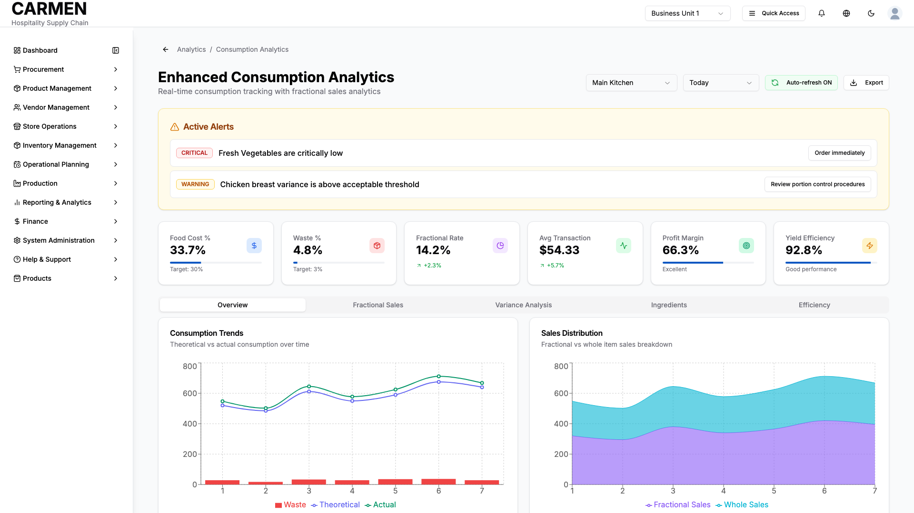

# Consumption Analytics with Fractional Sales Screen Specification

**Title**: Consumption Analytics with Fractional Sales Screen Specification  
**Module**: Reporting & Analytics  
**Function**: Consumption Analytics Dashboard  
**Screen**: Enhanced Consumption Analytics  
**Version**: 1.0  
**Date**: January 14, 2025  
**Status**: Based on Actual Source Code Analysis  

## Implementation Overview

**Purpose**: This comprehensive analytics dashboard provides real-time consumption tracking with specialized fractional sales analytics. Users can monitor ingredient usage, track variance between theoretical and actual consumption, analyze fractional sales efficiency, and receive actionable insights for operational optimization.

**File Locations**: 
- `app/(main)/reporting-analytics/consumption-analytics/page.tsx` (main page wrapper)
- `app/(main)/reporting-analytics/consumption-analytics/components/enhanced-consumption-dashboard.tsx` (core component)

**User Types**: Restaurant managers, kitchen supervisors, operations analysts, financial controllers, and department heads with analytics access privileges.

**Current Status**: Fully implemented with sophisticated real-time monitoring, multi-dimensional analytics, tabbed interface, and comprehensive fractional sales tracking capabilities.

## Visual Interface

*Advanced consumption analytics dashboard featuring fractional sales analysis, usage patterns, and cost optimization insights*

## Layout & Navigation

**Header Section**: Clean breadcrumb navigation with back arrow leading to main analytics section, followed by page title "Enhanced Consumption Analytics" and descriptive subtitle emphasizing real-time fractional sales capabilities.

**Control Bar**: Top-right controls featuring location selector dropdown (Main Kitchen, Pastry Section, Bar Station), time range selector (Today, This Week, This Month), auto-refresh toggle with visual indicator, and export functionality button.

**Alert Banner**: Conditional amber-colored alert card appearing when active alerts exist, displaying critical stock levels, variance warnings, and recommended actions with severity-based badge styling.

**Six-Column KPI Grid**: Key performance indicators displayed in responsive card layout showing food cost percentage, waste percentage, fractional sales rate, average transaction value, profit margin, and yield efficiency with progress bars and trend indicators.

**Five-Tab Analytics Interface**: Main content organized into Overview, Fractional Sales, Variance Analysis, Ingredients, and Efficiency tabs with comprehensive visualizations and data tables.

## Data Display

**Real-Time Performance Metrics**:
- Food cost percentage with target comparison and color-coded progress tracking
- Waste percentage monitoring with visual threshold indicators
- Fractional sales conversion rate with trending arrows and percentage changes
- Average transaction value displaying currency amounts with growth indicators
- Profit margin visualization with performance classification labels
- Yield efficiency tracking with descriptive status messages

**Alert System**:
- Critical stock level notifications with ingredient-specific messaging
- Variance threshold warnings highlighting deviation percentages
- Severity-based badge coloring (critical in red, warning in amber, info in blue)
- Recommended action buttons providing direct resolution pathways

**Live Ingredient Monitoring**:
- Current inventory levels with precise unit measurements
- Projected depletion dates based on consumption patterns
- Reorder point thresholds with visual progress indicators
- Status classification (critical, low, adequate) with color-coded badges

**Chart Visualizations**:
- Consumption trends combining theoretical vs actual data with waste overlay
- Sales distribution showing fractional vs whole item breakdowns
- Fractional efficiency metrics across different product categories
- Variance analysis displaying ingredient-specific deviation patterns
- Yield efficiency trending with target baseline comparisons

## User Interactions

**Dashboard Controls**:
- Location selector allowing dynamic switching between operational areas
- Time range filtering for historical and current period analysis
- Auto-refresh toggle enabling real-time data updates with visual confirmation
- Export functionality providing data download capabilities

**Alert Management**:
- Interactive alert cards with embedded action buttons
- Direct navigation to resolution workflows from alert notifications
- Severity-based visual hierarchy for priority-based attention

**Tab Navigation**:
- Five comprehensive analysis sections accessible through tab interface
- Dynamic content loading based on selected analytical focus
- Persistent state management maintaining user selections

**Interactive Analytics**:
- Drill-down capabilities from summary metrics to detailed analysis
- Hover tooltips providing additional context and precise measurements
- Clickable chart elements enabling focused investigation

## Role-Based Functionality

**Operations Manager Permissions**:
- Complete access to all analytics tabs and performance metrics
- Real-time monitoring capabilities with alert management
- Export functionality for reporting and documentation purposes
- Location switching for multi-area operational oversight

**Kitchen Supervisor Permissions**:
- Full fractional sales analytics access with ingredient-level detail
- Variance analysis for portion control and waste management
- Efficiency monitoring focused on operational performance
- Limited export capabilities for operational reporting

**Financial Controller Permissions**:
- Comprehensive cost analysis with profit margin tracking
- Variance investigation tools for financial impact assessment
- Export capabilities for financial reporting and budget analysis
- Read-only access to operational metrics with financial focus

**Department Manager Permissions**:
- Location-specific analytics aligned with departmental responsibility
- Efficiency metrics relevant to department performance goals
- Alert notifications for department-specific issues
- Basic export functionality for departmental reporting

## Business Rules & Validation

**Data Refresh Requirements**:
- Auto-refresh intervals configurable between 30 seconds and manual-only modes
- Real-time data synchronization with POS and inventory systems
- Time-stamped data ensuring accuracy and audit trail compliance

**Threshold Monitoring**:
- Food cost percentage target of 30% with alert triggers at variance levels
- Waste percentage target of 3% with escalating alerts for exceeding thresholds
- Ingredient reorder points automatically calculated based on consumption patterns
- Variance thresholds set at 8% with recommendation triggers for investigations

**Alert Generation Rules**:
- Critical alerts for ingredients below reorder points requiring immediate action
- Warning alerts for variance exceeding acceptable thresholds needing investigation
- Info alerts for optimization opportunities providing improvement suggestions

**Data Accuracy Standards**:
- Real-time integration with POS systems ensuring transaction accuracy
- Inventory system synchronization maintaining current stock level precision
- Recipe system integration providing accurate theoretical consumption calculations

## Current Limitations

**Mock Data Implementation**:
- Real-time metrics currently use sophisticated mock data structures for demonstration
- Alert system operates on simulated threshold breaches and stock levels
- Chart data represents realistic patterns but requires live system integration

**Integration Dependencies**:
- POS system integration pending for complete real-time transaction processing
- Inventory management system connection needed for accurate stock level monitoring
- Recipe management system integration required for precise theoretical calculations

**Advanced Analytics Features**:
- Machine learning predictions for consumption patterns in development
- Advanced forecasting algorithms pending implementation
- Automated optimization recommendations requiring historical data accumulation

## Fractional Sales Specific Features

**Pizza Slice Analytics**:
- Individual slice tracking with precise inventory impact calculations
- Revenue analysis per slice with efficiency metrics and waste monitoring
- Transaction count tracking across different pizza varieties and sizes
- Yield efficiency calculations based on whole pizza to slice conversion rates

**Cake Portion Management**:
- Portion-based sales tracking with automated inventory deduction
- Revenue optimization analysis for different portion sizes and varieties
- Waste analysis specific to cake cutting and serving operations
- Efficiency metrics comparing planned vs actual portion yields

**Multi-Category Fractional Tracking**:
- Comprehensive analysis across pizza slices, cake slices, portion control items, and beverage glasses
- Comparative efficiency metrics showing performance across fractional categories
- Transaction volume analysis with revenue correlation and trend identification
- Waste percentage tracking specific to fractional vs whole item sales

**Inventory Impact Analysis**:
- Real-time deduction tracking when fractional items are sold
- Raw material usage calculations based on fractional portions consumed
- Variance analysis between expected and actual ingredient consumption
- Optimization recommendations for improving fractional sales efficiency

**Performance Optimization**:
- Yield efficiency monitoring for each fractional product category
- Revenue optimization suggestions based on sales patterns and waste analysis
- Portion size standardization recommendations for consistency improvement
- Cost-benefit analysis of fractional vs whole item sales strategies

The Enhanced Consumption Analytics dashboard serves as the comprehensive control center for monitoring and optimizing food service operations with specialized focus on fractional sales management. The interface provides sophisticated real-time analytics while maintaining intuitive navigation, enabling both operational staff and financial managers to make data-driven decisions that improve efficiency and profitability.