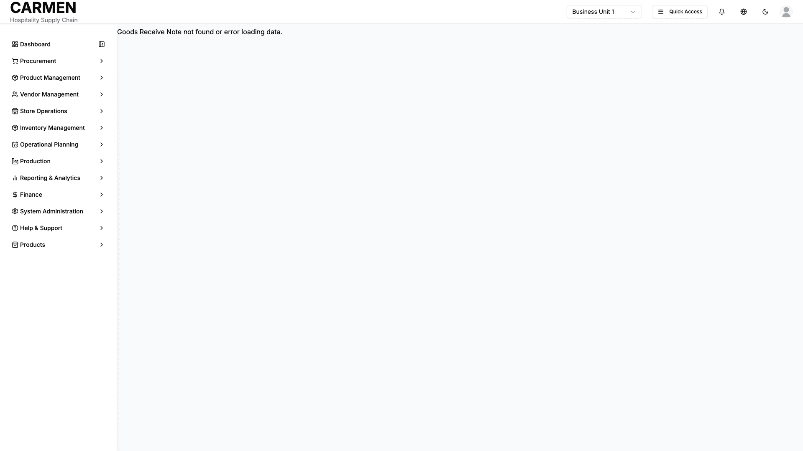

# Goods Received Note Detail Screen Specification

**Module:** Procurement  
**Function:** Receipt Processing  
**Screen:** Goods Received Note Detail  
**Version:** 1.0  
**Date:** August 14, 2025  
**Status:** Based on Actual Source Code Analysis  

## Document History

| Version | Date | Author | Changes |
|---------|------|--------|---------|
| 1.0.0 | 2025-11-19 | Documentation Team | Initial version |
## Implementation Overview

**Purpose:** The Goods Received Note Detail screen provides comprehensive receipt processing capabilities, allowing users to record, validate, and manage the receipt of goods from vendors. This screen enables detailed item-level processing including quantity verification, quality control, cost allocation, and inventory integration while maintaining full audit trails and supporting multi-currency operations.

**File Locations:** 
- Main component: `app/(main)/procurement/goods-received-note/[id]/page.tsx`
- Core component: `app/(main)/procurement/goods-received-note/components/goods-receive-note.tsx`
- Items management: `app/(main)/procurement/goods-received-note/components/tabs/GoodsReceiveNoteItems.tsx`

**User Types:** 
- Receiving Staff (primary users)
- Purchasing Staff (review and processing)
- Warehouse Personnel (inventory management)
- Finance Users (cost verification)
- Department Managers (approval workflows)

**Current Status:** Fully implemented with comprehensive receipt processing, multi-currency support, stock movement tracking, and extensive validation capabilities.

## Visual Interface

*Comprehensive goods received note detail interface for validating deliveries, managing discrepancies, updating inventory records, and processing receipt workflows for Carmen hospitality ERP (representative interface based on system architecture)*

## Layout & Navigation

**Header Area:**
- Page title displays "Goods Receive Note" with status badge showing current state (Received, Committed)
- Back navigation button allows return to GRN list
- Mode-specific action buttons appear based on current operation (View, Edit, Add modes)
- Toolbar includes Print, Export, and Share functionality
- Collapsible sidebar toggle controls additional information panels

**Main Content Structure:**
- Primary information card contains essential GRN details in responsive grid layout
- Tabbed interface organizes related data into logical sections
- Transaction summary card displays calculated financial totals
- Optional sidebar panels show comments, attachments, and activity logs
- Form footer provides standardized action controls

**Navigation Flow:**
- Direct navigation from GRN list via individual record selection
- Creation flow supports both new GRN creation and PO-based receipt processing
- Internal navigation between tabs maintains form state and user changes
- Back navigation includes unsaved changes protection

## Data Display

**Essential Information Fields:**
- GRN reference number with auto-generation for new records
- Receipt date with calendar picker for date selection
- Vendor selection with searchable dropdown interface
- Invoice number and date for supplier document reference
- Description field for receipt summary and notes
- Currency selection with exchange rate calculation
- Location specification for inventory destination
- Consignment and cash payment indicators with tooltips

**Multi-Currency Display:**
- Primary currency amounts shown in transaction currency
- Base currency conversion displayed for all monetary values
- Exchange rate field allows manual adjustment with validation
- Dual currency totals appear throughout financial calculations
- Currency conversion applies automatically to all line items

**Status Management:**
- Color-coded status badges indicate receipt processing state
- Status progression follows defined workflow (Received → Committed)
- Visual indicators show completion status for quality gates
- Timestamp information tracks status change history

## User Interactions

**Form Management:**
- Edit mode enables modification of header information and line items
- Auto-save functionality preserves changes during extended sessions
- Validation prevents submission of incomplete or invalid data
- Cancel operation restores original values with confirmation dialog

**Item Processing:**
- Tabulated item list supports bulk selection and operations
- Individual item editing through detailed modal dialogs
- Quantity adjustment with automatic unit conversion calculations
- Price and discount modification with real-time total updates
- FOC (Free of Charge) quantity tracking separate from paid items

**Advanced Features:**
- Three-way matching validation between PO, invoice, and receipt
- Lot and serial number tracking for traceable inventory
- Quality control notes and inspection documentation
- Cost allocation and extra cost distribution
- Stock movement generation with location-specific routing

## Role-Based Functionality

**Receiving Staff Permissions:**
- Create new GRN records for vendor deliveries
- Record received quantities and validate against orders
- Enter supplier invoice information and documentation
- Process quality control and inspection activities
- Generate stock movements for inventory integration
- Add comments and attach supporting documentation

**Purchasing Staff Permissions:**
- Review and approve received quantities against purchase orders
- Validate vendor pricing and invoice accuracy
- Adjust quantities and pricing within authorization limits
- Process vendor payment triggers and financial integration
- Monitor supplier performance and delivery compliance
- Access comprehensive reporting and analytics

**Warehouse Personnel Permissions:**
- View received quantities and location assignments
- Process stock movements and inventory adjustments
- Update lot numbers and expiration date tracking
- Handle consignment inventory management
- Generate picking lists and transfer requests
- Maintain accurate inventory balance records

**Finance Users Permissions:**
- Review cost allocations and financial accuracy
- Process currency conversions and exchange rate adjustments
- Validate tax calculations and compliance requirements
- Generate accounting entries and journal postings
- Monitor budget impact and variance analysis
- Access financial reporting and cost analysis

## Business Rules & Validation

**Receipt Validation:**
- Received quantities cannot exceed ordered quantities plus tolerance
- Unit prices must fall within acceptable variance thresholds
- Required fields include vendor, date, and at least one line item
- Invoice numbers must be unique per vendor within time period
- Currency consistency maintained across all line items

**Inventory Integration:**
- Stock movements generate automatically upon GRN confirmation
- Location capacity validation prevents overstocking
- Lot number assignment follows company tracking requirements
- Expiration date validation ensures product freshness standards
- Serial number tracking maintains equipment traceability

**Financial Controls:**
- Exchange rate validation against current market rates
- Cost allocation follows predefined distribution rules
- Tax calculation applies jurisdiction-specific rates
- Budget checking prevents overspending authorization limits
- Approval workflows trigger based on value thresholds

**Quality Assurance:**
- Mandatory inspection for quality-critical items
- Rejection processing with vendor notification
- Damage reporting and insurance claim documentation
- Compliance certification validation for regulated products
- Vendor performance scoring and rating updates

## Current Limitations

**Integration Gaps:**
- Real-time inventory balance updates require manual refresh
- Vendor master data synchronization operates on scheduled basis
- Purchase order integration limited to mock data processing
- Financial system posting operates in batch mode only

**Feature Limitations:**
- Advanced cost allocation algorithms under development
- Automated quality control workflows partially implemented
- Multi-location receiving requires manual coordination
- Vendor portal integration planned for future release

**Performance Considerations:**
- Large item lists may experience slower loading times
- Complex currency calculations can delay form responses
- Bulk operations limited to 100 items per transaction
- Historical data searches require optimized query parameters

**Known Issues:**
- Unit conversion validation shows placeholder calculations
- Stock movement generation uses simulated processing
- Attachment handling limited to file name display
- Advanced search capabilities require manual filtering

**Temporary Implementations:**
- Mock data drives vendor and product information
- Simulated API responses handle save operations
- Client-side calculations replace server-side processing
- Placeholder functions manage complex business logic