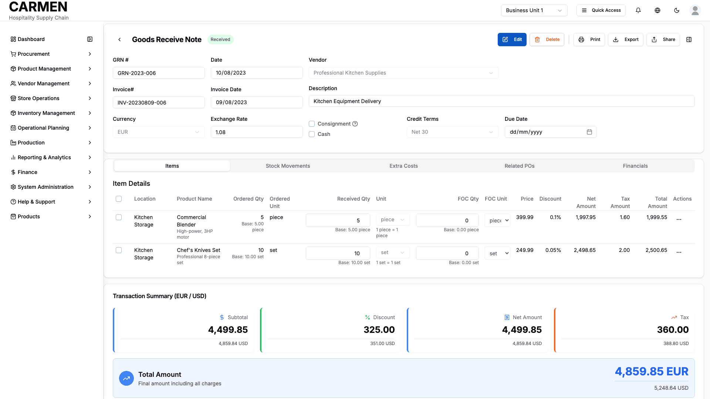

# Goods Received Note List Screen Specification

**Title:** Goods Received Note List Screen Specification  
**Module:** Procurement  
**Function:** Goods Received Notes  
**Screen:** GRN List View  
**Version:** 1.0  
**Date:** 2025-01-14  
**Status:** Based on Actual Source Code Analysis  

## Visual Interface

*Goods Received Notes management interface showing populated data with first record selected, displaying comprehensive tracking system for vendor deliveries, purchase order validation, and inventory record maintenance within Carmen hospitality ERP*

## Layout & Navigation

### Header & Title Area
- **Main Title:** "Goods Receive Notes" displayed prominently at the top
- **Subtitle Description:** Explanatory text stating "Track and manage goods received from vendors, validate deliveries against purchase orders, and maintain accurate inventory records"
- **Breadcrumb Navigation:** Integrated with main application navigation structure

### Action Buttons Bar
- **New GRN Dropdown:** Primary action button with two creation options:
  - Create from Purchase Order: Links to vendor selection workflow
  - Create Manually: Direct creation with immediate navigation to confirmation mode
- **Export Button:** Allows data export functionality (currently shows as placeholder)
- **Print Button:** Enables printing of current view or selected items

### Layout Structure
- **Responsive Design:** Adapts from desktop multi-column to mobile-friendly stacked layout
- **Container Layout:** Full-width container with proper spacing and padding
- **Flexible Toolbar:** Search, filters, and view controls positioned above data display area

## Data Display

### Information Fields Shown
- **GRN Reference Number:** Clickable links to individual GRN detail pages
- **Vendor Name:** Company or supplier identification
- **Receipt Date:** Formatted date display showing when goods were received
- **Status Indicators:** Color-coded badges showing current processing state
- **Total Amount:** Monetary values with proper currency formatting and right alignment
- **Currency Code:** Three-letter currency identifiers with fallback to USD

### Table Structure & Organization
- **Column Sorting:** All major columns support ascending/descending sort with visual indicators
- **Row Selection:** Individual checkbox selection for each GRN record
- **Header Selection:** Master checkbox to select/deselect all visible items
- **Pagination Controls:** Previous/Next navigation with current page indicators
- **Results Counter:** Shows count of selected items and total filtered results

### Status Indicators
- **Received:** Items have been physically received and logged
- **Committed:** Receipt confirmed and committed to inventory
- **Partial:** Incomplete receipt with some items still pending
- **Cancelled:** Receipt process cancelled and voided
- **Voided:** Previously processed receipt that has been reversed

### Alternative View Modes
- **Table View:** Standard row-and-column data presentation
- **Card View:** Visual card layout showing key information in structured panels with:
  - Header section with GRN number, date, and status
  - Vendor information and item count
  - Total amount prominently displayed
  - Action menu for each card

## User Interactions

### Search & Filtering
- **Global Search:** Text input that searches across GRN numbers, vendors, and other key fields
- **Quick Status Filter:** Dropdown allowing filtering by specific receipt status
- **Advanced Filter System:** Comprehensive filtering with:
  - Multiple field selection (GRN number, dates, vendor, amounts, location, etc.)
  - Various operators (equals, contains, between, greater than, less than)
  - Logical operators (AND/OR) for complex conditions
  - Save and reuse filter combinations
  - Filter history and testing capabilities

### Bulk Operations
- **Multi-Select Capability:** Checkbox selection for multiple GRN records
- **Bulk Actions Bar:** Appears when items are selected showing available operations
- **Delete Selected:** Bulk deletion functionality for selected receipts

### Row-Level Actions
- **Action Menu:** Three-dot menu for each GRN providing:
  - Print GRN: Generate printable version
  - Download PDF: Export individual receipt as PDF
  - Delete: Remove individual GRN record

### Column Management
- **Column Visibility:** Dropdown control to show/hide specific data columns
- **View Toggle:** Switch between table and card view presentations
- **Column Customization:** Users can control which information is displayed

### Navigation & Linking
- **GRN Detail Links:** Clicking GRN reference numbers navigates to detailed view
- **Deep Linking:** Direct URL access to individual GRN records in view mode

## Role-Based Functionality

### Staff & Counter Personnel
- **View Access:** Can see GRN list and basic receipt information
- **Basic Search:** Access to search and standard filtering capabilities
- **Read-Only Mode:** Cannot modify or delete receipt records

### Purchasing Staff
- **Full Creation Access:** Can create new GRNs both manually and from purchase orders
- **Edit Capabilities:** Modify existing receipt records and update status
- **Bulk Operations:** Access to bulk actions including deletion
- **Advanced Filtering:** Full access to complex filter building and saving

### Department Managers
- **Oversight Functions:** View all GRNs for their department or location
- **Approval Authority:** Can approve and finalize receipt transactions
- **Reporting Access:** Export and print capabilities for management reporting

### Financial Managers
- **Financial Analysis:** Focus on monetary aspects and currency management
- **Audit Capabilities:** Access to complete receipt history and financial summaries
- **Cross-Department View:** Can see receipts across multiple departments

## Business Rules & Validation

### Field Requirements
- **Mandatory Data:** GRN reference, vendor, receipt date, and status are required
- **Unique References:** GRN numbers must be unique across the system
- **Date Validation:** Receipt dates cannot be in the future
- **Currency Consistency:** All amounts must match the selected currency

### Status Workflow Logic
- **Status Progression:** Receipts follow defined workflow from Received → Committed
- **Status Restrictions:** Certain statuses cannot be reversed without proper authorization
- **Partial Receipt Handling:** Items can be partially received with remaining quantities tracked

### Filter Validation Rules
- **Date Range Validation:** Ensure "from" dates are not after "to" dates in range filters
- **Numeric Validation:** Amount filters must contain valid numeric values
- **Required Field Logic:** Some advanced filters require minimum field combinations

### Data Integrity Constraints
- **Referenced Data:** Cannot delete GRNs that are referenced by other transactions
- **Inventory Integration:** Receipt status changes trigger inventory movement updates
- **Audit Trail:** All modifications are tracked in activity logs

## Current Limitations

### Mock Data Implementation
- **Test Data Source:** Currently uses hardcoded mock data instead of live database
- **Limited Sample Size:** Fixed set of sample GRNs for demonstration purposes
- **No Real-Time Updates:** Changes don't persist between sessions

### Placeholder Functionality
- **Export Feature:** Export button shows but doesn't generate actual file downloads
- **Print Functionality:** Print actions trigger console logging rather than actual printing
- **PDF Generation:** Download PDF option is not fully implemented

### Backend Integration Gaps
- **No API Connectivity:** No integration with actual backend services for data persistence
- **Missing Validation:** Server-side validation rules not implemented
- **Authentication Bypass:** Role-based restrictions not enforced at API level

### Advanced Features Pending
- **Real-Time Notifications:** No live updates when GRNs are modified by other users
- **Advanced Reporting:** Limited reporting capabilities beyond basic export
- **Workflow Automation:** Manual status changes rather than automated business rule enforcement
- **Integration Points:** No connection to inventory management or financial systems

### Performance Considerations
- **Client-Side Processing:** All filtering and sorting happens in browser
- **No Pagination Backend:** All data loaded at once rather than paginated server responses
- **Limited Scalability:** Current implementation won't handle large datasets efficiently

### Mobile & Accessibility
- **Touch Optimization:** Limited touch gesture support for mobile interactions
- **Screen Reader Support:** Basic accessibility implemented but not comprehensively tested
- **Offline Functionality:** No offline capability for field operations

This specification documents the current state of the Goods Received Note List Screen as implemented in the source code, providing a foundation for understanding existing functionality and planning future enhancements.