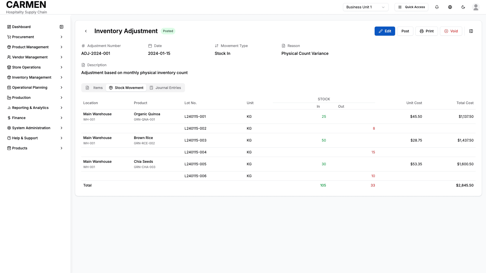

# Inventory Adjustment Detail Screen Specification

```yaml
Title: Inventory Adjustment Detail Screen Specification
Module: Inventory Management
Function: Inventory Adjustments
Screen: Detail View
Version: 1.0
Date: 2025-01-14
Status: Based on Actual Source Code Analysis
```

## Implementation Overview

**Purpose**: This screen provides comprehensive viewing and management of individual inventory adjustments, including item details, stock movements, financial impact, and journal entries.

**File Locations**: 
- Main component: `app/(main)/inventory-management/inventory-adjustments/[id]/page.tsx`
- Detail component: `components/inventory-adjustment-detail.tsx`
- Supporting components: Header, stock movement table, journal entry displays

**User Types**: Warehouse staff, inventory managers, financial controllers, and department managers with inventory access permissions.

**Current Status**: Fully implemented with mock data integration, tabbed interface structure, and comprehensive adjustment tracking capabilities.


## Visual Interface


*Comprehensive inventory adjustment detail interface for managing stock variance corrections, approval workflows, audit documentation, and financial impact tracking for Carmen hospitality ERP (representative interface based on system architecture)*

## Layout & Navigation

### Header/Title Area
The screen displays "Inventory Adjustment" as the main heading with a color-coded status badge indicating the current state of the adjustment (Posted, Pending, etc.). A back navigation button allows users to return to the previous screen.

### Action Buttons
The header contains several action buttons that change based on the current mode:

**View Mode Actions**:
- Edit button to enable modification of adjustment details
- Post button to finalize and post the adjustment to the system
- Print button for generating physical reports
- Void button for canceling the adjustment (displayed in red text)
- Details panel toggle button to show/hide the right sidebar

**Edit Mode Actions**:
- Cancel button to discard changes and return to view mode
- Save Changes button to confirm and save modifications

### Layout Structure
The screen uses a card-based layout with:
- Header information section displaying key adjustment details in a responsive grid
- Tabbed content area with three main sections: Items, Stock Movement, and Journal Entries
- Optional right panel for comments, attachments, and audit history

## Data Display

### Information Fields
The header section displays adjustment information in a six-column responsive grid:

**Adjustment Number**: Unique identifier for the adjustment (non-editable)
**Date**: Date of the adjustment (editable in edit mode via date picker)
**Movement Type**: Displays "Stock In" or "Stock Out" based on adjustment type
**Reason**: Business reason for the adjustment (e.g., "Physical Count Variance")
**Description**: Detailed explanation of the adjustment (editable text field in edit mode)

### Tables/Lists

**Items Tab**:
Displays a comprehensive table of adjusted items with columns for:
- Checkbox for multi-select operations
- Location with name and code
- Product information including name, SKU, and description
- Unit of measure
- On Hand quantity
- Adjustment quantity
- Closing quantity after adjustment
- Total price impact
- Status with color-coded badges
- Actions column with edit and delete buttons (visible on row hover)

Each item row includes an expandable sub-row showing additional context like quantities on order, last purchase price, and last vendor information.

**Stock Movement Tab**:
Shows detailed lot-level stock movements in a specialized table format:
- Location and product information
- Lot numbers for each movement
- Split display for stock in (green) and stock out (red) quantities
- Unit cost and total cost calculations
- Summary totals row with aggregated quantities and values

**Journal Entries Tab**:
Displays the financial accounting impact with:
- Journal entry header with posting information, creation details, and reference numbers
- Detailed journal entries table showing account numbers, names, debit/credit amounts, departments, and references
- Balanced totals ensuring debits equal credits

### Status Indicators
Status badges throughout the interface use consistent color coding to indicate various states like Posted, Pending, Approved, etc. These badges appear in the header, item status column, and journal entry status display.

## User Interactions

### Form Elements
**Edit Mode Interactions**:
- Date picker for adjustment date modification
- Text input field for description updates
- Dropdown selections for various adjustment parameters

**Bulk Operations**:
The Items tab includes checkboxes for each item, enabling bulk operations like mass updates or deletions (though specific bulk actions are not yet implemented beyond the UI structure).

### Modal Dialogs
The right panel functions as a slide-out modal containing:
- Comments section with user avatars, timestamps, and message content
- File attachment area showing uploaded documents with metadata
- Audit history displaying chronological activity logs
- Comment composition area with text input and attachment capabilities

## Role-Based Functionality

### Warehouse Staff Permissions
- View adjustment details and stock movement information
- Access to Items tab for reviewing quantity changes
- Read-only access to adjustment status and basic information

### Inventory Managers Permissions
- Full edit capabilities for adjustment details in edit mode
- Ability to modify dates, descriptions, and item-level information
- Access to posting functionality for finalizing adjustments
- Complete visibility into stock movements and lot-level details

### Financial Controllers Permissions
- Primary access to Journal Entries tab for reviewing financial impact
- Ability to view accounting treatment and posting details
- Access to audit trails and approval workflows
- Authority to void adjustments when necessary

### Department Managers Permissions
- Read-only access to adjustments affecting their department
- Visibility into cost impacts and quantity changes
- Access to comments and collaboration features
- Reporting and historical data review capabilities

## Business Rules & Validation

### Field Requirements
- Adjustment Number is auto-generated and cannot be modified
- Date field is required and must be a valid date
- Movement Type is system-determined based on adjustment calculations
- Reason field is mandatory for audit trail purposes
- Description provides additional context and is recommended but not required

### Validation Rules
- Adjustment quantities must result in non-negative closing stock levels
- Total debit and credit amounts in journal entries must balance
- Posted adjustments cannot be modified (edit mode disabled)
- Voided adjustments cannot be posted or further modified

### Workflow Logic
Adjustments follow a defined lifecycle:
1. **Draft**: Initial creation allowing full editing
2. **Pending**: Awaiting review and approval
3. **Posted**: Finalized with journal entries created and stock updated
4. **Voided**: Cancelled adjustments that maintain audit trail

Status changes trigger automatic journal entry generation and stock level updates in the system.

## Current Limitations

### Placeholder Features
- Item editing buttons display but only log actions to console
- Add Item functionality shows UI but lacks implementation
- Bulk operations checkboxes are present without corresponding actions
- File attachment upload button exists but doesn't process files

### Missing Integration
- Backend API connections are simulated with mock data
- Real-time stock level validation is not implemented
- Integration with external accounting systems is pending
- Email notifications for status changes are not configured

### Known Issues
- Right panel overlay doesn't prevent interaction with background content
- Table responsiveness could be improved for mobile devices
- Print functionality generates console logs instead of actual reports
- Search and filtering capabilities are not yet available for the items table

The screen provides a solid foundation for inventory adjustment management with room for backend integration and enhanced user interaction features.