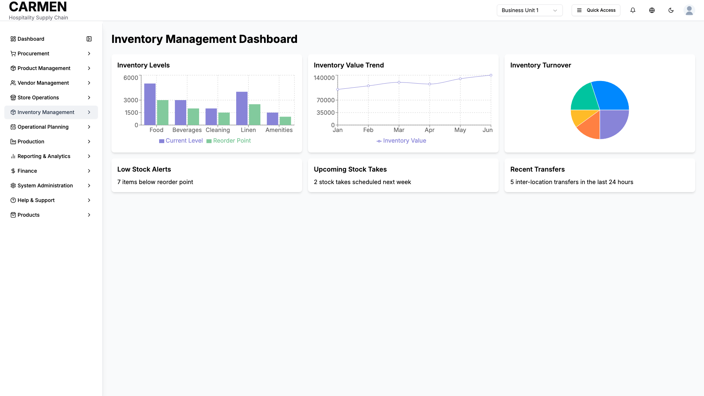

# Inventory Management Overview Screen Specification

**Module:** Inventory Management  
**Function:** Dashboard Overview  
**Screen:** Main Dashboard Landing Page  
**Version:** 1.0  
**Date:** August 14, 2025  
**Status:** Based on Actual Source Code Analysis

## Implementation Overview

**Purpose:** Provides a comprehensive dashboard view of key inventory metrics and performance indicators with customizable layout capabilities for inventory managers and staff to monitor stock levels, trends, and operational metrics.

**File Locations:** 
- Main component: app/(main)/inventory-management/page.tsx
- Related: app/(main)/dashboard/components/inventory-status.tsx

**User Types:** All authenticated users with inventory access permissions including staff, department managers, inventory managers, and purchasing staff.

**Current Status:** Fully implemented with interactive drag-and-drop dashboard, live charts, and real-time data visualization using mock data.

## Visual Interface

*Inventory management module overview showing stock levels, recent transactions, and access to inventory control functions*

## Layout & Navigation

**Header/Title Area:**
- Large page title "Inventory Management Dashboard" displayed prominently at the top
- Clean layout with generous padding for professional appearance
- No additional action buttons or navigation elements in header area

**Action Buttons:**
- No explicit action buttons present in main interface
- Navigation occurs through sidebar menu to access specific inventory functions
- All interaction is through drag-and-drop dashboard reorganization

**Layout Structure:**
- Customizable grid-based dashboard with drag-and-drop functionality
- Responsive layout: single column on mobile, two columns on medium screens, three columns on large screens
- Six main dashboard cards arranged in flexible grid pattern
- White background cards with rounded corners and subtle shadows
- Equal spacing between all dashboard elements

## Data Display

**Dashboard Cards:**
- **Inventory Levels Chart:** Interactive bar chart showing current stock levels versus reorder points across five categories (Food, Beverages, Cleaning, Linen, Amenities)
- **Inventory Value Trend:** Line chart displaying monthly inventory value progression from January through June
- **Inventory Turnover:** Pie chart visualizing turnover rates by product category with color-coded segments
- **Low Stock Alerts:** Text-based alert showing "7 items below reorder point"
- **Upcoming Stock Takes:** Information card displaying "2 stock takes scheduled next week"
- **Recent Transfers:** Activity summary showing "5 inter-location transfers in the last 24 hours"

**Chart Visualizations:**
- All charts are fully responsive and interactive with hover tooltips
- Bar charts include grid lines, axis labels, and color-coded data series
- Line charts show trend data with smooth curves and data point markers
- Pie charts display percentage breakdowns with labeled segments
- Consistent color scheme across all visualizations

**Information Cards:**
- Simple text-based cards for quick status updates
- Clean typography with clear headings
- Immediate visibility of critical metrics without requiring chart interaction

## User Interactions

**Drag and Drop Functionality:**
- Users can drag any dashboard card to reorder the layout
- Visual feedback provided during drag operations
- Layout automatically adjusts to accommodate new positioning
- Changes are immediately reflected and maintained during session

**Chart Interactions:**
- Hover tooltips on all chart elements showing detailed data values
- Interactive legends allowing data series toggling
- Responsive design maintains functionality across all device sizes
- Charts automatically resize based on container dimensions

**Dashboard Customization:**
- Real-time layout reorganization through drag-and-drop
- No save/reset functionality - changes are temporary per session
- Intuitive grid-based positioning system
- Visual feedback during reorganization process

## Role-Based Functionality

**All Authenticated Users:**
- Full access to dashboard viewing capabilities
- Complete chart interaction and data visualization
- Drag-and-drop layout customization
- Access to all inventory overview metrics

**Current Implementation:**
- No role-based restrictions currently implemented
- All users see identical dashboard content and functionality
- Access controlled through main navigation sidebar permissions
- Dashboard content is read-only with no data modification capabilities

## Business Rules & Validation

**Data Display Rules:**
- All metrics are displayed using mock data for demonstration
- Charts automatically adjust scale based on data ranges
- Color coding follows consistent pattern: optimal (green), warning (yellow), critical (red)
- Percentage calculations automatically computed for progress indicators

**Layout Constraints:**
- Minimum card size maintained regardless of content type
- Grid system ensures proper spacing and alignment
- Responsive breakpoints automatically adjust column count
- Drag operations constrained to valid drop zones

**Chart Rendering:**
- All charts render with consistent styling and color schemes
- Responsive containers maintain aspect ratios across device sizes
- Tooltip information includes relevant context and units
- Legend positioning optimized for readability

## Current Limitations

**Data Integration:**
- All dashboard data is currently mock/static data
- No real-time data feeds from inventory management system
- Inventory levels, alerts, and metrics are placeholder values
- No backend API integration for live updates

**Persistence:**
- Dashboard layout changes are not saved between sessions
- No user preference storage for preferred arrangements
- Layout resets to default configuration on page refresh
- No export or sharing capabilities for dashboard views

**Functionality Gaps:**
- No drill-down capability from dashboard metrics to detailed views
- Missing direct action capabilities (no "View Details" or "Take Action" buttons)
- No filtering or date range selection for historical data
- No customization options for chart types or data sources

**Navigation Integration:**
- Dashboard serves as overview only with no direct links to related inventory functions
- Users must navigate through sidebar menu to access specific inventory operations
- No breadcrumb navigation or quick access to frequently used functions
- Missing integration with main inventory workflow processes

**Responsive Design:**
- Charts may not be optimally sized on very small mobile devices
- Text content in information cards not fully optimized for mobile viewing
- Drag-and-drop functionality may be challenging on touch devices
- No mobile-specific interface adaptations implemented