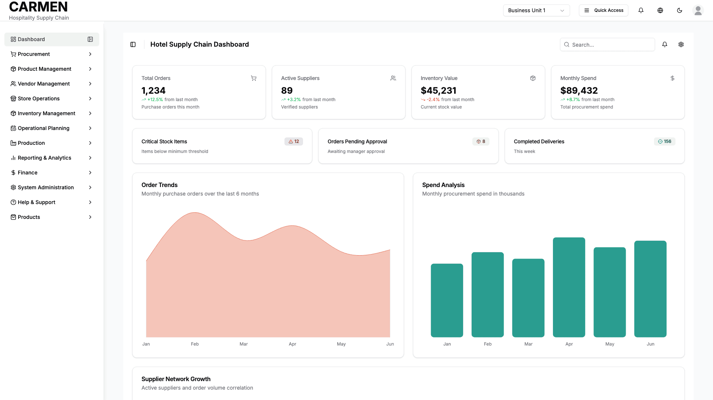

# Main Dashboard Screen Specification

## Document History

| Version | Date | Author | Changes |
|---------|------|--------|---------|
| 1.0.0 | 2025-11-19 | Documentation Team | Initial version |
```yaml
Title: Main Dashboard Screen Specification
Module: Dashboard
Function: Executive Overview & System Monitoring
Screen: Main Dashboard
Version: 1.0
Date: 2025-01-14
Status: Based on Actual Source Code Analysis
```

## Implementation Overview

**Purpose**: The main dashboard provides an executive overview of the hotel supply chain system, offering real-time insights into procurement activities, inventory status, and operational performance through visual metrics, charts, and activity tracking.

**File Locations**: 
- Main component: `app/(main)/dashboard/page.tsx`
- Header: `app/(main)/dashboard/components/dashboard-header.tsx`
- Metrics cards: `app/(main)/dashboard/components/dashboard-cards.tsx`
- Charts: `app/(main)/dashboard/components/dashboard-chart.tsx`
- Activity table: `app/(main)/dashboard/components/dashboard-data-table.tsx`

**User Types**: All authenticated users across different roles (Staff, Department Manager, Financial Manager, Purchasing Staff, Counter Staff, Chef) can access the dashboard with role-appropriate data visibility.

**Current Status**: Fully implemented with mock data. All visual components, charts, and interactive elements are functional. The dashboard displays static sample data for demonstration purposes.


## Visual Interface


*Executive overview dashboard displaying real-time metrics, charts, and operational performance tracking for Carmen hospitality ERP*

## Layout & Navigation

**Header Area**: 
- Displays "Hotel Supply Chain Dashboard" as the main title
- Contains a sidebar toggle button for collapsing/expanding the navigation menu
- Includes a search input field (visible on medium screens and larger) with search icon placeholder
- Features notification bell icon button for system alerts
- Provides settings gear icon button for configuration access
- All header buttons are functional but currently show placeholder interactions

**Main Content Structure**:
- Organized in a single-column layout with consistent spacing
- Three main content sections arranged vertically: metrics cards, analytical charts, and recent activities table
- Responsive design that adapts to different screen sizes
- Uses container queries for optimal responsive behavior
- Sidebar integration allows for collapsible navigation without affecting content layout

**Navigation Integration**:
- Integrates with the main application sidebar that contains all system modules
- Dashboard appears as the first menu item in the navigation hierarchy
- Active state highlighting shows current location within the application
- Supports both expanded and collapsed sidebar modes

## Data Display

**Key Performance Metrics Section**:
- Four primary metric cards displayed in a responsive grid (2 columns on medium screens, 4 on large screens)
- Total Orders card shows "1,234" with +12.5% growth indicator and upward trending green arrow
- Active Suppliers card displays "89" suppliers with +3.2% growth and upward trend
- Inventory Value card shows "$45,231" with -2.4% decline and downward trending red arrow
- Monthly Spend card displays "$89,432" with +8.7% increase and upward trending green arrow
- Each card includes descriptive text explaining the metric context
- Trend indicators use color coding: green for positive trends, red for negative trends
- All percentage changes show comparison to the previous month

**Status Alert Cards Section**:
- Three status cards arranged in a responsive grid layout
- Critical Stock Items shows "12" items below minimum threshold with red critical status badge
- Orders Pending Approval displays "8" orders awaiting manager approval with yellow warning badge
- Completed Deliveries shows "156" deliveries completed this week with green success badge
- Each status card uses color-coded badges to indicate priority and urgency level
- Icons accompanying each status provide visual context for the alert type

**Analytics Charts Section**:
- Three interactive charts displayed in a responsive grid layout
- Order Trends chart shows monthly purchase orders over the last 6 months using an area chart format
- Spend Analysis chart displays monthly procurement spend in thousands using a bar chart visualization
- Supplier Network Growth chart spans full width and shows correlation between active suppliers and order volume using line chart format
- All charts include proper axis labels, tooltips, and responsive scaling
- Chart data covers January through June with consistent monthly data points

**Recent Activities Table**:
- Comprehensive table showing latest procurement and inventory activities across all departments
- Displays document type, document number with ID, target entity, current status, priority level, assigned reviewer, and date
- Includes various activity types: Purchase Requests, Purchase Orders, Goods Receipts, Stock Adjustments, Vendor Invoices, and Quality Checks
- Status badges use color coding: green for approved/complete, yellow for processing/pending, blue for under review, red for failed
- Priority badges show critical (red), high (orange), medium (yellow), and low (green) levels
- Each row includes an action menu with view, edit, and delete options

## User Interactions

**Search Functionality**:
- Global search input field in the header accepts text queries
- Search icon provides visual indication of search capability
- Currently implemented as a placeholder interface element
- Search field is hidden on small screens to optimize mobile experience

**Notification System**:
- Bell icon button in header indicates system notifications availability
- Click interaction is implemented but shows placeholder behavior
- Visual indicator for unread notifications through icon state

**Settings Access**:
- Settings gear icon provides access to system configuration
- Positioned in header for consistent access across dashboard views
- Currently implemented with placeholder functionality

**Activity Table Actions**:
- Each activity row includes a three-dot menu button for additional actions
- Dropdown menu provides three action options: "View details", "Edit", and "Delete"
- View details option allows users to examine complete activity information
- Edit option enables modification of activity details
- Delete option includes visual warning styling with red text color
- All menu actions are currently implemented with placeholder functionality

**Chart Interactions**:
- All charts include hover tooltips that display specific data values
- Interactive elements respond to user mouse movements
- Charts maintain accessibility features for screen readers
- Responsive design ensures charts remain functional across device sizes

## Role-Based Functionality

**All User Roles** (Common Access):
- View dashboard overview with key performance metrics
- Access global search functionality in header
- Navigate using sidebar menu system
- View recent activities across all departments
- Interact with notification system
- Access settings configuration

**Staff Permissions**:
- Can view general metrics relevant to their department context
- Limited visibility to activities they have permission to see
- Cannot access financial details beyond basic inventory values
- Restricted from viewing sensitive procurement information

**Department Manager Permissions**:
- Full visibility to departmental activities and metrics
- Can view approval-pending items requiring their authorization
- Access to department-specific performance indicators
- Enhanced visibility in recent activities for their department scope

**Financial Manager Permissions**:
- Complete access to all financial metrics and spending data
- Full visibility to procurement spend analysis and trends
- Access to all activities across departments with financial implications
- Enhanced access to vendor and supplier financial information

**Purchasing Staff Permissions**:
- Comprehensive view of procurement-related metrics and activities
- Full access to supplier network growth data and vendor information
- Enhanced visibility to purchase orders and goods receipt activities
- Priority access to activities requiring purchasing department action

**Chef Permissions**:
- Focus on inventory-related metrics and stock levels
- Enhanced visibility to recipe-related and kitchen activities
- Access to food cost analysis and procurement trends affecting kitchen operations
- Specialized view of activities related to kitchen and food service operations

**Counter Staff Permissions**:
- Streamlined view focused on operational metrics relevant to front-of-house
- Limited visibility to procurement activities
- Access to inventory levels affecting daily operations
- Restricted financial information display

## Business Rules & Validation

**Data Refresh Requirements**:
- Dashboard displays real-time data when connected to live backend systems
- Currently shows static mock data for demonstration purposes
- Metrics automatically update when underlying data changes
- Chart data reflects the most recent 6-month period

**Status Calculation Logic**:
- Critical Stock Items count items below predefined minimum threshold levels
- Orders Pending Approval shows items waiting for role-appropriate authorization
- Completed Deliveries calculates weekly completion metrics
- All status badges reflect current workflow states

**Chart Data Rules**:
- Order Trends chart aggregates monthly purchase order counts
- Spend Analysis converts financial data to thousands for readability
- Supplier Network Growth correlates active supplier count with order volume
- All charts maintain consistent time periods for accurate comparison

**Activity Display Rules**:
- Recent Activities table shows the most recent procurement and inventory activities
- Priority levels are assigned based on business impact and urgency
- Status updates reflect current workflow position for each activity
- Date stamps show when activities were last modified or created

**Access Control Validation**:
- Role-based visibility controls what data users can see
- Department context filters activities and metrics appropriately
- Financial information displays based on user permissions
- Sensitive data is hidden from users without appropriate access levels

## Current Limitations

**Mock Data Implementation**:
- All metrics, charts, and activities currently display static demonstration data
- No live backend integration for real-time data updates
- Percentage changes and trends are simulated rather than calculated from actual data
- Activity table shows sample procurement activities rather than live system data

**Placeholder Functionality**:
- Search functionality accepts input but does not perform actual searches
- Notification bell icon displays but does not show real notifications
- Settings gear icon provides access but leads to placeholder configuration
- Activity table action menus show options but do not perform actual operations

**Limited Interactivity**:
- Charts display data but do not support drill-down capabilities
- Clicking on metric cards does not navigate to detailed views
- Status badges are informational only and do not link to related records
- Recent activities do not link to the actual documents or records

**Backend Integration Gaps**:
- No API connections for fetching live dashboard data
- User context switching does not affect dashboard data display
- Role-based permissions are not enforced at the data level
- Real-time updates and notifications are not implemented

**Responsive Design Considerations**:
- Some chart elements may require optimization for very small screens
- Activity table may need horizontal scrolling on mobile devices
- Complex data visualization may be challenging on smaller displays
- Touch interactions for mobile users may need enhancement