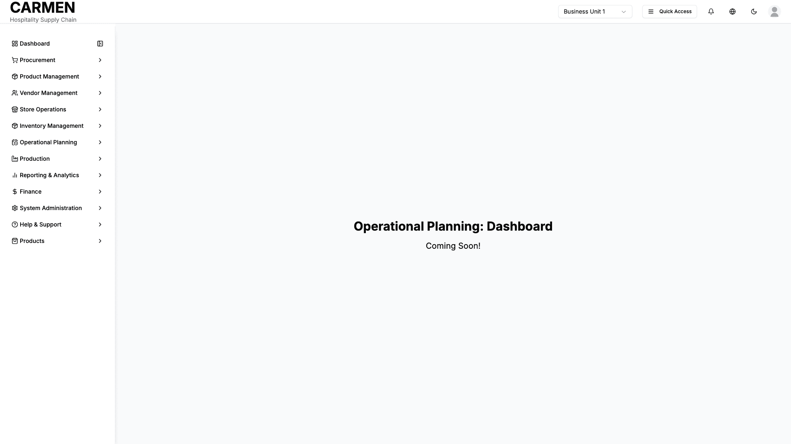

# Operational Dashboard with Fractional Tracking Screen Specification

**Title**: Operational Dashboard with Fractional Tracking Screen Specification  
**Module**: Reporting & Analytics  
**Function**: Kitchen Operations Management  
**Screen**: Kitchen Operations Dashboard  
**Version**: 1.0  
**Date**: January 14, 2025  
**Status**: Based on Actual Source Code Analysis  

## Document History

| Version | Date | Author | Changes |
|---------|------|--------|---------|
| 1.0.0 | 2025-11-19 | Documentation Team | Initial version |
## Implementation Overview

**Purpose**: This real-time operational dashboard provides comprehensive kitchen management capabilities with specialized fractional portion tracking. Users can monitor station performance, manage active orders with fractional components, track quality alerts, oversee inventory levels, and analyze operational performance metrics in real-time.

**File Locations**: `app/(main)/reporting-analytics/consumption-analytics/components/operational-dashboard.tsx`

**User Types**: Kitchen managers, station supervisors, quality control staff, inventory managers, and operations directors with kitchen oversight responsibilities.

**Current Status**: Fully implemented with sophisticated real-time monitoring, multi-tab interface, comprehensive fractional tracking, and automated alert systems.

## Visual Interface

*Operational planning dashboard showcasing fractional sales analytics, recipe management, and production forecasting capabilities*

## Layout & Navigation

**Header Section**: Dynamic header featuring chef hat icon with "Kitchen Operations Dashboard" title, real-time clock displaying current time, and status subtitle emphasizing live operational monitoring capabilities.

**Control Panel**: Right-aligned control buttons including alert visibility toggle (eye/eye-off icon), manual refresh button with loading animation, and live status badge indicating active real-time updates.

**Six-Column Metrics Grid**: Key operational indicators displayed in responsive card layout showing average prep time, order accuracy, kitchen efficiency, waste levels, staff utilization, and customer wait times with color-coded status indicators.

**Five-Tab Interface**: Main content organized into Station Status, Active Orders, Quality Control, Inventory, and Performance tabs providing comprehensive operational oversight capabilities.

**Real-Time Clock**: Continuously updating timestamp displaying current time in header section for precise operational timing reference.

## Data Display

**Operational Metrics Cards**:
- Average prep time with threshold monitoring and time-based status indicators
- Order accuracy percentage with target comparison and performance tracking
- Kitchen efficiency with warning thresholds and visual status dots
- Waste level monitoring with acceptable threshold comparisons
- Staff utilization rates with performance benchmarks
- Customer wait times with service level target tracking

**Station Status Information**:
- Individual station cards showing operational, warning, maintenance, or offline status
- Efficiency percentages with progress bar visualizations
- Current load versus capacity with overload warnings
- Active order counts per station with staff assignment details
- Temperature monitoring for temperature-sensitive stations
- Maintenance scheduling with next service dates

**Active Order Queue**:
- Order cards with priority indicators (urgent, high, normal) using color-coded dots
- Station assignment badges showing current processing location
- Status badges indicating queued, in-progress, quality check, ready, or completed states
- Fractional portion tracking showing quantity breakdowns and portion counts
- Staff assignment details with responsible team member identification
- Time tracking with start times and estimated completion timestamps

**Quality Alert System**:
- Severity-based alert cards with critical, high, medium, and low classifications
- Alert type indicators for temperature, timing, portioning, allergen, and waste issues
- Station-specific alert targeting with location identification
- Action requirement descriptions with specific resolution steps
- Assignment tracking showing responsible staff or teams
- Time stamps indicating when alerts were detected

**Inventory Alert Monitoring**:
- Urgency-based inventory alerts with critical, high, medium, and low classifications
- Category identification for fractional, whole, and ingredient items
- Current level versus minimum level comparisons with precise measurements
- Depletion time estimates based on current consumption patterns
- Supplier information for reorder processing
- Recommended reorder quantities with unit specifications

## User Interactions

**Dashboard Controls**:
- Alert visibility toggle allowing users to show or hide alert panels
- Manual refresh button enabling immediate data updates with visual feedback
- Live status indicator providing real-time update confirmation

**Station Management**:
- Individual station cards with hover effects for additional interaction
- Status monitoring with visual indicators for operational health
- Load monitoring with capacity management insights
- Temperature tracking with threshold alert capabilities

**Order Queue Management**:
- Priority-based order organization with visual priority indicators
- Status progression tracking from queued to completed states
- Staff assignment visibility with team member identification
- Fractional portion tracking with precise quantity management
- Allergen identification with safety-focused badge display

**Alert Response System**:
- Quality alert cards with severity-based visual hierarchy
- Action requirement display with specific resolution guidance
- Assignment tracking for accountability and follow-up
- Time stamp tracking for response time monitoring

**Performance Analytics**:
- Hourly performance chart with efficiency, orders, and waste trending
- Multi-axis visualization showing correlated operational metrics
- Interactive tooltips providing detailed measurement information
- Trend analysis capabilities for operational optimization

## Role-Based Functionality

**Kitchen Manager Permissions**:
- Complete access to all dashboard tabs and operational metrics
- Station status management with full override capabilities
- Order queue management with priority adjustment authority
- Quality alert resolution with assignment and escalation powers
- Inventory alert management with reorder authorization
- Performance analysis with historical trend access

**Station Supervisor Permissions**:
- Station-specific monitoring focused on assigned areas
- Order management within designated station responsibilities
- Quality alert response for station-specific issues
- Basic inventory monitoring for station-relevant supplies
- Performance tracking for supervised station areas

**Quality Control Staff Permissions**:
- Comprehensive quality alert access with resolution tracking
- Temperature monitoring with threshold management
- Portioning accuracy oversight with calibration authority
- Allergen management with safety protocol enforcement
- Limited access to performance metrics related to quality measures

**Inventory Manager Permissions**:
- Complete inventory alert management with reorder capabilities
- Supply level monitoring across all categories (fractional, whole, ingredient)
- Supplier management with reorder processing authority
- Depletion forecasting with procurement planning access
- Performance metrics focused on inventory efficiency and waste reduction

## Business Rules & Validation

**Operational Thresholds**:
- Average prep time target of 15 minutes with warning at 12.5 minutes
- Order accuracy minimum of 95% with alerts below threshold
- Kitchen efficiency target of 90% with warning below 87%
- Waste level maximum of 5% with monitoring at 3.2%
- Staff utilization target range of 85-95% for optimal performance
- Customer wait time maximum of 8 minutes with service level alerts

**Station Status Rules**:
- Operational status requires efficiency above 85% and load below 90%
- Warning status triggered by efficiency below 85% or load above 90%
- Maintenance status assigned for scheduled or emergency maintenance
- Offline status for stations not currently operational or under repair

**Alert Generation Logic**:
- Quality alerts automatically generated based on threshold breaches
- Temperature alerts for refrigeration above safe limits or cooking temperatures
- Portioning alerts for variance above 5% from standard specifications
- Inventory alerts triggered when levels fall below minimum thresholds
- Critical alerts require immediate response within defined timeframes

**Fractional Portion Tracking**:
- Precise tracking of portion counts alongside whole item quantities
- Automatic calculation of fractional portions from whole items
- Allergen tracking specific to fractional portion requirements
- Staff assignment tracking for fractional portion preparation responsibility

## Current Limitations

**Mock Data Implementation**:
- Real-time metrics currently operate on sophisticated mock data structures
- Station status information uses simulated operational conditions
- Order queue data represents realistic scenarios but requires live integration
- Alert systems operate on simulated threshold breaches and conditions

**Integration Dependencies**:
- Kitchen equipment integration pending for real-time temperature monitoring
- POS system connection needed for actual order queue management
- Inventory management system integration required for live stock levels
- Staff scheduling system connection needed for accurate utilization metrics

**Advanced Features**:
- Predictive analytics for operational optimization in development
- Automated alert escalation based on response times pending implementation
- Machine learning for efficiency optimization requiring historical data
- Advanced reporting features awaiting full data integration

## Fractional Tracking Specific Features

**Fractional Order Management**:
- Detailed tracking of fractional portions within each order item
- Precise quantity breakdowns showing whole items and fractional components
- Preparation time calculations specific to fractional portion requirements
- Staff assignment tracking for fractional portion preparation tasks

**Fractional Quality Control**:
- Portioning consistency monitoring with 5% variance thresholds
- Fractional-specific quality alerts for portion accuracy and consistency
- Calibration requirements for portioning equipment used in fractional preparation
- Quality assurance protocols specific to fractional item standards

**Fractional Inventory Integration**:
- Category-specific inventory tracking for fractional items (cheese wheels, specialty ingredients)
- Depletion calculations based on fractional sales consumption patterns
- Reorder quantity recommendations accounting for fractional usage rates
- Supplier management specific to fractional ingredient categories

**Performance Impact Analysis**:
- Efficiency metrics incorporating fractional preparation complexity
- Waste tracking specific to fractional portion preparation and service
- Staff utilization calculations including fractional preparation time requirements
- Customer wait time analysis accounting for fractional preparation complexity

**Real-Time Monitoring Features**:
- Live status updates every second with precise timestamp display
- Automatic refresh capabilities with user-controlled intervals
- Visual status indicators with color-coded operational health
- Alert visibility controls for focused operational management

The Kitchen Operations Dashboard provides comprehensive real-time operational oversight with specialized support for fractional portion tracking and management. The interface combines sophisticated monitoring capabilities with intuitive navigation, enabling kitchen staff at all levels to maintain optimal operational efficiency while ensuring quality standards and effective resource utilization.