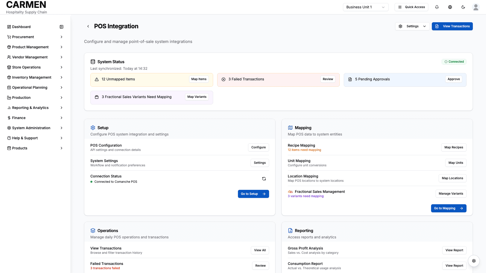

# POS Integration with Fractional Sales Screen Specification

**Title**: POS Integration with Fractional Sales Screen Specification  
**Module**: System Administration  
**Function**: POS Integration Management  
**Screen**: POS Integration Dashboard  
**Version**: 1.0  
**Date**: January 14, 2025  
**Status**: Based on Actual Source Code Analysis  

## Document History

| Version | Date | Author | Changes |
|---------|------|--------|---------|
| 1.0.0 | 2025-11-19 | Documentation Team | Initial version |
## Implementation Overview

**Purpose**: This screen serves as a comprehensive control center for managing point-of-sale system integrations with special emphasis on fractional sales management. Users can monitor system health, configure POS connections, manage recipe mappings, and handle fractional sales variants like pizza slices and cake portions.

**File Locations**: `app/(main)/system-administration/system-integrations/pos/page.tsx`

**User Types**: System administrators, IT staff, integration managers, and operations supervisors with POS integration privileges.

**Current Status**: Fully implemented with sophisticated fractional sales monitoring, multi-category organizational structure, and real-time system status tracking.

## Visual Interface

*POS Integration dashboard showing system status, fractional sales monitoring, and comprehensive integration management controls for Carmen hospitality ERP*

## Layout & Navigation

**Header Area**: Clean navigation with back button returning to system integrations overview, page title "POS Integration", and action buttons grouped in the top-right corner including settings dropdown and "View Transactions" button.

**System Status Banner**: Prominent status card immediately below header displaying connection status, last synchronization time, and color-coded alert badges for system issues requiring attention.

**Four-Column Grid Layout**: Main content organized into Setup, Mapping, Operations, and Reporting sections, each contained within hover-responsive cards with distinct visual styling.

**Recent Activity Section**: Bottom section displays transaction history table with detailed activity logs including fractional sales events.

## Data Display

**Connection Status Indicators**: 
- Live connection badge showing green "Connected" or red "Disconnected" status
- Last synchronization timestamp displaying "Today at 14:32" format
- System health metrics including unmapped items count, failed transactions, and pending approvals

**Alert Badge System**:
- Amber badges for unmapped items with counts and direct action links
- Red badges for failed transactions requiring review
- Blue badges for pending approvals awaiting action  
- Purple badges specifically for fractional sales variants needing mapping

**Progress Tracking**:
- Sales progress bar showing daily performance against targets
- Percentage completion with actual vs. target amounts
- Real-time sales figures updating throughout the day

**Activity Log Table**:
- Timestamp column with precise time entries
- Type badges color-coded by activity category
- Detailed descriptions of system events and transactions
- Status indicators showing success, pending, or error states
- Quick action buttons for immediate response to issues

## User Interactions

**Settings Management**: 
- Dropdown menu providing access to POS configuration and system settings
- Direct links to configuration pages for API settings and workflow preferences
- Connection refresh button for manual synchronization

**Navigation Actions**:
- Category-specific action buttons leading to detailed management pages
- "Go to Setup", "Go to Mapping", "Go to Operations", and "Go to Reports" buttons
- Quick-access buttons within alert badges for immediate issue resolution

**Mapping Interface**:
- Recipe mapping button connecting to POS item management
- Unit mapping for conversion configurations
- Location mapping for multi-site operations
- Specialized fractional sales variant management with pizza and cake icons

**Transaction Management**:
- View all transactions button accessing complete history
- Failed transaction review with filtering capabilities
- Stock-out approval workflow for inventory exceptions

## Role-Based Functionality

**System Administrator Permissions**:
- Full access to all POS configuration settings
- Complete mapping management capabilities
- System status monitoring and alert resolution
- Integration health diagnostics and troubleshooting

**Integration Manager Permissions**:
- Recipe and variant mapping responsibilities
- Transaction review and approval workflows
- Reporting access for operational analysis
- Limited configuration access for routine adjustments

**Operations Supervisor Permissions**:
- Read-only access to system status and health metrics
- Transaction viewing and basic reporting capabilities
- Alert notifications without administrative access
- Fractional sales monitoring and tracking

**Kitchen Manager Permissions**:
- Fractional sales variant viewing and monitoring
- Recipe mapping verification for operational items
- Basic transaction history for sold items
- Limited access focused on kitchen-relevant POS data

## Business Rules & Validation

**Connection Requirements**:
- System must maintain active connection to POS system for real-time operations
- Failed connection attempts trigger automatic retry sequences
- Manual refresh available for connection diagnostics and troubleshooting

**Mapping Validation**:
- All POS items must be mapped to system recipes before transaction processing
- Fractional sales variants require specific yield ratios and portion definitions
- Unit conversions must be validated against standard measurement systems
- Location mappings verified against active system locations

**Alert Thresholds**:
- Unmapped items generate amber-level warnings requiring resolution
- Failed transactions create red-level alerts demanding immediate attention
- Pending approvals trigger blue-level notifications for workflow completion
- Fractional variant mapping issues generate purple-level specialized alerts

**Approval Workflows**:
- Stock-out situations require supervisory approval before continuing sales
- Failed transactions must be reviewed and resolved before system continuation
- Fractional sales mapping changes require validation before implementation

## Current Limitations

**Mock Data Implementation**: 
- System status data currently uses static mock values for demonstration
- Transaction counts and alert numbers are placeholder implementations
- Real-time synchronization timestamps are simulated for development

**Integration Dependencies**: 
- Backend POS system connections not yet fully implemented
- Live transaction processing pending full API integration
- Real-time inventory deduction for fractional sales in development phase

**Reporting Features**: 
- Advanced analytics dashboards show placeholder data
- Gross profit analysis calculations using mock financial data
- Consumption reports pending actual transaction data integration

## Fractional Sales Specific Features

**Pizza Slice Management**:
- Visual pizza icon indicators in mapping and activity sections
- Automatic inventory deduction when individual slices are sold
- Variant tracking for different pizza sizes and slice counts
- Integration with recipe yield calculations for accurate costing

**Cake Portion Management**:
- Cake icon representation throughout fractional sales interfaces
- Portion-based inventory management with automatic calculations
- Multiple yield variants for different cake sizes and serving options
- Real-time tracking of sold portions with inventory impact

**Multi-Yield Recipe Integration**:
- Recipe mapping supports multiple yield variants per base recipe
- Automatic portion calculations based on sold quantities
- Integration with operational planning for accurate forecasting
- Cost allocation across different serving sizes and portions

**Inventory Impact Tracking**:
- Real-time inventory deduction when fractional items are sold
- Automatic calculation of raw material usage based on portions
- Integration with consumption analytics for variance tracking
- Alert system for low inventory based on projected fractional sales

The POS Integration screen serves as the central command center for managing complex point-of-sale integrations while providing specialized support for fractional sales operations. The interface balances comprehensive system monitoring with intuitive navigation, enabling both technical administrators and operational staff to effectively manage their respective responsibilities within the integrated POS ecosystem.