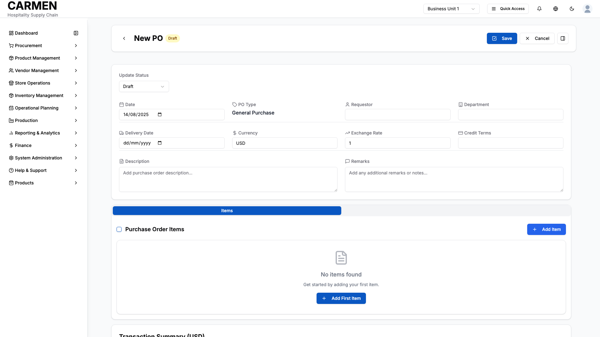

# Purchase Order Detail Screen Specification

**Module:** Procurement  
**Function:** Order Management  
**Screen:** Purchase Order Detail  
**Version:** 1.0  
**Date:** 2025-01-14  
**Status:** Based on Actual Source Code Analysis  

## Implementation Overview

**Purpose:** This screen provides comprehensive management of individual purchase orders throughout their entire lifecycle, from draft creation to final closure, including vendor coordination, goods receipt tracking, and financial oversight.

**File Locations:** 
- Main component: `app/(main)/procurement/purchase-orders/[id]/page.tsx`
- Detail page: `app/(main)/procurement/purchase-orders/components/PODetailPage.tsx`
- Item management: `app/(main)/procurement/purchase-orders/components/tabs/EnhancedItemsTab.tsx`

**User Types:** Purchasing staff, department managers, financial managers, administrative staff with appropriate procurement permissions

**Current Status:** Fully implemented with comprehensive order management capabilities, goods receipt integration, financial tracking, and activity monitoring

## Visual Interface

*Purchase Order detail interface showing comprehensive order management with header information fields (Date, PO Type, Requestor, Department, Delivery Date, Currency, Exchange Rate, Credit Terms), item management section with "Add Item" capabilities, Transaction Summary card, and save/cancel controls - captured from create form demonstrating the complete interface design for Carmen hospitality ERP*

## Layout & Navigation

**Header/Title Area:**
- Back navigation button (arrow icon) to return to purchase orders list
- "New PO" title displayed prominently with "Draft" status badge in header
- Save button (blue) and Cancel button for form submission and exit actions  
- Details panel toggle button (right side) for expanding additional information panels

**Action Buttons:**
- Primary save action prominently displayed in blue for form completion
- Cancel option available for discarding changes and returning to list
- Details panel toggle for accessing additional information and controls
- Status indicator shows current draft state with appropriate visual styling

**Layout Structure:**
- Two-column responsive layout with main content area and collapsible sidebar
- Main content contains order header information, tabbed interface, and financial summary
- Right sidebar houses comments/attachments and activity log when expanded
- Responsive design adapts to mobile with stacked layout

## Data Display

**Order Header Information:**
- Status update dropdown at top with "Draft" as current selection
- First row fields: Date (14/08/2025), PO Type (General Purchase), Requestor, and Department
- Second row fields: Delivery Date (date picker), Currency (USD), Exchange Rate (1), and Credit Terms  
- Full-width Description text area with placeholder "Add purchase order description..."
- Full-width Remarks text area with placeholder "Add any additional remarks or notes..."
- All form fields are active and editable with appropriate input controls and placeholders

**Status Management:**
- Current status prominently displayed with color-coded badge
- Status dropdown available in edit mode with all available status options
- Status change confirmation dialog with context-specific messaging
- Reason requirement for sensitive status changes (Voided, Cancelled)

**Tabbed Content Areas:**
- **Items Tab**: Comprehensive table view with item details, quantities, vendor information, delivery tracking, and order status
- **Documents Tab**: Related document tracking and management (visible only for existing orders)  
- **Activities Tab**: Order history and status change tracking (implementation varies by configuration)

**Items Table Display:**
- **Expandable Rows**: Click chevron to expand item details, auto-expand on hover option available
- **Multi-Column Layout**: Location & Status, Product Details, Ordered quantities, Received quantities, Pricing (role-dependent)
- **Status Indicators**: Color-coded badges for Pending, Ordered, Partial Receipt, Fully Received, Cancelled status
- **Progressive Disclosure**: Detailed item information revealed through expansion with visual hierarchy
- **Empty State Management**: "No items found" placeholder with document icon and "Add First Item" call-to-action

**Advanced Item Details (Expanded View):**
- **Inventory Information**: On-hand quantities, available stock, reorder levels with clickable details
- **Delivery Details**: Delivery dates, shipping addresses, delivery points with dropdown selection
- **Business Dimensions**: Cost centers, projects, departments, budget codes with autocomplete
- **Vendor & Pricing**: Vendor selection, catalog numbers, unit prices, discount terms with comparison tools
- **Receipt Tracking**: Goods received note references, inspection status, quality control notes

**Transaction Summary:**
- "Transaction Summary (USD)" header indicating currency context
- Currently shows empty state waiting for items to be added for calculation
- Will display subtotal, discounts, taxes, and final totals once items are populated
- Positioned at bottom of form to provide final order value summary
- Updates automatically as items are added, modified, or removed

## User Interactions

**Order Management:**
- Edit toggle switches entire form into edit mode with inline field editing
- Save operation validates all required fields and updates order data
- Delete operation requires confirmation dialog with warning message
- Status changes trigger specialized confirmation dialogs with appropriate messaging

**Form Elements:**
- **Date Pickers**: Calendar popup for delivery dates and required dates
- **Dropdown Selectors**: Product selection, vendor selection, delivery points, business dimensions
- **Number Inputs**: Quantities with decimal precision, automatic calculation updates
- **Text Areas**: Item descriptions, delivery notes with placeholder text and character limits
- **Checkboxes**: Tax and discount applications, bulk selection for multiple items

**Bulk Operations:**
- **Multi-Select**: Checkbox-based selection of multiple items with select all functionality
- **Bulk Actions**: Update Delivery Date, Change Vendor, Cancel Selected, Modify Quantities
- **Mixed Status Handling**: Smart dialog when selecting items with different order status
- **Status-Aware Actions**: Actions available based on current item status and user permissions

**Modal Dialogs:**
- **Item Details Form**: Full item editing interface with validation and save/cancel options
- **Vendor Comparison**: Side-by-side vendor pricing comparison with selection capability
- **Delivery Schedule**: Calendar-based delivery planning with constraint validation
- **Inventory Popups**: On-hand by location and outstanding purchase order details
- **Receipt History**: Goods received note details and quality inspection records

**Item Management:**
- Add item button opens comprehensive item details modal with progressive disclosure
- Individual item rows support expand/collapse for detailed view with visual hierarchy
- Enhanced item editor with pricing, inventory, delivery, and specification details
- Search and filter functionality for item discovery with real-time suggestions

**Workflow Actions:**
- **Floating Action Panel**: Context-sensitive order management buttons positioned bottom-right
- **Smart Decision Engine**: Analyzes order status to determine available actions
- **Status Progression**: Send Order, Receive Items, Close Order, Cancel Order options
- **Comment Requirements**: Mandatory comments for certain workflow actions like cancellations

**Export Functionality:**
- Export dialog with format selection (PDF, Excel, CSV)
- Section selection checkboxes to customize export content
- Format-specific options for different export types
- Progress indication during export processing

**Communication Features:**
- Comments section with threaded conversation support
- Attachment handling for document uploads and downloads
- Real-time comment posting with user attribution
- File attachment icons with download capabilities

## Role-Based Functionality

**Purchasing Staff Permissions:**
- Full order creation, modification, and management capabilities
- Access to all vendor communication features
- Complete item management including additions, modifications, and deletions
- Status management for operational workflow control
- Export and printing capabilities for vendor coordination

**Department Manager Permissions:**
- Order review and approval workflow participation
- Comment and communication access for coordination
- Limited editing capabilities based on order status
- Activity monitoring and oversight functions
- Export access for reporting and analysis

**Financial Manager Permissions:**
- Financial summary review and override capabilities
- Exchange rate and currency management
- Discount and tax adjustment permissions
- Cost analysis and variance reporting access
- Financial document export and audit trail review

**Administrative Staff Permissions:**
- Read-only access to order information for support purposes
- Activity log visibility for troubleshooting assistance
- Basic export capabilities for administrative reporting
- Limited comment access for operational coordination

## Business Rules & Validation

**Field Requirements:**
- Purchase order number is automatically generated for new orders
- Vendor selection is mandatory before order can be sent
- At least one item is required before order completion
- Order date defaults to current date but can be modified
- Currency and exchange rate must be specified for multi-currency orders

**Status Workflow Logic:**
- Draft orders can be edited freely and status changed to any state
- Sent orders require reason for status changes to Voided or Cancelled
- Partial orders automatically update based on goods receipt progress
- Closed orders prevent further modifications except for comments
- Voided and Cancelled orders preserve data but prevent operational changes

**Financial Validation:**
- All monetary calculations automatically update when item details change
- Exchange rate validation ensures reasonable values and prevents zero rates
- Tax and discount percentages must be within acceptable ranges
- Override capabilities allow manual adjustment with audit trail creation
- Base currency conversion maintains precision for financial reporting

**Item Management Rules:**
- Item quantities must be positive values for active orders
- Unit prices support decimal precision for accurate costing
- Tax inclusion settings affect calculation methods appropriately
- Received quantity tracking prevents over-receipt situations
- Inventory information provides context for purchasing decisions

## Current Limitations

**Backend Integration Gaps:**
- Save operations currently log to console instead of persisting to database
- Email functionality displays console output rather than sending actual emails
- Print operations show placeholder implementation without PDF generation
- Export features demonstrate UI flow but don't generate actual files

**Missing Integration Features:**
- Goods receipt integration shows placeholder implementations for receiving workflow
- Vendor communication lacks direct email integration with procurement systems
- Inventory updates don't automatically reflect in stock management systems
- Financial posting requires manual integration with accounting systems

**Placeholder Implementations:**
- Activity log uses mock data instead of real user action tracking
- Related documents tab shows sample data rather than actual document relationships
- User authentication context uses hardcoded values instead of actual user sessions
- Attachment handling demonstrates UI without file storage implementation

**Known Technical Issues:**
- Status change history maintains local state but doesn't persist across sessions
- Comment threading displays in UI but lacks backend conversation management
- Bulk operations on items show UI patterns but need server-side processing
- Real-time updates require polling or websocket implementation for multi-user scenarios