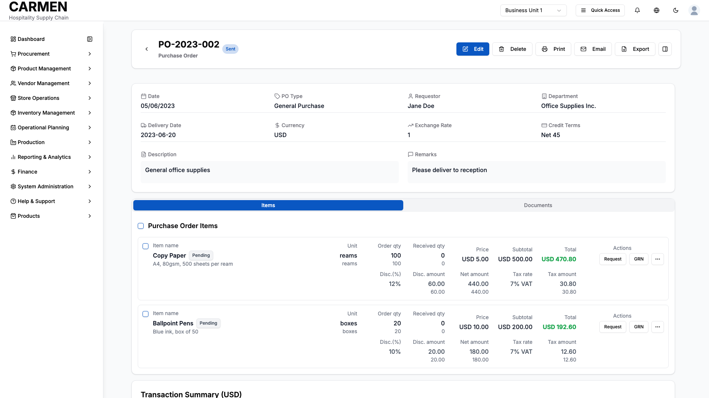

# Purchase Orders List Screen Specification

**Module:** Procurement Management  
**Function:** Purchase Order Management  
**Screen:** Purchase Orders List  
**Version:** 1.0  
**Date:** August 14, 2025  
**Status:** Based on Actual Source Code Analysis  

## Implementation Overview

**Purpose:** This screen provides a comprehensive interface for managing and tracking all purchase orders from creation to fulfillment. Users can view, filter, search, and perform bulk operations on purchase orders while tracking their status throughout the procurement lifecycle.

**File Locations:** 
- Main component: `/app/(main)/procurement/purchase-orders/page.tsx`
- Data table: `/components/purchase-orders-data-table.tsx`
- Column definitions: `/components/purchase-orders-columns.tsx`
- Card view: `/components/purchase-orders-card-view.tsx`

**User Types:** All procurement team members, department managers, purchasing staff, and financial managers with appropriate permissions

**Current Status:** Fully implemented with table and card views, comprehensive filtering, and purchase order creation workflows

## Visual Interface

*Purchase Orders management interface showing populated data with first record selected, showcasing comprehensive list view with filtering, search capabilities, and purchase order creation workflows for Carmen hospitality ERP*

## Layout & Navigation

### Header Area
- **Page Title:** "Purchase Orders" displayed prominently at the top left
- **Description:** "Manage and track all purchase orders from creation to fulfillment" appears below the title
- **Primary Action Button:** "New Purchase Order" dropdown button with chevron icon positioned at top right
- **Secondary Actions:** Export and Print buttons positioned next to the primary action

### Action Buttons
- **New Purchase Order Dropdown:** Contains multiple creation options:
  - Create Blank PO (direct creation)
  - Create from Purchase Requests (opens selection dialog)
  - Create from Template (placeholder functionality)
  - Create Recurring PO (placeholder functionality)
- **Export Button:** Allows users to export purchase order data
- **Print Button:** Enables printing of purchase order lists or selected items

### Layout Structure
- **Responsive Design:** Adapts between desktop and mobile layouts
- **Container Layout:** Full-width container with proper spacing and padding
- **Flexible Views:** Toggle between table and card views using view mode controls

## Data Display

### Table View Structure
- **Selection Column:** Checkboxes for individual and bulk selection of purchase orders
- **PO Number:** Clickable links that navigate to detailed purchase order views
- **Vendor:** Displays vendor name with proper formatting
- **Order Date:** Shows order creation date in localized format
- **Delivery Date:** Expected delivery date or "N/A" if not set
- **Status:** Color-coded status badges indicating current purchase order state
- **Amount:** Right-aligned monetary values with proper formatting
- **Currency:** Currency codes displayed for each purchase order
- **Actions:** Dropdown menu with Print, Download PDF, and Delete options

### Card View Structure
- **Responsive Grid:** Automatically adjusts from 1 to 3 columns based on screen size
- **Card Headers:** Dark background section with PO number, date, and status badge
- **Vendor Information:** Clearly labeled vendor details
- **Key Metrics Grid:** Two-column layout showing delivery date and currency
- **Financial Summary:** Net amount, tax amount, and total amount with clear hierarchy
- **Hover Actions:** Action menu appears on card hover for quick access

### Status Indicators
- **Status Badges:** Color-coded badges representing different purchase order states:
  - Draft (initial creation)
  - Open (ready for processing)
  - Sent (transmitted to vendor)
  - Partial Received (partially fulfilled)
  - Received (fully received)
  - Closed (completed)
  - Cancelled (terminated)

### Data Formatting
- **Currency Values:** Properly formatted with decimal places and localization
- **Dates:** Consistent date formatting throughout the interface
- **Numbers:** Right-aligned numerical values for easy scanning
- **Text:** Truncated long text with proper spacing and typography

## User Interactions

### Search and Filtering
- **Global Search:** Text input field that searches across PO numbers, vendors, and descriptions
- **Quick Filters:** Dropdown buttons for:
  - Status filtering (All Status, Draft, Open, Sent, etc.)
  - Delivery date filtering (All Delivery Dates, Overdue, Due Today, etc.)
- **Advanced Filters:** Comprehensive filtering system with multiple criteria and operators
- **Active Filter Display:** Visual badges showing applied filters with removal options
- **Clear All Filters:** Single button to remove all applied filter criteria

### Sorting and Organization
- **Column Sorting:** Clickable column headers with sort direction indicators
- **Multi-level Sorting:** Ability to sort by multiple criteria
- **Sort Persistence:** Maintains sort preferences during session

### View Controls
- **View Mode Toggle:** Switch between table and card views using icon buttons
- **Column Visibility:** Dropdown menu to show/hide specific table columns
- **Page Size Control:** Adjust number of items displayed per page

### Bulk Operations
- **Multi-Select:** Checkbox selection for individual items and select-all functionality
- **Selection Counter:** Display showing number of selected items
- **Bulk Actions:** Operations available for multiple selected purchase orders

### Navigation and Interaction
- **Row/Card Click:** Navigate to detailed purchase order view
- **Link Navigation:** Direct links for PO numbers that open detail pages
- **Action Menus:** Context-sensitive dropdown menus with relevant options
- **Modal Dialogs:** Pop-up interfaces for complex operations like creating POs from PRs

## Purchase Order Creation Workflows

### Create from Purchase Requests
- **Selection Dialog:** Modal interface displaying available approved purchase requests
- **Search and Filter:** Find specific purchase requests by number, description, or vendor
- **Visual Grouping:** Color-coded rows showing which PRs will be grouped by vendor and currency
- **Smart Grouping Logic:** Automatically groups PRs with same vendor and currency into single POs
- **Preview Summary:** Shows how selected PRs will be grouped and estimated PO count
- **Batch Creation:** Creates multiple POs when PRs have different vendor/currency combinations

### Purchase Request Selection Interface
- **Sortable Table:** Columns for requisition number, date, vendor, description, delivery date, amount, and currency
- **Multi-Select:** Checkbox selection with select-all functionality
- **Grouping Preview:** Real-time display of how selections will be grouped
- **Creation Summary:** Shows resulting PO count and grouping breakdown

## Role-Based Functionality

### All Users
- **View Access:** Can view purchase order list and basic information
- **Search and Filter:** Can use all search and filtering capabilities
- **Navigation:** Can access detailed views of purchase orders
- **Export:** Can export purchase order data for reporting

### Purchasing Staff
- **Full Creation Access:** Can create new purchase orders using all available methods
- **Edit Capabilities:** Can modify purchase order details and status
- **Vendor Management:** Access to vendor-related functions and selection
- **Conversion Rights:** Can convert approved purchase requests to purchase orders
- **Bulk Operations:** Can perform bulk actions on multiple purchase orders

### Department Managers
- **Review Access:** Can review purchase orders from their department
- **Approval Functions:** Can approve purchase orders within their authority limits
- **Budget Oversight:** Can monitor spending and budget compliance
- **Status Updates:** Can update purchase order status and add notes

### Financial Managers
- **Financial Oversight:** Can view all financial aspects of purchase orders
- **Approval Authority:** Can approve high-value purchase orders
- **Currency Management:** Can handle multi-currency purchase orders
- **Financial Reporting:** Access to financial analytics and reporting features

### Administrative Users
- **System Management:** Can manage purchase order templates and recurring orders
- **User Management:** Can assign permissions and manage user access
- **Configuration:** Can configure approval workflows and system settings

## Business Rules & Validation

### Purchase Order Creation Rules
- **Vendor Selection:** Must select valid vendor before creating purchase order
- **Currency Consistency:** All items in a PO must use the same currency
- **Approval Requirements:** POs above certain thresholds require additional approvals
- **Delivery Date Validation:** Delivery dates must be in the future and realistic

### Status Workflow Logic
- **Linear Progression:** Status changes follow logical sequence (Draft → Open → Sent → Received)
- **Reversibility Rules:** Some status changes can be reversed while others cannot
- **Permission Gates:** Status changes require appropriate user permissions
- **Automatic Updates:** System automatically updates status based on receiving transactions

### Data Validation Rules
- **Required Fields:** PO number, vendor, order date, and at least one line item required
- **Numerical Validation:** Amounts must be positive numbers with proper decimal places
- **Date Validation:** Dates must be valid and follow logical sequence
- **Duplicate Prevention:** System prevents duplicate PO numbers

### Grouping and Consolidation Rules
- **Vendor Consistency:** PRs can only be grouped if they have the same vendor
- **Currency Matching:** PRs must have matching currency to be consolidated
- **Delivery Alignment:** Considers delivery dates when grouping requests
- **Authority Limits:** Respects user authority limits when creating consolidated POs

## Filtering and Search Capabilities

### Quick Filter Options
- **Status-Based Filtering:**
  - All Status (shows all purchase orders)
  - Draft (newly created, not yet finalized)
  - Open (approved and ready for processing)
  - Sent (transmitted to vendor)
  - Partial Received (some items received)
  - Received (all items received)
  - Closed (completed transactions)
  - Cancelled (terminated orders)

- **Delivery Date Filtering:**
  - All Delivery Dates (no date restriction)
  - Overdue (past due delivery dates)
  - Due Today (deliveries scheduled for today)
  - Due This Week (deliveries in current week)
  - Due Next Week (deliveries in following week)
  - Due This Month (deliveries in current month)

### Advanced Filtering System
- **Multi-Criteria Filtering:** Combine multiple filter conditions
- **Operator Selection:** Choose from equals, contains, greater than, less than, etc.
- **Value Input Methods:** Text input, dropdowns, date pickers based on field type
- **Filter Persistence:** Maintains filter settings during session
- **Filter Management:** Save, load, and share filter configurations

### Search Functionality
- **Global Search:** Searches across multiple fields simultaneously
- **Real-Time Results:** Updates results as user types
- **Search Highlighting:** Highlights matching text in results
- **Search History:** Remembers recent search terms

## Pagination and Performance

### Data Management
- **Paginated Loading:** Loads data in manageable chunks for performance
- **Page Size Options:** Users can adjust number of items per page
- **Navigation Controls:** First, previous, next, and last page buttons
- **Page Information:** Shows current page number and total pages
- **Jump to Page:** Direct page number input for large datasets

### Performance Optimization
- **Lazy Loading:** Loads additional data as needed
- **Caching:** Maintains recently viewed data in memory
- **Responsive Updates:** Efficiently updates display when data changes
- **Minimal Re-renders:** Optimized component updates for smooth performance

## Current Limitations

### Backend Integration
- **Mock Data Usage:** Currently displays sample data instead of live database connections
- **API Endpoints:** Create, update, and delete operations log to console but don't persist
- **Real-time Updates:** Status changes and data updates are simulated rather than synchronized
- **Search Limitations:** Search operates on local data rather than server-side queries

### Feature Placeholders
- **Template Creation:** "Create from Template" option exists but functionality not implemented
- **Recurring Orders:** "Create Recurring PO" displays but lacks backend support
- **Advanced Reporting:** Export and print functions are placeholder implementations
- **Notification System:** Status change notifications are not yet implemented

### Integration Gaps
- **Goods Receipt Connection:** Links to GRN system exist but integration not complete
- **Vendor Communication:** Email and communication features are placeholder text
- **Approval Workflows:** Approval routing is simulated rather than enforced
- **Financial Integration:** Accounting system connections are not yet established

### Known Issues
- **Filter Persistence:** Applied filters reset on page refresh
- **Bulk Action Limitations:** Some bulk operations only show confirmation dialogs
- **Mobile Optimization:** Some advanced features may have reduced functionality on mobile devices
- **Performance at Scale:** Large datasets may experience slower performance without backend pagination

### Development Notes
- **Component Structure:** Well-organized component hierarchy ready for production integration
- **Type Safety:** Comprehensive TypeScript interfaces ensure data consistency
- **Responsive Design:** Mobile-first approach with progressive enhancement
- **Accessibility:** Basic accessibility features implemented but could be enhanced
- **Testing Coverage:** Manual testing performed but automated test suite needed