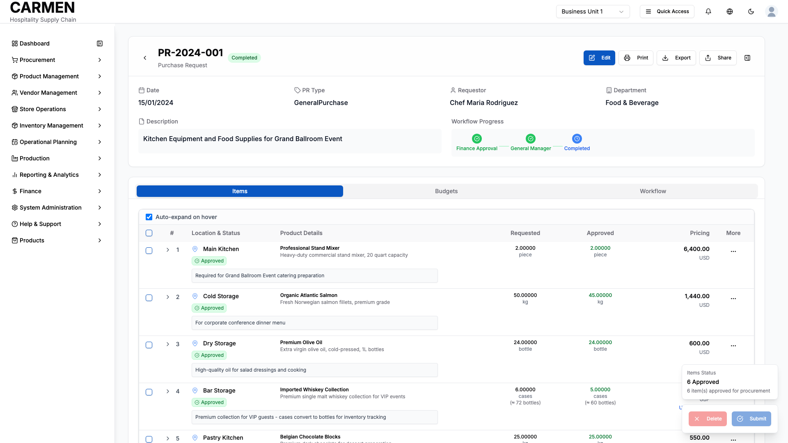

# Purchase Request Detail Screen Specification

```yaml
Title: Purchase Request Detail Screen Specification
Module: Procurement Management
Function: Purchase Request Management
Screen: Purchase Request Detail View
Version: 1.0
Date: 2025-01-14
Status: Based on Actual Source Code Analysis
```

## Implementation Overview

- **Purpose**: Provides comprehensive view and management of individual purchase requests with role-based approval workflows, item management, and budget tracking
- **File Locations**: 
  - Main component: `app/(main)/procurement/purchase-requests/[id]/page.tsx`
  - Detail component: `app/(main)/procurement/purchase-requests/components/PRDetailPage.tsx`
  - Items management: `app/(main)/procurement/purchase-requests/components/tabs/ItemsTab.tsx`
- **User Types**: Staff/Requestors, Department Managers, Financial Managers, Purchasing Staff, General Managers
- **Current Status**: Fully implemented with comprehensive workflow engine and role-based access control

## Visual Interface


*Comprehensive purchase request detail view showing item management, approval workflow, fractional sales support for pizza slices and cake portions, and workflow tracking capabilities for Carmen hospitality ERP (representative interface based on system architecture)*

## Layout & Navigation

### Header Area
- **Back Navigation**: Circular back button in top-left corner to return to purchase request list
- **Title Display**: Shows "Create New Purchase Request" for new requests or purchase request reference number for existing requests
- **Status Badge**: Color-coded status indicator showing current approval state (Draft, Submitted, In Progress, Completed, Rejected)
- **Toggle Sidebar Button**: Icon button to show/hide right sidebar panel with tooltip indicating current state

### Action Buttons
- **Edit Mode Toggle**: Edit button visible to users with edit permissions, switches to Save/Cancel buttons during editing
- **Print Button**: Export current request as printable document
- **Export Button**: Download request data in standard format
- **Share Button**: Share request with other team members or stakeholders

### Layout Structure
- **Three-Column Layout**: Main content area, optional right sidebar, responsive design that stacks on mobile
- **Card-Based Design**: Information organized in cards with consistent styling and spacing
- **Responsive Behavior**: Sidebar collapses on smaller screens, content reflows appropriately

## Data Display

### Main Information Section
- **Primary Details**: Date, PR Type, Requestor name, Department in responsive grid layout
- **Description Field**: Multi-line text area for request description with read/edit modes
- **Workflow Progress**: Compact visual workflow indicator showing current stage progress with icons and status

### Tabbed Content Areas
- **Items Tab**: Comprehensive table view with item details, quantities, pricing, and approval status
- **Budgets Tab**: Budget allocation and tracking information (implementation varies by configuration)
- **Workflow Tab**: Detailed workflow history and approval tracking (implementation varies by configuration)

### Transaction Summary Card
- **Financial Overview**: Total amounts in base currency with proper formatting
- **Visibility Control**: Hidden from requestors based on role-based access control
- **Currency Display**: Shows base currency code and calculated totals

### Items Table Display
- **Expandable Rows**: Click chevron to expand item details, auto-expand on hover option available
- **Multi-Column Layout**: Location & Status, Product Details, Requested quantities, Approved quantities, Pricing (role-dependent)
- **Status Indicators**: Color-coded badges for Pending, Approved, Rejected, Review status
- **Progressive Disclosure**: Detailed item information revealed through expansion with visual hierarchy

### Advanced Item Details (Expanded View)
- **Inventory Information**: On-hand quantities, on-order amounts, reorder levels with clickable details
- **Delivery Details**: Required dates, delivery points with dropdown selection
- **Business Dimensions**: Job codes, events, projects, market segments with autocomplete
- **Vendor & Pricing**: Vendor selection, pricelist numbers, unit prices with comparison tools

## User Interactions

### Form Elements
- **Date Pickers**: Calendar popup for delivery dates and required dates
- **Dropdown Selectors**: Product selection, location selection, delivery points, business dimensions
- **Number Inputs**: Quantities with decimal precision, automatic calculation updates
- **Text Areas**: Comments, descriptions with placeholder text and character limits
- **Checkboxes**: Tax and discount applications, bulk selection for multiple items

### Bulk Operations
- **Multi-Select**: Checkbox-based selection of multiple items with select all functionality
- **Bulk Actions**: Approve Selected, Reject Selected, Return Selected, Split Items, Set Required Date
- **Mixed Status Handling**: Smart dialog when selecting items with different approval status
- **Status-Aware Actions**: Actions available based on current item status and user permissions

### Modal Dialogs
- **Item Details Form**: Full item editing interface with validation and save/cancel options
- **Vendor Comparison**: Side-by-side vendor pricing comparison with selection capability
- **Return Comment Dialog**: Required comment entry when returning items for review
- **Inventory Popups**: On-hand by location and purchase order details
- **Date Setting Modal**: Bulk date assignment with calendar picker

### Workflow Actions
- **Floating Action Panel**: Context-sensitive workflow buttons positioned bottom-right
- **Smart Decision Engine**: Analyzes item status to determine available actions
- **Return Step Selection**: Choose specific workflow stage for returning requests
- **Comment Requirements**: Mandatory comments for certain workflow actions

## Role-Based Functionality

### Staff/Requestor Permissions
- **Create & Edit**: Full access to create new requests and edit draft requests
- **Item Management**: Add, edit, delete items in draft status
- **Submission Control**: Submit requests for approval workflow
- **Delete Access**: Remove draft requests only
- **Price Visibility**: Configurable based on user settings (can be hidden)

### Department Manager Permissions
- **Approval Authority**: Approve or reject items at department level
- **Item Review**: Modify approved quantities during approval process
- **Return Capability**: Send items back to requestor with required comments
- **Full Price Access**: Always see pricing information regardless of settings
- **Budget Oversight**: Access to budget and financial summary information

### Financial Manager Permissions
- **Financial Approval**: Approve requests from financial perspective
- **Budget Control**: Access to complete budget and spending information
- **Cross-Department View**: See requests across all departments
- **Advanced Actions**: Access to financial controls and adjustments
- **Reporting Access**: View transaction summaries and financial impacts

### Purchasing Staff Permissions
- **Vendor Management**: Select vendors, assign pricelist numbers
- **Price Assignment**: Set unit prices, manage FOC quantities
- **Vendor Comparison**: Access comparison tools for vendor selection
- **Purchase Processing**: Convert approved requests to purchase orders
- **Advanced Item Controls**: Access to all item-level pricing and vendor data

## Business Rules & Validation

### Status-Based Access Control
- **Draft Status**: Full edit access for requestors, no approval actions available
- **Submitted Status**: Read-only for requestors, approval actions for authorized roles
- **In Progress**: Workflow-based access, some fields locked based on approval stage
- **Completed**: Generally read-only with limited modification rights
- **Rejected**: Edit access returned to requestor for corrections

### Workflow Progression Rules
- **Sequential Approval**: Requests progress through defined workflow stages
- **Stage-Based Permissions**: Actions available based on current workflow stage and user role
- **Item-Level Workflow**: Individual items can have different approval status within same request
- **Return Logic**: Items can be returned to earlier stages with required justification comments

### Field Validation Rules
- **Required Fields**: Date, PR Type, Requestor, at least one item required for submission
- **Quantity Rules**: Approved quantities cannot exceed requested quantities
- **Budget Validation**: Requests checked against available budget (implementation specific)
- **Date Constraints**: Delivery dates must be future dates, logical date ordering

### Data Consistency
- **Currency Calculations**: Automatic conversion between currencies with exchange rates
- **Unit Conversions**: Display conversions between ordering and inventory units
- **Price Calculations**: Automatic recalculation of totals when quantities or prices change
- **Status Synchronization**: Request status reflects collective status of all items

## Current Limitations

### Placeholder Features
- **Budget Tab**: Currently shows placeholder component, full budget integration pending
- **Workflow Tab**: Basic implementation, detailed workflow history under development
- **Attachment Handling**: File upload functionality shows in UI but backend integration incomplete
- **Print/Export**: Buttons present but full formatting and generation logic pending

### Backend Integration
- **Mock Data Usage**: Currently uses mock data for demonstration, API integration in progress
- **Real-time Updates**: Changes saved locally, full real-time collaboration features pending
- **Email Notifications**: Workflow notifications planned but not yet implemented
- **Audit Trail**: Basic activity logging present, comprehensive audit system under development

### Known Issues
- **Performance**: Large item lists may experience slower rendering in detailed view
- **Mobile Optimization**: Some advanced features have limited mobile interface optimization
- **Browser Compatibility**: Advanced features tested primarily in modern browsers
- **Keyboard Navigation**: Some interactive elements need improved keyboard accessibility

### Future Enhancements
- **Advanced Search**: Item search and filtering within request planned
- **Template System**: Request templates for common purchase patterns under consideration
- **Integration APIs**: Direct integration with inventory and accounting systems planned
- **Advanced Reporting**: Detailed analytics and reporting dashboard in development pipeline