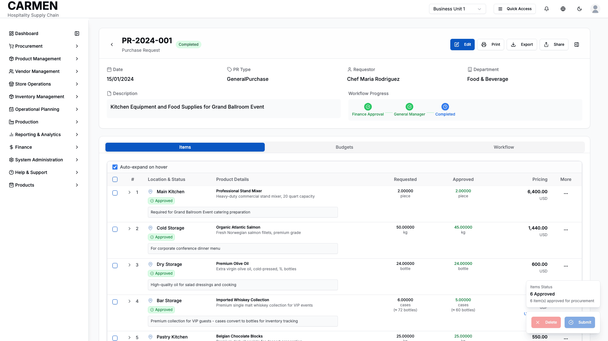

# Purchase Requests List Screen Specification

```yaml
Title: Purchase Requests List Screen Specification
Module: Procurement Management
Function: Purchase Request Management
Screen: Purchase Requests List
Version: 1.0
Date: 2025-08-14
Status: Based on Actual Source Code Analysis
```

## Implementation Overview

**Purpose**: Centralized dashboard for viewing, managing, and tracking all purchase requests across the organization with comprehensive filtering, search, and approval workflow capabilities.

**File Locations**: 
- Main Page: app/(main)/procurement/purchase-requests/page.tsx
- Primary Component: components/ModernPurchaseRequestList.tsx
- Data Table: components/purchase-requests-data-table.tsx
- Card View: components/purchase-requests-card-view.tsx

**User Types**: All authenticated users with role-based access to purchase request functionality including staff, department managers, financial managers, purchasing staff, and chefs.

**Current Status**: Fully implemented with mock data integration, comprehensive filtering system, dual view modes, and approval workflow integration.

## Visual Interface


*Purchase Requests management dashboard showing populated data with first record selected, displaying comprehensive list view with filtering, search capabilities, and workflow status indicators for Carmen hospitality ERP*

## Layout & Navigation

**Header Area**:
- Page title "Purchase Requests" with descriptive subtitle explaining the function
- Responsive layout with title on left, action buttons aligned to top right
- Clean spacing and typography hierarchy for clear information presentation

**Action Buttons**:
- "New Purchase Request" dropdown with template options including:
  - Create Blank PR option for custom requests
  - Pre-defined templates: Office Supplies, IT Equipment, Kitchen Supplies, Maintenance
- Export button for data export functionality
- Print button for generating printable reports
- All buttons include appropriate icons and responsive sizing

**Main Content Area**:
- Full-width container with proper spacing and responsive margins
- Integrated toolbar with search, filters, and view controls
- Seamless switching between table and card view modes
- Pagination controls at bottom with row selection indicators

## Data Display

**Table View Columns**:
- Checkbox column for multi-select functionality with select all capability
- PR Number as primary identifier with clickable links to detail view
- Date column with consistent DD/MM/YYYY formatting and sorting capability
- Type column showing purchase request category with capitalized display
- Stage column with color-coded workflow stage badges indicating current approval level
- Status column with standardized status badges using consistent color scheme
- Requestor column displaying requesting person's name
- Department column showing originating department
- Amount column with right-aligned currency formatting and sorting
- Currency column with centered display showing currency code
- Actions dropdown with contextual menu options

**Card View Layout**:
- Three-column responsive grid layout (adjusts to single column on mobile)
- Each card displays: PR number, date, description excerpt, type badge, workflow stage
- Requestor and department information in organized grid
- Total amount prominently displayed with currency
- Visual status indicators and interactive action buttons
- Hover effects and selection states for enhanced user experience

**Status Indicators**:
- Workflow stage badges with distinct colors: blue for requester, yellow for department approval, purple for finance, green for completed, red for rejected
- Status badges using standardized color scheme and consistent styling
- Visual hierarchy that makes current state immediately recognizable

**Empty State**:
- Friendly empty state with icon, descriptive text, and call-to-action button
- Encouraging message to create first purchase request
- Professional presentation maintaining design consistency

## User Interactions

**Search Functionality**:
- Global search field with placeholder text and search icon
- Real-time filtering across all visible columns and data fields
- Search input positioned prominently in toolbar for easy access
- Responsive width that adapts to screen size

**Filtering System**:
- **Quick Filters**: Primary toggle between "My Pending" and "All Documents"
  - My Pending: Shows actionable requests requiring user attention (Draft, Submitted, InProgress, Rejected statuses)
  - All Documents: Comprehensive view based on user permissions
- **Secondary Filters**: Context-sensitive dropdowns that change based on primary filter selection
  - Status filter (visible with "All Documents"): All Status, Draft, Submitted, In Progress, Approved, Rejected, Cancelled
  - Stage filter (visible with "My Pending"): All Stage, Request Creation, Department Approval, Purchasing Review, Finance Review, Final Approval, Completed
  - Requester filter: Available for both primary modes with predefined user list
- **Advanced Filter Builder**: Comprehensive filter creation tool with:
  - Field selection from available PR properties
  - Operator selection (equals, contains, greater than, etc.)
  - Value input with appropriate controls
  - Saved filter management with star/favorite functionality
  - Filter import/export capabilities

**Column Management**:
- Column visibility toggle with dropdown checklist
- Show/hide columns based on user preference
- Persistent column selection across sessions

**View Mode Toggle**:
- Seamless switching between table and card view modes
- Visual toggle buttons with icons for clear mode identification
- Maintains filtering and selection state across view changes

**Row Selection**:
- Individual row checkboxes with visual selection indicators
- Select all functionality with indeterminate state for partial selections
- Selection count display with clear feedback
- Maintains selection across pagination and filtering

**Sorting**:
- Clickable column headers with sort direction indicators
- Multi-level sorting capability
- Clear visual feedback for active sort columns

**Pagination**:
- Standard pagination controls with first, previous, next, last buttons
- Page indicator showing current page and total pages
- Row count display with selected items count
- Configurable page size (implementation ready)

## Role-Based Functionality

**All Users**:
- View purchase requests within permission scope
- Use search and basic filtering capabilities
- Access detail view for permitted requests
- Export data within permission boundaries

**Staff Role**:
- Create new purchase requests from templates or blank
- Edit own purchase requests in draft status
- View status and progress of submitted requests
- Access "My Pending" filter showing actionable items

**Department Manager Role**:
- View all purchase requests within department
- Approve/reject requests at department level
- Access advanced filtering and reporting features
- Manage department-specific budget considerations

**Financial Manager Role**:
- View all purchase requests across organization
- Approve/reject requests requiring financial approval
- Access comprehensive financial reporting and analysis
- Manage financial approval workflows

**Purchasing Staff Role**:
- View all purchase requests for procurement processing
- Convert approved requests to purchase orders
- Manage vendor selection and procurement workflows
- Access vendor management integration

**Chef Role**:
- Create kitchen and food service related purchase requests
- Manage recipe and inventory related procurement
- View food service department requests
- Access kitchen-specific templates and workflows

## Business Rules & Validation

**Access Control**:
- Purchase request visibility filtered by user role and department assignments
- Action availability determined by current workflow stage and user permissions
- Approval actions only visible to users with appropriate workflow stage permissions

**Workflow Rules**:
- Purchase requests follow defined approval workflow stages
- Stage progression requires appropriate approvals from designated roles
- Status changes reflect current workflow position and approval state
- Rejection returns requests to appropriate stage for revision

**Data Validation**:
- Required field validation before allowing status changes
- Amount validation for budget compliance and approval thresholds
- Date validation ensuring logical sequence and business rules
- Department validation ensuring proper organizational alignment

**Filter Logic**:
- "My Pending" filter uses business rules to identify actionable items
- Advanced filters support complex query building with proper validation
- Saved filters maintain integrity across system updates

## Current Limitations

**Backend Integration**:
- Currently uses mock data (mockPRListData) instead of live API integration
- Approval actions (approve, reject, delete) only show console.log outputs
- Real-time updates not implemented - requires manual refresh
- No actual data persistence for filter preferences or user settings

**Workflow Integration**:
- Approval workflow stages are displayed but not fully functional
- Email notifications and workflow automation not implemented
- Real-time status updates not available
- Approval routing logic uses placeholder implementation

**Advanced Features**:
- Bulk operations beyond selection not fully implemented
- Advanced reporting and analytics features pending
- Integration with purchase order creation process incomplete
- Document attachment and file management not integrated

**Performance Considerations**:
- Large dataset handling not optimized - pagination is basic
- Search functionality is client-side only
- Advanced filtering may impact performance with large datasets
- Real-time collaboration features not implemented