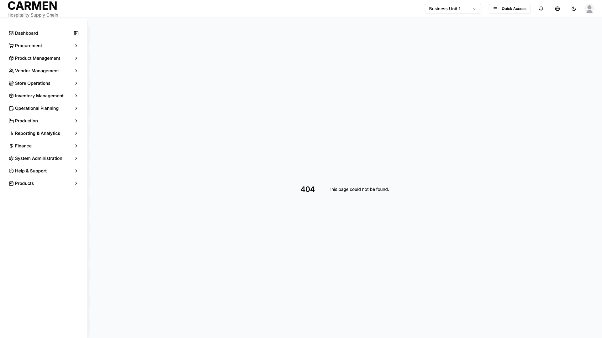

# Stock Balance Report Screen Specification

**Title:** Stock Balance Report Screen Specification  
**Module:** Inventory Management  
**Function:** Stock Overview  
**Screen:** Stock Balance Report  
**Version:** 1.0  
**Date:** August 14, 2025  
**Status:** Based on Actual Source Code Analysis  

## Document History

| Version | Date | Author | Changes |
|---------|------|--------|---------|
| 1.0.0 | 2025-11-19 | Documentation Team | Initial version |
## Implementation Overview

**Purpose:** This screen provides comprehensive inventory balance reporting with real-time stock valuations, detailed balance breakdowns by location/category/product, and movement history tracking for operational inventory management.

**File Locations:** 
- Main component: app/(main)/inventory-management/stock-overview/inventory-balance/page.tsx
- Related components: ReportHeader.tsx, FilterPanel.tsx, BalanceTable.tsx, MovementHistory.tsx

**User Types:** All inventory users including warehouse staff, department managers, financial managers, and purchasing staff with appropriate location/category access permissions.

**Current Status:** Fully implemented with mock data integration, hierarchical balance display, advanced filtering capabilities, and dual-tab reporting (Balance Report and Movement History).

## Visual Interface

*Comprehensive stock balance reporting interface showing current inventory levels, valuation, and variance analysis*

## Layout & Navigation

**Header Area:**
- Page title displays "Inventory Balance Report" with large, bold text
- Subtitle shows current report date formatted as "As of [MM/DD/YYYY]"
- Right-aligned action area contains view type dropdown, valuation method selector, and function buttons

**Summary Cards Section:**
- Three summary cards displayed in horizontal grid layout
- Total Items card shows aggregate quantity count with blue-themed icon
- Total Value card displays monetary total with green-themed icon  
- Valuation Method card shows current method (FIFO or Weighted Average) with purple-themed icon
- Loading skeleton cards appear during data refresh

**Filter Controls:**
- Collapsible filter panel with expand/collapse button showing "Filters" label with chevron icons
- Active filter badges display below main button showing Location, Category, and Product filters
- Each filter badge includes remove button (X icon) for quick filter clearing
- Filter panel expansion reveals detailed filter form within card container

**Action Buttons:**
- Stock Cards navigation button links to related stock card view
- Refresh button triggers data reload with loading states
- Print button enables report printing functionality
- Export button allows report export in various formats
- Show Lots toggle switch controls lot-level detail display

## Data Display

**Main Content Tabs:**
- Balance Report tab shows hierarchical inventory data in expandable table format
- Movement History tab displays chronological transaction records with filtering

**Balance Report Table:**
- Six-column structure: Code, Description, Unit, Quantity, Unit Cost, Value
- Hierarchical data presentation with location → category → product → lot drill-down
- Expandable rows using chevron icons (right/down) to show/hide nested levels
- Location rows display with highlighted background and bold location names
- Category rows use medium-gray background with category codes and names
- Product rows show normal background with product details and status badges
- Lot rows display with light background indentation showing lot numbers and expiry dates

**Status Indicators:**
- Inventory status badges: "Low" (red), "High" (amber), "Normal" (green) based on quantity thresholds
- Batch tracking indicator shows information icon with tooltip for batch-tracked items
- Quantity values display right-aligned with number formatting
- Currency values show right-aligned with proper currency formatting
- Total summary row at bottom with bold formatting and highlighted background

**Movement History Display:**
- Four summary cards showing Total In, Total Out, Net Change, and Transaction count
- Movement table with eight columns: Date & Time, Reference, Product, Location, Type, Reason, Quantity, Value
- Transaction type badges: "In" (green), "Out" (red), "Adjustment" (amber)
- Reference type badges with color coding: GRN (blue), SO (purple), ADJ (amber), TRF (indigo), PO (cyan), WO (rose), SR (emerald)
- Quantity and value changes display with color-coded positive/negative indicators
- Before/after values shown in small gray text below main change values

## User Interactions

**Filter Panel Operations:**
- Date picker calendar for "As of Date" selection with visual calendar interface
- Location range inputs with "From" and "To" text fields for range filtering
- Category range inputs with dual text fields for category code filtering  
- Product range inputs with dual text fields for product code filtering
- Valuation method dropdown with FIFO and Weighted Average options
- Apply Filters button processes all filter selections with loading states
- Reset button clears all filters and returns to default view

**Table Interactions:**
- Click location rows to expand/collapse category listings
- Click category rows to expand/collapse product listings  
- Click product rows to expand lot details when "Show Lots" is enabled
- Double-click product rows to navigate to individual Stock Card page
- Single-click product rows toggles lot expansion when lots are available
- Hover effects on all interactive rows with subtle background color changes

**Movement History Filters:**
- Date range picker with dual calendar selection for filtering transaction periods
- Transaction type dropdown with All Types, In, Out, and Adjustment options
- Search input field for filtering by product name, code, reference, location, or reason
- Real-time search filtering as user types in search field
- Pagination controls with Previous/Next buttons and page indicator

**View Customization:**
- View Type dropdown with "By Category", "By Product", and "By Lot" options
- Valuation Method selector with FIFO and Weighted Average options  
- Show Lots toggle switch controls lot-level detail visibility
- All selections trigger data refresh with appropriate loading states

## Role-Based Functionality

**All Inventory Users:**
- View balance reports for locations and categories within their access permissions
- Access movement history for transactions within their scope
- Use filtering and search capabilities for data analysis
- Print and export reports for offline analysis
- Navigate to related Stock Card views for detailed product information

**Department Managers:**
- Full access to balance reports for their assigned departments and locations
- Complete movement history visibility for their operational areas
- Advanced filtering capabilities across all available dimensions
- Export functionality for management reporting and analysis

**Financial Managers:**
- System-wide balance report access across all locations and categories
- Complete valuation method control with FIFO and Weighted Average options
- Full movement history access for financial reconciliation and audit purposes
- Comprehensive export capabilities for financial reporting integration

**Warehouse Staff:**
- Location-specific balance reports based on assigned warehouse areas
- Movement history focused on operational transactions and adjustments
- Basic filtering by location, category, and product ranges
- Print functionality for physical inventory verification processes

## Business Rules & Validation

**Report Generation Rules:**
- Balance calculations automatically update based on selected valuation method
- Inventory status badges update dynamically based on product-specific minimum/maximum thresholds  
- Lot display requires "Show Lots" toggle activation and availability of lot data
- Movement history displays transactions within selected date range with real-time filtering

**Data Accuracy Requirements:**
- Balance totals must reconcile across all hierarchical levels (location → category → product → lot)
- Quantity and value calculations respect selected valuation method (FIFO or Weighted Average)
- Movement records maintain before/after balance consistency for audit purposes
- Currency formatting displays consistently across all monetary values

**Filter Validation:**
- Date selections cannot exceed current system date for balance reporting
- Range filters (location, category, product) accept alphanumeric codes with proper validation
- Invalid filter combinations display appropriate error messages or warnings
- Filter combinations that return no results show "No results found" message

**Performance Considerations:**
- Loading states appear during data refresh operations with skeleton placeholders
- Large datasets implement pagination for movement history (10 items per page)
- Filter operations include debounced search to optimize performance
- Table expansion states persist during data refresh operations

## Current Limitations

**Mock Data Implementation:**
- All balance data currently loads from static mock data sources rather than live inventory database
- Movement history generates simulated transaction records instead of actual inventory movements
- Filter operations simulate API calls with setTimeout delays but don't affect actual data results
- Search functionality works on mock data but doesn't connect to backend search services

**Backend Integration Gaps:**
- Export functionality displays buttons but doesn't generate actual file downloads
- Print functionality shows button but doesn't implement actual print dialog integration
- Refresh button simulates data reload but doesn't fetch updated information from server
- Navigation to Stock Card page uses URL routing but may not pass proper context parameters

**Advanced Features Missing:**
- Real-time balance updates require manual refresh rather than automatic polling
- Advanced filter combinations (multiple location ranges, complex date ranges) not fully implemented
- Drill-down reporting beyond lot level not available (serial number tracking)
- Integration with other inventory functions (adjustments, transfers) shows navigation only

**Data Validation Limitations:**
- Inventory threshold calculations use hardcoded values rather than dynamic business rules
- Currency formatting uses basic implementation without multi-currency support
- Date range validation in movement history lacks business day and fiscal period awareness
- User permission filtering simulated but not enforced through actual role-based access control