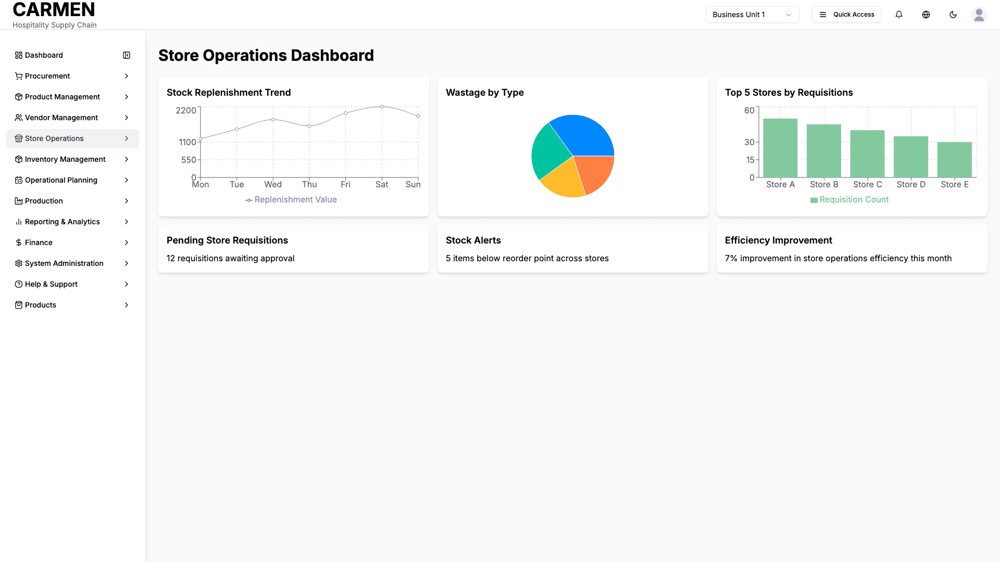

# Store Operations Overview Screen Specification

## Document History

| Version | Date | Author | Changes |
|---------|------|--------|---------|
| 1.0.0 | 2025-11-19 | Documentation Team | Initial version |
## Header Section

```yaml
Title: Store Operations Overview Screen Specification
Module: Store Operations
Function: Store Operations Management
Screen: Store Operations Dashboard
Version: 1.0
Date: 2025-01-14
Status: Based on Actual Source Code Analysis
```

## Implementation Overview

**Purpose**: Provides a centralized dashboard for store operations managers to monitor key operational metrics, track store requisitions, monitor waste patterns, and access daily store management functions through visual analytics and quick navigation.

**File Locations**: 
- Main Component: `app/(main)/store-operations/page.tsx`
- Store Requisition List: `app/(main)/store-operations/components/store-requisition-list.tsx`
- Navigation: Referenced in `components/Sidebar.tsx`

**User Types**: Store managers, department managers, operations staff, purchasing staff with store operations access

**Current Status**: Core dashboard implemented with interactive charts, data visualization, and drag-and-drop customization. Store requisitions functionality fully implemented with comprehensive filtering and workflow management.


## Visual Interface


*Store operations module overview displaying inter-store activities, requisition summaries, and operational workflow management*

## Layout & Navigation

**Header Area**: 
- Main page title displays "Store Operations Dashboard" prominently at the top
- No additional navigation breadcrumbs or back buttons visible in current implementation

**Action Buttons**: 
- Dashboard provides read-only analytics view with no primary action buttons
- Navigation to sub-functions available through sidebar menu

**Layout Structure**: 
- Grid-based dashboard with draggable cards (3 columns on large screens, 2 on medium, 1 on mobile)
- Cards can be rearranged by drag and drop for personalized dashboard layout
- Each card contains either data visualization charts or key performance metrics
- Responsive design adapts card layout based on screen size

## Data Display

**Dashboard Cards Configuration**:
- Stock Replenishment Trend: Line chart showing weekly replenishment values by day
- Wastage by Type: Pie chart breaking down waste categories (Expired, Damaged, Overproduction, Other)
- Top 5 Stores by Requisitions: Bar chart ranking stores by requisition count
- Pending Store Requisitions: Text metric showing count of requisitions awaiting approval
- Stock Alerts: Text metric displaying items below reorder point across stores
- Efficiency Improvement: Text metric showing monthly efficiency percentage change

**Chart Visualizations**:
- Line charts display trend data with grid lines, tooltips, and legends
- Pie charts show percentage breakdowns with colored segments and labels
- Bar charts display comparative data with value tooltips
- All charts are fully responsive and interactive

**Data Format**: 
- Monetary values displayed without currency formatting in charts
- Percentage values shown with labels (e.g., "Expired 35%")
- Count metrics displayed as simple numbers
- All data appears to be mock/sample data for demonstration

## User Interactions

**Drag and Drop Functionality**:
- Any dashboard card can be clicked and dragged to reorder position
- Cards maintain their data and visualization during repositioning
- Layout changes persist during the session but reset on page reload

**Chart Interactions**:
- Hover over chart elements to display detailed tooltips
- Charts are read-only with no click interactions or drill-down capabilities
- Responsive charts resize automatically based on card dimensions

**Navigation Options**:
- Store Requisitions: Links to comprehensive requisition management
- Stock Replenishment: Links to coming soon placeholder
- Wastage Reporting: Links to coming soon placeholder

## Role-Based Functionality

**All Authorized Users**:
- View dashboard metrics and visualizations
- Customize dashboard layout through drag and drop
- Access store requisitions from sidebar navigation
- View all chart data and performance indicators

**Store Management Roles**:
- Access to Store Requisitions with full workflow management
- Advanced filtering and search capabilities for requisitions
- Approval and rejection workflows for pending requisitions
- Export functionality for requisition data

**Department Managers**:
- Monitor departmental store requisition metrics
- Access to approval workflows for their department's requests
- View efficiency metrics relevant to their operations

**Operational Staff**:
- View-only access to operational metrics
- Monitor stock alerts and replenishment needs
- Track wastage patterns for operational improvements

## Business Rules & Validation

**Dashboard Data Rules**:
- Charts display sample data with realistic operational patterns
- Stock replenishment trends show 7-day week cycle
- Wastage breakdown totals 100% across all categories
- Store ranking displays top 5 performers only

**Access Controls**:
- Dashboard accessible to users with store operations permissions
- Sub-navigation requires specific module permissions
- Chart data visibility controlled by user role context

**Data Refresh**:
- Dashboard loads with static mock data
- No automatic refresh or real-time data updates implemented
- Manual page refresh required to reload dashboard state

## Current Limitations

**Mock Data Implementation**:
- All dashboard metrics use hardcoded sample data
- No backend API integration for live operational data
- Chart data does not reflect actual store operations

**Limited Functionality**:
- Stock Replenishment and Wastage Reporting link to "Coming Soon" pages
- No drill-down capability from dashboard charts to detailed views
- Dashboard customization does not persist across sessions

**Missing Integration**:
- No real-time data feeds from inventory or point-of-sale systems
- Charts not connected to actual store operation databases
- No export functionality for dashboard analytics

**Placeholder Features**:
- Two of three sub-navigation items (Stock Replenishment, Wastage Reporting) show placeholder pages
- Store efficiency calculations not connected to actual operational metrics
- Alert systems display static counts rather than dynamic monitoring

**Known Issues**:
- Dashboard layout resets when page is refreshed
- No user preferences storage for customized layouts
- Chart tooltips and interactions are basic without advanced analytics features