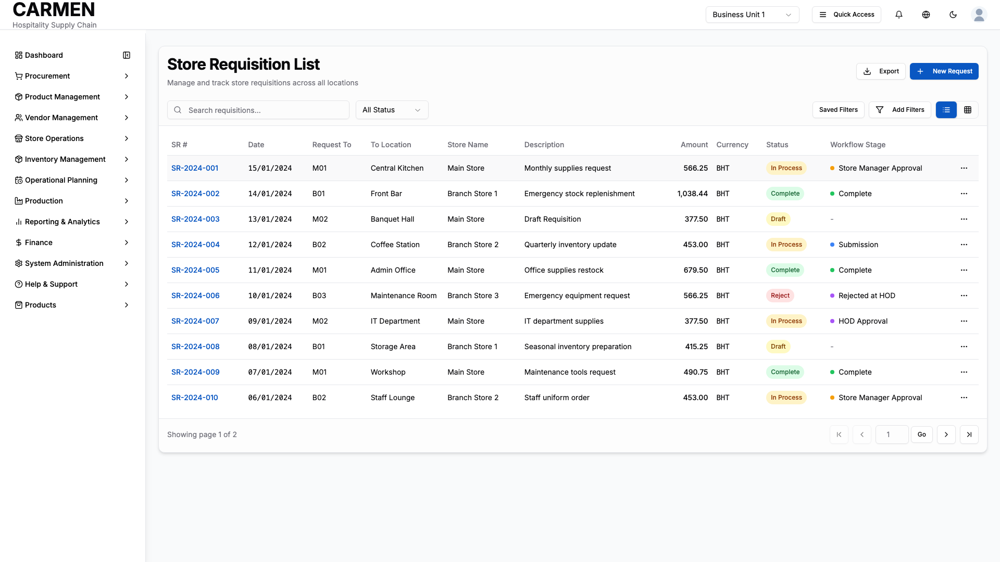

# Store Requisitions List Screen Specification

```yaml
Title: Store Requisitions List Screen Specification
Module: Store Operations
Function: Store Requisitions Management
Screen: Store Requisitions List
Version: 1.0
Date: August 14, 2025
Status: Based on Actual Source Code Analysis
```

## Implementation Overview

### Purpose
The Store Requisitions List Screen serves as the central hub for managing and tracking store requisition requests across all locations. Users can view, search, filter, and take actions on store requisitions based on their role and department permissions. The screen supports both approval workflows and operational tracking of item transfers between stores and departments.

### File Locations
- Main component: `app/(main)/store-operations/store-requisitions/page.tsx`
- List component: `app/(main)/store-operations/components/store-requisition-list.tsx`
- Detail component: `app/(main)/store-operations/store-requisitions/components/store-requisition-detail.tsx`
- Status management: `components/ui/custom-status-badge.tsx`

### User Types
- **Store Staff**: View and create requisitions for their department
- **Department Managers**: Approve departmental requisitions and manage store operations
- **Store Managers**: Final approval authority for store-to-store transfers
- **Finance Managers**: Budget oversight and approval authority
- **Purchasing Staff**: Inventory management and procurement oversight
- **Chefs**: Kitchen requisitions and recipe-based ordering

### Current Status
Fully implemented with comprehensive filtering, approval workflows, and responsive design patterns.

## Visual Interface


*Store Requisitions management interface showing populated data with first record selected, displaying comprehensive list view with approval workflows, filtering capabilities, and inter-location transfer tracking for Carmen hospitality ERP*

## Layout & Navigation

### Header/Title Area
- **Page Title**: "Store Requisition List" with descriptive subtitle "Manage and track store requisitions across all locations"
- **Quick Actions**: Export button for data export, prominently placed "New Request" button for creating requisitions
- **Breadcrumb Navigation**: Integrated back button functionality for navigation hierarchy

### Action Buttons
- **New Request Button**: Primary call-to-action button positioned in top-right header area for creating new requisitions
- **Export Button**: Secondary action button for exporting requisition data to external formats
- **View Toggle**: Switch between table and card view modes for different user preferences
- **Filter Controls**: Advanced filtering with saved filter options and filter builder dialog

### Layout Structure
- **Header Section**: Fixed header with title, actions, and search controls
- **Control Bar**: Secondary row containing search, status filters, and view mode toggles
- **Main Content Area**: Responsive data display area supporting both table and card layouts
- **Pagination Footer**: Navigation controls with page-specific information and quick jump functionality

## Data Display

### Information Fields
- **Requisition Reference**: Clickable requisition numbers (SR-YYYY-NNN format) linking to detail pages
- **Date Information**: Creation date and expected delivery date in DD/MM/YYYY format
- **Location Data**: Request source ("Requested From") and destination location ("To Location")
- **Store Assignments**: Store name and department associations for organizational tracking
- **Description Text**: Brief description of requisition purpose, truncated with tooltips for longer text
- **Financial Information**: Total amount display with currency formatting and decimal precision
- **Status Indicators**: Color-coded status badges showing requisition lifecycle position

### Tables/Lists
#### Table View Features
- **Sortable Columns**: All major columns support ascending/descending sort functionality
- **Responsive Design**: Horizontal scrolling on smaller screens with minimum column widths
- **Row Interactions**: Hover states and click-through navigation to detail pages
- **Column Structure**: Requisition number, date, request destination, location, store, description, amount, currency, status, workflow stage, and actions

#### Card View Features
- **Compact Layout**: Two-column mobile layout expanding to three-column on larger screens
- **Information Hierarchy**: Structured display with status badges and workflow indicators prominently placed
- **Action Menus**: Dropdown action menus accessible from card headers
- **Responsive Grid**: Dynamic card sizing based on screen resolution and content

### Status Indicators
- **Primary Status Badges**: Color-coded system showing "Draft", "In Process", "Complete", "Reject", and "Void" states
- **Workflow Stage Indicators**: Secondary badges showing current approval stage with tooltips explaining approval requirements
- **Workflow Stage Colors**: Blue for submission, purple for HOD approval, amber for manager approval, green for completion, red for rejection
- **Interactive Status Elements**: Clickable status badges providing detailed workflow information

## User Interactions

### Form Elements
- **Search Input**: Global text search across requisition numbers, descriptions, and location data with minimum 350px width
- **Status Filter Dropdown**: Single-select status filtering with "All Status" default option
- **Date Range Pickers**: From/to date selection for time-based filtering
- **Advanced Filter Builder**: Multi-condition filtering with field, operator, and value selections

### Bulk Operations
- **Multi-Select Functionality**: Checkbox-based selection with select-all capability
- **Bulk Status Changes**: Apply approval/rejection actions to multiple selected requisitions
- **Selection Feedback**: Visual indication of selected items count and available actions
- **Clear Selection**: Easy deselection with visual confirmation

### Modal Dialogs
- **Filter Builder Dialog**: Complex filtering interface with add/remove filter conditions
- **Action Confirmation**: Confirmation dialogs for destructive actions like deletion
- **Approval Log Dialogs**: Detailed approval history accessible from status badges
- **Export Options**: Dialog for selecting export formats and date ranges

## Role-Based Functionality

### Staff Permissions
- **View Access**: Can view requisitions they created or that affect their department
- **Create Access**: Can create new requisitions for their assigned department and location
- **Edit Limitations**: Can only edit requisitions in "Draft" status that they created
- **Status Tracking**: Read-only access to approval workflow progress

### Department Manager Permissions
- **Department Scope**: Can view and manage all requisitions within their department
- **Approval Authority**: Can approve departmental requisitions up to budget limits
- **Budget Oversight**: Can see financial totals and cost implications
- **Team Management**: Can view requisitions created by their team members

### Store Manager Permissions
- **Store-Wide Access**: Can view and manage requisitions across all departments in their store
- **Final Approval**: Authority to approve inter-store transfers and high-value requisitions
- **Workflow Control**: Can return requisitions for revision or reject with comments
- **Operational Priority**: Can expedite urgent requisitions through approval workflow

### Finance Manager Permissions
- **Financial Oversight**: Can view all requisitions with financial impact across the organization
- **Budget Authority**: Can approve requisitions exceeding departmental budget limits
- **Cost Analysis**: Access to detailed cost breakdowns and financial summaries
- **Audit Trail**: Can view complete approval history and financial audit trails

### Purchasing Staff Permissions
- **Inventory Integration**: Can see inventory levels and availability for requested items
- **Vendor Coordination**: Can see vendor assignment and procurement planning implications
- **Supply Chain Visibility**: Can view requisitions in the context of overall procurement planning
- **Fulfillment Tracking**: Can monitor requisition fulfillment status and delivery schedules

### Chef Permissions
- **Kitchen Operations**: Can create requisitions for kitchen supplies and ingredients
- **Recipe Integration**: Can create requisitions based on menu planning and recipe requirements
- **Quality Specifications**: Can add detailed specifications for food and beverage items
- **Inventory Awareness**: Can see current kitchen inventory levels when creating requisitions

## Business Rules & Validation

### Field Requirements
- **Mandatory Fields**: Requisition date, requested from location, requesting department, and at least one item are required
- **Reference Generation**: System automatically generates sequential requisition numbers (SR-YYYY-NNN format)
- **Location Validation**: Source and destination locations must be different and both must be active
- **Department Assignment**: Requesting department must match user's current department context

### Validation Rules
- **Status Transition Logic**: Requisitions can only move forward through defined workflow stages or be returned to previous stages
- **Approval Hierarchy**: Each approval stage must be completed before proceeding to the next stage
- **Budget Validation**: Financial limits enforced based on user role and department budget allocations
- **Inventory Checking**: System validates item availability at source location before approval

### Workflow Logic
- **Draft to Submission**: Requisitions must have complete item details and valid approvers assigned
- **Approval Sequence**: Standard sequence is Submission → HOD Approval → Store Manager Approval → Complete
- **Return Mechanism**: Any approver can return requisition to previous stage with mandatory comments
- **Rejection Processing**: Rejected requisitions require comments and are returned to draft status for revision

## Current Limitations

### Placeholder Features
- **Search Functionality**: Search input field exists but only performs console logging, no actual filtering implementation
- **Sort Implementation**: Column headers show sort indicators but sorting logic only logs to console
- **Filter Application**: Advanced filter builder collects conditions but application logic is placeholder
- **Export Function**: Export button present but only logs action, no actual export generation

### Missing Integration
- **Backend API**: All data is currently mock data with no real database connectivity
- **User Authentication**: No real role-based access control integration with authentication system
- **Notification System**: No real-time notifications for approval status changes or workflow updates
- **Audit Logging**: Activity logging only includes mock data, no persistent audit trail

### Known Issues
- **Pagination Logic**: Fixed mock data with client-side pagination, no server-side data loading
- **Real-time Updates**: No web socket or polling for real-time status updates
- **Mobile Optimization**: While responsive, some advanced filtering features may be difficult to use on very small screens
- **Performance**: All filtering and sorting is client-side, may not scale with large data sets

## Integration Points

### Inventory Management
- **Stock Validation**: Integration needed with inventory system to check availability before approval
- **Automatic Deduction**: Approved requisitions should automatically reduce source location inventory
- **Lot Tracking**: Integration with lot management for items requiring batch tracking

### Approval Workflow Engine
- **Dynamic Routing**: Integration needed with configurable approval workflow engine
- **Notification Triggers**: Automatic notifications to approvers when requisitions require attention
- **Escalation Rules**: Time-based escalation when approvals are pending beyond defined thresholds

### Financial System
- **Budget Checking**: Real-time budget validation against department and project budgets
- **Cost Center Assignment**: Integration with financial dimension for proper cost allocation
- **Accounting Integration**: Automatic journal entry generation for inventory transfers

### User Management
- **Role Validation**: Dynamic permission checking based on current user context and role assignments
- **Department Security**: Enforcement of department-based access restrictions
- **Location Security**: Validation of user access to source and destination locations

## Technical Considerations

### Performance Optimization
- **Lazy Loading**: Implementation needed for large requisition lists with progressive loading
- **Search Optimization**: Server-side search implementation with proper indexing
- **Caching Strategy**: Client-side caching for frequently accessed reference data

### Accessibility Compliance
- **Screen Reader Support**: All interactive elements include proper ARIA labels and descriptions
- **Keyboard Navigation**: Full keyboard accessibility for all actions and navigation
- **Color Contrast**: Status badges and indicators meet WCAG 2.1 AA contrast requirements
- **Focus Management**: Proper focus handling for modal dialogs and dropdown menus

### Mobile Responsiveness
- **Touch Optimization**: All interactive elements sized appropriately for touch interaction
- **Gesture Support**: Swipe gestures for card navigation and selection
- **Responsive Tables**: Horizontal scrolling with sticky columns for table view on mobile devices
- **Modal Adaptation**: Full-screen modals on small screens with appropriate close affordances