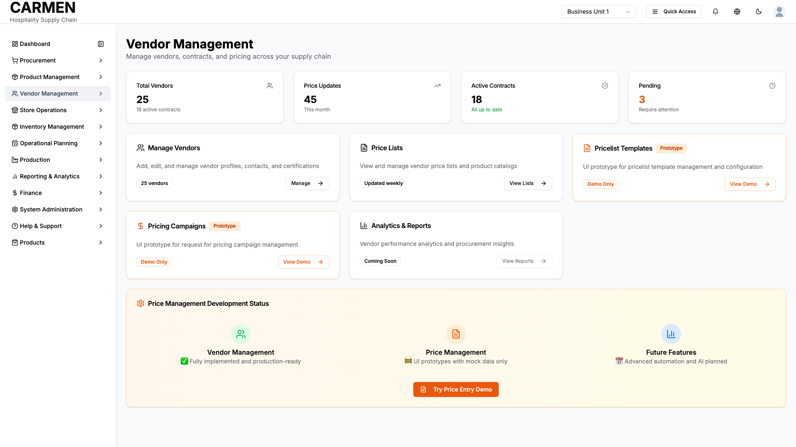

# Vendor Management Overview Screen Specification

```yaml
Title: Vendor Management Overview Screen Specification
Module: Vendor Management
Function: Central Dashboard
Screen: Overview Landing Page
Version: 1.0
Date: 2025-01-14
Status: Based on Actual Source Code Analysis
```

## Implementation Overview

**Purpose**: Provides a centralized dashboard for managing all vendor-related activities, including vendor profiles, contracts, pricing, and analytics. Serves as the main entry point for supplier relationship management with quick access to key metrics and navigation to detailed functions.

**File Locations**: 
- Primary: app/(main)/vendor-management/page.tsx
- Related: vendor management submodules and components

**User Types**: All users with vendor management permissions can access this screen, with different capabilities based on role-specific permissions.

**Current Status**: Main vendor management functions are fully implemented, while advanced pricing and analytics features are in prototype/development phase.


## Visual Interface


*Vendor management module overview displaying key metrics, recent activities, and navigation to vendor management functions*

## Layout & Navigation

**Header Area**: 
- Page title "Vendor Management" prominently displayed at the top
- Descriptive subtitle explaining the purpose: "Manage vendors, contracts, and pricing across your supply chain"
- Clean, professional layout with adequate spacing

**Quick Stats Dashboard**:
- Four metric cards displayed in a responsive grid layout
- Total Vendors card shows vendor count with active contracts summary
- Price Updates card displays monthly pricing activity with trending indicator
- Active Contracts card shows current contract status with positive status indicator
- Pending Approvals card highlights items requiring attention with orange warning color

**Module Navigation Grid**:
- Six main function cards arranged in responsive grid (3 columns on large screens, 2 on medium, 1 on mobile)
- Each card includes descriptive icon, title, explanation text, status badge, and action button
- Hover effects provide visual feedback for interactive elements
- Cards clearly indicate implementation status (active, prototype, coming soon)

**Development Status Section**:
- Special informational card with orange gradient background
- Three-column status grid showing implementation progress
- Visual indicators using colored icons and status descriptions
- Central call-to-action button for trying demo features

## Data Display

**Metrics Overview**:
- Total vendor count (currently showing 25 vendors)
- Active contracts summary (18 active contracts with "All up to date" status)
- Monthly price updates count (45 updates this month with trending indicator)
- Pending approvals requiring attention (3 items flagged in orange)

**Module Status Indicators**:
- Green checkmark badges for fully implemented features
- Orange "Prototype" badges for demo/development features
- "Coming Soon" badges for planned functionality
- "Demo Only" badges clearly identifying non-functional prototypes

**Implementation Progress Display**:
- Visual progress indicators using colored circular icons
- Green indicators for production-ready features
- Orange indicators for prototype/development features
- Blue indicators for planned future functionality

## User Interactions

**Navigation Actions**:
- "Manage" button links to full vendor management interface
- "View Lists" button accesses price list management
- "View Demo" buttons provide access to prototype features (clearly marked)
- Disabled buttons for features not yet available

**Quick Access Features**:
- Direct navigation to vendor management with current vendor count
- Price list access with update frequency indicator
- Demo access for prototype features with clear warnings
- Central demo button for trying price entry functionality

**Interactive Elements**:
- Hover effects on all navigation cards for better user experience
- Responsive design adapts to different screen sizes
- Visual feedback for clickable elements
- Clear visual hierarchy guiding user attention

## Role-Based Functionality

**All Vendor Management Users**:
- View vendor metrics and summary statistics
- Access to vendor profile management
- Navigate to price list viewing
- View system implementation status

**Vendor Management Staff**:
- Full access to vendor profile creation and editing
- Price list management capabilities
- Contract management access
- Approval workflow participation

**Purchasing Staff**:
- Read access to vendor information for procurement decisions
- Price list consultation for purchase planning
- Vendor performance metrics viewing
- Integration with purchase request and order processes

**Management Roles**:
- Complete vendor analytics and reporting access
- Strategic vendor relationship oversight
- Approval authority for vendor contracts and agreements
- Access to advanced pricing campaign features (when available)

## Business Rules & Validation

**Data Integrity Rules**:
- Vendor counts reflect actual database entries
- Contract status automatically updated based on expiration dates
- Price update tracking maintains accurate monthly counts
- Pending approval counts reflect actual workflow states

**Access Control Rules**:
- Prototype features clearly marked to prevent production use
- Demo functionalities isolated from live data
- User permissions respected for all navigation options
- Role-based access control for sensitive vendor information

**Status Management**:
- Active contract status validated against expiration dates
- Price update frequency monitored and displayed accurately
- Pending approval counts updated in real-time
- Implementation status reflects actual development progress

## Current Limitations

**Prototype Features**:
- Pricelist Templates module shows "Demo Only" functionality with no backend integration
- Pricing Campaigns feature provides UI mockups without data processing capabilities
- Analytics & Reports section disabled with "Coming Soon" status

**Development Gaps**:
- Advanced vendor analytics not yet implemented
- Automated pricing campaign management requires development
- Real-time reporting features planned but not available
- Integration with external vendor systems pending

**Data Limitations**:
- Quick stats show static mock data rather than dynamic database queries
- Prototype features display sample data only
- Future features section indicates planned functionality without implementation timeline

**Integration Constraints**:
- Price management features isolated from procurement workflow
- Vendor portal integration requires additional development
- Advanced automation features depend on future AI implementation
- Cross-module reporting capabilities limited in current implementation

The Vendor Management Overview Screen successfully provides a comprehensive dashboard for vendor relationship management while clearly distinguishing between production-ready features and development prototypes. The interface effectively guides users to available functionality while transparently communicating the current implementation status of advanced features.